# Forgewright — Adaptive AI Orchestrator

<p align="center">
  <a href="https://opensource.org/licenses/MIT"></a>
  
  
  
  
  
  
  
  
  
  
  
</p>

---

## TL;DR — What is Forgewright?

**Imagine:** You have a team of 56 AI experts. Each one excels at a different task — writing code, security auditing, game design, performance optimization. Forgewright is the "manager" — when you say "I want to build an e-commerce app", it automatically knows which experts to call, in what order, and how to validate quality.

> **One sentence:** Forgewright automatically selects the right AI expert for the right job, from idea to production.

### Concrete Example

```
You say:  "Build me a t-shirt selling website"

    ↓

Forgewright automatically does:
    1. Market analysis (Business Analyst)
    2. Feature planning (Product Manager)
    3. Database & API architecture design (Solution Architect)
    4. Write backend + frontend code (Software Engineer)
    5. Write unit tests (QA Engineer)
    6. Security audit (Security Engineer)
    7. Deploy to server (DevOps)
    8. Monitor & optimize (SRE)

    ↓

Result: Production-ready website, reviewed, tested, score 0-100
```

### 4 Power Levels — Choose what fits you


---

## 🚀 Quick Start — 5 Phút Đầu Tiên

### Trước khi bắt đầu

Kiểm tra máy đã cài đủ công cụ chưa:

```bash
# macOS/Linux
node --version   # Cần Node.js 18+
python3 --version  # Cần Python 3.8+ (cho Memory/Level 3)
git --version    # Cần Git

# Windows: Dùng PowerShell hoặc WSL2
```

**Nếu chưa cài Node.js:**
```bash
# macOS
brew install node

# Linux
curl -fsSL https://deb.nodesource.com/setup_18.x | sudo -E bash -
sudo apt-get install -y nodejs

# Windows: Tải từ https://nodejs.org
```

---

### Cách 1: Dùng ngay (Khuyên dùng — Level 1)

Đây là cách nhanh nhất, không cần cài gì thêm:

**Bước 1:** Tạo thư mục project mới (hoặc dùng project hiện có)

```bash
cd /path/to/your/project
# Hoặc tạo mới:
mkdir my-project && cd my-project
git init
```

**Bước 2:** Clone Forgewright

```bash
git clone https://github.com/buiphucminhtam/forgewright.git
cd forgewright
```

**Bước 3:** Copy 2 file cần thiết vào project của bạn

```bash
# Quay lại thư mục project
cd /path/to/your/project

# Copy 2 file cấu hình (chạy từ thư mục chứa forgewright)
cp forgewright/AGENTS.md .
cp forgewright/CLAUDE.md .

# Hoặc nếu dùng Claude Code/VS Code Agent, file sẽ tự đọc CLAUDE.md
```

**Bước 4:** Mở IDE và bắt đầu chat

- **Cursor**: Mở Cursor, chọn thư mục project
- **Claude Code**: Chạy `claude` trong terminal từ thư mục project
- **VS Code + Claude Extension**: Mở project, bật Claude extension

**Bước 5:** Gõ yêu cầu đầu tiên

```bash
# Ví dụ 1: Xây dựng website mới
"Build me a landing page for my coffee shop"

# Ví dụ 2: Thêm tính năng vào project hiện có
"Add user authentication with JWT"

# Ví dụ 3: Sửa bug
"Fix the login bug where users get logged out randomly"

# Ví dụ 4: Viết tests
"Write unit tests for the payment module"
```

**Sau khi gõ, Forgewright sẽ tự động:**
1. Phân tích yêu cầu của bạn
2. Chọn đúng AI skill cần thiết
3. Thực hiện công việc theo pipeline
4. Báo kết quả kèm điểm chất lượng (0-100)

---

### Cách 2: Cài đặt đầy đủ (Level 4 — Full Power)

Cách này thêm **12 công cụ AI** vào IDE của bạn:

**Bước 1-3:** Làm tương tự **Cách 1** (Bước 1-3)

**Bước 4:** Chạy MCP Setup

```bash
# Từ thư mục project (nơi chứa forgewright/)
cd /path/to/your/project
bash forgewright/scripts/forgewright-mcp-setup.sh
```

Script này sẽ tự động:
- Tạo MCP server cho project
- Cấu hình workspace isolation
- Cập nhật config của Cursor/VS Code/Claude Desktop
- Kiểm tra cài đặt

**Bước 5:** Restart IDE

```bash
# Tắt và mở lại Cursor/VS Code/Claude Desktop
```

**Bước 6:** Kiểm tra

```bash
# Kiểm tra MCP đã hoạt động chưa
bash forgewright/scripts/forgewright-mcp-setup.sh --check
```

**Bước 7:** Bắt đầu sử dụng

Giờ bạn có thể dùng các lệnh đặc biệt:

```bash
# Phân tích project
"/onboard"

# Xem pipeline
"/pipeline"

# Kiểm tra chất lượng code
"/quality"

# Hoặc hỏi thẳng:
"How does the authentication flow work?"
"What will break if I change the User model?"
"Show me all API endpoints"
```

---

### Cách 3: Dùng như Submodule (Cho team)

Khi muốn thêm Forgewright vào project để share với team:

**Bước 1:** Thêm submodule

```bash
cd /path/to/your/project
git submodule add -b main https://github.com/buiphucminhtam/forgewright.git \
  .antigravity/plugins/production-grade
```

**Bước 2:** Copy file cấu hình

```bash
cp .antigravity/plugins/production-grade/AGENTS.md .
cp .antigravity/plugins/production-grade/CLAUDE.md .
```

**Bước 3:** Commit

```bash
git add .gitmodules .antigravity AGENTS.md CLAUDE.md
git commit -m "feat: add forgewright AI orchestrator"
git push
```

**Bước 4:** Team member khác clone và init submodule

```bash
git clone https://github.com/your-org/your-project.git
cd your-project
git submodule update --init --recursive
```

---

### 🔀 Multi-Project Workflow

Làm việc với nhiều project cùng lúc:

#### Cách 1: Nhiều Cursor/IDE windows (Đơn giản nhất)

Mỗi project mở 1 window riêng:

```bash
# Project A
cursor /path/to/project-a

# Project B (terminal khác)
cursor /path/to/project-b
```

**Mỗi window có:**
- Memory riêng (`.forgewright/memory.jsonl`)
- ForgeNexus index riêng
- MCP config riêng

#### Cách 2: Git Worktrees (Cùng repo, nhiều branches)

Dùng khi cần test nhiều features trên cùng repo:

```bash
# Tạo worktree cho feature mới
cd your-repo
git worktree add .worktrees/feature-login feature/login

# Tạo worktree cho hotfix
git worktree add .worktrees/hotfix-payment hotfix/payment

# Mở từng worktree trong Cursor riêng
cursor .worktrees/feature-login
cursor .worktrees/hotfix-payment
```

#### Cách 3: MCP cho mỗi workspace

Mỗi project cần chạy MCP setup riêng:

```bash
# Project A
cd project-a
bash forgewright/scripts/forgewright-mcp-setup.sh

# Project B (port khác để tránh conflict)
cd project-b
STUDIO_PORT=7893 bash forgewright/scripts/forgewright-mcp-setup.sh
```

#### Architecture: Multi-Project Isolation

```
┌─────────────────────────────────────────────────────────────┐
│                    Your Machine                             │
├─────────────────────────────────────────────────────────────┤
│                                                             │
│  ┌─────────────┐  ┌─────────────┐  ┌─────────────┐        │
│  │  Project A  │  │  Project B  │  │  Project C  │        │
│  │  .forgewright│  │  .forgewright│  │  .forgewright│        │
│  │  memory.jsonl│  │  memory.jsonl│  │  memory.jsonl│        │
│  │  index.db   │  │  index.db   │  │  index.db   │        │
│  └─────────────┘  └─────────────┘  └─────────────┘        │
│         │                │                │                │
│         ▼                ▼                ▼                │
│  ┌─────────────┐  ┌─────────────┐  ┌─────────────┐        │
│  │ MCP Server  │  │ MCP Server  │  │ MCP Server  │        │
│  │  (port A)   │  │  (port B)   │  │  (port C)   │        │
│  └─────────────┘  └─────────────┘  └─────────────┘        │
│                                                             │
└─────────────────────────────────────────────────────────────┘
```

---

## 🎯 Sau Khi Cài Đặt — Làm Gì?

### Dùng như thế nào?

| Bạn muốn... | Gõ/Dùng... | Forgewright sẽ... |
|-------------|-------------|-------------------|
| Xây app mới | `"Build a todo app with React"` | BA → PM → Architect → Code → Test |
| Thêm tính năng | `"Add dark mode"` | PM → Code → Test |
| Viết tests | `"Write tests for auth"` | QA Engineer viết tests |
| Review code | `"Review my API code"` | Code Reviewer check quality |
| Sửa bug | `"Fix the memory leak"` | Debugger → Engineer fix |
| Deploy | `"Deploy to Vercel"` | DevOps → SRE |
| Tối ưu | `"Speed up the homepage"` | Performance Engineer analyze |
| Bảo mật | `"Audit the auth flow"` | Security Engineer check |
| Game | `"Build a 2D platformer in Unity"` | Game Designer → Unity Engineer |
| Research | `"Research about RAG architecture"` | NotebookLM + Polymath |

### Các lệnh đặc biệt

```bash
# Dashboard
/onboard        # Phân tích sâu project, tạo profile
/pipeline       # Xem tất cả 24 modes và 56 skills
/quality        # Chấm điểm code 0-100
/mcp            # Kiểm tra MCP setup

# Trong chat
"@file:auth.ts"    # Tham chiếu file cụ thể
"how does X work?" # Hỏi về code
"what depends on X?" # Hỏi về dependencies
```

### Hiểu output của Forgewright

Khi Forgewright làm việc, bạn sẽ thấy:

```
🤔 INTERPRETING REQUEST...
   Intent: Build a landing page
   Mode: Full Build (simplified)
   Confidence: HIGH

📋 PLANNING...
   Step 1: Business Analyst defines scope
   Step 2: Architect designs structure
   Step 3: Engineer builds code
   Step 4: QA writes tests

⚡ EXECUTING...
   [████████░░░░░░░░░░] 45% - Building components...

✅ DONE (Score: 87/100)
   - 12 files created
   - 3 tests passed
   - No security issues
```

---

## 🎨 Forgewright Studio — Real-time Pipeline Monitor

Forgewright Studio là dashboard theo dõi pipeline theo thời gian thực, lấy cảm hứng từ [AgentScope Studio](https://github.com/agentscope-ai/agentscope-studio).

### Tính năng

| Tính năng | Mô tả |
|------------|-------|
| **Pipeline Monitor** | Theo dõi tiến độ các phase: DEFINE → BUILD → HARDEN → SHIP |
| **Memory Trace** | Timeline của memory operations |
| **Token Tracker** | Theo dõi tokens và chi phí API |
| **Session History** | Lịch sử các phiên làm việc |

### Cách chạy

**Bước 1:** Cài đặt dependencies

```bash
cd /Users/buiphucminhtam/Documents/GitHub/forgewright
npm install
```

**Bước 2:** Build ForgeNexus (nếu chưa có)

```bash
npm run build
```

**Bước 3:** Chạy Studio Server

```bash
# Cách 1: Chạy với ts-node
npx ts-node src/studio/run.ts

# Cách 2: Chạy với demo events
npx ts-node src/studio/run.ts --demo

# Cách 3: Chạy trên port khác
STUDIO_PORT=9000 npx ts-node src/studio/run.ts
```

**Bước 4:** Mở Dashboard

Sau khi chạy, bạn sẽ thấy:

```
╔══════════════════════════════════════════════════════════════╗
║                   Forgewright Studio                         ║
╠══════════════════════════════════════════════════════════════╣
║                                                              ║
║  🎯 Dashboard:  http://localhost:7891                        ║
║  📡 WebSocket: ws://localhost:7891                          ║
║                                                              ║
║  Status: Running                                             ║
║                                                              ║
╚══════════════════════════════════════════════════════════════╝
```

### Tự tạo UI Dashboard

Component React của Studio có sẵn trong `src/studio/components/`. Bạn có thể tự tạo UI:

```tsx
import { StudioApp } from "@forgewright/studio";

// Trong React app của bạn
function App() {
  return (
    <StudioApp
      sessionId="your-session-id"
      wsUrl="ws://localhost:7891"
    />
  );
}
```

### Architecture

```
┌─────────────┐     WebSocket      ┌──────────────┐
│   IDE/CLI   │ ─────────────────► │  WS Server   │
│ (Emitter)   │   port 7891       │  (run.ts)    │
└─────────────┘                    └──────────────┘
                                          │
                                          ▼
                                   ┌──────────────┐
                                   │  Studio UI   │
                                   │ (React App)  │
                                   └──────────────┘
```

### Events được hỗ trợ

| Event | Mô tả |
|-------|-------|
| `pipeline:start` | Pipeline bắt đầu |
| `pipeline:progress` | Tiến độ thay đổi |
| `pipeline:complete` | Pipeline hoàn thành |
| `stats:update` | Cập nhật tokens/cost |
| `memory:trace` | Memory operation |
| `error:throw` | Error xảy ra |

---

## ❓ FAQ — Câu Hỏi Thường Gặp

**Q: Cần trả tiền không?**
A: Không. Forgewright miễn phí. Bạn chỉ cần trả tiền cho Claude API nếu dùng Claude.

**Q: Dùng được với GPT-4 không?**
A: Có. Forgewright hoạt động với Claude, GPT-4, và các LLM khác.

**Q: Cần biết lập trình không?**
A: Không bắt buộc. Level 1 có thể dùng như "AI assistant" đơn giản.

**Q: Lưu dữ liệu ở đâu?**
A: Tất cả data được lưu trong `.forgewright/` và `.antigravity/` của project bạn.

**Q: Gặp lỗi thì làm sao?**
A: Chạy `bash forgewright/scripts/forgewright-mcp-setup.sh --diagnose`

**Q: Làm việc với nhiều project cùng lúc thì sao?**
A: Có 3 cách:

| Cách | Khi nào dùng | Cách setup |
|------|---------------|------------|
| **Nhiều Cursor windows** | Mỗi project 1 window riêng | Mỗi project cần có `AGENTS.md` + `CLAUDE.md` |
| **Git worktrees** | Cùng 1 repo, nhiều branches chạy song song | Dùng `scripts/worktree-manager.sh` |
| **MCP per workspace** | Mỗi project có MCP riêng | Mỗi project chạy `forgewright-mcp-setup.sh` |

**Q: Mỗi project có memory riêng không?**
A: Có! Memory được lưu trong `.forgewright/memory.jsonl` của từng project. Nếu muốn cross-project memory, dùng NotebookLM.

**Q: Project A và B có bị conflict không?**
A: Không. Mỗi project có workspace isolation riêng:
- `.forgewright/` — project-specific state
- `.antigravity/` — plugin config
- MCP config — per-workspace (`~/.cursor/mcp.json`)

---

## 🔧 Troubleshooting Nhanh

| Lỗi | Cách fix |
|-----|----------|
| MCP không hoạt động | Restart IDE, chạy `--diagnose` |
| Không tìm thấy skills | Kiểm tra đã copy AGENTS.md và CLAUDE.md |
| Index cũ | Chạy `npx forgenexus analyze` |
| Submodule lỗi | `git submodule update --init --recursive` |

---

## Getting Started — 3 Easiest Steps

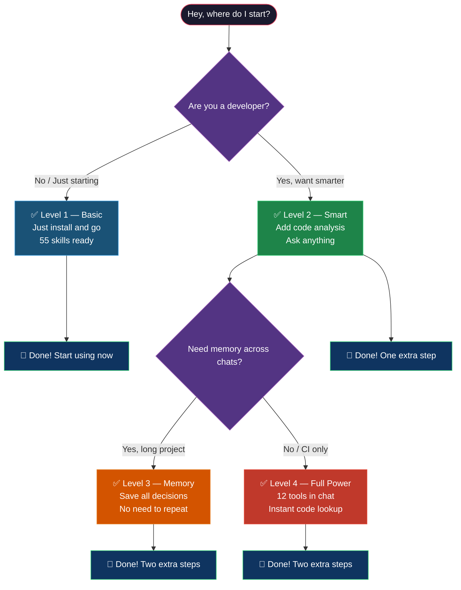

### Quick Setup — Copy, Paste, Done

**Step 1: Open your project in terminal**

```bash
# Navigate to your project folder
cd /path/to/your/project

# If you don't have a project yet, create one
mkdir my-project && cd my-project
git init
```

**Step 2: Clone Forgewright (choose ONE way)**

```bash
# Way A — Clone as a standalone tool (recommended)
git clone https://github.com/buiphucminhtam/forgewright.git

# Way B — Add as git submodule inside your project
git submodule add https://github.com/buiphucminhtam/forgewright.git forgewright

# Way C — Clone anywhere, use Antigravity plugin from any project
git clone https://github.com/buiphucminhtam/forgewright.git ~/.forgewright-home
```

**Step 3: Run MCP Setup (Level 4 — enables 12 AI tools in your IDE)**

```bash
# If you cloned forgewright standalone (Way A) — run from forgewright directory:
cd forgewright
bash scripts/forgewright-mcp-setup.sh

# If you added as submodule (Way B) — run from your project directory:
bash forgewright/scripts/forgewright-mcp-setup.sh

# If you used Antigravity plugin (Way C):
bash ~/.forgewright-home/.antigravity/plugins/production-grade/scripts/forgewright-mcp-setup.sh
```

**Step 4: Restart your IDE**

After setup completes, **restart Cursor / VS Code / Claude Desktop** to load the MCP server.

**Step 5: Verify**

```bash
# Check MCP status
bash scripts/forgewright-mcp-setup.sh --check
```

---

### IDE-Specific Setup

#### Cursor

1. **Clone forgewright into your project** (Way A or B above)
2. **Run setup:**
   ```bash
   bash scripts/forgewright-mcp-setup.sh   # from forgewright/ directory
   ```
3. **Restart Cursor** — the MCP server auto-loads from `~/.cursor/mcp.json`
4. **Done.** Type your first request and Forgewright's 56 skills activate automatically.

#### Claude Desktop

1. Clone forgewright (Way A or B):
   ```bash
   git clone https://github.com/buiphucminhtam/forgewright.git
   cd forgewright
   ```
2. Run setup:
   ```bash
   bash scripts/forgewright-mcp-setup.sh
   ```
3. **Restart Claude Desktop**
4. The MCP server is registered in `~/Library/Application Support/Claude/claude_desktop_config.json`

#### VS Code (with Claude Extension)

1. Install the Claude extension from the VS Code marketplace
2. Clone forgewright and run setup (same commands as Cursor)
3. Restart VS Code

---

### Quick Reference — What Gets Installed

| What | Where | Purpose |
|------|-------|---------|
| `forgewright-mcp-setup.sh` | `scripts/` | One-command MCP setup |
| `mcp-server/` | `.forgewright/` | Project-specific AI tools |
| `mcp-manifest.json` | `.antigravity/` | Workspace isolation config |
| `project-profile.json` | `.forgewright/` | Auto-generated on first chat |

### Troubleshooting

| Problem | Fix |
|---------|-----|
| `forgewright-mcp-setup.sh: not found` | Make sure you're in the right directory. Check with `ls scripts/` |
| MCP tools not showing after restart | Run `bash scripts/forgewright-mcp-setup.sh --diagnose` |
| Need to reset everything | `bash scripts/forgewright-mcp-setup.sh --force` |
| Want to remove MCP | `bash scripts/forgewright-mcp-setup.sh --uninstall` |
| `node: command not found` | Install Node.js 18+: [nodejs.org](https://nodejs.org) |

---

## AgentScope-Inspired Features

Inspired by [AgentScope Studio](https://github.com/agentscope-ai/agentscope), these 3 features enhance Forgewright's developer experience.

### 1. Forgewright Studio — Real-time Pipeline Monitor

Visual monitoring for pipeline execution, inspired by AgentScope's trajectory tracing.

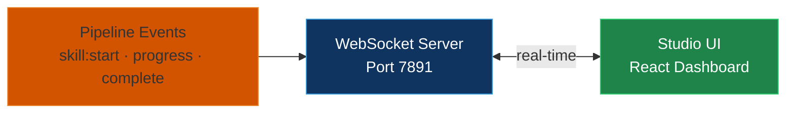

**Features:** Phase progress, Memory trace timeline, Token/cost tracker, Session history.

### 2. Tool Sandboxing — Security Isolation

Isolated execution environments for AI-generated code. Zero-trust security with policy enforcement.

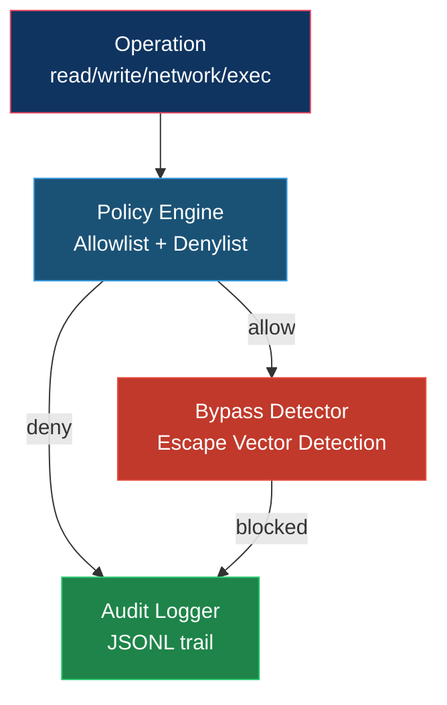

**Sandbox types:** Filesystem, Network, Shell. Default: dry-run mode (preview before execute).

### 3. Template System — 55 Templates for Fast Scaffolding

Pre-built templates for Docker, CI/CD, SRE, Config, Cursor rules, Game engine scaffolding. Generate via CLI.

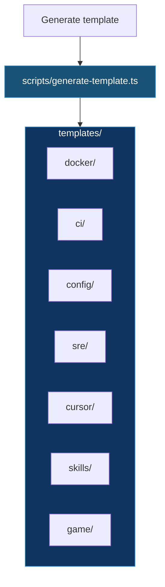

**Generate a template:**
```bash
npx ts-node scripts/generate-template.ts \
  --template ci/github-ci \
  --output ./.github/workflows/ci.yml \
  --data '{"project": "my-app"}'
```

**55 templates included:**
- Docker: multi-stage Dockerfile, docker-compose dev/test/game, .dockerignore
- CI/CD: GitHub Actions CI, CD staging/production, PR checks, commit lint, scheduled
- Config: Jest, Prettier v3, ESLint, TSConfig base, .env.example, Makefile, EditorConfig
- SRE: war room checklist, incident comms, on-call rotation, escalation policy, RCA
- Cursor: rule templates, file-specific rules, agent prompts, rules index
- Skills: DevOps checklist, SRE runbook, SWE patterns, DB migration, mobile assertions
- Game: Godot lobby, NetworkManager, SyncVar, server-authoritative loop

---

## Token Efficiency — 90% Reduction on AI Context

Forgewright v8.1+ implements a comprehensive token efficiency stack that compounds savings across every layer. **Save up to 90% on LLM token costs** while maintaining full functionality.

### Impact Summary

| Metric | Before | After | Reduction |
|--------|--------|-------|-----------|
| **Shell outputs** | Full raw output | Structured summary | **60-80%** |
| **Session duplicate calls** | Repeated tool results | Deduplicated | **90%** |
| **Conversation context** | All turns retained | Intelligent pruning | **50-70%** |
| **Memory retrieval** | Full context load | Progressive disclosure | **75%** |
| **Code execution output** | Raw stdout/stderr | Summarized results | **95-98%** |
| **Symbol navigation** | Full file reads | Minimal signatures | **97%** |
| **Combined estimate** | High token usage | Minimal usage | **~90%** |

### Architecture Overview

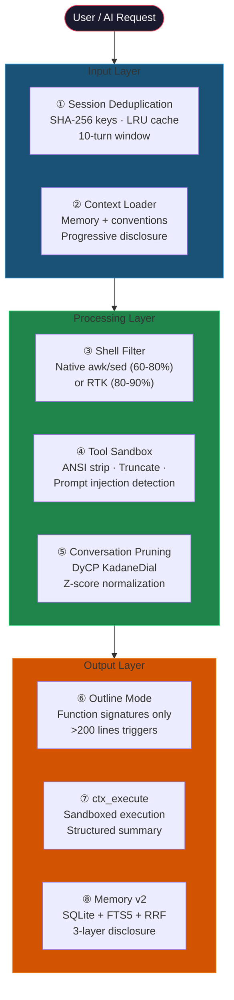

### Components

#### 1. Shell Output Filter — 60-80% reduction

Pure shell script that compresses CLI outputs without external dependencies.

```bash
# Auto-detects best compressor: rtk > chop > snip > ctx > native
bash scripts/run_shell_filter.sh --pipe
```

**Supported commands:** git, npm, cargo, pytest, docker, kubectl, curl, pytest, tsc, eslint, prettier, ruff, mypy, go, gradle, and more.

#### 2. Session Deduplication — 90% reduction

Prevents duplicate tool calls from re-entering context using SHA-256 normalized keys.

```typescript
// Sliding window: 10 turns / 5 minutes
// LRU eviction: 500 entries max
// Eviction: Least Recently Used
```

#### 3. Tool Output Sandboxing — Security + Efficiency

Isolated execution with structured summaries and audit logging.

```typescript
// Features:
// - ANSI stripping
// - Prompt injection detection
// - Compression (truncate >10KB)
// - Audit log: .forgewright/audit/{session}/{turn}/{tool}/
```

#### 4. Conversation Pruning (DyCP) — 50-70% reduction

KadaneDial algorithm for intelligent conversation span selection.

```python
# KadaneDial: Z-score normalized span scoring
# Pre-processing: tool dedup + error purge
# Strategies: structured_summary | truncate | offload
```

#### 5. Memory v2 (SQLite + FTS5 + RRF) — 75% reduction

3-layer progressive disclosure for memory retrieval.

| Layer | Tokens | Content |
|-------|--------|---------|
| Layer 1 | ~15 | Single-line summary |
| Layer 2 | ~60 | Key facts only |
| Layer 3 | ~200 | Full detail |

#### 6. ForgeNexus Outline Mode — 97% reduction

Pattern-based structural extraction for large files.

```typescript
// Thresholds:
// - >200 lines OR >6000 tokens → Outline mode
// - <200 lines → Full content
// Session dedup: "[shown earlier]" on revisit
```

#### 7. ctx_execute Sandbox — 95-98% reduction

Sandboxed code execution with structured output summarization.

```typescript
// Supports: python, node, bash, go, rust, ruby, php
// Language auto-detection via shebang or syntax
// Configurable: timeout_ms, max_output_chars
```

#### 8. Token-Savior Integration — 97% reduction (optional)

Ultra-efficient symbol navigation via Token-Savior MCP.

```bash
# Install:
pip install 'token-savior-recall[mcp,memory-vector]'

# Detection: Auto-enabled in MCP setup
# Fallback: ForgeNexus if not installed
```

### Test Coverage

All token efficiency features have comprehensive test coverage:

| Module | Tests | Status |
|--------|-------|--------|
| ForgeNexus | 173 | ✅ |
| MCP Server | 86 | ✅ |
| Memory v2 (mem0-v2) | 30 | ✅ |
| DyCP Pruning | 25 | ✅ |
| Shell Filter | 7 | ✅ |
| **Total** | **321** | ✅ |

### Configuration

Settings are auto-generated by `forgewright-mcp-setup.sh` to `.forgewright/settings.env`:

```bash
# Shell output compressor
export FORGEWRIGHT_SHELL_COMPRESSOR="forgewright-shell-filter"  # or rtk/chop/snip

# Session deduplication
export FORGEWRIGHT_SESSION_DEDUP="true"
export FORGEWRIGHT_DEDUP_WINDOW="10"

# Memory
export FORGEWRIGHT_MEMORY_ENABLED="true"

# Code navigation (token-savior > forgenexus)
export FORGEWRIGHT_CODE_NAV="forgenexus"

# Memory vector (token-savior > sqlite)
export FORGEWRIGHT_MEMORY_VECTOR="sqlite"
```

---

## The Flow — How Forgewright Works

> All diagrams below render well on GitHub, GitLab, and any mermaid viewer.
> If you don't see the diagrams — make sure your viewer uses **mermaid 10+**.

### Overview — Who Does What

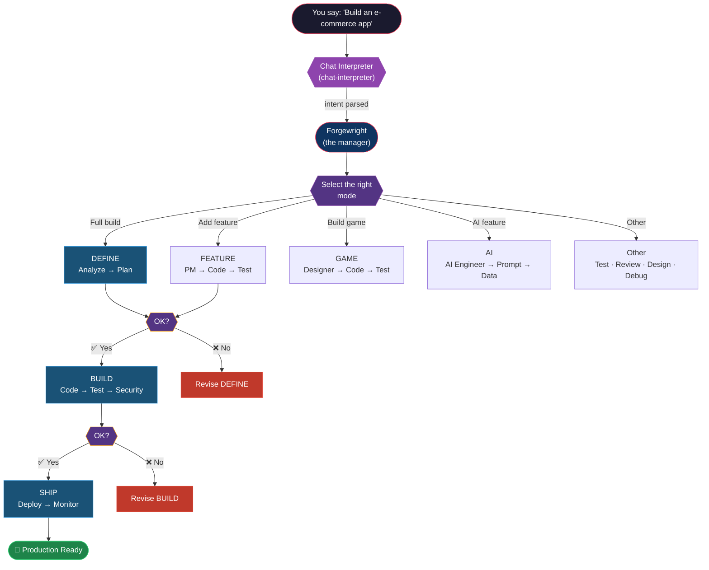

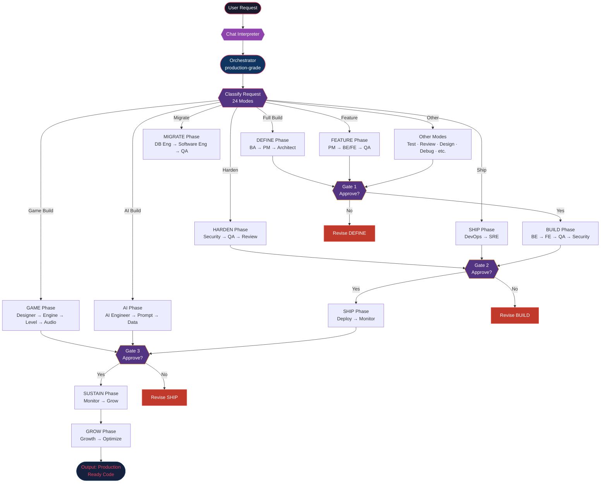

### Middleware Chain (every skill execution)

```mermaid
flowchart TD
    REQ(["User Request"])
    PRE1["① SessionData<br/>Load profile + session state"]
    PRE2["② ContextLoader<br/>Memory + conventions + KIs"]
    PRE3["③ SkillRegistry<br/>Progressive skill discovery"]
    PRE4["④ Guardrail<br/>Pre-tool authorization"]
    PRE5["⑤ PromptMaster<br/>Intent parse · Prompt techniques · Templates"]
    PRE6["⑥ Summarization<br/>Auto-compress if >70% budget"]
    SKILL_EXEC["SKILL EXECUTION<br/>Engineer → QA → Security → ..."]
    POST1["⑦ QualityGate<br/>4-level validation 0-100"]
    POST2["⑧ BrownfieldSafety<br/>Regression + change manifest"]
    POST3["⑨ TaskTracking<br/>Update task.md"]
    POST4["⑩ Memory Turn-Close<br/>REQ: DONE: OPEN: → mem0"]
    POST5["⑪ GracefulFailure<br/>Retry + exit strategy"]
    RESULT(["Result / Next Skill"])

    REQ --> PRE1 --> PRE2 --> PRE3 --> PRE4 --> PRE5 --> PRE6 --> SKILL_EXEC
    SKILL_EXEC --> POST1 --> POST2 --> POST3 --> POST4 --> POST5 --> RESULT

    style REQ fill:#1a1a2e,stroke:#e94560,color:#fff
    style RESULT fill:#16213e,stroke:#0f3460,color:#e94560
    style SKILL_EXEC fill:#0f3460,stroke:#e94560,color:#fff
    style PRE1 fill:#1a5276,stroke:#3498db,color:#fff
    style PRE2 fill:#1a5276,stroke:#3498db,color:#fff
    style PRE3 fill:#1a5276,stroke:#3498db,color:#fff
    style PRE4 fill:#1a5276,stroke:#3498db,color:#fff
    style PRE5 fill:#1a5276,stroke:#3498db,color:#fff
    style PRE6 fill:#1a5276,stroke:#3498db,color:#fff
    style POST1 fill:#1e8449,stroke:#2ecc71,color:#fff
    style POST2 fill:#1e8449,stroke:#2ecc71,color:#fff
    style POST3 fill:#1e8449,stroke:#2ecc71,color:#fff
    style POST4 fill:#1e8449,stroke:#2ecc71,color:#fff
    style POST5 fill:#1e8449,stroke:#2ecc71,color:#fff
```

### Session Lifecycle (Turn-Start + Turn-Close)

```mermaid
sequenceDiagram
    autonumber
    participant User
    participant Orch as Orchestrator
    participant Mem as Memory mem0
    participant Forge as ForgeNexus
    participant Skill as Skills

    User->>Orch: New Session Start

    Orch->>Orch: Step 0.5: Load .forgewright/ context
    Orch->>Orch: Step 1: Load project-profile.json
    Orch->>Orch: Step 2: Load session-log.json
    Orch->>Orch: Step 3: mem0 search + code-conventions
    Orch->>Forge: Step 3.5: Check index freshness
    Orch->>Orch: Step 4: Detect greenfield vs brownfield

    rect rgb(20, 30, 60)
        Note over Orch,Skill: FOR EACH REQUEST (within session)

        User->>Orch: Request

        rect rgb(30, 50, 80)
            Note over Orch: TURN-START
            Orch->>Mem: T1: Load CONVERSATION_SUMMARY.md
            Orch->>Mem: T2: mem0 search recent turns + session
            Orch->>Mem: T3: Load BA scope + pipeline context
        end

        Orch->>Skill: Route to skills via Plan Quality Loop
        Skill-->>Orch: Skill output

        rect rgb(20, 60, 40)
            Note over Orch: TURN-CLOSE (mandatory)
            Orch->>Mem: TC1: Auto-generate CONVERSATION_SUMMARY.md
            Orch->>Mem: TC2: mem0 add REQ/DONE/OPEN/SCOPE_UPDATE
            Orch->>Mem: TC3: Optional: decisions/architecture/blockers
        end

        Orch-->>User: Response
    end

    User->>Orch: Session End
```

### Game Build Pipeline (18 game skills)

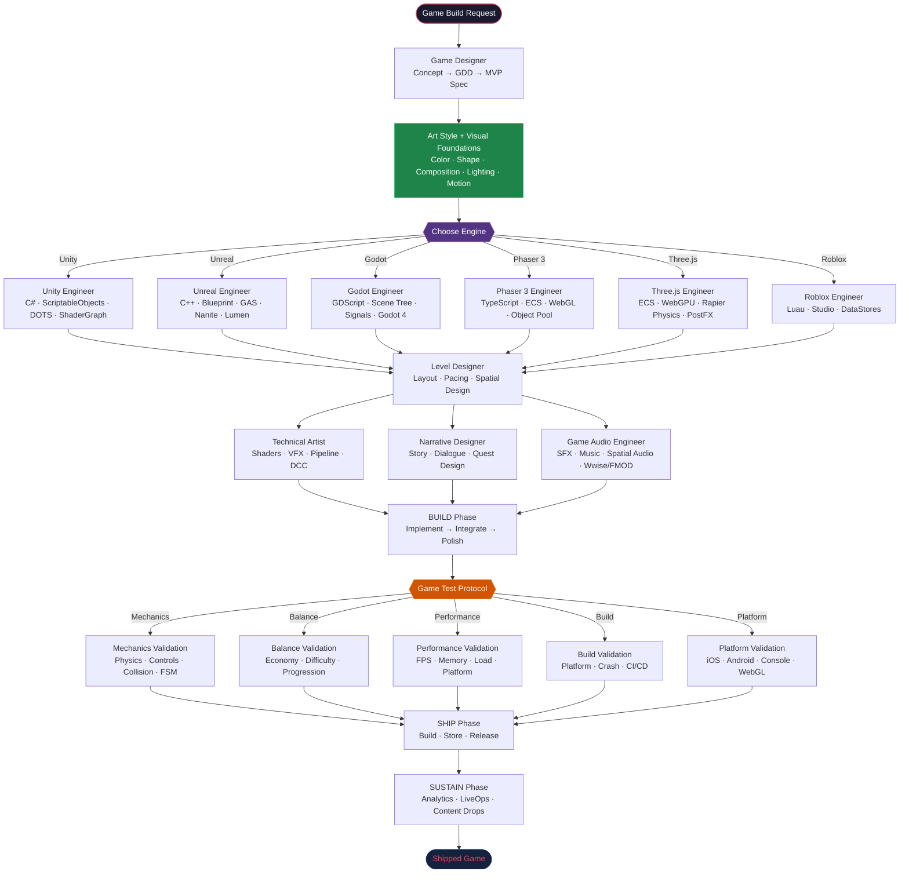

### Full Build Pipeline (6 Phases + 3 Gates)

```mermaid
flowchart LR
    START(["User Request"])

    START --> DEFINE["DEFINE Phase<br/>Business Analyst<br/>Product Manager<br/>Solution Architect"]

    DEFINE --> GATE1{{"Gate 1<br/>Plan Approved?"}}
    GATE1 --> |"No"| REV1["Revise DEFINE"]
    GATE1 --> |"Yes"| BUILD["BUILD Phase<br/>Backend Engineer<br/>Frontend Engineer<br/>QA Engineer<br/>Security Engineer"]

    BUILD --> GATE2{{"Gate 2<br/>Code Approved?"}}
    GATE2 --> |"No"| REV2["Revise BUILD"]
    GATE2 --> |"Yes"| HARDEN["HARDEN Phase<br/>Security Engineer<br/>QA Engineer<br/>Code Reviewer<br/>Accessibility Engineer"]

    HARDEN --> SHIP["SHIP Phase<br/>DevOps<br/>SRE<br/>Database Engineer<br/>Performance Engineer"]

    SHIP --> GATE3{{"Gate 3<br/>Deploy Approved?"}}
    GATE3 --> |"No"| REV3["Revise SHIP"]
    GATE3 --> |"Yes"| SUSTAIN["SUSTAIN Phase<br/>Monitor<br/>Test · Review<br/>Document"]

    SUSTAIN --> GROW["GROW Phase<br/>Growth Marketer<br/>Conversion Optimizer<br/>AI Engineer"]

    GROW --> END(["Production Ready"])

    style START fill:#1a1a2e,stroke:#e94560,color:#fff
    style END fill:#16213e,stroke:#0f3460,color:#e94560
    style GATE1 fill:#533483,stroke:#f39c12,color:#fff
    style GATE2 fill:#533483,stroke:#f39c12,color:#fff
    style GATE3 fill:#533483,stroke:#f39c12,color:#fff
    style REV1 fill:#c0392b,stroke:#e74c3c,color:#fff
    style REV2 fill:#c0392b,stroke:#e74c3c,color:#fff
    style REV3 fill:#c0392b,stroke:#e74c3c,color:#fff
    style DEFINE fill:#0f3460,stroke:#3498db,color:#fff
    style BUILD fill:#0f3460,stroke:#3498db,color:#fff
    style HARDEN fill:#0f3460,stroke:#3498db,color:#fff
    style SHIP fill:#0f3460,stroke:#3498db,color:#fff
    style SUSTAIN fill:#0f3460,stroke:#3498db,color:#fff
    style GROW fill:#0f3460,stroke:#3498db,color:#fff
```

### NotebookLM Research Workflow (Research Mode — v0.5.19)

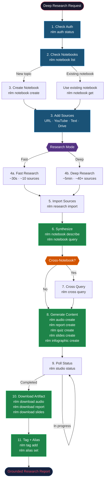

### ForgeNexus Analyze Pipeline (code analysis)

```mermaid
flowchart LR
    ANAME["npx forgenexus analyze"]

    subgraph SCAN["① Scanner"]
        S1["glob file discovery"]
        S2["language detection"]
        S3[".gitignore filter"]
    end

    subgraph PARSE["② Parse — tree-sitter AST"]
        P1["Worker Pool<br/>cpus-1 threads<br/>20MB budget/worker"]
        P2["Graceful fallback<br/>sequential if <15 files"]
        P3["17 Edge Types extracted"]
    end

    subgraph RESOLVE["③ Resolve"]
        R1["Suffix Trie O(1)<br/>import path resolution"]
        R2["Fast-path<br/>skip if <3% gaps"]
    end

    subgraph PROP["④ Propagate"]
        PP1["Kahn topological sort"]
        PP2["Cross-file binding"]
    end

    subgraph COMMUNITY["⑤ Community — Leiden Algorithm"]
        C1["3-phase:<br/>move → refine → aggregate"]
        C2["60s timeout · large-graph mode"]
    end

    subgraph PROCESS["⑥ Process — BFS Entry-Point Tracing"]
        PR1["Call chain extraction"]
        PR2["Auto-detect framework:<br/>Next.js · FastAPI · NestJS<br/>Express · Django · Rails<br/>Gin · Spring · etc."]
    end

    subgraph FTS_EMB["⑦ FTS + Embeddings"]
        F1["Incremental FTS5<br/>only changed nodes"]
        E1["Cache-first embedding<br/>5 providers"]
    end

    subgraph META["⑧ Meta"]
        M1["Commit tracking"]
        M2["Early exit<br/>if git unchanged"]
    end

    DB[(<b>KuzuDB Graph<br/>Nodes + Rels + FTS<br/>Vector Embeddings</b>)]

    ANAME --> SCAN --> PARSE --> RESOLVE --> PROP --> COMMUNITY --> PROCESS --> FTS_EMB --> META
    FTS_EMB --> DB
    PARSE --> DB
    PROP --> DB

    style ANAME fill:#0f3460,stroke:#e94560,color:#fff
    style DB fill:#16213e,stroke:#4B0082,color:#fff
    style SCAN fill:#1a5276,stroke:#3498db
    style PARSE fill:#1a5276,stroke:#3498db
    style RESOLVE fill:#6c3483,stroke:#9b59b6
    style PROP fill:#6c3483,stroke:#9b59b6
    style COMMUNITY fill:#1e8449,stroke:#2ecc71
    style PROCESS fill:#1e8449,stroke:#2ecc71
    style FTS_EMB fill:#d35400,stroke:#e67e22
    style META fill:#2c3e50,stroke:#7f8c8d
```

### Multi-Repo Group Management

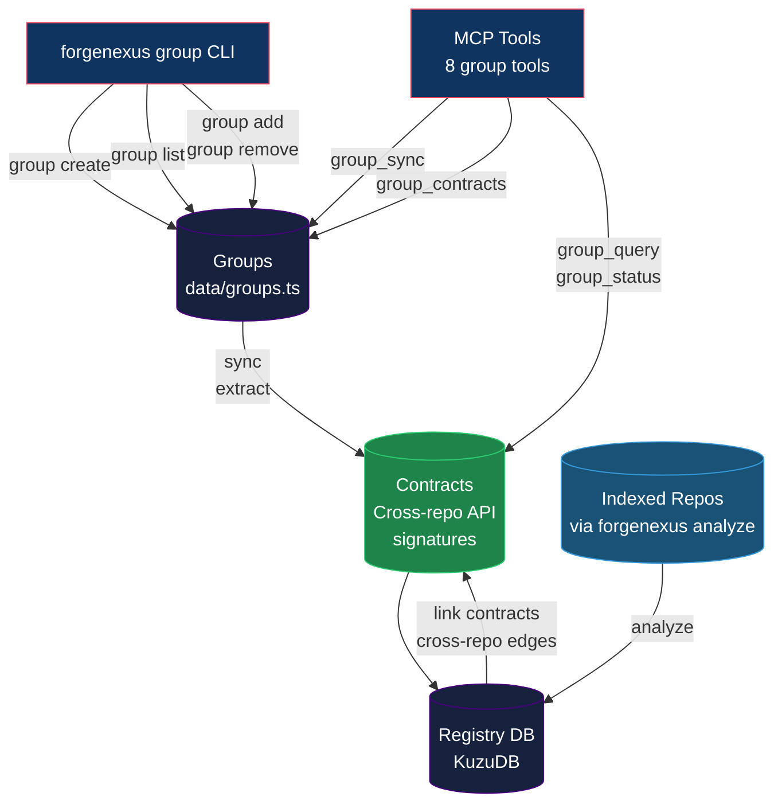

### ForgeNexus Enterprise — GitHub Actions

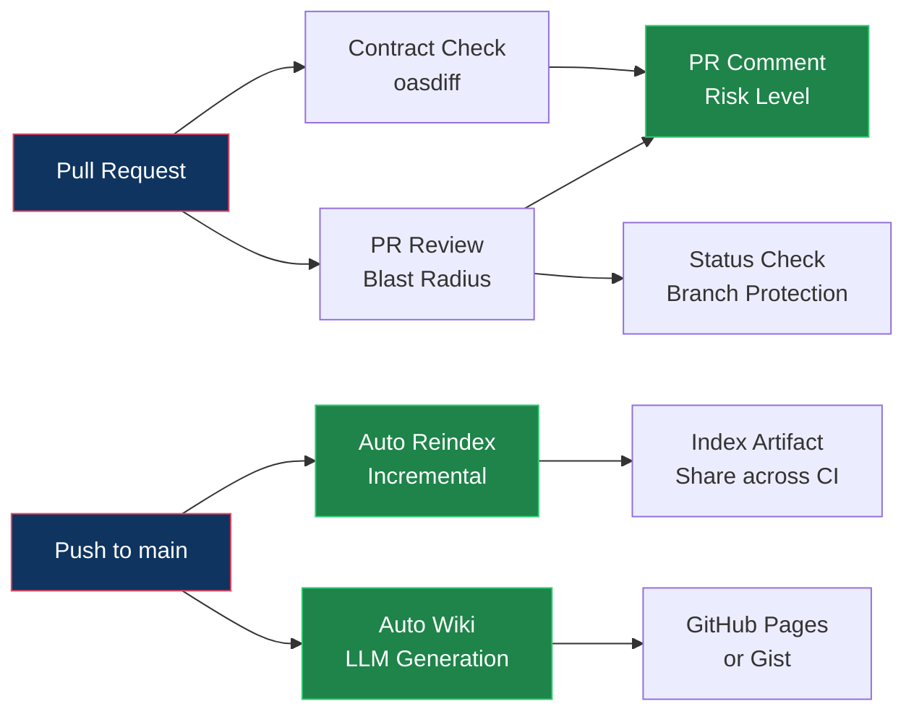

#### Quick Setup — PR Review for your repo

#### CLI Commands (Enterprise)

| Command | Description |
|---------|-------------|
| `pr-review <base> [head]` | Analyze PR blast radius |
| `impact <symbol>` | Analyze symbol impact |
| `group contracts <group>` | View all contracts in group |
| `group status <group>` | Check staleness of all repos |
| `group query <group> <term>` | Search across all repos |

#### Enterprise Features

| Feature | CLI | GitHub Actions | Dry Run |
|---------|-----|---------------|---------|
| PR Review Blast Radius | ✅ | ✅ | ✅ |
| OpenAPI contract check (oasdiff) | N/A | ✅ | ✅ |
| Auto-generate Wiki | ✅ | ✅ | ✅ |
| Auto Reindex (incremental/full) | ✅ | ✅ | ✅ |
| Multi-Repo Group Management | ✅ | ✅ | ✅ |
| Cross-repo impact analysis | N/A | ✅ | ✅ |

**Completion: 100%** — All features support dry-run mode.

### Claude Code Hooks — Auto-Reindex

```mermaid
flowchart TD
    HOOK_PRE[("pre-tool-use hook<br/>Enrich context")]
    HOOK_POST[("post-tool-use hook<br/>Auto-reindex")]

    subgraph PRE_HOOK["pre-tool-use.ts"]
        T1{"tool name?"}
        T_GREP["grep / search<br/>ForgeNexus search<br/>→ show callers"]
        T_READ["read file<br/>→ show file symbols"]
        T_EDIT["edit / Write<br/>→ warn about callers"]
        T_SKIP["Other tools<br/>→ skip"]
    end

    subgraph POST_HOOK["post-tool-use.ts"]
        G1{"git commit<br/>detected?"}
        G2["Find forgenexus root<br/>detect last commit"]
        G3["Spawn incremental<br/>forgenexus analyze"]
        G4["Success → log<br/>Failure → warn"]
    end

    HOOK_PRE --> PRE_HOOK
    PRE_HOOK --> T1
    T1 --> |"grep/search"| T_GREP
    T1 --> |"read"| T_READ
    T1 --> |"edit/Write"| T_EDIT
    T1 --> |"other"| T_SKIP

    HOOK_POST --> POST_HOOK
    POST_HOOK --> G1
    G1 --> |"yes"| G2 --> G3 --> G4
    G1 --> |"no"| G_SKIP["(no action)"]

    style HOOK_PRE fill:#6c3483,stroke:#9b59b6,color:#fff
    style HOOK_POST fill:#6c3483,stroke:#9b59b6,color:#fff
    style PRE_HOOK fill:#1a1a2e,stroke:#9b59b6
    style POST_HOOK fill:#1a1a2e,stroke:#9b59b6
    style T_GREP fill:#1e8449,stroke:#2ecc71,color:#fff
    style T_READ fill:#1e8449,stroke:#2ecc71,color:#fff
    style T_EDIT fill:#d35400,stroke:#e67e22,color:#fff
    style G3 fill:#d35400,stroke:#e67e22,color:#fff
```

### 24 Modes — What You Say, Forgewright Chooses

```mermaid
flowchart LR
    INPUT["You say..."]

    INPUT --> F1["Build SaaS<br/>Production Grade"]
    INPUT --> F2["Add feature"]
    INPUT --> F3["Build Game<br/>Unity/Unreal/Godot/Roblox"]
    INPUT --> F4["Build VR/AR"]
    INPUT --> F5["Build Mobile<br/>iOS/Android"]
    INPUT --> F6["AI Feature<br/>RAG/LLM/Chatbot"]
    INPUT --> F7["Review Code<br/>Quality check"]
    INPUT --> F8["Write Tests"]
    INPUT --> F9["Deploy CI/CD<br/>Docker/Terraform"]
    INPUT --> F10["Design UI<br/>UX Research"]
    INPUT --> F11["Optimize<br/>Performance"]
    INPUT --> F12["Deep research"]
    INPUT --> F13["Marketing"]
    INPUT --> F14["Debug Fix<br/>Bug Trace"]
    INPUT --> F15["Analyze<br/>Requirements"]
    INPUT --> F16["Migrate DB"]
    INPUT --> F17["Harden Security<br/>Audit + Fix"]
    INPUT --> F18["Design Architecture<br/>API/Data Model"]
    INPUT --> F19["Write Docs"]
    INPUT --> F20["Improve Prompts<br/>Prompt Engineering"]
    INPUT --> F21["Autonomous Testing<br/>Self-Healing E2E"]

    F1 --> M1{{"Full Build"}}
    F2 --> M2{{"Feature"}}
    F3 --> M3{{"Game Build"}}
    F4 --> M4{{"XR Build"}}
    F5 --> M5{{"Mobile"}}
    F6 --> M6{{"AI Build"}}
    F7 --> M7{{"Review"}}
    F8 --> M8{{"Test"}}
    F9 --> M9{{"Ship"}}
    F10 --> M10{{"Design"}}
    F11 --> M11{{"Optimize"}}
    F12 --> M12{{"Research"}}
    F13 --> M13{{"Marketing"}}
    F14 --> M14{{"Debug"}}
    F15 --> M15{{"Analyze"}}
    F16 --> M16{{"Migrate"}}
    F17 --> M17{{"Harden"}}
    F18 --> M18{{"Architect"}}
    F19 --> M19{{"Document"}}
    F20 --> M20{{"Prompt"}}
    F21 --> M21{{"Autonomous"}}

    M1 --> SK1["BA → PM → Architect →<br/>BE → FE → QA →<br/>Security → DevOps → SRE"]
    M2 --> SK2["PM → Architect →<br/>BE/FE → QA"]
    M3 --> SK3["Game Designer →<br/>Engine Engineer →<br/>Level → Narrative →<br/>Technical Art → Audio"]
    M4 --> SK4["XR Engineer →<br/>XR Game Pipeline"]
    M5 --> SK5["BA → Mobile Engineer →<br/>PM → Architect"]
    M6 --> SK6["AI Engineer →<br/>Prompt Engineer →<br/>Data Scientist"]
    M7 --> SK7["Code Reviewer"]
    M8 --> SK8["QA Engineer"]
    M9 --> SK9["DevOps → SRE"]
    M10 --> SK10["UX Researcher →<br/>UI Designer"]
    M11 --> SK11["Performance Engineer →<br/>SRE"]
    M12 --> SK12["NotebookLM Researcher\n(+ Polymath web search)"]
    M13 --> SK13["Growth Marketer →<br/>Conversion Optimizer"]
    M14 --> SK14["Debugger →<br/>Engineer"]
    M15 --> SK15["Business Analyst"]
    M16 --> SK16["Database Engineer →<br/>Software Eng → QA"]
    M17 --> SK17["Security → QA →<br/>Code Review → Fix"]
    M18 --> SK18["Solution Architect"]
    M19 --> SK19["Technical Writer"]
    M20 --> SK20["Prompt Engineer →<br/>chat-interpreter →<br/>prompt-techniques → templates"]
    M21{{"Autonomous"}} --> SK21["Autonomous Testing →<br/>Self-Healing E2E →<br/>Vitest + Playwright + Applitools"]

    style INPUT fill:#1a1a2e,stroke:#e94560,color:#fff
    style M1 fill:#533483,stroke:#9b59b6,color:#fff
    style M2 fill:#533483,stroke:#9b59b6,color:#fff
    style M3 fill:#533483,stroke:#9b59b6,color:#fff
    style M4 fill:#533483,stroke:#9b59b6,color:#fff
    style M5 fill:#533483,stroke:#9b59b6,color:#fff
    style M6 fill:#533483,stroke:#9b59b6,color:#fff
    style M7 fill:#533483,stroke:#9b59b6,color:#fff
    style M8 fill:#533483,stroke:#9b59b6,color:#fff
    style M9 fill:#533483,stroke:#9b59b6,color:#fff
    style M10 fill:#533483,stroke:#9b59b6,color:#fff
    style M11 fill:#533483,stroke:#9b59b6,color:#fff
    style M12 fill:#533483,stroke:#9b59b6,color:#fff
    style M13 fill:#533483,stroke:#9b59b6,color:#fff
    style M14 fill:#533483,stroke:#9b59b6,color:#fff
    style M15 fill:#533483,stroke:#9b59b6,color:#fff
    style M16 fill:#533483,stroke:#9b59b6,color:#fff
    style M17 fill:#533483,stroke:#9b59b6,color:#fff
    style M18 fill:#533483,stroke:#9b59b6,color:#fff
    style M19 fill:#533483,stroke:#9b59b6,color:#fff
    style M20 fill:#8e44ad,stroke:#9b59b6,color:#fff
    style M21 fill:#8e44ad,stroke:#9b59b6,color:#fff
    style F21 fill:#1a5276,stroke:#3498db,color:#fff
    style SK1 fill:#0f3460,stroke:#3498db,color:#fff
    style SK2 fill:#0f3460,stroke:#3498db,color:#fff
    style SK3 fill:#0f3460,stroke:#3498db,color:#fff
    style SK4 fill:#0f3460,stroke:#3498db,color:#fff
    style SK5 fill:#0f3460,stroke:#3498db,color:#fff
    style SK6 fill:#0f3460,stroke:#3498db,color:#fff
    style SK7 fill:#0f3460,stroke:#3498db,color:#fff
    style SK8 fill:#0f3460,stroke:#3498db,color:#fff
    style SK9 fill:#0f3460,stroke:#3498db,color:#fff
    style SK10 fill:#0f3460,stroke:#3498db,color:#fff
    style SK11 fill:#0f3460,stroke:#3498db,color:#fff
    style SK12 fill:#0f3460,stroke:#3498db,color:#fff
    style SK13 fill:#0f3460,stroke:#3498db,color:#fff
    style SK14 fill:#0f3460,stroke:#3498db,color:#fff
    style SK15 fill:#0f3460,stroke:#3498db,color:#fff
    style SK16 fill:#0f3460,stroke:#3498db,color:#fff
    style SK17 fill:#0f3460,stroke:#3498db,color:#fff
    style SK18 fill:#0f3460,stroke:#3498db,color:#fff
    style SK19 fill:#0f3460,stroke:#3498db,color:#fff
    style SK20 fill:#8e44ad,stroke:#3498db,color:#fff
    style SK21 fill:#8e44ad,stroke:#3498db,color:#fff
```

---

## 56 Skills — Which One, When?

```mermaid
flowchart TD
    USER["What do you want to do?"]

    USER --> |"Build new website/app"| SaaS["📦 Core Engineering<br/>23 skills"]
    USER --> |"Build game (Unity/Unreal/Godot)"| GAME["🎮 Game Development<br/>18 skills"]
    USER --> |"Autonomous Testing"| AUT["🤖 Autonomous Testing<br/>Self-Healing E2E"]
    USER --> |"Optimize / debug code"| OPT["🔧 Optimization & Debug<br/>Performance · Debugger · QA"]
    USER --> |"Research / data analysis"| DATA["📊 Data & AI<br/>AI Engineer · Data Scientist · NotebookLM"]
    USER --> |"Deploy / CI/CD / infra"| DEVOPS["🚀 DevOps & Ship<br/>DevOps · SRE · Database"]
    USER --> |"Marketing / growth"| GROW["📈 Growth<br/>Growth Marketer · Conversion Optimizer"]
    USER --> |"Design / UX"| DESIGN["🎨 Design & UX<br/>UX Researcher · UI Designer"]

    SaaS --> SaaS_DETAIL["<b>23 skills:</b><br/>Business Analyst · Product Manager<br/>Solution Architect · Software Engineer<br/>Frontend · QA · Security · DevOps · SRE<br/>Database · API Designer · Prompt Engineer"]
    AUT --> AUT_DETAIL["<b>Autonomous Testing:</b><br/>Vitest · Playwright · Applitools<br/>Self-healing · Auto-fix · Continue"]
    GAME --> GAME_DETAIL["<b>18 skills:</b><br/>Game Designer · Unity/Unreal/Godot/Roblox Engineer<br/>Level Designer · Narrative Designer<br/>Technical Artist · Game Audio Engineer<br/>XR Engineer"]
    OPT --> OPT_DETAIL["<b>Optimize:</b> Performance Engineer<br/><b>Debug:</b> Debugger → Software Engineer<br/><b>Test:</b> QA Engineer"]
    DATA --> DATA_DETAIL["<b>AI:</b> AI Engineer · Prompt Engineer · Data Scientist<br/><b>Research:</b> NotebookLM Researcher<br/><b>Web:</b> Web Scraper · XLSX Engineer"]
    DEVOPS --> DEVOPS_DETAIL["<b>Ship:</b> DevOps · SRE · Performance Engineer<br/><b>Data:</b> Database Engineer<br/><b>API:</b> API Designer"]
    GROW --> GROW_DETAIL["<b>Growth:</b> Growth Marketer<br/><b>Conversion:</b> Conversion Optimizer"]
    DESIGN --> DESIGN_DETAIL["<b>Research:</b> UX Researcher<br/><b>Design:</b> UI Designer<br/><b>Accessibility:</b> Accessibility Engineer"]

    style USER fill:#1a1a2e,stroke:#e94560,color:#fff
    style SaaS fill:#1a5276,stroke:#3498db,color:#fff
    style AUT fill:#1e8449,stroke:#2ecc71,color:#fff
    style GAME fill:#1a5276,stroke:#3498db,color:#fff
    style OPT fill:#1a5276,stroke:#3498db,color:#fff
    style DATA fill:#1a5276,stroke:#3498db,color:#fff
    style DEVOPS fill:#1a5276,stroke:#3498db,color:#fff
    style GROW fill:#1a5276,stroke:#3498db,color:#fff
    style DESIGN fill:#1a5276,stroke:#3498db,color:#fff
    style SaaS_DETAIL fill:#0f3460,stroke:#3498db,color:#fff
    style AUT_DETAIL fill:#1e8449,stroke:#2ecc71,color:#fff
    style GAME_DETAIL fill:#0f3460,stroke:#3498db,color:#fff
    style OPT_DETAIL fill:#0f3460,stroke:#3498db,color:#fff
    style DATA_DETAIL fill:#0f3460,stroke:#3498db,color:#fff
    style DEVOPS_DETAIL fill:#0f3460,stroke:#3498db,color:#fff
    style GROW_DETAIL fill:#0f3460,stroke:#3498db,color:#fff
    style DESIGN_DETAIL fill:#0f3460,stroke:#3498db,color:#fff
```

---

## Detailed Setup

### Method 1: Add to another project as submodule

**Step 1:** Open Terminal, run from your project root:

```bash
git submodule add -b main https://github.com/buiphucminhtam/forgewright.git \
  .antigravity/plugins/production-grade
```

**Step 2:** Copy the 2 required files:

```bash
cp .antigravity/plugins/production-grade/AGENTS.md .
cp .antigravity/plugins/production-grade/CLAUDE.md .
```

**Step 3:** Commit:

```bash
git add .gitmodules .antigravity AGENTS.md CLAUDE.md
git commit -m "feat: add forgewright"
```

**Step 4:** Initialize the submodule:

```bash
git submodule update --init --recursive
```

### Method 2: Upgrade to Level 2 (Smart)

Requires: **Node.js 18+**

```bash
# Check
node --version

# If missing → download from nodejs.org
# macOS: brew install node
```

Then:

```bash
npx --yes forgenexus analyze "$(pwd)"
```

Wait 1-2 minutes (first time). Done!

### Method 3: Add memory (Level 3)

Requires: **Python 3.8+**

```bash
# Check
python3 --version
```

Then:

```bash
bash .antigravity/plugins/production-grade/scripts/ensure-mem0.sh "$(pwd)"
```

### Method 4: Install MCP server (Level 4)

**ONE command — does everything:**

```bash
# Standard way (from project using forgewright as submodule)
bash forgewright/scripts/forgewright-mcp-setup.sh

# Or via Antigravity plugin (universal, works from any project)
bash .antigravity/plugins/production-grade/scripts/forgewright-mcp-setup.sh
```

This single command:
- Detects forgewright location automatically
- Generates the MCP server
- Creates the workspace manifest
- Updates your global config (Cursor/Claude)
- Verifies the installation

Then restart Cursor/VS Code.

**Check status anytime:**

```bash
bash forgewright/scripts/forgewright-mcp-setup.sh --check
```

**Diagnose problems:**

```bash
bash forgewright/scripts/forgewright-mcp-setup.sh --diagnose
```

### Verify your installation

```bash
echo "=== Verification ==="
echo "Skills: $(ls .antigravity/plugins/production-grade/skills/ -1 2>/dev/null | wc -l | tr -d ' ')"
echo "ForgeNexus: $([ -f .antigravity/plugins/production-grade/forgenexus/dist/cli/index.js ] && echo 'OK' || echo 'MISSING')"
echo "MCP: $([ -d .forgewright/mcp-server ] && echo 'OK' || echo 'MISSING')"
echo "Memory: $([ -f .forgewright/memory.jsonl ] && echo 'OK' || echo 'MISSING')"
```

---

## Optional Enhancements

### Research — NotebookLM CLI (v0.5.19)

> **AI research that never gets it wrong.** Use Google NotebookLM to read documents, create summaries, quizzes, flashcards, podcasts, reports, slides, and more.

```bash
# Install (uv recommended)
pipx install notebooklm-mcp-cli

# Authenticate (launches browser, extracts cookies automatically)
nlm login

# Check status
nlm auth status        # Shows "Authenticated" with notebook count
nlm notebook list      # List all notebooks
nlm --ai              # Full AI-optimized documentation
```

**35+ tools:** notebook, source, research, studio, audio, video, report, quiz, flashcards, mindmap, slides, infographic, data-table, batch, cross-notebook, pipelines, tags, drive-sync, sharing, aliases.

### Web Scraping (crawl4ai)

```bash
pip install "crawl4ai>=0.8.0"
# Then: "Scrape [URL]" or "Crawl [website]"
```

### AI Vision Testing (Midscene.js)

```bash
npm install -g @anthropic-ai/midscene
# Then: "Test on Android" or "Test on iOS"
```

### Multi-Agent (Paperclip)

```bash
npx paperclipai onboard --yes
cd paperclip && pnpm dev
# Dashboard: http://localhost:3100
```

---

## Quality Gate — Automatic Scoring

Run anytime to score your project 0-100:

```bash
bash scripts/forge-validate.sh

# CI mode (exit code only)
bash scripts/forge-validate.sh --quiet

# JSON report
bash scripts/forge-validate.sh --json
```

| Score | Grade | Meaning |
|-------|-------|---------|
| 90–100 | A | Production ready |
| 80–89 | B | Minor issues |
| 70–79 | C | Should review |
| 60–69 | D | Fix before deploy |
| < 60 | F | Not acceptable — blocks deploy |

---

## Troubleshooting

| Issue | Solution |
|-------|----------|
| `forgenexus: command not found` | Use `npx forgenexus` instead of `forgenexus` |
| MCP setup fails | Run `bash forgewright/scripts/forgewright-mcp-setup.sh --diagnose` |
| Can't see MCP tools | Restart Cursor/VS Code after config change |
| Stale index | Run `npx forgenexus analyze "$(pwd)"` |
| Submodule not initialized | `git submodule update --init --recursive` |
| `realpath` not found (macOS) | `brew install coreutils` |
| `python3` not found | Install Python 3.8+ for memory feature |
| Windows: `bash` not found | Use equivalent PowerShell commands |
| Mermaid diagrams not showing | Make sure viewer uses **mermaid 10+**. GitHub/GitLab supported. |
| `better-sqlite3` error after merge | Run `cd forgenexus && npm install` to install `kuzu` instead |
| Multi-project MCP conflicts | Use `forgewright-mcp-setup.sh` — one config per workspace |

**Quick diagnostics:**
```bash
# Check MCP status
bash forgewright/scripts/forgewright-mcp-setup.sh --check

# Diagnose issues
bash forgewright/scripts/forgewright-mcp-setup.sh --diagnose
```

---

## Available Workflow Shortcuts

| Command | What it does |
|---------|--------------|
| `/setup` | First-time setup as git submodule |
| `/update` | Check for and install updates (safe, keeps your changes) |
| `/pipeline` | View full pipeline, modes, and skills list |
| `/onboard` | Deep project analysis — creates `.forgewright/project-profile.json` |
| `/mcp` | Check or regenerate MCP setup |
| `/setup-mcp` | One-command MCP setup for any project |
| `/setup-mobile-test` | Set up mobile testing for Android/iOS |

---

## Contributing

1. Fork the repo
2. Create branch: `git checkout -b feature/your-feature`
3. Commit using [Conventional Commits](https://www.conventionalcommits.org/): `feat(skill): add new capability`
4. Open a Pull Request

**Adding a new skill:** Create a file at `skills/your-skill-name/SKILL.md`. See existing skills for examples.

---

## License

MIT

---

## Support the Project

If Forgewright helps you ship faster, you can support here:

<p align="center">
  
</p>

---

<p align="center">
  <strong>Forgewright — 56 AI skills. 24 modes. Persistent Memory. Code Intelligence. Real-time Studio. Sandboxed Execution. 55 Templates.</strong>
</p>
<p align="center">
  <em>Plan precisely. Build confidently. Scale intelligently.</em>
</p>
