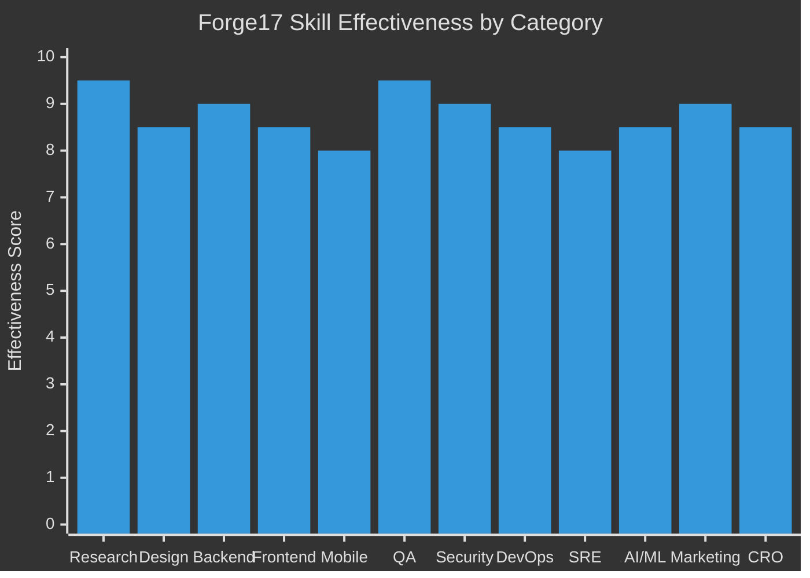

# 🔨 Forge17

[](https://opensource.org/licenses/MIT)
[]()
[]()
[]()
[]()
[]()
[]()
[]()
[]()

**21 AI Skills. Full Lifecycle. Research → Build → Test → Market → Grow.**

> *"One prompt to research, design, build, test, secure, deploy, market, and grow — the complete business lifecycle."*

Forge17 is an AI pipeline that orchestrates **21 specialized skills** across **6 phases** to take a product from idea to market. The only AI pipeline that covers the **complete lifecycle**: DEFINE → BUILD → HARDEN → SHIP → SUSTAIN → **GROW**.

> Built from [claude-code-production-grade-plugin](https://github.com/nagisanzenin/claude-code-production-grade-plugin) and [awesome-claude-skills](https://github.com/ComposioHQ/awesome-claude-skills). Entirely vibe coded — the skills evaluated and upgraded themselves. 🎵


---

## Give me a coffee

If Forge17 helps you ship faster, you can support the project here:


### Release Timeline

```
2026-03-12  v5.6  ●━━━ Mobile Tester — plug-and-play AI testing on Android/iOS real devices
                  │
2026-03-12  v5.5  ●━━━ GROW Phase — Growth Marketer + Conversion Optimizer, 6-phase lifecycle
                  │
2026-03-12  v5.4  ●━━━ Vision Testing — Midscene.js AI testing, cross-platform (web+mobile+desktop)
                  │
2026-03-11  v5.3  ●━━━ Research Intelligence — NotebookLM MCP, deep research workflow, 13 modes
                  │
2026-03-10  v5.2  ●━━━ Parallel dispatch (git worktrees), scope analysis, anti-hallucination
                  │
2026-03-06  v5.1  ●━━━ +3 new skills, +5 upgrades, 14→17 skills, 12 execution modes
                  │
2026-03-06  v5.0  ●━━━ Migrated to Antigravity, sequential execution, updated tool APIs
                  │
2026-03-06  v4.2  ●━━━ Adaptive routing, 10 execution modes, everyday SWE work
                  │
2026-03-05  v4.1  ●━━━ Engagement modes, scale-driven architecture, adaptive interviews
                  │
2026-03-04  v4.0  ●━━━ Two-wave parallelism, internal skill agents, dynamic task generation
                  │
2026-03-04  v3.3  ●━━━ Brownfield-safe — works on existing codebases
                  │
2026-03-03  v3.2  ●━━━ Auto-update, MECE intent routing, protocol crash fix
                  │
2026-03-02  v3.1  ●━━━ Polymath co-pilot — the 14th skill
                  │
2026-03-01  v3.0  ●━━━ Full rewrite — shared protocols, 7 parallel points
                  │
2026-02-28  v2.0  ●━━━ 13 bundled skills, unified workspace, prescriptive UX
                  │
2026-02-24  v1.0  ●━━━ Initial release — autonomous DEFINE>BUILD>HARDEN>SHIP>SUSTAIN
```

---

## For Antigravity Users

Forge17 is self-discovering. Once installed, Antigravity reads `AGENTS.md` on every new chat and automatically routes your requests through the 21-skill pipeline. No manual configuration needed.

**Available workflows (slash commands):**

| Command | Description |
|---------|-------------|
| `/setup` | First-time install as git submodule |
| `/update` | Check for and install updates |
| `/pipeline` | Show full pipeline reference, modes, and skill list |
| `/setup-mobile-test` | Set up plug-and-play mobile testing (Android/iOS) |

Just open a new chat and describe what you want. The orchestrator handles the rest.

---

## Quick Start

### Option A: One-liner Setup (Recommended)

```bash
# macOS/Linux — download & install as git submodule
curl -sO https://raw.githubusercontent.com/buiphucminhtam/forge17/main/setup.sh
chmod +x setup.sh && ./setup.sh install

# Windows (PowerShell)
Invoke-WebRequest -Uri "https://raw.githubusercontent.com/buiphucminhtam/forge17/main/setup.ps1" -OutFile "setup.ps1"
.\setup.ps1 install
```

### Option B: Manual Git Submodule

```bash
git submodule add -b main https://github.com/buiphucminhtam/forge17.git .antigravity/plugins/production-grade
git add .gitmodules .antigravity/ && git commit -m "feat: add production-grade plugin v5.6"
```

### Option C: Standalone Clone

```bash
git clone https://github.com/buiphucminhtam/forge17.git
```

Then say: *"Build a production-grade SaaS for [your idea]"* — or *"Help me think about [your idea]"* if you want the Polymath co-pilot first.

### Enable Parallel Dispatch (Optional)

After installing, set up parallel execution support:

```bash
./setup.sh init-parallel   # symlinks worktree-manager, adds .worktrees/ to .gitignore
```

### Updating

```bash
# With setup script
./setup.sh update          # macOS/Linux
.\setup.ps1 update         # Windows

# Manual submodule update
git submodule update --remote .antigravity/plugins/production-grade
git add .antigravity/ && git commit -m "chore: update production-grade plugin"

# Standalone clone
git pull
```

### Team Collaboration

When your project uses the submodule, teammates just run:

```bash
# First time cloning your project
git clone --recurse-submodules <your-project-url>

# Or if already cloned
git submodule update --init --recursive
```

---

## Why This Exists

Software development with AI today is broken in a specific way: **AI is fast at generating code, but slow at understanding what to generate.** You prompt, you get code, it's wrong, you re-prompt, you get different wrong code. The bottleneck isn't generation — it's alignment.

**Forge17 solves both sides:**
1. A **Research Intelligence layer** that grounds decisions in real data — NotebookLM MCP provides zero-hallucination, citation-backed research before any code is written
2. A **Polymath co-pilot** that thinks with you — researches your domain, detects your knowledge gaps, helps you crystallize the idea before committing to code
3. A **21-agent autonomous pipeline** that executes the full software development lifecycle — from requirements to deployment to go-to-market — without you managing the process
4. A **Vision Testing engine** (Midscene.js) that tests UIs with natural language across web, Android, and iOS — no brittle selectors
5. A **Go-to-Market layer** that handles SEO, copywriting, launch campaigns, CRO, A/B testing, and retention — the complete GROW phase

The result: you describe what you want in plain language. 21 specialized skills research, design, build, test, secure, deploy, market, and grow a complete production system. You approve 3 times. That's it.

### By the Numbers

| Metric | Detail |
|--------|--------|
| **21 specialized skills** | Each with sole authority over its domain — no overlap, no contradiction |
| **16 execution modes** | Full Build, Feature, Harden, Ship, Test, Review, Architect, Document, Explore, **Research**, Optimize, Design, Mobile, **Mobile Test**, **Marketing**, **Grow** |
| **6-phase pipeline** | DEFINE → BUILD → HARDEN → SHIP → SUSTAIN → **GROW** — the complete business lifecycle |
| **Research Intelligence** | NotebookLM MCP integration — zero-hallucination, citation-backed, Gemini-grounded research |
| **Vision Testing** | Midscene.js — AI-powered, natural language, cross-platform (web + Android + iOS + canvas) |
| **Go-to-Market** | SEO audit, AI search optimization (AEO/GEO), copywriting, launch campaigns, funnel CRO, A/B testing |
| **Parallel dispatch** | Git worktree-based parallel execution with Task Contracts and anti-hallucination |
| **Scope analysis** | Complexity scoring, time estimation, and risk assessment before execution |
| **3 approval gates** | Everything between gates is fully autonomous |
| **7 shared protocols** | UX, input validation, tool efficiency, conflict resolution, task contract, task validator, merge arbiter |
| **6 Polymath modes** | Onboard, research, ideate (with structured brainstorming), advise, translate, synthesize |
| **4 engagement modes** | Express, Standard, Thorough, Meticulous — choose your interaction depth |
| **0 open-ended questions** | Every user interaction is structured with numbered options |

### Skill Effectiveness Ratings



> **Research: 9.5/10** — NotebookLM MCP grounded research. **QA: 9.5/10** — Playwright + Midscene vision testing. **Marketing: 9.0/10** — Full go-to-market stack absorbed from 32 proven skills (12.9k⭐ coreyhaines31/marketingskills).

### Research Intelligence (v5.3 ⭐ NEW)

Forge17 now integrates **NotebookLM MCP** as an optional research enhancement layer:

```
┌─────────────────────────────────────────────────────────┐
│                   Research Pipeline                     │
│                                                         │
│  Phase 1: Web Search (search_web)         ← ALWAYS ON  │
│  ├── 3-5 parallel searches                              │
│  ├── Collect 5-15 relevant URLs                         │
│  └── Quick read top sources                             │
│                                                         │
│  Phase 2: NotebookLM MCP (optional)   ← GROUNDED AI    │
│  ├── Create research notebook                           │
│  ├── Add sources → Deep research (40+ sources, ~5min)   │
│  ├── Iterative querying (multi-round with context)      │
│  └── Generate: reports, mind maps, study guides          │
│                                                         │
│  Phase 3: Synthesize → Grounded Output  ← ZERO HALLUC. │
│  └── Citations + trade-offs + recommendations           │
│                                                         │
│  ⚡ Fallback: Phase 2 fails? Phase 1 still works.       │
└─────────────────────────────────────────────────────────┘
```

| Capability | Without NotebookLM | With NotebookLM |
|------------|--------------------|-----------------|
| Web search | ✅ | ✅ |
| Source grounding | ❌ | ✅ Zero hallucination |
| Auto source discovery | ❌ | ✅ 40+ sources in 5 min |
| Citation-backed answers | ❌ | ✅ Every claim cited |
| Report generation | Manual | ✅ Auto (briefing doc, study guide) |
| Mind maps | ❌ | ✅ Auto-generated |
| Iterative deep dive | Limited | ✅ Multi-round with context |

---

## Skill Strengths & Capabilities

### 21 Bundled Skills

| # | Skill | Strengths | Key Capabilities |
|---|-------|-----------|-----------------|
| 0 | **polymath** | Creative partner + grounded researcher | Research (+ NotebookLM MCP), ideate (SCAMPER, Six Hats, HMW, Crazy 8s), advise, onboard, translate, synthesize |
| 1 | **production-grade** | Smart routing, minimal overhead | **15 execution modes**, auto-classifies request, dependency-based task graph |
| 2 | **product-manager** | Deep requirement discovery | CEO interview, domain research via web search, BRD with user stories |
| 3 | **solution-architect** | Scale-driven decisions | ADRs, API contracts (OpenAPI 3.1), data models, fitness interview, scaffold generation |
| 4 | **software-engineer** | TDD-first, clean architecture | Handlers → services → repositories, strict TDD cycle, cross-cutting concerns |
| 5 | **frontend-engineer** | Design system + a11y | Component library, pages, API integration, WCAG compliance, responsive design |
| 6 | **qa-engineer** | Full testing pyramid + browser automation + vision AI | Unit, integration, E2E, **Playwright** (visual regression, multi-viewport, a11y scanning), **Midscene.js** (vision-based, natural language, cross-platform), performance (k6) |
| 7 | **security-engineer** | Sole OWASP/STRIDE authority | Threat modeling, code audit, auth/authz, PII detection, dependency scanning |
| 8 | **code-reviewer** | Architecture conformance | Quality analysis, performance review, read-only (no code changes) |
| 9 | **devops** | End-to-end infrastructure | Docker, Terraform, CI/CD, monitoring, **branch strategy** (trunk-based/gitflow), Conventional Commits |
| 10 | **sre** | Sole SLO authority | SLOs, error budgets, chaos engineering, runbooks, capacity planning |
| 11 | **data-scientist** | AI/ML lifecycle management | LLM optimization, A/B testing, data pipelines, cost modeling, **prompt engineering** (eval harness, guardrails) |
| 12 | **technical-writer** | Automated doc generation | API reference, developer guides, Docusaurus scaffold, **changelog generation** (Conventional Commits) |
| 13 | **skill-maker** | Self-extending system | Generates 3-5 project-specific custom skills based on domain needs |
| 14 | **ui-designer** | Design-first approach | Design brief, color palettes, typography scale, wireframes, component inventory, interaction patterns, a11y guidelines |
| 15 | **mobile-engineer** | Cross-platform native feel | React Native (Expo) / Flutter, navigation, native integrations (push, biometric, camera), app store prep, **Midscene cross-platform testing** (Android ADB + iOS WDA) |
| 16 | **growth-marketer** | Go-to-market & content | Market analysis, positioning, SEO audit, AI search optimization (AEO/GEO), copywriting, email sequences, launch campaigns, analytics setup |
| 17 | **conversion-optimizer** | CRO & growth engineering | Funnel audit, 6-type CRO (signup/onboarding/form/popup/paywall/page), A/B testing, growth loops, churn prevention, dunning |
| 18 | **mobile-tester** ⭐ | AI device testing | Plug-and-play Android/iOS testing via Midscene.js, auto-setup (`/setup-mobile-test`), vision-based test generation + execution on real devices, visual replay reports |

> **⭐ v5.5 Highlights:** Complete **6-phase lifecycle** with new GROW phase. **Growth Marketer** covers SEO, content, launch, analytics. **Conversion Optimizer** covers CRO, A/B testing, retention, growth loops. Patterns absorbed from **32 proven marketing skills** (12.9k⭐ coreyhaines31/marketingskills).

### Token-Efficient Architecture

Large skills use a router + on-demand phase pattern. Only the relevant phase loads.

| Skill | Phases |
|-------|--------|
| `polymath` | 6 modes: onboard, research (+ NotebookLM MCP), ideate (+ SCAMPER, Six Hats, HMW, Crazy 8s), advise, translate, synthesize |
| `software-engineer` | 5 phases: context, implementation, cross-cutting, integration, local dev |
| `frontend-engineer` | 5 phases: analysis, design system, components, pages, testing/a11y |
| `security-engineer` | 6 phases: threat model, code audit, auth, data, supply chain, remediation |
| `sre` | 5 phases: readiness, SLOs, chaos, incidents, capacity |
| `data-scientist` | 7 phases: audit, LLM optimization, experiments, pipeline, ML infra, cost, **prompt engineering** |
| `technical-writer` | 5 phases: audit, API reference, dev guides, Docusaurus, **changelog** |
| `ui-designer` | 4 phases: UX research, design tokens, wireframes, component inventory |
| `mobile-engineer` | 5 phases: platform analysis, navigation, screens (parallel), native integration, build/store prep |
| `growth-marketer` | 4 phases: market analysis, content & SEO, launch campaigns, analytics |
| `conversion-optimizer` | 4 phases: funnel audit, CRO strategy, A/B testing, growth loops |

---

## How It Works

```
DEFINE → BUILD → HARDEN → SHIP → SUSTAIN → GROW
```

You give a high-level vision. 21 specialized skills handle everything else.

### The Pipeline

```
Polymath (pre-flight: research, gap detection, context building)
    ↓
T1:   Product Manager (BRD) ─────────────── GATE 1: approve requirements
T1.5: UI Designer (design tokens, wireframes) ← NEW conditional
T2:   Solution Architect ────────────────── GATE 2: approve architecture
    ↓
T3a: Backend Engineer ──── implements services      ┐
T3b: Frontend Engineer ─── implements pages         ├ parallel (worktrees)
T3c: Mobile Engineer ───── mobile app (conditional) ┘
T4:  DevOps ────────────── Dockerfiles + CI skeleton
    ↓ (code written — validated & merged)
T5:  QA Engineer ─────────── tests (unit/e2e/perf)  ┐
T6a: Security Engineer ──── STRIDE + code audit     ├ parallel (worktrees)
T6b: Code Reviewer ──────── arch conformance review ┘
    ↓
T7:  DevOps (IaC + CI/CD + branch strategy)
T8:  Remediation
T9:  SRE (SLOs + chaos)
T10: Data Scientist (conditional — LLM/ML/AI projects)
    ↓ ─────────────────────────── GATE 3: approve production readiness
T11: Technical Writer (+ changelog generation)
T12: Skill Maker
T13: Growth Marketer ──────── go-to-market strategy, SEO, content, launch
T14: Conversion Optimizer ── funnel CRO, A/B testing, growth loops
T15: Compound Learning
```

**3 approval gates. Parallel or sequential execution. Scope analysis with risk prediction.**

### Parallel Dispatch (v5.2)

When enabled, independent tasks run simultaneously in isolated git worktrees:

```
CEO Agent (Orchestrator)
    │
    ├── Scope Analysis → Complexity Score, Time Estimate, Risk Level
    │
    ├── Task Contract ──→ Worktree 1: Backend  (services/)
    ├── Task Contract ──→ Worktree 2: Frontend (frontend/)
    ├── Task Contract ──→ Worktree 3: Mobile   (mobile/)
    │
    ├── Validate each worker (7-step anti-hallucination)
    └── Merge Arbiter → Clean merge into main
```

**Anti-hallucination pipeline:** Contract boundaries → Forbidden pattern grep → Build check → Test check → Import verification → API/Schema conformance → Integration test

---

## Integration Guide

### Setup Scripts

| Platform | Install | Update | Status | Init Parallel | Uninstall |
|----------|---------|--------|--------|--------------|----------|
| **macOS/Linux** | `./setup.sh install` | `./setup.sh update` | `./setup.sh status` | `./setup.sh init-parallel` | `./setup.sh uninstall` |
| **Windows** | `.\setup.ps1 install` | `.\setup.ps1 update` | `.\setup.ps1 status` | — | `.\setup.ps1 uninstall` |

**Requirements:** Antigravity or Gemini CLI, Docker & Docker Compose, Git.

### Zero Config

Works out of the box. The orchestrator auto-detects your project structure and makes sensible defaults.

### Custom Config (`.production-grade.yaml`)

For existing projects or specific preferences:

```yaml
version: "5.2"

project:
  name: "my-project"
  language: "typescript"        # typescript | go | python | rust | java
  framework: "nestjs"           # nestjs | express | fastapi | gin | actix | spring
  cloud: "aws"                  # aws | gcp | azure
  architecture: "microservices" # monolith | modular-monolith | microservices

paths:
  services: "services/"
  frontend: "frontend/"
  mobile: "mobile/"             # NEW — mobile app directory
  tests: "tests/"
  terraform: "infrastructure/terraform/"
  ci_cd: ".github/workflows/"
  docs: "docs/"

preferences:
  test_framework: "jest"
  orm: "prisma"
  package_manager: "npm"
  frontend_framework: "nextjs"
  mobile_framework: "react-native"  # NEW — react-native | flutter

features:
  frontend: true
  mobile: false                 # NEW — auto-detected from BRD or set explicitly
  ui_design: true               # NEW — set to false for backend-only projects
  ai_ml: false                  # auto-detected from imports
  multi_tenancy: true
  documentation_site: true
```

### Partial Execution

Don't need the full pipeline? Run what you need:

| Command | What Runs |
|---------|-----------|
| `"Just define"` | PM + UI Designer + Architect only |
| `"Just build"` | Backend + Frontend + Mobile + Containers |
| `"Just harden"` | QA + Security + Code Review |
| `"Just ship"` | IaC + CI/CD + SRE |
| `"Just document"` | Technical Writer + Changelog |
| `"Help me think about..."` | Polymath only (exploration, research, advice) |
| `"Deep research on..."` ⭐ | Polymath research mode + NotebookLM MCP (grounded research) |
| `"Onboard me on this repo"` | Polymath onboard mode |
| `"Design UI for..."` | UI Designer only |
| `"Build mobile app for..."` | Mobile Engineer (+ PM, Architect if needed) |
| `"Marketing strategy for..."` ⭐ | Growth Marketer — SEO, content, launch, analytics |
| `"Optimize conversions"` ⭐ | Conversion Optimizer — funnel CRO, A/B testing |
| `"Test on Android/iOS"` ⭐ | Mobile Tester — plug-and-play AI device testing |
| `"Skip frontend"` | Full pipeline minus frontend |
| `"Skip mobile"` | Full pipeline minus mobile |

### Brownfield Workflow (Existing Projects)

1. Create `.production-grade.yaml` to map your existing paths
2. Skills detect existing code and **extend, don't replace**
3. Run specific modes: `"harden"`, `"add feature"`, `"write tests"`, `"document"`
4. Workspace artifacts go to `Antigravity-Production-Grade-Suite/` — your code stays untouched

---

## Known Limitations & Important Notes

### ⚠️ Limitations

| Area | Limitation | Workaround |
|------|-----------|------------|
| **Mobile testing** | Midscene mobile testing requires API key and device connection | Run `/setup-mobile-test` for automated setup; CI covers unit/integration, device testing runs locally |
| **Visual design** | UI Designer produces text-based specs, not Figma/Sketch files | Use specs to build in your preferred design tool, or feed directly to frontend-engineer |
| **Playwright** | Playwright tests require browsers installed in CI environment | Use Playwright's Docker image or CI browser caching (documented in qa-engineer Phase 5b) |
| **Prompt engineering** | LLM-as-judge eval requires additional API calls and cost | Budget for eval API calls; use exact-match/schema-valid metrics where possible |
| **Changelog** | Requires Conventional Commits format in git history | Retrofit with `git rebase -i` or start fresh with commit-lint enforcement |
| **App stores** | Plugin generates submission docs, not actual submissions | Manual App Store Connect / Play Console submission required |
| **Flutter support** | Mobile engineer covers both RN and Flutter, but examples lean React Native | Explicitly set `mobile_framework: "flutter"` in config for Flutter-first output |
| **Token budget** | Full 20-skill pipeline on large projects may hit context limits | Use engagement mode "Express" for autonomous execution; phases load on demand |
| **No database migration runner** | Schema designs are generated but migrations aren't executed | Run generated SQL/migration files manually or integrate with your ORM's migration tool |

### 📋 Important Notes

1. **Conditional skills save tokens** — `mobile-engineer`, `data-scientist`, and `ui-designer` only activate when needed. Backend-only APIs skip all three automatically.

2. **Design tokens flow downstream** — The `ui-designer` generates `docs/design/design-tokens.json` which `frontend-engineer` and `mobile-engineer` consume. If you skip UI design, these skills use sensible defaults.

3. **Branch strategy depends on DevOps phase** — The new branch strategy section in `devops` recommends Trunk-Based Development by default. Override in config if your team uses Gitflow.

4. **Changelog requires git history** — The new changelog phase reads `git log`. On fresh repos with no history, it generates a template instead.

5. **Prompt engineering is deep** — Phase 7 of `data-scientist` includes eval harness, A/B testing, and guardrails. For simple LLM usage, Phase 2 (LLM Optimization) may be sufficient.

6. **Engagement modes apply per-skill** — Express mode runs ALL skills autonomously. Standard surfaces 1-2 decisions per skill. For new users, start with Standard.

7. **Authority hierarchy is strict** — Security engineer owns OWASP (code reviewer must not do security review). SRE owns SLOs (devops must not define them). UI Designer owns design tokens (frontend must consume, not replace).

8. **Workspace artifacts are separate from your code** — All skill workspace outputs go to `Antigravity-Production-Grade-Suite/`. Your source code directories (`services/`, `frontend/`, `mobile/`) contain only production code.

---

## Conflict Resolution

Each domain has one authority. No overlap, no contradictions.

| Domain | Authority | Others Must Not |
|--------|-----------|-----------------|
| OWASP, STRIDE, PII | **security-engineer** | code-reviewer skips security |
| SLOs, error budgets, runbooks | **sre** | devops skips SLO definitions |
| Code quality, arch conformance | **code-reviewer** | produces findings only, no code changes |
| Infrastructure, CI/CD | **devops** | sre reviews but doesn't provision |
| Requirements | **product-manager** | architect flags gaps, doesn't change requirements |
| Architecture | **solution-architect** | implementation follows, doesn't redesign |
| Design tokens, UX patterns | **ui-designer** | frontend/mobile consumes, doesn't replace |
| Prompt quality, LLM guardrails | **data-scientist** | other skills don't modify prompts directly |

---

## Examples

```
# Greenfield SaaS (all 21 skills, 6 phases)
"Build a production-grade SaaS for multi-vendor e-commerce
 with seller dashboards, buyer marketplace, and payment processing."

# Deep Research (⭐ NEW — NotebookLM MCP powered)
"Deep research on real-time collaborative editing architectures.
 Compare CRDT vs OT approaches with real-world case studies."

# AI/ML platform (data-scientist + prompt engineering auto-activate)
"Full production pipeline for an AI content generation platform
 with prompt management, usage metering, and team workspaces."

# Mobile-first app (mobile-engineer auto-activates)
"Build a fitness tracking app with iOS and Android support,
 workout logging, social features, and push notifications."

# Design system first
"Design a UI system for a fintech dashboard —
 color palette, components, wireframes, dark mode."

# API-only backend (frontend, mobile, ui-design auto-skipped)
"Build a production-grade REST API for a fintech lending platform.
 No frontend. Focus on security and compliance."

# Explore first, build later
"Help me think about building a restaurant management platform.
 I'm not sure what's out there or what tech to use."

# Existing project
"Onboard me on this codebase, then harden it —
 run security audit and code review."

# Specific skill invocations
"Write a changelog from my git history."
"Generate Playwright tests for my login flow."
"Set up a branch strategy for my team of 5."

# Marketing & Growth (⭐ NEW)
"Create a go-to-market strategy for my SaaS launch.
 Include SEO audit, email sequences, and launch plan."

"Optimize the signup funnel — audit conversions,
 design A/B tests, and build growth loops."
```

---

## FAQ

**Does it write working code?**
Yes. Every skill: write, build, test, debug, fix. No stubs. No TODOs. Code that compiles and runs.

**Can I use it if I'm not technical?**
Yes. The Polymath co-pilot translates everything into plain language. Every interaction uses numbered options. You never need to know the right technical terms.

**What is Research Intelligence?** ⭐ NEW
Forge17 integrates NotebookLM MCP for grounded research. When available, the Polymath can create research notebooks, auto-discover 40+ sources, query them with zero hallucinations, and generate citation-backed reports. If unavailable, it gracefully falls back to web search — still effective, just without the grounding layer.

**What is Midscene Vision Testing?** ⭐ NEW
Forge17 integrates Midscene.js (12k+ stars) for AI-powered UI testing. Instead of brittle CSS selectors, tests describe actions in natural language: `aiAct('click the login button')`, `aiAssert('dark mode is active')`. Works on web, Android, iOS, desktop, and even `<canvas>` UIs that traditional selectors can't reach.

**Is Midscene required?**
No. Playwright selector-based tests remain the primary CI testing tool. Midscene is an optional enhancement for visual QA, cross-platform mobile testing, and complex UIs. If not configured, it's skipped gracefully.

**Is NotebookLM MCP required?**
No. It's an optional enhancement. All workflows work without it. When available, research quality jumps from ⭐⭐⭐ to ⭐⭐⭐⭐⭐ (zero hallucinations + citations).

**Can I use it on existing projects?**
Yes. Create `.production-grade.yaml` to map your paths, then run specific phases or the full pipeline.

**What languages are supported?**
TypeScript/Node.js, Go, Python, Rust, Java/Kotlin. Mobile: React Native (Expo) or Flutter.

**Will it overwrite my existing code?**
No. Deliverables go to defined directories. Workspace artifacts stay in `Antigravity-Production-Grade-Suite/`.

**Do I need all 21 skills?**
No. The orchestrator only activates the skills you need. A backend API project may use only 8-10 skills. A full-stack mobile app with marketing might use all 21.

**What is Mobile Tester?** ⭐ NEW
The `mobile-tester` skill enables plug-and-play testing on real Android/iOS devices. Run `/setup-mobile-test` to auto-install ADB, Midscene.js, and scaffold demo tests. Then plug in your phone and AI writes + runs test cases using vision — no selectors, no brittle locators. Uses `@midscene/android` (ADB) and `@midscene/ios` (WebDriverAgent). Cost: ~$0.01 per test suite.

**What is the GROW phase?** ⭐ NEW
After shipping your product, Forge17 can generate complete marketing assets: SEO audit, content strategy, copywriting, launch campaigns, email sequences, analytics tracking (Growth Marketer). It also optimizes your funnels: CRO audits, A/B test design, growth loops, churn prevention (Conversion Optimizer). Patterns absorbed from 32 proven skills with 12.9k⭐ community validation.

**How does parallel dispatch work?**
When the pipeline has 2+ independent tasks, the orchestrator creates git worktrees (one per task), assigns each a Task Contract (exact input/output spec), and dispatches separate Gemini CLI instances. After execution, a 7-step validator checks for boundary violations, stubs, and hallucinated imports before merging.

**Is parallel mode safe?**
Yes. Each worker runs in an isolated git worktree with explicit read/write boundaries. The Merge Arbiter handles conflicts, and a full integration test runs after merge. If anything fails, per-branch rollback kicks in.

**How does the UI Designer work without Figma?**
It produces detailed text-based design specs: color palettes with exact hex/HSL values, typography scales, spacing systems, component inventories with state matrices, and wireframe descriptions with responsive breakpoints. The frontend/mobile engineer consumes these specs directly.

**Is Playwright required for testing?**
No. Playwright is an optional addition to the QA engineer (Phase 5b). Traditional unit, integration, and API tests run without it. Add Playwright when you need browser automation, visual regression, or accessibility scanning.

**How is state managed?**
Via `task.md` tracking files in the workspace. No custom state management needed.

---

## Contributing

1. Fork the repo
2. Create a branch: `git checkout -b feature/your-feature`
3. Commit changes using [Conventional Commits](https://www.conventionalcommits.org/): `feat(skill): add new capability`
4. Open a Pull Request

**Adding a skill:** Create `skills/your-skill-name/SKILL.md` with `---` frontmatter. For large skills, use the router + phases pattern. See any existing skill as a reference.

---

## License

MIT

---

<p align="center">
  <strong>Forge17 — 21 AI skills. 6 phases. Full lifecycle. One prompt. Idea to market. ⭐</strong>
</p>
<p align="center">
  <em>Research with zero hallucinations. Test with AI vision. Market with proven patterns. Grow with data.</em>
</p>
