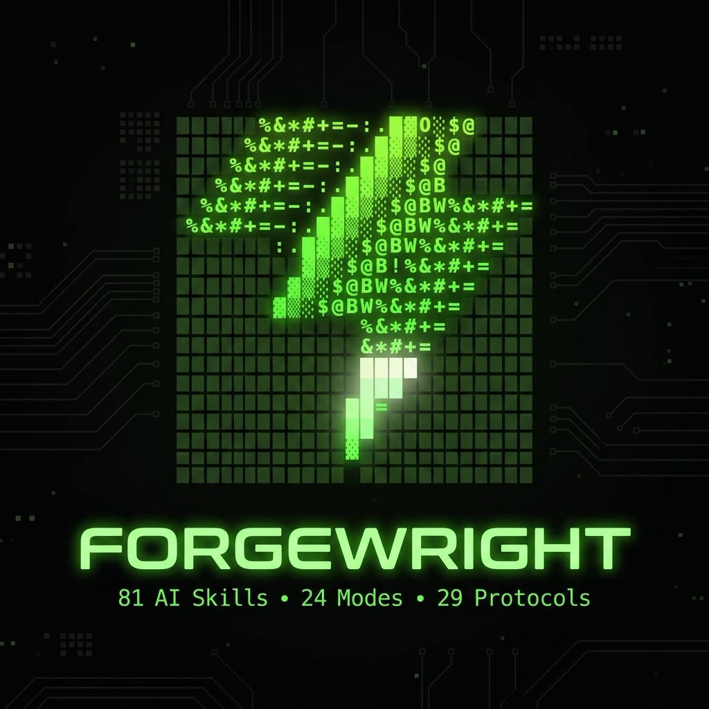
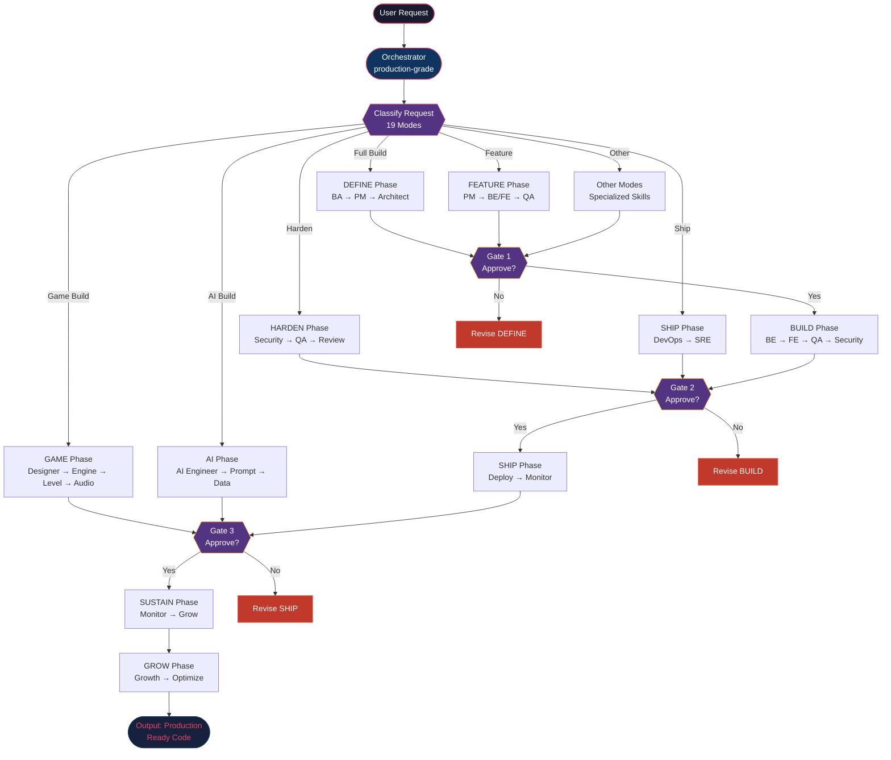
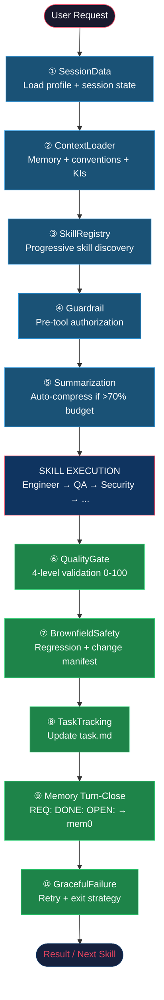
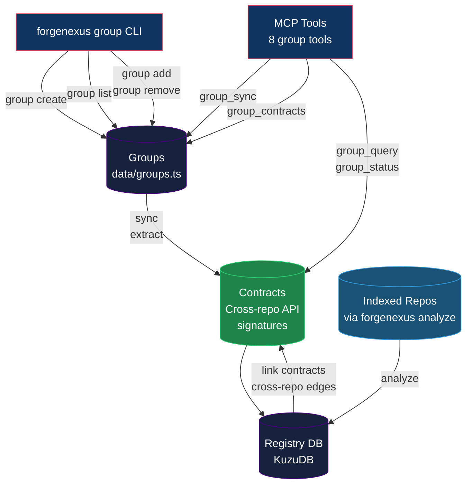
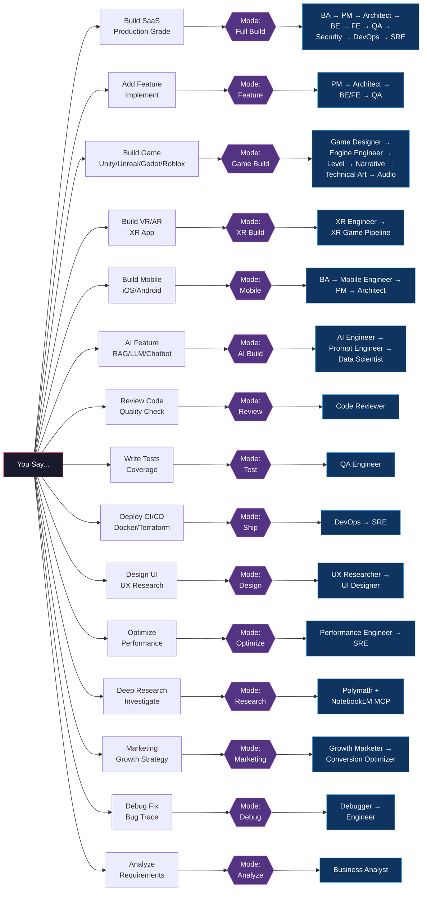

```mermaid
flowchart TD
    HOOK_PRE[("pre-tool-use hook<br/>Enrich context")]
    HOOK_POST[("post-tool-use hook<br/>Auto-reindex")]

    subgraph PRE_HOOK["pre-tool-use.ts"]
        T1{"tool name?"}
        T_GREP["grep / search<br/>ForgeNexus search<br/>→ show callers"]
        T_READ["read file<br/>→ show file symbols"]
        T_EDIT["edit / Write<br/>→ warn about callers"]
        T_SKIP["Other tools<br/>→ skip"]
    end

    subgraph POST_HOOK["post-tool-use.ts"]
        G1{"git commit<br/>detected?"}
        G2["Find forgenexus root<br/>detect last commit"]
        G3["Spawn incremental<br/>forgenexus analyze"]
        G4["Success → log<br/>Failure → warn"]
    end

    HOOK_PRE --> PRE_HOOK
    PRE_HOOK --> T1
    T1 --> |"grep/search"| T_GREP
    T1 --> |"read"| T_READ
    T1 --> |"edit/Write"| T_EDIT
    T1 --> |"other"| T_SKIP

    HOOK_POST --> POST_HOOK
    POST_HOOK --> G1
    G1 --> |"yes"| G2 --> G3 --> G4
    G1 --> |"no"| G_SKIP["(no action)"]

    style HOOK_PRE fill:#6c3483,stroke:#9b59b6,color:#fff
    style HOOK_POST fill:#6c3483,stroke:#9b59b6,color:#fff
    style PRE_HOOK fill:#1a1a2e,stroke:#9b59b6
    style POST_HOOK fill:#1a1a2e,stroke:#9b59b6
    style T_GREP fill:#1e8449,stroke:#2ecc71,color:#fff
    style T_READ fill:#1e8449,stroke:#2ecc71,color:#fff
    style T_EDIT fill:#d35400,stroke:#e67e22,color:#fff
    style G3 fill:#d35400,stroke:#e67e22,color:#fff
```

# Forgewright — Adaptive AI Orchestrator

<p align="center">
  
</p>

<p align="center">
  <a href="https://opensource.org/licenses/MIT"></a>
  
  
  
  
  
  
  
  
</p>

---

## TL;DR — What Is This?

Forgewright is an AI-powered orchestrator that routes your request through the right skills automatically.

```
You say: "Build a production-grade SaaS for X"
        ↓
Forgewright activates:
  BA → PM → Architect → Engineers → QA → Security → DevOps → SRE
        ↓
Output: production-ready code, reviewed, tested, scored 0–100
```

**Pipeline:** `DEFINE → BUILD → HARDEN → SHIP → SUSTAIN → GROW`
**Skills:** 52 specialized AI agents covering SaaS, game dev, XR, AI/ML, data engineering, and growth.

---

## Agent Setup — Executable Checklist

> Follow every step in order. Each block is **machine-executable** — copy, paste, run.

---

### Step 0 — Detect Context

```bash
CWD="$(pwd)"
IS_FORGEWRIGHT_REPO="$(echo "$CWD" | grep -q 'forgewright' && echo "yes" || echo "no")"
FW_PLUGINS="$(realpath "$CWD/.antigravity/plugins/production-grade" 2>/dev/null || echo "")"
echo "CWD: $CWD"
echo "IS_FORGEWRIGHT_REPO: $IS_FORGEWRIGHT_REPO"
echo "FW_PLUGINS: $FW_PLUGINS"
```

| Condition | Next step |
|-----------|-----------|
| `IS_FORGEWRIGHT_REPO=yes` | **Step 1A** — Forgewright self-setup |
| `$FW_PLUGINS` non-empty | **Step 1B** — Submodule already installed |
| Otherwise | **Step 1C** — Add as git submodule |

---

### Step 1 — Install Forgewright

#### (A) Inside the forgewright repo — self-setup

```bash
# Verify core files
ls skills/production-grade/SKILL.md  # orchestrator entry
ls CLAUDE.md                          # code intelligence rules
ls AGENTS.md                          # 52-skill catalog
echo "Forgewright self-setup OK."
```

#### (B) Forgewright is a git submodule

```bash
# Initialize submodule
git submodule update --init --recursive .antigravity/plugins/production-grade

# Verify
ls .antigravity/plugins/production-grade/skills/ | wc -l   # should be 52
ls .antigravity/plugins/production-grade/CLAUDE.md          # must exist
ls .antigravity/plugins/production-grade/AGENTS.md          # must exist
echo "Submodule initialized."
```

#### (C) Add Forgewright as a submodule to any project

```bash
# Run from project root (NOT inside forgewright)
PROJECT_ROOT="$(pwd)"
git submodule add -b main https://github.com/buiphucminhtam/forgewright.git \
  "$PROJECT_ROOT/.antigravity/plugins/production-grade"

# Copy required files to project root
cp "$PROJECT_ROOT/.antigravity/plugins/production-grade/AGENTS.md" \
   "$PROJECT_ROOT/AGENTS.md"
cp "$PROJECT_ROOT/.antigravity/plugins/production-grade/CLAUDE.md" \
   "$PROJECT_ROOT/CLAUDE.md"

# Commit
git add .gitmodules .antigravity AGENTS.md CLAUDE.md
git commit -m "feat: add forgewright v7.7 — 52 skills, ForgeNexus, MCP"

# Initialize
git submodule update --init --recursive .antigravity/plugins/production-grade
```

---

### Step 2 — Power Level Setup

Run from project root. Each command is independent — run what you need.

#### ⚡ Level 1 — Basic (52 skills + pipeline)

> Installed by Step 1. Nothing extra needed.

#### ⚡⚡ Level 2 — Smart (ForgeNexus code intelligence)

> **What you get:** Ask *"what breaks if I change this function?"* — instant blast-radius analysis.
> **Requires:** Node.js 18+

```bash
FW_ROOT="$(realpath .antigravity/plugins/production-grade 2>/dev/null || pwd)"
PROJECT_ROOT="$(pwd)"

# Build ForgeNexus (if not built)
if [ ! -f "$FW_ROOT/forgenexus/dist/cli/index.js" ]; then
    cd "$FW_ROOT" && npm install && npm run build
fi

# Index your project
cd "$FW_ROOT"
npx --yes forgenexus analyze "$PROJECT_ROOT"

# Verify
npx forgenexus status "$PROJECT_ROOT"
```

#### ⚡⚡⚡ Level 3 — Persistent Memory (Turn-Start + Turn-Close)

> **What you get:** Cross-session memory. The orchestrator remembers decisions, architecture, blockers across requests.
> **Why:** Without this, project memory only grows at gates — conversation facts are lost between turns.
> **Requires:** Python 3.8+

```bash
PROJECT_ROOT="$(pwd)"
FORGEWRIGHT_ROOT="$(realpath .antigravity/plugins/production-grade 2>/dev/null || pwd)"

# Initialize memory store
bash "$FORGEWRIGHT_ROOT/scripts/ensure-mem0.sh" "$PROJECT_ROOT"

# Verify
ls "$PROJECT_ROOT/.forgewright/memory.jsonl"   # must exist
python3 "$FORGEWRIGHT_ROOT/scripts/mem0-cli.py" refresh

# Skip if CI/headless only:
# FORGEWRIGHT_SKIP_MEM0=1
```

**How it works:**
- **Turn-Start** (before each request): loads conversation summary + recent turns + BA scope
- **Turn-Close** (after each request): writes `REQ: | DONE: | OPEN: | SCOPE_UPDATE:` to mem0
- The orchestrator calls these automatically — no manual action needed

#### ⚡⚡⚡⚡ Level 4 — Full Power (MCP + ForgeNexus tools)

> **What you get:** 12 ForgeNexus tools in your AI chat (`query`, `context`, `impact`, `detect_changes`, `rename`, `cypher`, `route_map`, `tool_map`, `shape_check`, `api_impact`, `pr_review`, `list_repos`)
> **Requires:** Step 2 + Step 3

```bash
FW_ROOT="$(realpath .antigravity/plugins/production-grade 2>/dev/null || pwd)"
PROJECT_ROOT="$(pwd)"

# Generate MCP config
bash "$FW_ROOT/scripts/mcp-generate.sh"

# Verify
ls "$PROJECT_ROOT/.forgewright/mcp-server/"
cat "$PROJECT_ROOT/.forgewright/mcp-server/mcp-config.json"
```

Then add to your AI client:

**Cursor / VS Code** — already written by Step 3:

```bash
cat ~/.cursor/mcp.json          # verify
# Restart Cursor after any MCP config change
```

**Claude Desktop (macOS):**

```bash
FORGENEXUS_ENTRY="$(realpath .antigravity/plugins/production-grade/forgenexus/dist/cli/index.js 2>/dev/null)"
cat > "$HOME/Library/Application Support/Claude/claude_desktop_config.json" << EOF
{
  "mcpServers": {
    "forgenexus": {
      "command": "node",
      "args": ["$FORGENEXUS_ENTRY", "mcp", "$PROJECT_ROOT"]
    }
  }
}
EOF
```

**Verify MCP connection:**

```bash
# Quick smoke test
echo '{"jsonrpc":"2.0","id":1,"method":"tools/list","params":{}}' | \
    node "$(realpath .antigravity/plugins/production-grade/forgenexus/dist/cli/index.js)" \
    mcp "$PROJECT_ROOT" 2>/dev/null | head -5

# Expected: {"jsonrpc":"2.0","id":1,"result":{"tools":[...
```

---

### Step 3 — Verify Full Setup

```bash
PROJECT_ROOT="$(pwd)"
FW_ROOT="$(realpath .antigravity/plugins/production-grade 2>/dev/null || pwd)"

echo "=== Forgewright Power Level Check ==="
echo "Skills: $(ls "$FW_ROOT/skills" -1 2>/dev/null | wc -l | tr -d ' ') / 52"
echo "ForgeNexus: $([ -f "$FW_ROOT/forgenexus/dist/cli/index.js" ] && echo '✓ built' || echo '✗ missing')"
echo "MCP server: $([ -d "$PROJECT_ROOT/.forgewright/mcp-server" ] && echo '✓ generated' || echo '✗ missing')"
echo "Memory: $([ -f "$PROJECT_ROOT/.forgewright/memory.jsonl" ] && echo '✓ initialized' || echo '✗ missing')"
echo "ForgeNexus indexed: $([ -d "$PROJECT_ROOT/.forgewright/mcp-server" ] && echo '✓ yes' || echo '✗ run: npx forgenexus analyze')"
echo "======================================="
```

---

## The Flow — How Forgewright Works

> All diagrams below render in GitHub, GitLab, and any mermaid-compatible viewer.
> If a diagram does not render, check that your viewer uses mermaid 10+.

### Architecture Overview



### Middleware Chain (per skill execution)



### Session Lifecycle (Turn-Start + Turn-Close)

```mermaid
sequenceDiagram
    autonumber
    participant User
    participant Orch as Orchestrator
    participant Mem as Memory mem0
    participant Forge as ForgeNexus
    participant Skill as Skills

    User->>Orch: New Session Start

    Orch->>Orch: Step 0.5: Load .forgewright/ context
    Orch->>Orch: Step 1: Load project-profile.json
    Orch->>Orch: Step 2: Load session-log.json
    Orch->>Orch: Step 3: mem0 search + code-conventions
    Orch->>Forge: Step 3.5: Check index freshness
    Orch->>Orch: Step 4: Detect greenfield vs brownfield

    rect rgb(20, 30, 60)
        Note over Orch,Skill: FOR EACH REQUEST (within session)

        User->>Orch: Request

        rect rgb(30, 50, 80)
            Note over Orch: TURN-START
            Orch->>Mem: T1: Load CONVERSATION_SUMMARY.md
            Orch->>Mem: T2: mem0 search recent turns + session
            Orch->>Mem: T3: Load BA scope + pipeline context
        end

        Orch->>Skill: Route to skills via Plan Quality Loop
        Skill-->>Orch: Skill output

        rect rgb(20, 60, 40)
            Note over Orch: TURN-CLOSE (mandatory)
            Orch->>Mem: TC1: Auto-generate CONVERSATION_SUMMARY.md
            Orch->>Mem: TC2: mem0 add REQ/DONE/OPEN/SCOPE_UPDATE
            Orch->>Mem: TC3: Optional: decisions/architecture/blockers
        end

        Orch-->>User: Response
    end

    User->>Orch: Session End
```



### ForgeNexus Analyze Pipeline (Code Intelligence)

```mermaid
flowchart LR
    ANAME["npx forgenexus analyze"]

    subgraph SCAN["① Scanner"]
        S1["glob file discovery"]
        S2["language detection"]
        S3[".gitignore filter"]
    end

    subgraph PARSE["② Parse — tree-sitter AST"]
        P1["Worker Pool<br/>cpus-1 threads<br/>20MB budget/worker"]
        P2["Graceful fallback<br/>sequential if <15 files"]
        P3["17 Edge Types extracted"]
    end

    subgraph RESOLVE["③ Resolve"]
        R1["Suffix Trie O(1)<br/>import path resolution"]
        R2["Fast-path<br/>skip if <3% gaps"]
    end

    subgraph PROP["④ Propagate"]
        PP1["Kahn topological sort"]
        PP2["Cross-file binding"]
    end

    subgraph COMMUNITY["⑤ Community — Leiden Algorithm"]
        C1["3-phase:<br/>move → refine → aggregate"]
        C2["60s timeout · large-graph mode"]
    end

    subgraph PROCESS["⑥ Process — BFS Entry-Point Tracing"]
        PR1["Call chain extraction"]
        PR2["Auto-detect framework:<br/>Next.js · FastAPI · NestJS<br/>Express · Django · Rails<br/>Gin · Spring · etc."]
    end

    subgraph FTS_EMB["⑦ FTS + Embeddings"]
        F1["Incremental FTS5<br/>only changed nodes"]
        E1["Cache-first embedding<br/>5 providers"]
    end

    subgraph META["⑧ Meta"]
        M1["Commit tracking"]
        M2["Early exit<br/>if git unchanged"]
    end

    DB[(<b>KuzuDB Graph<br/>Nodes + Rels + FTS<br/>Vector Embeddings</b>)]

    ANAME --> SCAN --> PARSE --> RESOLVE --> PROP --> COMMUNITY --> PROCESS --> FTS_EMB --> META
    FTS_EMB --> DB
    PARSE --> DB
    PROP --> DB

    style ANAME fill:#0f3460,stroke:#e94560,color:#fff
    style DB fill:#16213e,stroke:#4B0082,color:#fff
    style SCAN fill:#1a5276,stroke:#3498db
    style PARSE fill:#1a5276,stroke:#3498db
    style RESOLVE fill:#6c3483,stroke:#9b59b6
    style PROP fill:#6c3483,stroke:#9b59b6
    style COMMUNITY fill:#1e8449,stroke:#2ecc71
    style PROCESS fill:#1e8449,stroke:#2ecc71
    style FTS_EMB fill:#d35400,stroke:#e67e22
    style META fill:#2c3e50,stroke:#7f8c8d
```



### Multi-Repo Group Management (ForgeNexus Groups)



### Claude Code Hooks — Auto-Reindex Flow



### Request → Mode → Skills Routing



---

## 52 Skills — Quick Reference

| Division | Skills |
|----------|--------|
| **Orchestrator & Meta** | production-grade, polymath, parallel-dispatch, memory-manager, skill-maker, mcp-generator |
| **Core Engineering** | business-analyst, product-manager, solution-architect, software-engineer, frontend-engineer, qa-engineer, security-engineer, code-reviewer, devops, sre, data-scientist, technical-writer, ui-designer, mobile-engineer, mobile-tester, api-designer, database-engineer, debugger, prompt-engineer, project-manager |
| **AI/ML & Data** | ai-engineer, performance-engineer, data-engineer, web-scraper, xlsx-engineer |
| **Accessibility & UX** | accessibility-engineer, ux-researcher |
| **Game Development** | game-designer, unity-engineer, unreal-engineer, godot-engineer, godot-multiplayer, roblox-engineer, level-designer, narrative-designer, technical-artist, game-audio-engineer, unity-shader-artist, unity-multiplayer, unreal-technical-artist, unreal-multiplayer, xr-engineer |
| **Growth** | growth-marketer, conversion-optimizer |

---

## Optional Enhancements

### Web Scraping (crawl4ai)

```bash
pip install "crawl4ai>=0.8.0"
# Then: "Scrape [URL]" or "Crawl [website]"
```

### AI Vision Testing (Midscene.js)

```bash
npm install -g @anthropic-ai/midscene
# Then: "Test on Android" or "Test on iOS"
```

### Multi-Agent (Paperclip)

```bash
npx paperclipai onboard --yes
cd paperclip && pnpm dev
# Dashboard: http://localhost:3100
```

### Research (NotebookLM MCP)

```bash
pip install notebooklm-mcp
# Add to MCP config for grounded AI with zero hallucinations
```

---

## Quality Gate — Automated Validation

Run anytime to score your project 0–100:

```bash
bash scripts/forge-validate.sh

# CI mode (exit code only)
bash scripts/forge-validate.sh --quiet

# JSON report
bash scripts/forge-validate.sh --json
```

| Score | Grade | Meaning |
|-------|-------|---------|
| 90–100 | A | Production ready |
| 80–89 | B | Minor issues |
| 70–79 | C | Review recommended |
| 60–69 | D | Fix issues before deploy |
| < 60 | F | Unacceptable — block deploy |

---

## Troubleshooting

| Problem | Solution |
|---------|----------|
| `forgenexus: command not found` | Run `npx forgenexus` instead |
| `npm install` fails in submodule | Check `node --version` (needs 18+) |
| MCP tools not showing up | Restart AI client after any config change |
| Index is stale | `npx forgenexus analyze "$(pwd)"` |
| Submodule not initialized | `git submodule update --init --recursive` |
| `realpath` not found on macOS | `brew install coreutils` |
| `python3` not found | Install Python 3.8+ for memory features |
| Windows: `bash` not found | Use PowerShell equivalent commands |
| Mermaid diagrams not rendering | Ensure viewer uses **mermaid 10+**. GitHub/GitLab current versions support it. |
| `better-sqlite3` build error after merge | Run `cd forgenexus && npm install` to install `kuzu` instead |

---

## Available Workflow Shortcuts

| Command | What It Does |
|---------|-------------|
| `/setup` | First-time install as git submodule |
| `/update` | Check + install Forgewright updates (safe, preserves project changes) |
| `/pipeline` | Show full pipeline reference, modes, and skill list |
| `/onboard` | Deep project analysis — creates `.forgewright/project-profile.json` |
| `/mcp` | Generate or regenerate MCP server config |
| `/setup-mobile-test` | Set up plug-and-play mobile testing (Android/iOS) |

---

## Contributing

1. Fork the repo
2. Create branch: `git checkout -b feature/your-feature`
3. Commit with [Conventional Commits](https://www.conventionalcommits.org/): `feat(skill): add new capability`
4. Open a Pull Request

**Adding a skill:** Create `skills/your-skill-name/SKILL.md`. See any existing skill as a reference.

---

## License

MIT

---

## Give me a coffee

If Forgewright helps you ship faster, you can support the project here:


---

<p align="center">
  <strong>Forgewright — 52 AI skills. 19 modes. 15 protocols. Persistent Memory. Code Intelligence. SaaS to AAA games.</strong>
</p>
<p align="center">
  <em>Plan with precision. Build with confidence. Scale with intelligence.</em>
</p>
