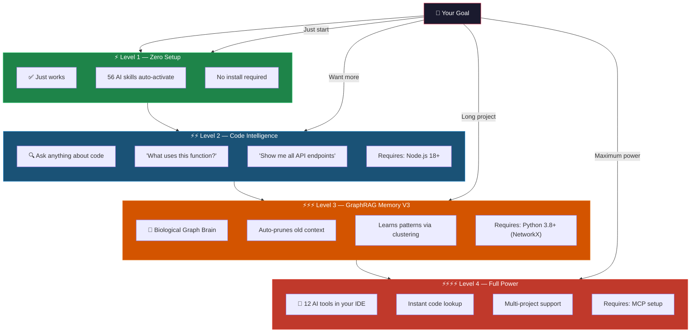
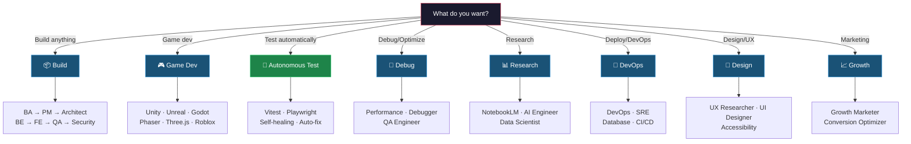

# Forgewright — AI Orchestrator That Actually Learns

<p align="center">
  <a href="https://github.com/buiphucminhtam/forgewright/stargazers">
    
  </a>
  <a href="https://github.com/buiphucminhtam/forgewright/network/members">
    
  </a>
  
  
  <a href="https://opensource.org/licenses/MIT">
    
  </a>
</p>

---

> **The AI that gets smarter every time it fails.** Unlike other AI assistants, Forgewright doesn't repeat the same mistakes. It learns.

```
You: "Build an e-commerce API"
Forgewright: [Builds it] → [Tests it] → [Fails test #7]
Forgewright: [Researches why] → [Updates its knowledge] → [Retries]
Forgewright: [Passes all tests] → [Learns: "Never use synchronous DB calls in hot path"]
Next project: "Build a different API"
Forgewright: [Skips synchronous DB calls] → [Built correctly the first time]
```

---

## Why Forgewright?

| Problem with other AI coding tools | Forgewright's solution |
|-----------------------------------|------------------------|
| Repeats the same mistakes | **ASIP** — learns from every failure |
| Gives generic advice | **Project-specific** — remembers your stack |
| Hallucinates solutions | **Grounded in research** — uses NotebookLM |
| No quality guarantee | **Auto-scored 0-100** — you know when it's ready |
| Starts from scratch each chat | **GraphRAG Memory V3** — biological-inspired graph memory |
| Handles requests directly | **Always via pipeline** — never skips orchestration |

---

## ⚠️ MANDATORY RULE: Always Use Forgewright

**After Forgewright is installed, EVERY user request MUST go through the Forgewright pipeline.**

```
┌─────────────────────────────────────────────────────────────────────┐
│                    FORGEWRIGHT MANDATORY RULE                       │
├─────────────────────────────────────────────────────────────────────┤
│                                                                     │
│  ⚠️ NEVER skip Forgewright for user requests.                       │
│  ⚠️ NEVER handle requests directly without the orchestrator.         │
│  ⚠️ ALWAYS interpret → classify → plan → execute via skills.        │
│                                                                     │
│  EXCEPTION: BA Scope Clarification                                 │
│  ─────────────────────────────────                                 │
│  If the request is a NEW PROJECT requiring Business Analyst         │
│  scope elicitation, the BA skill will ask clarifying questions     │
│  first. This is NOT a conflict — it's the correct Forgewright      │
│  workflow (Step 0: Interpret → Identify need for BA).             │
│                                                                     │
└─────────────────────────────────────────────────────────────────────┘
```

**Pipeline flow:**

```
INTERPRET → DEFINE → BUILD → HARDEN → SHIP → SUSTAIN
     ↓
  1. Classify mode (Feature, Build, Debug, etc.)
  2. Plan with quality score ≥ 9.0/10
  3. Execute via appropriate skills
  4. Quality gate verification
```

---

## 30-Second Demo

```
You: "Build a React login form with JWT auth"

Forgewright responds:
━━━━━━━━━━━━━━━━━━━━━━━━━━━━━━━━━━━━━━━━━━━━━━━━━
🤔 INTERPRETING...
   Intent: Feature request
   Mode: Feature
   Confidence: HIGH

📋 PLANNING (Plan Quality Loop)...
   Score: 9.5/10 ✓

⚡ EXECUTING...
   [████████████████████░░░░] 85%
   
   ✓ Component created (auth/LoginForm.tsx)
   ✓ JWT middleware added
   ✓ Unit tests written (3 passing)
   ✓ Security audit passed

✅ DONE (Score: 92/100)
   • 4 files created
   • All tests passing
   • No security issues
   • Ready for production

💡 Lesson learned: JWT refresh token rotation
━━━━━━━━━━━━━━━━━━━━━━━━━━━━━━━━━━━━━━━━━━━━━━━━━
```

---

## Quick Start — 5 Phút

### Prerequisites

```bash
# Check what's installed
node --version   # Need 18+
git --version   # Need any recent version

# If missing (macOS)
brew install node
```

### One-Command Setup

```bash
# 1. Go to your project
cd /path/to/your/project

# 2. Clone Forgewright
git clone https://github.com/buiphucminhtam/forgewright.git

# 3. Copy config files
cp forgewright/AGENTS.md .
cp forgewright/CLAUDE.md .

# 4. Open in your IDE
cursor .          # or: code . / claude
```

### That's It. Start Talking.

```bash
# Example 1: Build something new
"Build a landing page for my coffee shop"

# Example 2: Add a feature
"Add dark mode with system preference detection"

# Example 3: Fix something
"Fix the memory leak in our image uploader"

# Example 4: Get help
"How does our auth flow work?"
"What will break if I change User model?"
```

---

## 4 Power Levels — Start Simple, Add Power



### Level 4 Setup — Multi-Project MCP

Level 4 gives you **ForgeWright skills** and **GitNexus code intelligence** with a single global config.

#### Step 1: Set Up Your Project

```bash
cd /path/to/your-project

# Option A: Clone as submodule (recommended)
git submodule add -b main https://github.com/buiphucminhtam/forgewright.git forgewright
git submodule update --init --recursive

# Option B: Clone directly (for non-git projects)
git clone https://github.com/buiphucminhtam/forgewright.git
```

#### Step 2: Copy Config Files

```bash
cp forgewright/AGENTS.md .
cp forgewright/CLAUDE.md .
```

#### Step 3: Build Dependencies

```bash
cd forgewright
npm install --legacy-peer-deps
npm run build:forgenexus
```

#### Step 4: Setup MCP (New Method)

```bash
# One-command global setup (works for ALL projects)
bash scripts/fw-global-setup.sh

# Check status
bash scripts/fw-global-setup.sh --check

# Diagnose issues
bash scripts/fw-global-setup.sh --diagnose
```

#### Step 4: Setup GitNexus (Code Intelligence)

```bash
# Install GitNexus
npm install -g gitnexus

# Auto-configure for all editors (Claude, Cursor, Codex, etc.)
gitnexus setup

# Index your project
gitnexus analyze

# Check status
gitnexus status
```

#### Step 5: Restart Your IDE

Restart Cursor or Claude Desktop to load the MCP servers.

#### Step 5: Verify Setup

```bash
# From forgewright directory
bash scripts/fw-global-setup.sh --check

# Check GitNexus
gitnexus status
```

---

### For Existing Projects (Already Have Old Setup)

If you already have an old `.cursor/mcp.json` or legacy MCP config:

```bash
# 1. Backup old config
cp ~/.cursor/mcp.json ~/.cursor/mcp.json.bak.$(date +%Y%m%d)

# 2. Run new setup (auto-detects and updates global config)
bash scripts/fw-global-setup.sh --force

# 3. Restart your IDE
```

No need to delete old project-level configs — the launcher auto-detects workspace.

---

### Multi-Project Architecture

### MCP Configuration Format

The recommended MCP config for Cursor/Claude Desktop:

```json
{
  "mcpServers": {
    "forgewright": {
      "command": "npx",
      "args": ["tsx", "/path/to/forgewright/.forgewright/mcp-server/server.ts"],
      "env": {
        "FORGEWRIGHT_WORKSPACE": "${workspaceFolder}"
      }
    }
  }
}
```

**Key points:**
- Uses `npx tsx` to run the TypeScript server directly
- `${workspaceFolder}` is replaced by Cursor/Claude with the current project path
- The server auto-detects the forgewright installation from the workspace

**Manual setup:** If setup script fails, edit `~/.cursor/mcp.json` manually with the format above.

---

### Multi-Project Architecture

---

### Updating Existing Installations

```bash
# Pull latest changes
cd forgewright
git pull origin main
git submodule update --init --recursive

# Re-setup MCP
bash scripts/fw-global-setup.sh --force
```

---

## What Can You Do?

| You say... | Forgewright does... |
|------------|---------------------|
| `"Build a SaaS app"` | BA → PM → Architect → Code → Test → Deploy |
| `"Add user auth"` | PM → Code → Test |
| `"Write tests"` | QA Engineer writes unit/integration/e2e |
| `"Review my code"` | Code Reviewer checks quality (0-100) |
| `"Fix the bug"` | Debugger → Engineer → Test |
| `"Deploy to Vercel"` | DevOps → CI/CD → SRE |
| `"Build a Unity game"` | Game Designer → Unity Engineer → Level |
| `"Research RAG"` | NotebookLM + Polymath (deep research) |
| `"Audit security"` | Security Engineer (OWASP Top 10) |
| `"Optimize speed"` | Performance Engineer → Profiler → Fix |

---

## Featured: GraphRAG Memory V3 (Biological Brain)

> **New in v8.6.0** — Replaces flat Markdown memory with a self-pruning Knowledge Graph.

The biggest issue with long AI sessions is **context bloat** — the AI forgets the beginning of the chat because the memory file gets too large.

**GraphRAG V3** solves this by mimicking the human brain's **Ebbinghaus Forgetting Curve**:

1. **Graph Construction:** Every action, error, and decision is stored as a Node in a Local NetworkX Graph (`graph_memory.json`).
2. **Cognitive Decay:** Over time, nodes lose "weight" (Decay Rate = 0.8). 
3. **Garbage Collection:** Nodes that fall below the threshold are automatically pruned, keeping the context perfectly lean.
4. **Self-Evolution:** `graph_cluster.py` detects repeated "Error → Decision" patterns and automatically upgrades Forgewright's `SKILL.md` files.

---

## Featured: ASIP — The Self-Improving Protocol

> **Updated in v8.4.0** — Enhanced Research Gate with automatic failure tracking.

```mermaid
flowchart LR
    A1["Attempt 1"] --> F1["Fail"]
    F1 --> A2["Attempt 2"]
    A2 --> F2["Fail again?"]
    F2 -->|"Yes"| GATE["🔬 RESEARCH GATE"]
    F2 -->|"No"| CONT["Continue ✓"]

    GATE --> CHECK["0. Check: nlm --version?"]
    CHECK -->|Available| NLM["1. NotebookLM Research"]
    CHECK -->|Not Available| WEB["2. Web Search Fallback"]

    NLM --> SYN["3. Synthesize Insights"]
    WEB --> SYN
    SYN --> U["4. Update Tracker"]
    U --> TRACK["forgewright-session-tracker.sh"]
    TRACK --> L["5. Write Lessons"]
    L --> RT["6. Retry with Knowledge"]
    RT --> WIN["Solved! ✓"]
    RT --> ESC["Escalate"]

    style GATE fill:#c0392b,stroke:#e74c3c,color:#fff
    style NLM fill:#8e44ad,stroke:#9b59b6,color:#fff
    style WEB fill:#1e8449,stroke:#2ecc71,color:#fff
    style CHECK fill:#d35400,stroke:#e67e22,color:#fff
```



**Enhanced Research Gate (v8.4.0):**

```
┌─────────────────────────────────────────────────────────────────────┐
│  0. CHECK NotebookLM availability                                  │
│     nlm --version 2>/dev/null || NOT_AVAILABLE                   │
│                                                                     │
│  1. TRY NotebookLM CLI (if available)                             │
│     nlm notebook create "[Project] - [Skill] - [Topic]"           │
│     nlm research start "[topic]" --mode deep                       │
│                                                                     │
│  2. FALLBACK to Web Search (always available)                     │
│     WebSearch: "best practices [topic]"                           │
│                                                                     │
│  3. SYNTHESIZE: Extract 1-3 actionable insights                  │
│                                                                     │
│  4. UPDATE session tracker:                                       │
│     bash scripts/forgewright-session-tracker.sh plan <score>       │
│     bash scripts/forgewright-session-tracker.sh check              │
│                                                                     │
│  5. RE-PLAN with new insights                                     │
└─────────────────────────────────────────────────────────────────────┘
```

**Session Tracking:**

```bash
# Initialize tracker
bash scripts/forgewright-session-tracker.sh init

# Record plan attempt
bash scripts/forgewright-session-tracker.sh plan 7.5

# Check if research gate needed
bash scripts/forgewright-session-tracker.sh check

# Status
bash scripts/forgewright-session-tracker.sh status
```

**What gets learned:**

```
.forgewright/
├── session-track.json     # Consecutive failure tracking
├── lessons.md            # Your project lessons
└── plan-lessons.md       # Plan quality learnings

skills/*/SKILL.md
└── ## Planning Improvements  # Auto-updated from failures
```

**Enforced rules:**
- 2 failed attempts → Mandatory Research Gate
- NotebookLM first → Web Search fallback
- Session tracker records all attempts
- Skills improve over time

---

## Token Efficiency — 90% Cost Reduction

```
Before: $50/month on AI API costs
After:  $5/month (same productivity)
```

| What | Before | After | Saved |
|------|--------|-------|-------|
| Shell outputs | Full raw text | Structured summary | **60-80%** |
| Duplicates | Repeated queries | SHA-256 dedup | **90%** |
| Code navigation | Full file reads | Minimal signatures | **97%** |
| Memory | Everything loaded | Progressive disclosure | **75%** |
| **Combined** | High usage | Minimal usage | **~90%** |

**Pro tip:** Use [MiniMax](https://platform.minimax.io/subscribe/token-plan?code=400F3VSO0b&source=link) for parallel workers to maximize savings.

---

## Token Tracking & Cost Analytics

Track your LLM usage, costs, and optimization opportunities in real-time.

```bash
# Start the token API server
python3 scripts/token-api-server.py

# Open the dashboard
open scripts/token-dashboard.html

# Or use the CLI analyzer
python3 scripts/token-analyzer.py --project $(pwd) --period week
```

### Features

| Feature | Description |
|---------|-------------|
| **Real-time Tracking** | Logs every LLM call with tokens, latency, cost |
| **Cost Dashboard** | Visual analytics by provider, model, project |
| **Budget Alerts** | Configurable thresholds with notifications |
| **Trend Analysis** | Daily/weekly/monthly usage patterns |
| **Optimization Tips** | AI-powered cost reduction suggestions |

### Dashboard Preview

```
┌─────────────────────────────────────────────────────┐
│  Token Usage Dashboard                              │
├─────────────┬─────────────┬─────────────┬──────────┤
│ Total Tokens│ Total Cost  │ LLM Calls   │ Latency  │
│   1.25M     │   $12.45    │    245      │  850ms   │
├─────────────┴─────────────┴─────────────┴──────────┤
│  Input/Output Ratio: ████████░░ 76% / 24%         │
├─────────────────────────────────────────────────────┤
│  Top Models                                         │
│  ├─ claude-3-5-sonnet  850K tokens  $8.50         │
│  ├─ gpt-4o             100K tokens  $3.00          │
│  └─ gpt-4o-mini         50K tokens  $0.20         │
└─────────────────────────────────────────────────────┘
```

### Budget Configuration

Create `.forgewright/budget.yaml` to track spending:

```yaml
budget:
  daily: 5.00      # USD per day
  weekly: 25.00    # USD per week
  monthly: 80.00   # USD per month

  alerts:
    warning: 0.80   # Warn at 80%
    danger: 0.95    # Alert at 95%
    critical: 1.00  # Block at 100%
```

### API Endpoints

| Endpoint | Description |
|----------|-------------|
| `GET /api/usage` | Token usage by project/period |
| `GET /api/projects` | List tracked projects |
| `GET /api/unified/summary` | Cross-platform summary |

### Skill Integration

Use the Token Tracker skill for AI-powered analysis:

```
/usage      # Check current usage
/budget     # View budget status
/report     # Export detailed report
/optimize   # Get cost-saving tips
```

### Data Storage

| Type | Location |
|------|---------|
| Usage Logs | `~/.forgewright/usage/{project}/{date}.jsonl` |
| Error Logs | `~/.forgewright/usage/{project}/errors-{date}.jsonl` |
| Budget Config | `{project}/.forgewright/budget.yaml` |

---

## 58 Skills, 24 Modes



---

## Quality Gate — Always Scored 0-100

```bash
bash scripts/forge-validate.sh
```

| Score | Grade | Status |
|-------|-------|--------|
| 90-100 | A | ✅ Production ready |
| 80-89 | B | ⚠️ Minor issues |
| 70-79 | C | 🔶 Should review |
| 60-69 | D | 🔴 Fix before deploy |
| < 60 | F | 🚫 Blocked |

---

## ForgeNexus → GitNexus — Code Intelligence

> **v8.5.0 UPDATE:** ForgeNexus has been migrated to **GitNexus** — the recommended code intelligence tool. GitNexus provides 38K+ stars, npm installation, auto-setup for all editors, and 16 MCP tools for deep code understanding.

This project is indexed by GitNexus as **forgewright** (16,112 nodes, 23,551 edges, 322 clusters, 250 flows).

### Why GitNexus?

| Feature | GitNexus | ForgeNexus (Legacy) |
|---------|----------|---------------------|
| Installation | `npm install -g gitnexus` | Manual submodule setup |
| Setup | `gitnexus setup` (auto-detects editors) | Manual config per editor |
| Community | 38K+ stars, active Discord | Internal only |
| Multi-repo | Yes (`gitnexus group`) | No |

### Quick Start

```bash
# 1. Install GitNexus
npm install -g gitnexus

# 2. Setup for all editors
gitnexus setup

# 3. Analyze project
gitnexus analyze

# 4. Check status
gitnexus status
```

### MCP Tools (16 tools)

| Tool | Purpose | Command |
|------|---------|---------|
| `query` | Find code by concept | `gitnexus_query({query: "auth validation"})` |
| `context` | 360-degree symbol view | `gitnexus_context({name: "validateUser"})` |
| `impact` | Blast radius before editing | `gitnexus_impact({target: "X", direction: "upstream"})` |
| `detect_changes` | Pre-commit scope check | `gitnexus_detect_changes({scope: "staged"})` |
| `rename` | Safe multi-file rename | `gitnexus_rename({symbol_name: "old", new_name: "new", dry_run: true})` |
| `cypher` | Custom graph queries | `gitnexus_cypher({query: "..."})` |

### Mandatory Rules (GitNexus)

**Always Do:**
- **MUST** run impact analysis before editing any symbol
- **MUST** run `gitnexus_detect_changes()` before committing
- **MUST** warn the user if impact analysis returns HIGH or CRITICAL risk

**Never Do:**
- NEVER edit a function without first running `gitnexus_impact`
- NEVER ignore HIGH or CRITICAL risk warnings
- NEVER rename symbols with find-and-replace — use `gitnexus_rename`

### Keeping Index Fresh

```bash
gitnexus analyze  # Re-index after code changes
gitnexus status   # Check index freshness
```

### Migration from ForgeNexus

If you were using ForgeNexus:

```bash
# 1. Install GitNexus
npm install -g gitnexus

# 2. Setup
gitnexus setup

# 3. Analyze projects
gitnexus analyze

# 4. Remove legacy ForgeNexus (optional)
rm -rf forgenexus/
```

See [`docs/SETUP-GITNEXUS.md`](docs/SETUP-GITNEXUS.md) for full documentation.

---

## Parallel Dispatch — Multi-Agent Execution

Run multiple AI agents simultaneously for parallel task execution.

```bash
# Dispatch parallel worktrees
npx forgenexus dispatch --parallel 4 --task "build,test,deploy"

# Or use MiniMax for faster parallel execution
export MINIMAX_API_KEY="your-key"
npx forgenexus dispatch --provider minimax --parallel 8
```

### MiniMax Integration

For **parallel worktrees** (multiple AI agents running simultaneously), you'll need fast, cheap AI tokens.

| Feature | Benefit |
|---------|---------|
| **Low latency** | Faster parallel task completion |
| **High throughput** | More concurrent agents |
| **Competitive pricing** | Reduced cost per parallel worker |

[](https://platform.minimax.io/subscribe/token-plan?code=400F3VSO0b&source=link)

---

## Multica Hub — Unified Multi-Project Dashboard

Manage all Forgewright workspaces from a single dashboard.

```bash
cd multica-hub && pnpm install && pnpm dev
# Dashboard: http://localhost:4000
```

| Feature | Description |
|---------|-------------|
| **Environment Status** | Per-project Forgewright, MCP, Git status |
| **Auto-scan** | Detect all projects in `~/Documents/GitHub` |
| **Setup Buttons** | One-click init + setup for any project |
| **Real-time Refresh** | Live status updates |

See [`multica-hub/README.md`](multica-hub/README.md) for full documentation.

---

## Antigravity — Project Intelligence Layer

Automatic workspace detection and project-specific context.

```
~/.config/forgewright/global-launcher.sh
├── Detect workspace (env vars, git root, cwd)
├── Load project registry
└── Start MCP server with project context
```

| Feature | Description |
|---------|-------------|
| **Auto-detect** | No config needed when switching projects |
| **Isolated State** | Each project has own memory & index |
| **Manifest System** | `.antigravity/mcp-manifest.json` per project |

See [`antigravity/docs/README.md`](antigravity/docs/README.md) for details.

---

## Workflows — Pre-built Pipelines

Ready-to-use workflows for common tasks.

```bash
# AI Feature Build
npx forgenexus workflow ai-feature-build

# Security Audit
npx forgenexus workflow security-audit

# Deep Research
npx forgenexus workflow deep-research

# SaaS MVP
npx forgenexus workflow ship-saas-mvp
```

| Workflow | Use Case |
|----------|----------|
| `ai-feature-build` | RAG, chatbots, AI agents |
| `security-audit` | OWASP Top 10 review |
| `deep-research` | NotebookLM + Polymath research |
| `ship-saas-mvp` | Full-stack SaaS from scratch |
| `setup-paperclip` | Paperclip testing setup |
| `midscene-testing` | Midscene E2E automation |
| `mobile-test` | React Native testing |

---

## Memory Manager — Persistent Context

Forgewright remembers everything across sessions.

```bash
# Check memory status
npx forgenexus memory status

# Save decision
npx forgenexus memory save "auth: use JWT refresh tokens"

# Recall context
npx forgenexus memory recall "auth decisions"
```

| Memory Type | Location | Purpose |
|------------|----------|---------|
| **Lessons** | `.forgewright/lessons.md` | Project-specific learnings |
| **Architecture** | `.forgewright/architecture.md` | Design decisions |
| **Decisions** | `.forgewright/decisions/` | ADR records |
| **Context** | `.forgewright/context/` | Session summaries |

---

## FAQ

**Q: Is it free?**
A: Yes, Forgewright is free. You only pay for your AI API (Claude/GPT-4).

**Q: Does it work with GPT-4?**
A: Yes! Works with Claude, GPT-4, and other LLMs.

**Q: Do I need to code?**
A: No. Level 1 works as a simple AI assistant. No coding required.

**Q: What about privacy?**
A: All data stays in your `.forgewright/` folder. Nothing sent elsewhere.

**Q: Multiple projects?**
A: Yes! Each project has isolated memory, index, and MCP server. With the launcher setup, a single global config works for all projects.

**Q: Can I use just GitNexus without ForgeWright?**

A:** Yes. Run:
```bash
npm install -g gitnexus
gitnexus setup
```

**Q: What's new in v8.5.0?**

A:** Major migration from ForgeNexus to GitNexus:
- GitNexus provides 38K+ stars, npm installation, auto-setup for all editors
- Single `gitnexus setup` command replaces multi-step ForgeNexus setup
- 16 MCP tools with improved performance
- Multi-repo support with `gitnexus group`

See [`docs/SETUP-GITNEXUS.md`](docs/SETUP-GITNEXUS.md) for full migration guide.

**Q: What's the difference between forgewright and forgenexus MCP?**

A:** `forgewright` provides ForgeWright skills, memory, and orchestrator tools. `gitnexus` (formerly forgenexus) provides code intelligence.

Both work together. You typically need both.

---

## Troubleshooting

| Problem | Fix |
|---------|-----|
| MCP not working after setup | Restart IDE; re-run `bash scripts/fw-global-setup.sh --force` |
| `MCP server not found` | Edit `~/.cursor/mcp.json` manually (see MCP Configuration Format above) |
| `tsx` not found | Install tsx: `npm install -g tsx` |
| Skills not found | Check AGENTS.md + CLAUDE.md copied |
| GitNexus index stale | Run `gitnexus analyze --force` |
| Submodule issues | `git submodule update --init --recursive` |

```bash
# Quick diagnostics
bash scripts/fw-global-setup.sh --diagnose

# Check GitNexus
gitnexus status
gitnexus analyze --force

# Debug workspace detection
FORGEWRIGHT_DEBUG=1 bash ~/.config/forgewright/global-launcher.sh

# Update ForgeWright
bash scripts/fw-global-setup.sh --force
```

---

## Changelog

### v8.5.0 (May 2026) — GitNexus Migration

**Major Changes:**

| Change | Description |
|--------|-------------|
| **GitNexus Migration** | ForgeNexus → GitNexus (38K+ stars, npm install) |
| **fw-mcp.sh v3.0.0** | Unified setup script with `gitnexus` command |
| **Single-command Setup** | `gitnexus setup` replaces multi-step ForgeNexus setup |
| **Multi-repo Support** | New `gitnexus group` for cross-repo analysis |

**Breaking Changes:**

| Old | New |
|-----|-----|
| `npx forgenexus analyze` | `gitnexus analyze` |
| `forgenexus_*` MCP tools | `gitnexus_*` MCP tools |
| `fw-mcp.sh forgenexus` | `fw-mcp.sh gitnexus` |

**Migration:**

```bash
# Install GitNexus
npm install -g gitnexus

# Setup for all editors
gitnexus setup

# Analyze projects
gitnexus analyze
```

---

## Contributing

1. Fork the repo
2. Create branch: `git checkout -b feature/amazing-feature`
3. Commit: `git commit -m 'feat(skill): add amazing feature'`
4. Push: `git push origin feature/amazing-feature`
5. Open a Pull Request

**Add a new skill:** Create `skills/your-skill/SKILL.md`

---

## License

MIT — Use it however you want.

---

## Support the Project

**💡 Use MiniMax for parallel tasks** — Fast, cheap tokens perfect for parallel worktrees:

[](https://platform.minimax.io/subscribe/token-plan?code=400F3VSO0b&source=link)

Sign up with [my referral link](https://platform.minimax.io/subscribe/token-plan?code=400F3VSO0b&source=link) and get bonus credits. This helps fund Forgewright development!

---

## GitHub Stars Growth

[](https://star-history.com/#buiphucminhtam/forgewright&Date)

---

If Forgewright helps you ship faster, consider buying me a coffee:

<p align="center">
  
</p>

---

<p align="center">
  <strong>Forgewright — The AI that learns from every mistake.</strong>
  <br />
  <em>Plan precisely. Build confidently. Scale intelligently.</em>
</p>
