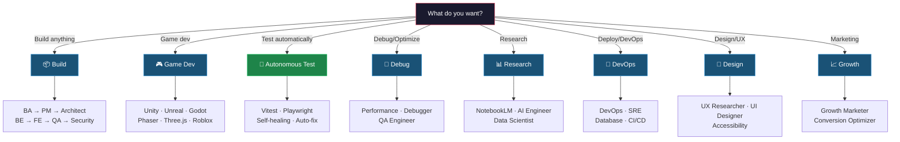

# Forgewright — AI Orchestrator That Actually Learns

<p align="center">
  
</p>

<p align="center">
  <a href="https://github.com/buiphucminhtam/forgewright/stargazers">
    
  </a>
  <a href="https://github.com/buiphucminhtam/forgewright/network/members">
    
  </a>
  
  
  
  
  <a href="https://opensource.org/licenses/MIT">
    
  </a>
</p>

---

> **The AI that gets smarter every time it fails.** Unlike other AI assistants, Forgewright doesn't repeat the same mistakes. It learns.

As a powerful **Open Source Devin alternative**, Forgewright is a true **Multi-Agent System** that acts as your **Local LLM coding assistant**. Through its unique **Self-healing code generation** pipelines, it orchestrates complex engineering tasks while you retain full control.

```
You: "Build an e-commerce API"
Forgewright: [Builds it] → [Tests it] → [Fails test #7]
Forgewright: [Researches why] → [Updates its knowledge] → [Retries]
Forgewright: [Passes all tests] → [Learns: "Never use synchronous DB calls in hot path"]
Next project: "Build a different API"
Forgewright: [Skips synchronous DB calls] → [Built correctly the first time]
```

---

## 🖥️ ForgeWright Console — Native Desktop Environment (Premium GUI)

Want to visualize your agent pipelines in real-time? Check out the **[ForgeWright Console](https://feedmycode.com/)**, a premium local desktop GUI designed to work side-by-side with the open-source CLI.

<p align="center">
  <a href="https://feedmycode.com/">
    
  </a>
</p>

*   **Visual Dashboard**: Watch real-time execution flows and progress diagrams of your 56+ AI skills. No more parsing raw CLI JSON logs.
*   **Local SQLite Explorer**: Visually query, filter, and audit past agent decisions, requirements gaps, and architectural schemas.
*   **One-Click Settings**: Toggle workspace variables, MCP multi-project isolation, cost parameters, and tools from a clean visual interface.
*   **Background Task Runner**: Run long-running autonomous pipelines smoothly with native OS notification triggers.

👉 Learn more and grab a lifetime license at **[feedmycode.com](https://feedmycode.com/)**.

---

## Harness Engineering: Turning Raw LLMs into Reliable Coders

In modern AI engineering, a raw language model is only 20% of a production agent. The other 80% is the **Harness**—the execution pipeline, safety guardrails, memory, and validation layers that govern how the AI operates.

<p align="center">
  <strong>Agent = Model (Claude/GPT/Gemini) + Forgewright Harness</strong>
</p>

Forgewright acts as a production-grade software delivery harness for AI coding agents:

*   **The Middleware Chain (14 Stages)**: Wraps every skill execution with guardrails, sandboxing, context compression, and quality gates.
*   **ASIP Feedback Loops**: Automatically detects plan/execution failures, triggers deep research, and adapts skill SOPs.
*   **SQLite Cognitive Graph (FluxMem)**: Ensures isolated project-specific context and sub-second execution path caching (Procedural Circuits).
*   **Enforceable Guardrails**: Active security audits, CI validation, and protected paths prevent AI hallucinations from introducing vulnerabilities.
*   **Hybrid BDD-First Testing Flow**: Automatically classifies task complexity using GitNexus metrics. Enforces a strict BDD/TDD-first sequence (`BA (BDD) -> QA (Stubs) -> Build -> Test`) for high-complexity tasks, while allowing a fast-track test-after flow for low-risk hotfixes.
*   **Premium Judgment on Demand**: Optional Expert CLI Mode routes only high-stakes planning, architecture, security, code review, and gate decisions through your local Claude CLI or Codex CLI. It is off by default, works with just one CLI, and keeps premium model usage reserved for the moments that matter.
*   **Built-in Cost Control**: `forge token on` enables local token tracking, budgets, reports, and dashboards so teams can prove where premium calls improve quality instead of guessing.
*   **Gemini 3.x Native Optimization**: Direct support for Gemini 3.5 Flash (for high-speed agentic routing with `thinking_level: MINIMAL` and strict grounding) and Gemini 3.1 Pro (for complex reasoning with `thinking_level: HIGH` and temperature 1.0). Avoids blanket temperature 1.0 enforcement to keep deterministic Claude/GPT tasks stable, and features Thought Signatures preservation (to prevent API 400 errors) and Context Caching thresholds.
*   **⚡ Forgewright Lite — Evidence-Gated Kernel (Upgraded v3)**: Designed specifically for cheap and fast models (e.g. Gemini Flash), it strips away heavy prose ceremony in favor of a lightweight reasoning kernel coupled with script-layer verification, pushing same-model coding accuracy up significantly.
    *   **Evidence-Gated Turn Checks**: Turn completion is enforced via script-layer validation of machine-written evidence files (`.forgewright/verify/<turn>.json`), eliminating self-attested hallucination and bias.
    *   **Turn-level Platform Hooks**: Out-of-the-box configurations for Claude Code, Gemini CLI, Cursor, and Codex CLI to hard-block execution on verification failure.
    *   **Strict ≤7k Boot Budget**: Restricts the boot context to under 7,000 tokens through progressive skill-overlay loading, keeping the task in the model's reliable-recall window.
    *   **Objective Escalations**: System-side triggers (like path grep on security/concurrency/schema edits or consecutive test failures) to cascade tasks to Sonnet/Opus models automatically.
    *   **UI & Visual Verification (Vision)**: For any task involving UI or visual designs, the AI must take a screenshot or capture the visual output, and use its vision capabilities to verify layout alignment, correctness, and aesthetics.
    *   **13-Task Golden Eval**: Standardized benchmark harness measuring pass rates, execution durations, and cost improvements.


---

## Why Forgewright?

| Problem with other AI coding tools | Forgewright's solution |
|-----------------------------------|------------------------|
| Repeats the same mistakes | **ASIP** — learns from every failure |
| Gives generic advice | **Project-specific** — remembers your stack |
| Hallucinates solutions | **Grounded in research** — uses NotebookLM |
| No quality guarantee | **Auto-scored 0-100** — you know when it's ready |
| Starts from scratch each chat | **SQLite L2 Graph Memory** — biological-inspired cognitive graph (FluxMem) |
| Handles requests directly | **Always via pipeline** — never skips orchestration |
| Premium models are expensive | **Expert CLI Mode** — use Claude/Codex only for risky gates |
| AI spend is invisible | **Token commands** — turn on tracking, budgets, reports, and dashboard |

---

## 🔒 Local-First & 100% Data Privacy (No Vendor Lock-in)

In the era of AI, your codebase is your most valuable asset. Forgewright is designed with a strict **Privacy-First** architecture:
- **Local Cognitive Graph:** All project memories, architectural decisions, and agent learning patterns are stored locally on your machine via a SQLite GraphRAG database (`.forgewright`).
- **No Third-Party Storage:** We do not send your code, prompts, or proprietary logic to any centralized Forgewright servers.
- **No Vendor Lock-in:** You can swap between OpenAI, Anthropic, Gemini, or local models (via Ollama/LMStudio) using standard CLI integrations. You own your tokens, your models, and your data.

---

## Premium Quality Without Premium Waste

Forgewright now supports an optional **Expert CLI Mode** for teams that want stronger judgment at the riskiest points without paying for premium models on every prompt.

```bash
# Keep premium escalation off by default
forge expert status

# Use one local CLI only; no multi-provider setup required
forge expert use codex --track-tokens
forge expert use claude

# Control where expert review is allowed
forge expert gates on
forge expert budget --max-calls 5

# Track spend independently of expert mode
forge token on
forge token report --period week
forge token dashboard
```

Use it for failed plan reviews, architecture gates, security reviews, production readiness, and other high-impact checkpoints. Leave it off for routine implementation and status checks.

---

## ⚠️ MANDATORY RULE: Always Use Forgewright

**After Forgewright is installed, EVERY user request MUST go through the Forgewright pipeline.**

```
┌─────────────────────────────────────────────────────────────────────┐
│                    FORGEWRIGHT MANDATORY RULE                       │
├─────────────────────────────────────────────────────────────────────┤
│                                                                     │
│  ⚠️ NEVER skip Forgewright for user requests.                       │
│  ⚠️ NEVER handle requests directly without the orchestrator.         │
│  ⚠️ ALWAYS interpret → classify → plan → execute via skills.        │
│                                                                     │
│  EXCEPTION: BA Scope Clarification                                 │
│  ─────────────────────────────────                                 │
│  If the request is a NEW PROJECT requiring Business Analyst         │
│  scope elicitation, the BA skill will ask clarifying questions     │
│  first. This is NOT a conflict — it's the correct Forgewright      │
│  workflow (Step 0: Interpret → Identify need for BA).             │
│                                                                     │
└─────────────────────────────────────────────────────────────────────┘
```

**Pipeline flow:**

```
INTERPRET → DEFINE → BUILD → HARDEN → SHIP → SUSTAIN
     ↓
  1. Classify mode (Feature, Build, Debug, etc.)
  2. Plan with quality score ≥ 9.0/10
  3. Execute via appropriate skills
  4. Quality gate verification
```

---

## 30-Second Demo

```
You: "Build a React login form with JWT auth"

Forgewright responds:
━━━━━━━━━━━━━━━━━━━━━━━━━━━━━━━━━━━━━━━━━━━━━━━━━
🤔 INTERPRETING...
   Intent: Feature request
   Mode: Feature
   Confidence: HIGH

📋 PLANNING (Plan Quality Loop)...
   Score: 9.5/10 ✓

⚡ EXECUTING...
   [████████████████████░░░░] 85%
   
   ✓ Component created (auth/LoginForm.tsx)
   ✓ JWT middleware added
   ✓ Unit tests written (3 passing)
   ✓ Security audit passed

✅ DONE (Score: 92/100)
   • 4 files created
   • All tests passing
   • No security issues
   • Ready for production

💡 Lesson learned: JWT refresh token rotation
━━━━━━━━━━━━━━━━━━━━━━━━━━━━━━━━━━━━━━━━━━━━━━━━━
```

---

## Quick Start — 5 Phút

### Prerequisites

```bash
# Check what's installed
node --version   # Need 18+
git --version   # Need any recent version

# If missing (macOS)
brew install node
```

### One-Command Setup

```bash
# 1. Clone Forgewright (if not already)
git clone https://github.com/buiphucminhtam/forgewright.git
cd forgewright

# 2. Copy config files to your project root
#    (For FORGEWRIGHT ITSELF, these files are already at the root)
#    For OTHER projects:
cp forgewright/AGENTS.md /path/to/your/project/
cp forgewright/CLAUDE.md /path/to/your/project/

# 3. Open in your IDE
cursor .          # or: code . / claude
```

### That's It. Start Talking.

```bash
# Example 1: Build something new
"Build a landing page for my coffee shop"

# Example 2: Add a feature
"Add dark mode with system preference detection"

# Example 3: Fix something
"Fix the memory leak in our image uploader"

# Example 4: Get help
"How does our auth flow work?"
"What will break if I change User model?"
```

---

## 4 Power Levels — Start Simple, Add Power


### Level 4 Setup — Multi-Project MCP

Level 4 gives you **ForgeWright skills** and **GitNexus code intelligence** with a single global config.

#### Step 1: Set Up Your Project

```bash
cd /path/to/your-project

# Option A: Clone as submodule (recommended for project-level integration)
git submodule add -b main https://github.com/buiphucminhtam/forgewright.git forgewright
git submodule update --init --recursive

# Option B: Clone directly (for non-git projects or standalone use)
git clone https://github.com/buiphucminhtam/forgewright.git
```

#### Step 2: Copy Config Files

```bash
cp forgewright/AGENTS.md .
cp forgewright/CLAUDE.md .
```

#### Step 3: Build Dependencies

```bash
cd forgewright
npm install --legacy-peer-deps
```

#### Step 4: Setup MCP (New Method)

```bash
# One-command global setup (configures Cursor, Claude Code, Antigravity, and Codex CLI)
bash scripts/forgewright-mcp-setup.sh

# Or setup Codex CLI specifically
bash scripts/forgewright-mcp-setup.sh --codex

# Or ask your AI assistant (Cursor, Claude Code, or Codex CLI) with a simple prompt:
# "enable codex mcp" OR "bật codex cli mcp" (the AI will automatically run the setup command)

# Check status
bash scripts/forgewright-mcp-setup.sh --check

# Diagnose issues
bash scripts/forgewright-mcp-setup.sh --diagnose
```

#### Step 5: Setup GitNexus (Code Intelligence)

```bash
# Install GitNexus
npm install -g gitnexus

# Auto-configure for all editors (Claude, Cursor, Codex, etc.)
gitnexus setup

# Index your project
gitnexus analyze

# Check status
gitnexus status
```

#### Step 6: Restart Your IDE

Restart Cursor or Claude Desktop to load the MCP servers.

#### Step 7: Verify Setup

```bash
# From forgewright directory
bash scripts/forgewright-mcp-setup.sh --check

# Check GitNexus
gitnexus status
```

#### Step 8: Run Project Onboarding (Recommended)

Once your IDE has restarted, open the AI chat panel (Cursor Chat, Claude Code, or Antigravity) and run:

> Run `/onboard` to initialize the project context.

This will:
1. Auto-detect your tech stack and generate `.forgewright/project-profile.json`.
2. Run health checks for your development tools.
3. Establish a baseline for local memory.

---

### For Existing Projects (Already Have Old Setup)

If you already have an old `.cursor/mcp.json` or legacy MCP config:

```bash
# 1. Backup old config
cp ~/.cursor/mcp.json ~/.cursor/mcp.json.bak.$(date +%Y%m%d)

# 2. Run new setup (auto-detects and updates global config)
bash scripts/forgewright-mcp-setup.sh --force

# 3. Restart your IDE
```

No need to delete old project-level configs — the launcher auto-detects workspace.

---

### Multi-Project Architecture

### MCP Configuration Format

The recommended MCP config for Cursor/Claude Desktop:

```json
{
  "mcpServers": {
    "forgewright": {
      "command": "npx",
      "args": ["tsx", "/path/to/forgewright/.forgewright/mcp-server/server.ts"],
      "env": {
        "FORGEWRIGHT_WORKSPACE": "${workspaceFolder}"
      }
    }
  }
}
```

**Key points:**
- Uses `npx tsx` to run the TypeScript server directly
- `${workspaceFolder}` is replaced by Cursor/Claude with the current project path
- The server auto-detects the forgewright installation from the workspace

**Manual setup:** If setup script fails, edit `~/.cursor/mcp.json` manually with the format above.

### Updating Existing Installations

```bash
# Pull latest changes
cd forgewright
git pull origin main
git submodule update --init --recursive

# Re-setup MCP
bash scripts/forgewright-mcp-setup.sh --force
```

---

## What Can You Do?

| You say... | Forgewright does... |
|------------|---------------------|
| `"Build a SaaS app"` | BA → PM → Architect → Code → Test → Deploy |
| `"Modernize legacy code"`| Architect → Refactor → QA (Safely migrates outdated architecture) |
| `"Reduce API Costs"` | Token Analyzer → Optimizes LLM usage & logs budget reports |
| `"Automate Tech Docs"` | Technical Writer → Syncs live code to Obsidian/Wiki |
| `"Audit security"` | Security Engineer (OWASP Top 10 automated review) |
| `"Fix the bug"` | Debugger → Engineer → Test (Self-healing loops) |
| `"Deploy to Vercel"` | DevOps → CI/CD → SRE |
| `"Build a Unity game"` | Game Designer → Unity Engineer → Level |
| `"Research RAG"` | NotebookLM + Polymath (deep research) |

---

## Featured: GraphRAG Memory V4 — FluxMem (SQLite Brain)

> **New in v8.7.0** — Replaces JSON-based memory with an isolated SQLite Layer 2 Cognitive Graph (`flux_nodes` & `flux_edges`).

The biggest issue with long AI sessions is **context bloat** — the AI forgets the beginning of the chat because the memory file gets too large, leading to repetitive mistakes.

**FluxMem (Memory V4)** solves this by using a hybrid Graph-Vector memory architecture:

1. **SQLite Cognitive Graph (`memory.db` containing `flux_nodes` & `flux_edges`)**: All episodic checkpoints, semantic decisions, and procedural skills are stored as nodes in a relational SQLite database. This ensures crash-safe concurrent operations and eliminates massive JSON parsing overhead.
2. **Procedural Circuits**: Caches successful agent execution trajectories (completed session tasks) inside `procedural_circuits` with a PES (Performance Evaluation Score), allowing sub-second recovery of optimized action plans.
3. **ASIP Edge Decay (`mem0-v2.py graph-decay`)**: When a plan score falls below 9.0 or an execution blocker occurs, ASIP automatically decays affected graph relation weights by a factor of **0.5**, mathematically training the orchestrator to avoid failing paths.
4. **ASIP Edge Reinforcement & Lesson Ingestion**: Upon a successful run, weights are reinforced by a factor of **1.2**. Lessons migrated from NotebookLM are saved as semantic graph nodes and linked to procedural skills (`edge_type: improves`, weight `1.5`).
5. **Passive Idle Trigger**: Automatically triggers a checkpoint after **10 minutes** of inactivity if there are uncommitted session messages, protecting agent state from IDE disconnects.

---

## Featured: MCP Tool Sandbox & Context Offload (DeerFlow IV)

To combat context bloat and ensure token efficiency during long sessions, Forgewright introduces a twin-middleware layer inside the MCP tool execution pipeline (running at stage ④c and ④d):

1. **Tool Sandbox (Middleware ④c)**: Automatically intercepts all tool output, strips ANSI colors, scans for prompt injections, and redacts credentials or secrets (such as API keys, bearer tokens, and connection URIs) using strict regex filters before they enter the model context or cache.
2. **Context Offload (Middleware ④d)**: Automatically offloads large tool execution outputs exceeding a token threshold (default: 1200 tokens) to the local disk under `.forgewright/offload/<session_id>/refs/<node_id>.md`.
   - The model context receives only a **short trace handle** (e.g. `refs/n-X-tool-hash.md`) and a compact summary of the output.
   - Saves up to 90% of context window token space.
   - Automatically maintains a session execution graph (`canvas.mmd` in Mermaid format) color-coded by node status (`queued`, `running`, `done`, `error`, `skipped`), providing a visual map of the agent's work.

### Tracing and Consolidating Offloaded Context

Two new scripts manage the offloaded context and local memory bank:

*   **Context Tracer (`scripts/memory-trace.py`)**: Allows searching, inspecting, and retrieving offloaded output from the command line:
    ```bash
    # List all tool events in a session
    python3 scripts/memory-trace.py trace-session <session_id>

    # Inspect a specific offloaded tool result node with output preview
    python3 scripts/memory-trace.py trace-node <node_id> --session <session_id>

    # Print the Mermaid visual execution canvas of a session
    python3 scripts/memory-trace.py trace-canvas <session_id>
    ```
*   **Memory Consolidator (`scripts/memory-consolidate.py`)**: Consolidates SQLite database observations, completed session logs, and offloaded tool events into structured persona and scenario memory layers under the project memory bank:
    ```bash
    # Consolidate raw memory assets
    python3 scripts/memory-consolidate.py
    ```
    Outputs:
    - `.forgewright/memory-bank/persona.md`: Project-specific defaults and stable developer preferences.
    - `.forgewright/memory-bank/scenarios/<scenario_id>.md`: Successful execution patterns and workflows from completed sessions.

---


## Featured: ASIP — The Self-Improving Protocol

> **Updated in v8.4.0** — Enhanced Research Gate with automatic failure tracking.

```mermaid
flowchart LR
    A1["Attempt 1"] --> F1["Fail"]
    F1 --> A2["Attempt 2"]
    A2 --> F2["Fail again?"]
    F2 -->|"Yes"| GATE["🔬 RESEARCH GATE"]
    F2 -->|"No"| CONT["Continue ✓"]

    GATE --> CHECK["0. Check: nlm --version?"]
    CHECK -->|Available| NLM["1. NotebookLM Research"]
    CHECK -->|Not Available| WEB["2. Web Search Fallback"]

    NLM --> SYN["3. Synthesize Insights"]
    WEB --> SYN
    SYN --> U["4. Update Tracker"]
    U --> TRACK["forgewright-session-tracker.sh"]
    TRACK --> L["5. Write Lessons"]
    L --> RT["6. Retry with Knowledge"]
    RT --> WIN["Solved! ✓"]
    RT --> ESC["Escalate"]

    style GATE fill:#c0392b,stroke:#e74c3c,color:#fff
    style NLM fill:#8e44ad,stroke:#9b59b6,color:#fff
    style WEB fill:#1e8449,stroke:#2ecc71,color:#fff
    style CHECK fill:#d35400,stroke:#e67e22,color:#fff
```



**Enhanced Research Gate (v8.4.0):**

```
┌─────────────────────────────────────────────────────────────────────┐
│  0. CHECK NotebookLM availability                                  │
│     nlm --version 2>/dev/null || NOT_AVAILABLE                   │
│                                                                     │
│  1. TRY NotebookLM CLI (if available)                             │
│     nlm notebook create "[Project] - [Skill] - [Topic]"           │
│     nlm research start "[topic]" --mode deep                       │
│                                                                     │
│  2. FALLBACK to Web Search (always available)                     │
│     WebSearch: "best practices [topic]"                           │
│                                                                     │
│  3. SYNTHESIZE: Extract 1-3 actionable insights                  │
│                                                                     │
│  4. UPDATE session tracker:                                       │
│     bash scripts/forgewright-session-tracker.sh plan <score>       │
│     bash scripts/forgewright-session-tracker.sh check              │
│                                                                     │
│  5. RE-PLAN with new insights                                     │
└─────────────────────────────────────────────────────────────────────┘
```

**Session Tracking:**

```bash
# Initialize tracker
bash scripts/forgewright-session-tracker.sh init

# Record plan attempt
bash scripts/forgewright-session-tracker.sh plan 7.5

# Check if research gate needed
bash scripts/forgewright-session-tracker.sh check

# Status
bash scripts/forgewright-session-tracker.sh status
```

**What gets learned:**

```
.forgewright/
├── session-track.json     # Consecutive failure tracking
├── lessons.md            # Your project lessons
└── plan-lessons.md       # Plan quality learnings

skills/*/SKILL.md
└── ## Planning Improvements  # Auto-updated from failures
```

**Enforced rules:**
- 2 failed attempts → Mandatory Research Gate
- NotebookLM first → Web Search fallback
- Session tracker records all attempts
- Skills improve over time

---

## Token Efficiency — 90% Cost Reduction

```
Before: $50/month on AI API costs
After:  $5/month (same productivity)
```

| What | Before | After | Saved |
|------|--------|-------|-------|
| Shell outputs | Full raw text | Structured summary | **60-80%** |
| Duplicates | Repeated queries | SHA-256 dedup | **90%** |
| Code navigation | Full file reads | Minimal signatures | **97%** |
| Memory | Everything loaded | Progressive disclosure | **75%** |
| **Combined** | High usage | Minimal usage | **~90%** |

**Pro tip:** Use [MiniMax](https://platform.minimax.io/subscribe/token-plan?code=400F3VSO0b&source=link) for parallel workers to maximize savings.

---

## Token Tracking & Cost Analytics

Track your LLM usage, costs, and optimization opportunities in real-time.

```bash
# Enable tracking for this project
forge token on

# Set budgets
forge token budget --daily 5 --weekly 25 --monthly 80

# Report and dashboard
forge token report --period week
forge token dashboard
```

### Features

| Feature | Description |
|---------|-------------|
| **Real-time Tracking** | Logs every LLM call with tokens, latency, cost |
| **Cost Dashboard** | Visual analytics by provider, model, project |
| **Budget Alerts** | Configurable thresholds with notifications |
| **Trend Analysis** | Daily/weekly/monthly usage patterns |
| **Optimization Tips** | AI-powered cost reduction suggestions |

### Dashboard Preview

```
┌─────────────────────────────────────────────────────┐
│  Token Usage Dashboard                              │
├─────────────┬─────────────┬─────────────┬──────────┤
│ Total Tokens│ Total Cost  │ LLM Calls   │ Latency  │
│   1.25M     │   $12.45    │    245      │  850ms   │
├─────────────┴─────────────┴─────────────┴──────────┤
│  Input/Output Ratio: ████████░░ 76% / 24%         │
├─────────────────────────────────────────────────────┤
│  Top Models                                         │
│  ├─ claude-3-5-sonnet  850K tokens  $8.50         │
│  ├─ gpt-4o             100K tokens  $3.00          │
│  └─ gpt-4o-mini         50K tokens  $0.20         │
└─────────────────────────────────────────────────────┘
```

### Budget Configuration

Create `.forgewright/budget.yaml` to track spending:

```yaml
budget:
  daily: 5.00      # USD per day
  weekly: 25.00    # USD per week
  monthly: 80.00   # USD per month

  alerts:
    warning: 0.80   # Warn at 80%
    danger: 0.95    # Alert at 95%
    critical: 1.00  # Block at 100%
```

### API Endpoints

| Endpoint | Description |
|----------|-------------|
| `GET /api/usage` | Token usage by project/period |
| `GET /api/projects` | List tracked projects |
| `GET /api/unified/summary` | Cross-platform summary |

### Skill Integration

Use the Token Tracker skill for AI-powered analysis:

```
/usage      # Check current usage
/budget     # View budget status
/report     # Export detailed report
/optimize   # Get cost-saving tips
```

### Data Storage

| Type | Location |
|------|---------|
| Usage Logs | `~/.forgewright/usage/{project}/{date}.jsonl` |
| Error Logs | `~/.forgewright/usage/{project}/errors-{date}.jsonl` |
| Budget Config | `{project}/.forgewright/budget.yaml` |

---

## 83 Skills, 24 Modes



---

## Quality Gate — Always Scored 0-100

```bash
bash scripts/forge-validate.sh
```

| Score | Grade | Status |
|-------|-------|--------|
| 90-100 | A | ✅ Production ready |
| 80-89 | B | ⚠️ Minor issues |
| 70-79 | C | 🔶 Should review |
| 60-69 | D | 🔴 Fix before deploy |
| < 60 | F | 🚫 Blocked |

---

## Enterprise-Grade Testing & Quality Control Stack

Forgewright supports a 100% free, open-source local testing stack designed to eliminate SaaS subscription costs and guarantee zero-escaped bugs in production:

*   **Property-Based Testing (PBT)**: Integrated `fast-check` (JS/TS) and `Hypothesis` (Python) to automatically stress-test complex algorithms with thousands of randomized, extreme inputs, catching hidden boundary-value errors.
*   **Mutation Testing**: Integrated `Stryker` (JS/TS) and `mutmut` (Python) to inject artificial faults ("mutants") into code logic, validating the actual assertion quality of your test suite and ensuring no regressions slip through.
*   **Shift-Left Spec Review & DoD**: Implements a strict Three-Way Handshake gate (PM + Tech Lead + QA Lead) to eliminate requirements gaps before coding, backed by automated Git Hooks (Husky + lint-staged) and CI pipelines enforcing coverage and mutation gates.
*   **Visual Regression (VRT)**: Uses Playwright's native screenshot engine and `pixelmatch` locally or on CI via official Playwright Docker containers (ensuring cross-platform render consistency).
*   **Performance & Load**: Configured k6 CLI metrics ingestion with a local InfluxDB & Grafana dockerized monitoring stack.
*   **Mobile E2E**: Fully supports Appium, Midscene.js (AI-vision), and **Maestro (Local-Only)** running against local Android Emulators (created via [scripts/setup-local-emulators.sh](file:///Users/buiphucminhtam/GitHub/forgewright/scripts/setup-local-emulators.sh)) and iOS Simulators.

---

## ForgeNexus → GitNexus — Code Intelligence

> **v8.5.0 UPDATE:** ForgeNexus has been migrated to **GitNexus** — the recommended code intelligence tool. GitNexus provides 38K+ stars, npm installation, auto-setup for all editors, and 16 MCP tools for deep code understanding.

This project is indexed by GitNexus as **forgewright** (19,409 symbols, 25,388 relationships, 300 execution flows).

### Why GitNexus?

| Feature | GitNexus | ForgeNexus (Legacy) |
|---------|----------|---------------------|
| Installation | `npm install -g gitnexus` | Manual submodule setup |
| Setup | `gitnexus setup` (auto-detects editors) | Manual config per editor |
| Community | 38K+ stars, active Discord | Internal only |
| Multi-repo | Yes (`gitnexus group`) | No |

### Quick Start

```bash
# 1. Install GitNexus
npm install -g gitnexus

# 2. Setup for all editors
gitnexus setup

# 3. Analyze project
gitnexus analyze

# 4. Check status
gitnexus status
```

### MCP Tools (16 tools)

| Tool | Purpose | Command |
|------|---------|---------|
| `query` | Find code by concept | `gitnexus_query({query: "auth validation"})` |
| `context` | 360-degree symbol view | `gitnexus_context({name: "validateUser"})` |
| `impact` | Blast radius before editing | `gitnexus_impact({target: "X", direction: "upstream"})` |
| `detect_changes` | Pre-commit scope check | `gitnexus_detect_changes({scope: "staged"})` |
| `rename` | Safe multi-file rename | `gitnexus_rename({symbol_name: "old", new_name: "new", dry_run: true})` |
| `cypher` | Custom graph queries | `gitnexus_cypher({query: "..."})` |

### Mandatory Rules (GitNexus)

**Always Do:**
- **MUST** run impact analysis before editing any symbol
- **MUST** run `gitnexus_detect_changes()` before committing
- **MUST** warn the user if impact analysis returns HIGH or CRITICAL risk

**Never Do:**
- NEVER edit a function without first running `gitnexus_impact`
- NEVER ignore HIGH or CRITICAL risk warnings
- NEVER rename symbols with find-and-replace — use `gitnexus_rename`

### 🖼️ Client-Server Sequence Flow Generator (NEW v8.8.0)

Forgewright features an automated **Client-Server Sequence Flow Generator** powered by GitNexus static call-graphs and heuristic route mapping.

*   **Zero-Overhead Static Parsing**: Automatically matches client-side REST API calls (`fetch` / `axios` in React/Next.js files) to the corresponding backend/server handlers (`route.ts` API files) without running the application or database.
*   **Recursive Call-Graph Stitching**: Queries GitNexus symbol contexts to recursively trace execution call graphs (`Route -> Service -> Database/Prisma`) and stitches them together.
*   **Mermaid.js Sequence Chart Exports**: Generates clean, visual, and standard Mermaid sequence diagrams saved in `docs/architecture/flows/` and syncs them automatically.
*   **Noise Filtering & Query Parameters**: Built-in smart blocklist filters out standard system loggers/helpers (`console.log`, `execSync`, `NextResponse.json`, etc.) to keep diagrams clutter-free, and documents query parameters.

**How to Use in Other Projects (Submodules):**

To run and synchronize sequence diagrams for any project that imports Forgewright as a submodule:

#### Step 1: Update Forgewright Submodule
Run this command from your project root to pull the latest Forgewright files containing the script:
```bash
git submodule update --remote --merge
```

#### Step 2: Ensure GitNexus is Indexed
The Sequence Generator relies on GitNexus code intelligence. Run:
```bash
# 1. Install globally (if not done already)
npm install -g gitnexus && gitnexus setup

# 2. Re-index codebase
gitnexus analyze
```

#### Step 3: Run the Sequence Flow Generator
Run the script using flexible CLI arguments matching your project's directory structure:
```bash
npx tsx forgewright/scripts/generate-sequence.ts \
  --client <client-directory> \
  --api <server-routes-directory> \
  --repo <gitnexus-repo-name> \
  --output <output-diagrams-directory>
```

*Example:*
```bash
npx tsx forgewright/scripts/generate-sequence.ts \
  --client apps/web/src \
  --api apps/web/src/pages/api \
  --repo my-saas-app \
  --output docs/flows
```
*(If args are omitted, it defaults to standard directory fallbacks like `src/`, `src/app/api/` or `multica-hub/src`).*

---

#### 🚀 Automate and Enforce (Husky & AI Rules)

1.  **Auto-update on commits**: Forgewright has a built-in pre-commit hook (`.husky/pre-commit`). If changes are made to core logic files (`.ts`, `.py`, `.js` under `src/`, `mcp/`, or `scripts/` excluding tests), it automatically updates the GitNexus index and regenerates sequence flow diagrams:
    ```bash
    gitnexus analyze
    npx tsx scripts/generate-sequence.ts
    ```
2.  **Enforce AI Agent Rules**: The repository enforces GitNexus & Sequence Flow diagram updates via project rules in `CLAUDE.md` and `AGENTS.md`.


### Keeping Index Fresh

```bash
gitnexus analyze  # Re-index after code changes
gitnexus status   # Check index freshness
```

### Migration from ForgeNexus

If you were using ForgeNexus:

```bash
# 1. Install GitNexus
npm install -g gitnexus

# 2. Setup
gitnexus setup

# 3. Analyze projects
gitnexus analyze

# 4. Remove legacy ForgeNexus (optional)
rm -rf forgenexus/
```

See [`docs/SETUP-GITNEXUS.md`](docs/SETUP-GITNEXUS.md) for full documentation.

---

## Parallel Dispatch

Run multiple AI agents simultaneously for parallel task execution using git worktrees.

```bash
# Dispatch parallel worktrees
bash scripts/worktree-manager.sh --parallel 4 "build,test,deploy"

# Or use MiniMax for faster parallel execution
export MINIMAX_API_KEY="your-key"
# MiniMax provides cheap/fast tokens for parallel workers
```

### MiniMax Integration

For **parallel worktrees** (multiple AI agents running simultaneously), you'll need fast, cheap AI tokens.

| Feature | Benefit |
|---------|---------|
| **Low latency** | Faster parallel task completion |
| **High throughput** | More concurrent agents |
| **Competitive pricing** | Reduced cost per parallel worker |

[](https://platform.minimax.io/subscribe/token-plan?code=400F3VSO0b&source=link)

---

## Multica Hub — Unified Multi-Project Dashboard

Manage all Forgewright workspaces from a single dashboard.

```bash
cd multica-hub && pnpm install && pnpm dev
# Dashboard: http://localhost:4000
```

| Feature | Description |
|---------|-------------|
| **Environment Status** | Per-project Forgewright, MCP, Git status |
| **Auto-scan** | Detect all projects in `~/Documents/GitHub` |
| **Setup Buttons** | One-click init + setup for any project |
| **Real-time Refresh** | Live status updates |

See [`multica-hub/README.md`](multica-hub/README.md) for full documentation.

---

## Antigravity — Project Intelligence Layer

Automatic workspace detection and project-specific context.

```
~/.config/forgewright/global-launcher.sh
├── Detect workspace (env vars, git root, cwd)
├── Load project registry
└── Start MCP server with project context
```

| Feature | Description |
|---------|-------------|
| **Auto-detect** | No config needed when switching projects |
| **Isolated State** | Each project has own memory & index |
| **Manifest System** | `.antigravity/mcp-manifest.json` per project |

See [`antigravity/docs/README.md`](antigravity/docs/README.md) for details.

---

## Workflows — Pre-built Pipelines

Ready-to-use workflows for common tasks.

```bash
# AI Feature Build
npx gitnexus workflow ai-feature-build

# Security Audit
npx gitnexus workflow security-audit

# Deep Research
npx gitnexus workflow deep-research

# SaaS MVP
npx gitnexus workflow ship-saas-mvp

# Setup Auto-Publish
npx gitnexus workflow setup-auto-publish
```

| Workflow | Use Case |
|----------|----------|
| `ai-feature-build` | RAG, chatbots, AI agents |
| `security-audit` | OWASP Top 10 review |
| `deep-research` | NotebookLM + Polymath research |
| `ship-saas-mvp` | Full-stack SaaS from scratch |
| `setup-auto-publish` | Automated iOS/Android store publishing via EAS & Fastlane |
| `setup-paperclip` | Paperclip testing setup |
| `midscene-testing` | Midscene E2E automation |
| `maestro-testing` | Maestro local E2E automation |
| `mobile-test` | React Native testing |

---

## Memory Manager — Persistent Context

Forgewright remembers everything across sessions.

```bash
# Check memory status
python3 scripts/mem0-v2.py stats

# Search memories
python3 scripts/mem0-v2.py search "auth decisions"

# Save decision
python3 scripts/mem0-v2.py add "auth: use JWT refresh tokens" --category decisions

# Auto-index conventions
bash scripts/convention-indexer.sh

# Memory hygiene (clean up)
bash scripts/memory-hygiene.sh --dry-run
```

| Memory Type | Location | Purpose |
|------------|----------|---------|
| **Lessons** | `.forgewright/lessons.md` | Project-specific learnings |
| **Architecture** | `.forgewright/architecture.md` | Design decisions |
| **Decisions** | `.forgewright/decisions/` | ADR records |
| **Context** | `.forgewright/context/` | Session summaries |

## LLM Wiki & Obsidian Integration

Forgewright integrates with [nashsu/llm_wiki](https://github.com/nashsu/llm_wiki) and Obsidian to manage and visualize documentation across all your projects in a centralized **Shared Obsidian Vault**.

### How it Works
1. **Zero Duplication (Symlink-based):** Documentation from each project is linked into a centralized directory using absolute symlinks, saving disk space and ensuring real-time file updates.
2. **Automated Ingestion:**
   - **Post-Skill Hook:** When an AI Agent finishes a Forgewright session, it automatically syncs changes.
   - **Git Hook (post-commit):** A git hook triggers synchronization only when documentation files (`docs/`, `README.md`, `TASKS.md`...) are committed.
3. **Obsidian Graph View:** Visualize relationships, microservices APIs, and database schemas in Obsidian.

### Commands

```bash
# Sync current project to the shared vault
./scripts/forgewright-wiki-sync.sh

# Batch-sync all projects in your GitHub directory
./scripts/forgewright-wiki-sync-all.sh
```

### Standardized Documentation Architecture

To maintain consistency and optimize context retrieval for AI Agents (reducing hallucinations), Forgewright projects adopt a standardized documentation structure under the `docs/` directory:

*   **Folder Structure**: Categorized with numeric prefixes (e.g., `00-vision/` for core roadmap, `01-product/` for business requirements, `02-architecture/` for design specs and ADRs, `03-guides/` for developer onboarding, `04-testing/` for QA plans, and `05-operations/` for deploy runbooks).
*   **Naming Conventions**: Always use `kebab-case` and lowercase letters for file names (e.g., `api-specification.md`). No spaces or special characters allowed.
*   **Templates Provided**:
    *   [TEMPLATE-FEATURE-SPEC.md](docs/01-product/TEMPLATE-FEATURE-SPEC.md): Standardized format for feature specifications and acceptance criteria.
    *   [TEMPLATE-ADR.md](docs/02-architecture/adrs/TEMPLATE-ADR.md): Standardized Architectural Decision Record (ADR) format.

---

## FAQ

**Q: Is it free?**
A: Yes, Forgewright is free. You only pay for your AI API (Claude/GPT-4).

**Q: Does it work with GPT-4?**
A: Yes! Works with Claude, GPT-4, and other LLMs.

**Q: Do I need to code?**
A: No. Level 1 works as a simple AI assistant. No coding required.

**Q: What about privacy?**
A: All data stays in your `.forgewright/` folder. Nothing sent elsewhere.

**Q: Multiple projects?**
A: Yes! Each project has isolated memory, index, and MCP server. With the launcher setup, a single global config works for all projects.

**Q: Can I use just GitNexus without ForgeWright?**

A:** Yes. Run:
```bash
npm install -g gitnexus
gitnexus setup
```

**Q: What's new in v8.7.0?**

A: Forgewright v8.7.0 is a major release focusing on reliability, learning retention, and code intelligence:
- **GraphRAG Memory V4 (FluxMem)** — Integrated SQLite relational cognitive graph (`flux_nodes` & `flux_edges`) replacing slow JSON files. Includes **Procedural Circuits** caching for sub-second trajectory recovery, automatic edge decay (0.5) / reinforcement (1.2) via ASIP, and passive 10m idle checkpointing.
- **GitNexus Integration** — In-editor symbol graph intelligence (impact analysis, blast radius, symbol-level rename).
- **Universal MCP Setup** — Single script configures all platforms (Cursor, Claude Code, Antigravity, Codex) automatically.
- **81 Skills** — Expanded team with 81 specialized agent skills (including LLM Tester, Prompt Optimizer, XLSX Engineer, UX Researcher, and Roblox/Three.js/Phaser game engineers).

See the [Changelog](#v800-june-2026--forgewright-80) below for full details.

**Q: What's the difference between forgewright and gitnexus MCP?**

A:** `forgewright` provides ForgeWright skills, memory, and orchestrator tools. `gitnexus` provides code intelligence (context, impact analysis, detect changes).

Both work together. You typically need both.

---

## Troubleshooting

| Problem | Fix |
|---------|-----|
| MCP not working after setup | Restart IDE; re-run `bash scripts/forgewright-mcp-setup.sh --force` |
| `MCP server not found` | Edit `~/.cursor/mcp.json` manually (see MCP Configuration Format above) |
| `tsx` not found | Install tsx: `npm install -g tsx` |
| Skills not found | Check AGENTS.md + CLAUDE.md copied |
| GitNexus index stale | Run `gitnexus analyze --force` |
| Submodule issues | `git submodule update --init --recursive` |

```bash
# Quick diagnostics
bash scripts/forgewright-mcp-setup.sh --diagnose

# Check GitNexus
gitnexus status
gitnexus analyze --force

# Debug workspace detection
FORGEWRIGHT_DEBUG=1 bash ~/.config/forgewright/global-launcher.sh

# Update ForgeWright
bash scripts/forgewright-mcp-setup.sh --force
```

---

## Changelog
### v8.8.0 (July 2026) — AI Reasoning Research & Kernel Hardening
**Major Changes:**
- **🧠 AI Reasoning Research Integration**: Deep NotebookLM research across 14 sources (OpenAI o1/o3 docs, Anthropic extended thinking, Claude Code best practices) produced 15 actionable lessons. Top 5 HIGH-IMPACT lessons implemented directly into the kernel.
- **Reasoning Checkpoint (Lesson 1)**: SOLVE Step 6.4 now mandates a 1–2 sentence reasoning pause after every CHECK result — inspired by Claude's "think tool" which improved policy compliance from 25% to 80%+.
- **Adversarial Review (Lesson 2)**: SOLVE Step 6.7 spawns a fresh-context reviewer (only sees diff + requirements) for FEATURE/DEBUG tasks touching ≥3 files — inspired by Claude Code's `/code-review`.
- **Anti-Narrative Verification (Lesson 3)**: VERIFY Rules 6-7 now explicitly mark narrative claims ("I updated the file") as automatically FALSE without command output, and prefer deterministic checks.
- **Tests-First Ordering (Lesson 4)**: Self-check protocol now enforces test stubs BEFORE implementation for complex tasks.
- **Context Reset (Lesson 5)**: STUCK rule expanded with Step 4 "Reset context" — a variant of a failed fix is still the same fix; start fresh instead of building on failed attempts.
- **🔒 Guardrail Hardening**: 13 rule categories integrated into Middleware ④ (`guardrail.md`), with cross-references in all 5 kernel files, 3 related protocols, and 17 regression tests.
- **🎨 UI Design Gate**: Mandatory design contract (tokens, states, responsive matrix, accessibility) required before any frontend edit in SOLVE Step 3.D.
- **📊 58 Regression Tests**: 19 AI reasoning + 17 guardrail + 13 UI design gate + 9 audit tests, all green.
- **Token Budget**: Kernel boot payload at 5,445 / 7,000 tokens (1,555 headroom).

### v8.7.0 (July 2026) — Evidence-Gated Kernel & Parallel Skill Distillation
**Major Changes:**
- **⚡ Forgewright Lite — Evidence-Gated Kernel (Upgraded v3)**: Integrated a lightweight reasoning kernel optimized for fast models (Gemini Flash), featuring turn-level script verification via `.forgewright/verify/<turn>.json` evidence files, turn-blocking platform hooks, ≤7k tokens boot budget, and objective escalations to Sonnet/Opus models.
- **Automated Skill Distillation & Batch Upgrader**: Implemented `upgrade-skills.py` to query NotebookLM CLI in parallel via multi-agent subagents, successfully distilling all 83 skills to Lite overlays (`LITE.md`).
- **Self-Healing Skill Indexing**: Integrated dynamic generation of `kernel/INDEX.md` by scanning all `LITE.md` overlays, automatically mapping triggers and paths.

### v8.2.0 (June 2026) — Test Coverage Reporting & State Isolation
**Major Changes:**
- **Vitest Coverage Reporter Fix**: Removed `minimatch` version override in `mcp/package.json` to resolve conflicts with `test-exclude` and enable successful Vitest coverage generation and reporting in CI/CD gates.
- **Pipeline Test State Isolation**: Refactored `mcp/src/state/pipeline-manager.test.ts` to execute inside isolated temporary directories, preventing test runs from writing to and polluting the workspace's `.forgewright/` state directory.
- **Sequence Diagram Generator Update**: Automated sequence diagram generator to trace routes, extract parameters, and map client-to-server call trees using GitNexus.
- **Submodule Auto-Update Check**: Added `scripts/forgewright-submodule-check.sh` to allow projects using Forgewright as a submodule to automatically check, fetch, and pull Forgewright updates in their git hooks (pre-commit or post-merge).

### v8.0.0 (June 2026) — Forgewright 8.0

**Major Changes:**

| Change | Description |
|--------|-------------|
| **GitNexus Code Intelligence** | 20,138 symbols, 28,557 relationships, 269 execution flows — context, impact, detect_changes, rename |
| **Universal MCP Setup** | Single `forgewright-mcp-setup.sh` configures all 4 platforms (Cursor, Claude Code, Antigravity, Codex) |
| **Step 0.5 Memory Retrieval Loop** | Every session loads conversation summary + recent memories before processing requests |
| **Rich Checkpoints** | `checkpoint-extract.sh` captures semantic context (intent, file categories, commit history) |
| **Auto-Tagging** | `mem0-v2.py` auto-tags with 14 categories (auth, database, architecture, etc.) |
| **Convention Indexer** | `convention-indexer.sh` indexes coding conventions into mem0 decisions |
| **Memory Hygiene** | `memory-hygiene.sh` — GC, duplicate detection, old session cleanup |
| **Anti-Hallucination System (Forgenexus)** | Skeptic agent, ECE < 0.10, confidence scoring, citation extraction, RAG-grounded wiki |
| **57 Skills** | Added Prompt Optimizer, Data Engineer, XLSX Engineer, Project Manager, UX Researcher, Accessibility Engineer |
| **GitHub Actions CI/CD** | test, benchmark, staged-rollout, dependency-review, benchmark-compare workflows |
| **Metrics Dashboard** | Terminal/HTML/Markdown/JSON dashboard via `forgenexus dashboard` |

**Bug Fixes:**

| Bug | File | Fix |
|-----|------|-----|
| `--reason` flag captured literal "provided" | `checkpoint-extract.sh` | Fixed to capture actual value |
| `ValueError: Invalid isoformat string` | `memory-middleware.py` | Fixed double timezone suffix `+00:00+00:00` |
| `import re` buried in function | `memory-middleware.py` | Moved to top-level |
| Multi-word search searched literal string | `mem0-v2.py` | Fixed to OR-split keywords |

**Tests:** 80/92 (86%) across 7 test suites + Python unittest for mem0-v2.py

**GitNexus:** Index fresh (20,138 symbols, 28,557 relationships) — all v8.0.0 files: **LOW risk**


### v8.5.0 (May 2026) — GitNexus Migration

**Major Changes:**

| Change | Description |
|--------|-------------|
| **GitNexus Migration** | ForgeNexus → GitNexus (38K+ stars, npm install) |
| **forgewright-mcp-setup.sh v3.0.0** | Unified setup script with `forgewright` + `gitnexus` MCP |
| **Single-command Setup** | `gitnexus setup` replaces multi-step ForgeNexus setup |
| **Multi-repo Support** | New `gitnexus group` for cross-repo analysis |

**Breaking Changes:**

| Old | New |
|-----|-----|
| `npx forgenexus analyze` | `gitnexus analyze` |
| `forgenexus_*` MCP tools | `gitnexus_*` MCP tools |
| `fw-mcp.sh forgenexus` | `gitnexus setup` (GitNexus) + `forgewright-mcp-setup.sh` (ForgeWright) |

**Migration:**

```bash
# Install GitNexus
npm install -g gitnexus

# Setup for all editors
gitnexus setup

# Analyze projects
gitnexus analyze
```

---

## Contributing

1. Fork the repo
2. Create branch: `git checkout -b feature/amazing-feature`
3. Commit: `git commit -m 'feat(skill): add amazing feature'`
4. Push: `git push origin feature/amazing-feature`
5. Open a Pull Request

**Add a new skill:** Create `skills/your-skill/SKILL.md`

---

## License

MIT — Use it however you want.

---

## Support the Project

**💡 Use MiniMax for parallel tasks** — Fast, cheap tokens perfect for parallel worktrees:

[](https://platform.minimax.io/subscribe/token-plan?code=400F3VSO0b&source=link)

Sign up with [my referral link](https://platform.minimax.io/subscribe/token-plan?code=400F3VSO0b&source=link) and get bonus credits. This helps fund Forgewright development!

---

## GitHub Stars Growth

[](https://star-history.com/#buiphucminhtam/forgewright&Date)

---

If Forgewright helps you ship faster, consider buying me a coffee:

<p align="center">
  
</p>

---

<p align="center">
  <strong>Forgewright — The AI that learns from every mistake.</strong>
  <br />
  <em>Plan precisely. Build confidently. Scale intelligently.</em>
</p>
