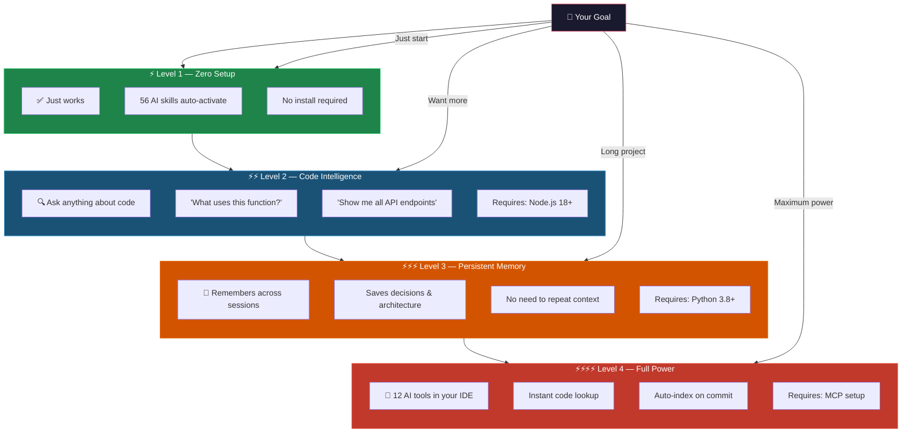
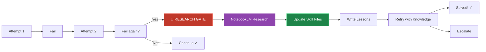
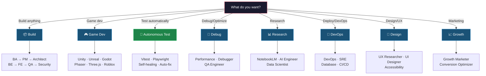
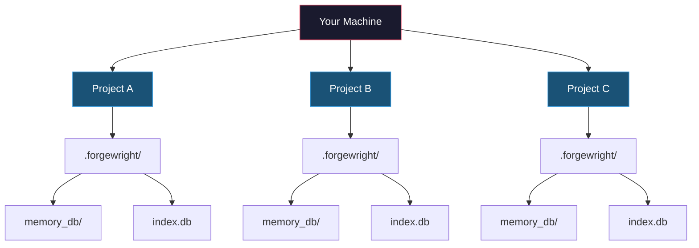

# Forgewright — AI Orchestrator That Actually Learns

<p align="center">
  <a href="https://github.com/buiphucminhtam/forgewright/stargazers">
    
  </a>
  <a href="https://github.com/buiphucminhtam/forgewright/network/members">
    
  </a>
  
  
  <a href="https://opensource.org/licenses/MIT">
    
  </a>
</p>

---

> **The AI that gets smarter every time it fails.** Unlike other AI assistants, Forgewright doesn't repeat the same mistakes. It learns.

```
You: "Build an e-commerce API"
Forgewright: [Builds it] → [Tests it] → [Fails test #7]
Forgewright: [Researches why] → [Updates its knowledge] → [Retries]
Forgewright: [Passes all tests] → [Learns: "Never use synchronous DB calls in hot path"]
Next project: "Build a different API"
Forgewright: [Skips synchronous DB calls] → [Built correctly the first time]
```

---

## Why Forgewright?

| Problem with other AI coding tools | Forgewright's solution |
|-----------------------------------|------------------------|
| Repeats the same mistakes | **ASIP** — learns from every failure |
| Gives generic advice | **Project-specific** — remembers your stack |
| Hallucinates solutions | **Grounded in research** — uses NotebookLM |
| No quality guarantee | **Auto-scored 0-100** — you know when it's ready |
| Starts from scratch each chat | **Persistent memory** — remembers everything |

---

## 30-Second Demo

```
You: "Build a React login form with JWT auth"

Forgewright responds:
━━━━━━━━━━━━━━━━━━━━━━━━━━━━━━━━━━━━━━━━━━━━━━━━━
🤔 INTERPRETING...
   Intent: Feature request
   Mode: Feature
   Confidence: HIGH

📋 PLANNING (Plan Quality Loop)...
   Score: 9.5/10 ✓

⚡ EXECUTING...
   [████████████████████░░░░] 85%
   
   ✓ Component created (auth/LoginForm.tsx)
   ✓ JWT middleware added
   ✓ Unit tests written (3 passing)
   ✓ Security audit passed

✅ DONE (Score: 92/100)
   • 4 files created
   • All tests passing
   • No security issues
   • Ready for production

💡 Lesson learned: JWT refresh token rotation
━━━━━━━━━━━━━━━━━━━━━━━━━━━━━━━━━━━━━━━━━━━━━━━━━
```

---

## Quick Start — 5 Phút

### Prerequisites

```bash
# Check what's installed
node --version   # Need 18+
git --version   # Need any recent version

# If missing (macOS)
brew install node
```

### One-Command Setup

```bash
# 1. Go to your project
cd /path/to/your/project

# 2. Clone Forgewright
git clone https://github.com/buiphucminhtam/forgewright.git

# 3. Copy config files
cp forgewright/AGENTS.md .
cp forgewright/CLAUDE.md .

# 4. Open in your IDE
cursor .          # or: code . / claude
```

### That's It. Start Talking.

```bash
# Example 1: Build something new
"Build a landing page for my coffee shop"

# Example 2: Add a feature
"Add dark mode with system preference detection"

# Example 3: Fix something
"Fix the memory leak in our image uploader"

# Example 4: Get help
"How does our auth flow work?"
"What will break if I change User model?"
```

---

## 4 Power Levels — Start Simple, Add Power



### Level 4 Setup (Full Power)

```bash
# One command does everything
cd your-project
bash forgewright/scripts/forgewright-setup.sh

# Restart your IDE, then:
# Type "/onboard" to analyze your project
# Type "/mcp" to check status
```

Or use the quick setup for fastest results:

```bash
# Ultra-simple one-liner
bash forgewright/scripts/forgeNexus-quick-setup.sh
```

**For existing installations, update with:**

```bash
# Check for updates
bash forgewright/scripts/forgewright-update.sh --check

# Update + migrate + reindex everything
bash forgewright/scripts/forgewright-update.sh --all
```

---

## What Can You Do?

| You say... | Forgewright does... |
|------------|---------------------|
| `"Build a SaaS app"` | BA → PM → Architect → Code → Test → Deploy |
| `"Add user auth"` | PM → Code → Test |
| `"Write tests"` | QA Engineer writes unit/integration/e2e |
| `"Review my code"` | Code Reviewer checks quality (0-100) |
| `"Fix the bug"` | Debugger → Engineer → Test |
| `"Deploy to Vercel"` | DevOps → CI/CD → SRE |
| `"Build a Unity game"` | Game Designer → Unity Engineer → Level |
| `"Research RAG"` | NotebookLM + Polymath (deep research) |
| `"Audit security"` | Security Engineer (OWASP Top 10) |
| `"Optimize speed"` | Performance Engineer → Profiler → Fix |

---

## Featured: ASIP — The Self-Improving Protocol

> **New in v8.3.0** — Skills that learn from failures.



**What gets learned:**

```
.forgewright/
├── lessons.md              # Your project lessons
├── asip-metrics.json     # Track improvements
└── skill-adaptations/    # Project-specific knowledge

skills/*/SKILL.md
└── ## Execution Learnings    # Auto-updated from failures
```

**Enforced rules:**
- 2 failed attempts → Mandatory NotebookLM research
- Research → Update skill files → Retry
- Lessons persist across sessions
- Skills get smarter over time

---

## Token Efficiency — 90% Cost Reduction

```
Before: $50/month on AI API costs
After:  $5/month (same productivity)
```

| What | Before | After | Saved |
|------|--------|-------|-------|
| Shell outputs | Full raw text | Structured summary | **60-80%** |
| Duplicates | Repeated queries | SHA-256 dedup | **90%** |
| Code navigation | Full file reads | Minimal signatures | **97%** |
| Memory | Everything loaded | Progressive disclosure | **75%** |
| **Combined** | High usage | Minimal usage | **~90%** |

---

## 56 Skills, 24 Modes



---

## Quality Gate — Always Scored 0-100

```bash
bash scripts/forge-validate.sh
```

| Score | Grade | Status |
|-------|-------|--------|
| 90-100 | A | ✅ Production ready |
| 80-89 | B | ⚠️ Minor issues |
| 70-79 | C | 🔶 Should review |
| 60-69 | D | 🔴 Fix before deploy |
| < 60 | F | 🚫 Blocked |

---

## Multi-Project Workflow

Each project has isolated state:



- Project A: Remembers "We use Next.js 14"
- Project B: Remembers "We use Django + PostgreSQL"
- No cross-contamination

---

## FAQ

**Q: Is it free?**
A: Yes, Forgewright is free. You only pay for your AI API (Claude/GPT-4).

**Q: Does it work with GPT-4?**
A: Yes! Works with Claude, GPT-4, and other LLMs.

**Q: Do I need to code?**
A: No. Level 1 works as a simple AI assistant. No coding required.

**Q: What about privacy?**
A: All data stays in your `.forgewright/` folder. Nothing sent elsewhere.

**Q: Multiple projects?**
A: Yes! Each project has isolated memory and index.

---

## Troubleshooting

| Problem | Fix |
|---------|-----|
| MCP not working | Restart IDE, run `--diagnose` |
| Skills not found | Check AGENTS.md + CLAUDE.md copied |
| Stale index | Run `npx forgenexus analyze --force` |
| Submodule issues | `git submodule update --init --recursive` |
| Need to update | `bash forgewright/scripts/forgewright-update.sh` |

```bash
# Quick diagnostics
bash forgewright/scripts/forgewright-setup.sh --check
bash forgewright/scripts/forgewright-setup.sh --diagnose

# Update ForgeWright
bash forgewright/scripts/forgewright-update.sh --check
bash forgewright/scripts/forgewright-update.sh --all
```

---

## ForgeNexus — Code Intelligence CLI

ForgeNexus indexes your codebase and provides instant code context:

```bash
# Index a repository
npx forgenexus analyze

# With semantic search
npx forgenexus analyze --embeddings

# Query code
npx forgenexus query "findUser"
npx forgenexus context getUser
npx forgenexus impact validateToken

# Check status
npx forgenexus status
npx forgenexus list
```

See [`forgenexus/ARCHITECTURE.md`](forgenexus/ARCHITECTURE.md) for full documentation.

---

## Contributing

1. Fork the repo
2. Create branch: `git checkout -b feature/amazing-feature`
3. Commit: `git commit -m 'feat(skill): add amazing feature'`
4. Push: `git push origin feature/amazing-feature`
5. Open a Pull Request

**Add a new skill:** Create `skills/your-skill/SKILL.md`

---

## License

MIT — Use it however you want.

---

## Support the Project

If Forgewright helps you ship faster, consider buying me a coffee:

<p align="center">
  
</p>

---

<p align="center">
  <strong>Forgewright — The AI that learns from every mistake.</strong>
  <br />
  <em>Plan precisely. Build confidently. Scale intelligently.</em>
</p>
