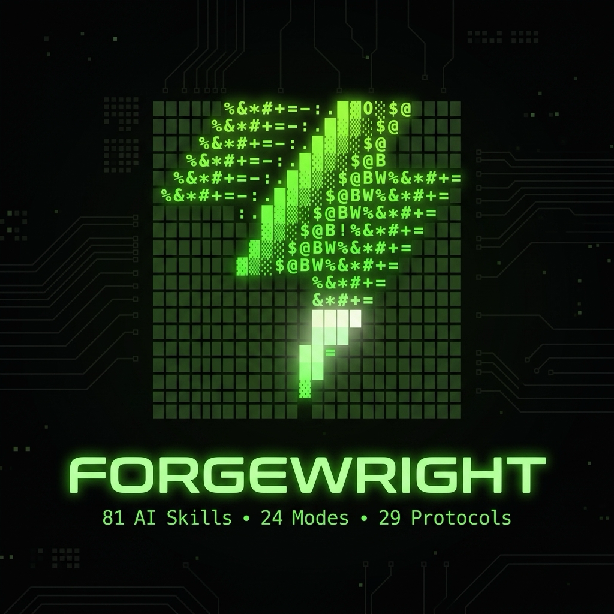
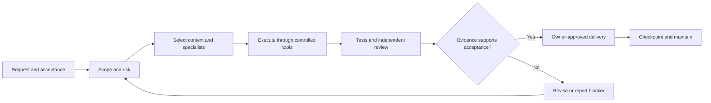

<!-- markdownlint-disable MD013 MD033 -->
# Forgewright

<p align="center">
  
</p>

<p align="center">
  <strong>From a prompt to an engineering workflow you can inspect, verify, and control.</strong>
</p>

<p align="center">
  
  
  
  
</p>

<p align="center">
  <a href="#quick-start">Quick start</a> ·
  <a href="#what-you-can-build">Use cases</a> ·
  <a href="#whats-new">What's new</a> ·
  <a href="#verification">Verification</a> ·
  <a href="README.vi.md">Tiếng Việt</a>
</p>

**Forgewright is a local-first engineering harness for AI-assisted software delivery.** It brings task definition, specialist workflows, code intelligence, tool controls, verification, and project continuity into one repository. Use it with the model runtime and tools you configure—not a mandatory hosted service or a second model subscription.

The difference is not a longer prompt or a larger cast of agents. It is a delivery contract: **what should change, who may change it, how it is checked, and what remains unverified.**

## Why Forgewright

| Engineering problem | What Forgewright adds |
| --- | --- |
| The agent writes code before understanding the task | A goal, explicit acceptance criteria, risk assessment, and the minimum safe scope. |
| Every specialist reads the entire conversation | Compact routing, on-demand skill overlays, bounded task context, and artifact references. |
| Parallel workers overwrite one another | Dependency-aware dispatch, explicit ownership, and isolated worktrees where configured. |
| “Done” means the model says it is done | Project-owned checks and schema-v2 evidence tied to the command, acceptance criteria, and exact worktree. |
| A stopped task leaves effects or processes behind | Owned process leases, cancellation, lifecycle accounting, and honest cleanup status. |
| The next session forgets decisions | Project-scoped checkpoints and canonical documentation; retrieved memory remains context, not authority. |

**84 skills. 24 operating modes. One delivery pipeline.** The [product manifest](product-manifest.json) and [capability inventory](docs/capability-maturity.json) keep those claims tied to the repository rather than marketing copy.

## What you can build

**Web products and internal tools.** Shape a brief, define architecture and acceptance, coordinate implementation and review, and retain the decisions needed for maintenance. The [Product Factory source](mcp/src/product-factory/) includes intent, environment-adapter, outcome-verification, and release contracts.

**Games and mobile projects.** Coordinate systems design, engineering, art direction, QA, performance work, and release evidence. The [Game Studio workflow](workflows/game-studio-build.md) covers concept through release; Unity, Android, and web environment adapters have local tests. Each target still needs its own build tools, devices, and production evidence.

**Existing codebases.** Investigate bugs, assess refactor impact, generate tests, review security-sensitive changes, and keep documentation aligned with the code. Start with a bounded task; parallel execution is an option, not a requirement.

### A practical request

```text
Add save/continue to this game.

Preserve the current gameplay and existing tests.
Define acceptance for resume, corrupt saves, and duplicate rewards.
Inspect affected systems before editing.
Implement the smallest safe change, run the checks, and report:
  changed files · observed results · remaining risks · rollback
Do not publish or deploy without approval.
```

This is an example input, not a fabricated execution transcript. Actual results depend on the connected runtime, project, tools, and checks.

## How it works

`INTERPRET → DEFINE → BUILD → HARDEN → SHIP → SUSTAIN`


```mermaid
flowchart LR
    A[Request and acceptance] --> B[Scope and risk]
    B --> C[Select context and specialists]
    C --> D[Execute through controlled tools]
    D --> E[Tests and independent review]
    E --> F{Evidence supports acceptance?}
    F -->|Yes| G[Owner-approved delivery]
    F -->|No| H[Revise or report blocker]
    H --> B
    G --> I[Checkpoint and maintain]
```

Clear local work stays small. Security, billing, concurrency, public contracts, and release changes require stronger checks. A worker's successful generation is not product acceptance, and stopping a retry loop never turns an unverified result into a verified one.

The [pipeline reference](docs/pipeline-reference.md) describes orchestration; the [canonical runtime ADR](docs/adr/0001-canonical-production-runtime.md) documents the implemented enforcement boundaries.

## Quick start

### 1. Build the local tools

Use **Node.js 22+**, **Python 3.11+**, and Git. The optional Pi package requires **Node.js 22.19+**. On Windows, use Git Bash for shell-based setup and gates; native PowerShell hook support is documented in the repository.

```bash
git clone https://github.com/buiphucminhtam/forgewright.git
cd forgewright
npm run ci:bootstrap
npm run build
npm run build:cli
node src/cli/dist/index.js --help
```

`ci:bootstrap` installs the checked-in Node/Python verification dependencies and configures this clone's Git hooks. It does not enable Pi, start production services, or require a paid CI runner. Model calls use your chosen provider's account and usage policy.

### 2. Inspect a project without a model call

Replace `/path/to/your-project` with an existing local project directory:

```bash
node src/cli/dist/index.js --json init /path/to/your-project
node src/cli/dist/index.js --json onboard /path/to/your-project
```

The CLI creates project-local metadata and records filesystem facts. Existing files are preserved unless an explicit overwrite option is used. See the [init/onboard guide](docs/guides/forge-init-onboard.md).

### 3. Connect the engineering workflow

For project-local adoption, add Forgewright as a Git submodule from **your project's root**:

```bash
git submodule add -b main https://github.com/buiphucminhtam/forgewright.git forgewright
git submodule update --init --recursive
bash forgewright/scripts/forgewright-mcp-setup.sh
```

Review the setup script and the configuration it writes. Merge the relevant instructions from `forgewright/AGENTS.md` or `forgewright/CLAUDE.md` into existing project instructions—**do not blindly overwrite your own rules**. Reload your client, check its MCP connection, then begin with `/onboard` where the client supports project workflows.

Host configuration is available for Codex, Claude, Cursor, and Antigravity; capability negotiation determines what the active host actually supports. Instructions alone are not a running MCP integration. Optional GitNexus indexing and host-specific hook installation are separate setup steps; consult the [GitNexus guide](docs/guides/gitnexus.md), [installer](scripts/forgewright-install.sh), and [hook doctor](scripts/forgewright-hook-doctor.sh).

## What's new

### Optional Pi execution, under Forgewright control

The [Pi integration](integrations/pi/) adds an isolated worker option without replacing Hermes, the current dispatcher, or Forgewright's ownership of goals and acceptance.

| Upgrade | Behavior |
| --- | --- |
| Pinned SDK | An independent lockfile pins `@earendil-works/pi-agent-core@0.85.1`; root installation does not install the optional package. |
| Canonical host bridge | Uses the existing model/tool gateways, containment, lifecycle coordinator, and trajectory ledger. `start()` returns a session; `wait()` owns settlement. |
| Explicit authority | Host-owned model, account, policy, tool registry, approvals, and scope; task text cannot grant permission. |
| Account-level budgets | One billing-account cap spans multiple workspaces. Never-dispatched reservations are released; uncertain invoked calls retain escrow. |
| Cancellation and deadlines | Late success cannot reopen a closed attempt. Cancellation also releases undispatched reservations when a binding callback hangs. |
| Bounded context and receipts | Preserve acceptance and current bindings; missing native usage or price remains unavailable, not zero. |
| Evaluation and rollback controls | Paired-report comparison plus default-off, single-active-worker canary admission, kill switch, and quarantine. |

**Status: experimental, explicitly opt-in.** The public `delegate` CLI now runs a real Pi worker from the parent project. It supports an existing authorized Codex/Pi OAuth subscription or an explicit loopback model server, without TypeSafe or a new paid API fallback. A host-approved task permits only named files, compare-and-swap patches and immutable verifier IDs. The original zero-tool analysis pilot remains available; it is not the coding-worker entrypoint.

```bash
npm --prefix integrations/pi ci --ignore-scripts --no-audit --no-fund
npm run build
npm run build:cli
npm --prefix integrations/pi run test:all
```

After building the CLI and MCP above, run from the **parent project**, not inside its submodule:

```bash
node forgewright/src/cli/dist/index.js delegate on --worker pi --provider openai-codex --auth-source codex --model <exact-codex-model-id>
node forgewright/src/cli/dist/index.js delegate status --worker pi
node forgewright/src/cli/dist/index.js delegate run --worker pi --contract task.json
node forgewright/src/cli/dist/index.js delegate resources
# node forgewright/src/cli/dist/index.js delegate cancel <run-id>
```

Settings live in the parent's existing `.production-grade.yaml`; unrelated settings are preserved. `current` is convenience-only and accepts a Codex-compatible unprefixed model selection; custom providers and provider-prefixed external routes are rejected instead of being reinterpreted as OpenAI. For deterministic setup, prefer the explicit `openai-codex` command above. To explicitly use an existing Codex subscription, select `--provider openai-codex --auth-source codex --model <exact-model-id>`. `CODEX_HOME` is respected. Subscription access is read-only and still consumes its existing quota; expired authorization reports `pi_auth_required`, not a paid fallback. Local execution needs a configured loopback model endpoint. Verifier isolation currently requires macOS and a single-process command; fork/spawn, network access and source writes are denied. Unsupported platforms fail closed. The governed `delegate run` entrypoint refuses legacy Agy execution until it has a compatible host-admission/cleanup contract; its low-level adapter and configuration are retained, not silently used as fallback. `ready` means prerequisites are present, while a successful task receipt requires actual execution. See the [Pi ADR](docs/adr/ADR-pi-worker-runtime.md) for the task contract, local-provider setup, cancellation, limitations and live-measurement gates.

### Leaner context and clearer project state

System-1 routing now uses bounded English/Vietnamese rules and optional exact caching, then abstains when the intent is ambiguous. It does not import or call Jev, require `TYPESAFE_API_KEY`, download a classifier, or spend an extra model call. It takes Jev's bounded-choice approach without claiming to run the Jev model. Progressive skill loading and compact execution summaries keep unrelated context out of the worker.

A shared per-user SQLite admission authority limits Pi clients across projects to at most two active workers and one heavy verifier, with one worker on the low-memory profile, pressure backoff, project fairness and uncertain-operation quarantine. Default scheduling estimates are **192 MiB per Pi worker** and **128 MiB per single-process verifier**, calibrated against observed target-Mac process RSS (~71–84 MiB for the loaded Pi runtime and ~42 MiB for a small Node verifier). These are admission estimates, not hard RSS caps; memory pressure still blocks new work and preserves host headroom. A small IPC broker starts on demand and exits after 15 idle seconds; project contexts and credentials remain separate. These are concurrency limits, not certified throughput for every 4 GiB workload. Unmanaged IDEs/processes are not killed. Savings and whole-machine overhead still require representative measurement.

The **Docs Hub** builds a searchable local HTML control center from approved Markdown/JSON. Project structure, roadmap, blockers, and Mermaid-derived flow views come from canonical sources—not another manually maintained dashboard.

```bash
node src/cli/dist/index.js docs build .
node src/cli/dist/index.js docs doctor . --strict
```

Open `.forgewright/docs-hub/site/index.html`. See the [Docs Hub guide](docs/guides/docs-hub.md) for multi-project registration, privacy allowlists, and Obsidian export.

## Core Capabilities

The maturity labels below follow the [capability inventory](docs/capability-maturity.json): **beta** means automated local evidence, **experimental** means incomplete production evidence, and **docs-only** means a documented integration or workflow—not a supported production runtime claim.

<details>
<summary><strong>Explore all 12 capability areas</strong></summary>

### 1. Code Intelligence (GitNexus)

**Docs-only integration.** Navigate relationships and assess impact before refactoring supported codebases. Stale indexes and dynamic code remain limitations; compatibility paths and user overrides are not universally enforced. [Guide](docs/guides/gitnexus.md).

### 2. Autonomous Testing Stack

**Beta.** Project-owned checks, property-based tests, controlled mutations, and acceptance-bound evidence. Existing behavioral oracles cannot be weakened merely to make a suite green. [Testing guide](docs/guides/testing-stack.md).

### 3. Persistent Cognitive Memory (FluxMem)

**Experimental.** Optional local retrieval and project context across sessions. Current files and canonical checkpoints outrank recalled material; memory never grants tool authority. [Architecture](docs/architecture.md).

### 4. Parallel Skill Dispatch

**Experimental.** Decompose genuinely independent work into owned lanes and combine checked results. Keep coupled work serial; more workers are not automatically faster or cheaper. [Pipeline](docs/pipeline-reference.md).

### 5. Multi-Project Hub

**Docs-only management integration.** The broader multi-project management surface remains a documented capability. The implemented Docs Hub separately provides local project registration and static source-backed views. [Docs Hub](docs/guides/docs-hub.md).

### 6. Token Tracking & Cost Analytics

**Beta.** Track reported usage, budget reservations, and benchmark observations. Distinguish measured usage, estimates, and unavailable pricing. [ForgeBench source](src/cli/src/bench/).

### 7. MCP Tool Sandbox

**Beta application controls—not OS isolation.** Canonical gateway admission, policy checks, containment, and bounded output processing. These controls are not a guarantee against every prompt injection or malicious same-user host. [Runtime contract](docs/adr/0001-canonical-production-runtime.md).

### 8. The Adaptive Self-Improving Protocol (ASIP)

**Experimental legacy workflow.** Retain useful lessons, but do not automatically promote them into shared rules. The canonical stuck rule stops repeated failed approaches and requires new evidence or escalation. [Kernel](AGENTS.md).

### 9. Runtime Lifecycle Guard

**Beta.** Track owned process leases, reuse eligible services, and inspect cleanup and disk budgets. Unowned processes stay outside automatic reclamation. [Lifecycle ADR](docs/adr/ADR-010-runtime-lifecycle-guard.md).

### 10. Game Studio Control Plane

**Beta optional pack.** Phase-aware handoffs from concept and systems design through production, polish, and release evidence. Real builds, devices, playtests, and store approval are project-specific. [Game Studio workflow](workflows/game-studio-build.md).

### 11. Token Efficiency Engine & System-1 Routing (Jev Integration)

**Experimental.** Compact overlays plus keyless, bounded local EN/VI routing with honest abstention. The historical Jev adapter is not on the default route; no classifier/model download or cloud routing call is required. No universal quality or savings percentage is promised. [Efficiency protocol](skills/_shared/protocols/tool-efficiency.md).

### 12. Optional Pi Worker Pilot

**Experimental, opt-in.** Pinned Pi SDK and a public consumer-project coding worker with scoped file tools, immutable verifiers, cancellation and shared low-memory admission. Existing subscription/local transport is explicit; no autonomous production migration or paired-savings claim. [Pi ADR](docs/adr/ADR-pi-worker-runtime.md).

</details>

## Verification

Forgewright's evidence is executable locally. Hosted CI can mirror it, but is not required.

```bash
# Core checks
npm run lint
npm run build
npm test
npm run typecheck:cli
npm run build:cli

# Documentation and declared roadmap contracts
npm run ci:docs
npm run verify:product-truth
npm run verify:roadmap

# Complete project-owned local pipeline
npm run ci:local
```

Run optional Pi tests separately with the commands above; they include contract checks, real-SDK runtime checks, and owner-gated workflows in separate Node processes. `python3 scripts/ci/verify-readme.py` checks both front pages and runs the documented init/onboard commands in a disposable project without a model call. The [roadmap completion manifest](docs/roadmap-completion.json) separates **implementation, integration, activation, production evidence, and measured outcome**. A passing unit suite, a signed commit, and an accepted product outcome are different things.

### Trust boundaries

The core is provider-neutral; execution stays within the selected provider's configured ecosystem. Local-first does not mean all data stays on-device: a remote model may receive prompts, selected code, and tool results. Use an appropriate local runtime when that is required.

Tool containment is application-level, not a kernel sandbox. Trusted host callbacks retain host privileges. Hash-bound evidence detects mismatches; it does not authenticate against a same-user attacker. Production Pi activation, live adaptive routing, and arbitrary autonomous process execution require their separate gates. See [security guidance](SECURITY.md) and the [active roadmap](docs/active-roadmap.md).

## Documentation

| Start here | Purpose |
| --- | --- |
| [Product overview](docs/product-overview.md) | Scope, delivery model, and product direction. |
| [Architecture](docs/architecture.md) / [pipeline reference](docs/pipeline-reference.md) | Components, ownership, and execution flow. |
| [Quickstart details](docs/guides/forge-init-onboard.md) | Deterministic initialization and onboarding. |
| [Docs Hub](docs/guides/docs-hub.md) | Source-backed local documentation and project views. |
| [Visual grounding](skills/_shared/protocols/visual-grounding.md) | Design direction based on inspected references and evidence. |
| [Game Studio](workflows/game-studio-build.md) | Game-production phases and handoff requirements. |
| [Pi integration](docs/adr/ADR-pi-worker-runtime.md) | Optional worker architecture, limits, and rollout gates. |
| [Capability inventory](docs/capability-maturity.json) / [active roadmap](docs/active-roadmap.md) | What exists, its maturity, and what remains open. |
| [Changelog](CHANGELOG.md) | Maintained change history. |

## Contributing and support

Bring a concrete problem, a bounded change, and the checks that demonstrate it. Preserve existing behavioral tests; include a failing reproduction for a fix, update the canonical documentation, and run the local gates before opening a pull request. Do not commit generated runtime evidence, credentials, or personal workspace state.

Use [GitHub issues](https://github.com/buiphucminhtam/forgewright/issues) for reproducible bugs and proposals. Security reports follow [SECURITY.md](SECURITY.md). Package-specific licensing is declared in the relevant package metadata, including [the CLI's MIT declaration](src/cli/package.json); review those declarations and upstream dependency licenses before redistribution.

**Build with more leverage. Ship with evidence.**
