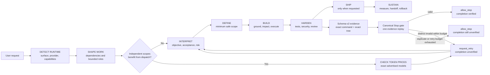

<!-- markdownlint-disable MD013 MD033 -->
# Forgewright — AI Orchestrator That Actually Learns

<p align="center">
  
</p>

<p align="center">
  <a href="https://github.com/buiphucminhtam/forgewright">
    
  </a>
  <a href="https://github.com/buiphucminhtam/forgewright/network/members">
    
  </a>
  
  
  
  
  <a href="https://opensource.org/licenses/MIT">
    
  </a>
</p>

---

> **An AI harness that records failures and reuses verified lessons.** Forgewright is designed to reduce repeated failure patterns; recurrence is measured rather than assumed away.

Forgewright is an open-source engineering harness that adds evidence-gated delivery workflows around the model provider and tools you configure. It coordinates definition, building, hardening, and shipping while keeping provider-specific execution inside that provider's native ecosystem.

---

## Roadmap and Evidence Status

The roadmap tracks 19 historical deliverables from P0.1 through P3.4 without collapsing artifact presence into product completion. The machine-readable [completion manifest](docs/roadmap-completion.json) records implementation, integration, activation, production evidence, and measured outcome separately, with executable local verifier contracts and rollback strategies; the [active roadmap](docs/active-roadmap.md) records the current dependency order and evidence boundaries.

- Verification runs locally and does not require GitHub Actions or paid hosted CI.
- Provider and model selection is capability-driven. The core does not require one provider, model catalog, or API.
- Provider-native execution stays within the selected provider's own CLI or ecosystem adapter.
- Live adaptive-routing gates P2.2–P2.5 remain disabled until that provider produces trustworthy native receipts. Fixtures, generic CLI probes, and local smoke markers cannot enable them.
- Gemini API integration is not part of the roadmap. Antigravity CLI may be used as one optional provider-side validation instance, not as a core dependency.

Replay the complete roadmap evidence contract locally:

```bash
npm run verify:roadmap
```

---

## Continuous Project Control Center

This release turns project documentation from scattered Markdown snapshots into
a continuously refreshed, local-first HTML control center:

- **Canonical sources stay authoritative.** Documentation governance updates an
  existing approved source whenever possible and rejects duplicate, transient,
  out-of-scope, generated-source, or unresolved stale documentation.
- **HTML stays current during delivery.** Material work requires a strict
  baseline plus persistent build before edits, a canonical-state update and
  rebuild at each meaningful checkpoint, then a worktree gate and final build
  before handoff.
- **Project flows are visual.** Every flow in `docs/project-state.json` is
  rendered as an accessible Mermaid-derived static SVG, with the Mermaid source
  and ordered steps retained as fallbacks.
- **Dispatch is runtime- and cost-aware.** Each request identifies the active
  Codex, Claude Code, Antigravity, Cursor, or other runtime. Candidate subagent
  models are compared using current first-party input/cached-input/output token
  prices, but routing prioritizes effectiveness, wall-clock speed, total tokens,
  then estimated token cost. Small coupled work stays parent-owned.
- **Canonical rules stay visible without blocking work.** Provider-native
  lifecycle hooks inject a bounded inventory plus fair excerpts for every
  active rule in `kernel/rule-manifest.json`. They default to advisory
  `observe`, preserve the existing Stop/security gates, and fail open on
  missing runtimes, malformed payloads, invalid manifests, or timeouts. Set
  `FORGEWRIGHT_RULE_HOOK_MODE=off` for the immediate kill switch.
- **Material visual direction is evidence-grounded.** Current project/user
  references outrank generic taste; greenfield external direction uses current
  production/design-system Evidence Cards plus a validated Visual Basis.
  Model training prior may suggest research hypotheses but cannot authorize
  palette, typography, layout, motion, art style, or a causal claim about why a
  successful product succeeded.

The generated site is written to `.forgewright/docs-hub/site/`; open
`.forgewright/docs-hub/site/index.html` for the project overview or
`.forgewright/docs-hub/site/projects/<project-id>/flows.html` for the Mermaid
flow control view. Generated HTML is inspectable output, never source truth.

The Stop lifecycle performs only a read-only Docs Hub continuity check. Its
default `observe` mode reports stale or missing HTML evidence as `UNVERIFIED`
without blocking; optional `FORGEWRIGHT_DOCS_CONTINUITY_MODE=enforce` may ask
for one refresh when a present receipt is provably stale, then always allows
the next pass to prevent retry storms. Use `off` to disable this check.

**[Read the Docs Hub Guide ➔](docs/guides/docs-hub.md)** ·
**[Read the Pipeline Reference ➔](docs/pipeline-reference.md)**

---

## Pipeline Flow

Forgewright separates delivery phases from the runtime controls that prove and
close a task. Small local work may compress irrelevant phases; HARD work expands
the same boundaries.


```mermaid
flowchart LR
    A[User request] --> H[DETECT RUNTIME<br/>surface, provider, capabilities]
    H --> W[SHAPE WORK<br/>dependencies and bounded roles]
    W --> Q{Independent scopes<br/>benefit from dispatch?}
    Q -->|No| B[INTERPRET<br/>objective, acceptance, risk]
    Q -->|Yes| P[CHECK TOKEN PRICES<br/>exact advertised models]
    P --> R[RANK CANDIDATES<br/>effectiveness → speed → tokens → cost]
    R --> B
    B --> C[DEFINE<br/>minimum safe scope]
    C --> D[BUILD<br/>ground, impact, execute]
    D --> E[HARDEN<br/>tests, security, review]
    E --> F[SHIP<br/>only when requested]
    F --> G[SUSTAIN<br/>measure, handoff, rollback]

    E --> V[Schema-v2 evidence<br/>exact command + exact tree]
    V --> S[Canonical Stop gate<br/>one evidence replay]
    S -->|valid| X[allow_stop<br/>completion verified]
    S -->|distinct invalid within budget| R[request_retry<br/>completion unverified]
    R --> B
    S -->|duplicate or retry budget exhausted| U[allow_stop<br/>completion still unverified]
```

| Boundary | Machine behavior | Loop/authority limit |
| --- | --- | --- |
| Host compatibility | `HarnessAdapter v1` negotiates owned/native loops and `start`, `resume`, `fork`, `steer`, `interrupt`, `checkpoint` support | Unknown or unsupported lifecycle operations fail closed; provider model IDs are not part of the core contract |
| Verification | Schema-v2 evidence binds acceptance IDs, exact argv, negative paths, output digest, and exact worktree | A Stop event replays the canonical evidence command at most once |
| Stop re-entry | At most two distinct invalid attempts are recorded per session/turn/tree scope; identical re-entry or exhausted budget terminates the host interaction | Termination never upgrades `completion_state`; suppressed retries remain `unverified` |
| Runtime lifecycle | MCP instances reconcile prior leases at startup and hold owner-token leases bound to PID start, PGID, parent identity, command digest, session, TTL, and version | Only the positive PID of an exact owned lease may receive TERM/KILL; dead leases close without a signal, while reused, rotated, unowned, or in-flight processes are preserved |
| Trajectory lifecycle | The canonical MCP path opens a `forgewright-trajectory-event/v1` hash-chained ledger, accounts each tool call, persists cancellation/LIFO disposer events, and supports exact-tip writer-epoch recovery at quiescent checkpoints | Hashes detect corruption rather than authenticate same-user rewrites; timeout records `not_confirmed`, and recovery refuses active work or pending disposer callbacks rather than replaying arbitrary cleanup code |
| Application containment | Canonical tool effects use pinned runtime/policy trust, fail-closed capability admission, contained state/filesystem paths, minimized policy subprocess environment, and deny-by-default webhook destinations | This is not a kernel sandbox; arbitrary process execution, foreign tools, same-user bypass, and kernel egress isolation remain outside the local claim |
| Context continuity | The agent proactively checkpoints before model/effect boundaries and after tool steps; checkpoints bind project/session/tree/ledger plus optional runtime trajectory/capability state and carry replay-safe step/tool limits | Checkpoints remain context-only; mismatch, corruption, expiry, replay, or budget overrun requires a fresh start and never authorizes tools or completion |

The current local upgrade completes the Stop/replay boundary, the
`HarnessAdapter v1` contract, MCP ownership leases, event-driven continuity,
the H2 trajectory lifecycle and H3 application-containment gates on the
canonical MCP path. Safe-boundary checkpoint/resume is available locally;
offline full-loop record/replay is locally verified; live provider evidence, portable OS process isolation,
arbitrary disposer rebinding, and fresh-evaluator handoff remain ordered work in the
[active roadmap](docs/active-roadmap.md).
The design choices and their primary-source evidence are recorded in the
[harness runtime research and decision log](docs/harness-runtime-research.md).

---

## Why Forgewright / Who It Is For

Raw language models are only a small part of a functional AI coding agent. Without a disciplined framework, agents hallucinate, lose context, and repeat errors. Forgewright wraps AI execution in an uncompromising delivery harness designed for professional engineering teams.

### Key Outcomes

- **Bounds repeated failure patterns**: The kernel stops the same failed approach after two attempts, requires new evidence or escalation, and bounds invalid Stop-hook re-entry without turning an unverified task into a verified one.
- **Project-Specific Continuity**: Material decisions, verifier results, handoffs, blockers, and terminal boundaries can write a hash-chained project/session checkpoint. SQLite-backed memory remains optional retrieval context, never project truth.
- **Pipeline Execution**: Requests use a right-sized engineering lifecycle. Clear local work stays compact; public contracts, security, concurrency, release, and other HARD signals expand verification and review before completion is claimed.
- **Evidence-Gated Testing**: Test and verification integrations are available where configured. They provide local evidence for the checks actually run; they do not guarantee zero escaped bugs.
- **Local-first state**: Project memory and orchestration state are stored in the workspace by default. Prompts, code excerpts, and tool results may still be sent to the model or tool providers you configure; use a local model and local tools when data must stay on-device.

### Who It Is For

- **Senior Engineers** needing an intelligent rubber-duck and rapid prototyping agent.
- **Development Teams** looking to automate repetitive boilerplate, refactoring, and test generation.
- **QA Engineers** desiring robust autonomous integration tests.

**[Read the Full Product Overview ➔](docs/product-overview.md)**

---

## 30-Second Example

Forgewright takes abstract prompts and manages the complete lifecycle autonomously.

```text
You: "Build a React login form with JWT auth"

Forgewright responds:
━━━━━━━━━━━━━━━━━━━━━━━━━━━━━━━━━━━━━━━━━━━━━━━━━
🤔 INTERPRETING...
   Intent: Feature request
   Mode: Feature
   Confidence: HIGH

📋 PLANNING (Plan Quality Loop)...
   Score: 9.5/10 ✓

⚡ EXECUTING...
   [████████████████████░░░░] 85%
   
   ✓ Component created (auth/LoginForm.tsx)
   ✓ JWT middleware added
   ✓ Unit tests written (3 passing)
   ✓ Security audit passed

✅ DONE (Score: 92/100)
   • 4 files created
   • All tests passing
   • No security issues
   • Ready for production

💡 Lesson learned: JWT refresh token rotation
━━━━━━━━━━━━━━━━━━━━━━━━━━━━━━━━━━━━━━━━━━━━━━━━━
```

For supported, configured paths, Forgewright can create files, run configured tests, and record verifier output. Whether a particular task uses those paths depends on the selected runtime and available tools; see the [canonical-runtime ADR](docs/adr/0001-canonical-production-runtime.md).

---

## Prerequisites and Quick Start

Forgewright is designed to run locally alongside your preferred IDE and development stack. It operates primarily as a Model Context Protocol (MCP) server, integrating seamlessly into modern AI-assisted editors.

### Prerequisites

Please ensure the following dependencies are installed and available in your system path:

- **Node.js**: v22.x or higher for supported Forgewright runtime and CLI usage; CI validates Node.js 24 LTS with a Node.js 22 compatibility lane.
- **Git**: v2.30+ (required for repository management and history tracking).
- **Python**: v3.11+ for the hook installer, hook doctor, and Stop runtime. On Windows, the launcher may be exposed as `python3.exe`, `python.exe`, or `py.exe`; setup resolves a supported interpreter and the native PowerShell adapter re-resolves one at hook invocation. The optional FluxMem SQLite GraphRAG memory layer alone remains compatible with Python v3.8+.
- **Windows shell**: Git Bash from Git for Windows is required for installer and hook shell entrypoints; those entrypoints support native Windows CPython rather than requiring WSL.
- **Supported IDE**: Cursor, Claude Desktop, or Codex CLI.

On Windows, the checked-in project Codex hooks are the exception to the shell
entrypoint rule: `.codex/config.toml` selects `command_windows`, which invokes
`scripts/lite/codex-hook-windows.ps1` with native PowerShell from any repository
subdirectory. Git Bash remains required for setup, doctor, and the installed
global shell entrypoint.

### Verified Install Paths for Supported IDEs

For the best experience, we recommend using Forgewright in **Cursor** or **Claude Desktop** via the Model Context Protocol (MCP). The following setup flow integrates Forgewright directly into your target repository as a submodule. This allows it to track your project's unique configuration securely and persistently across different developer machines.

#### Step 1: Clone Forgewright as a Git Submodule

Integrating Forgewright directly into your target repository allows it to maintain a project-specific memory bank and execution context. Open your terminal, navigate to the root of your project repository, and execute the following commands:

```bash
cd /path/to/your-project
git submodule add -b main https://github.com/buiphucminhtam/forgewright.git forgewright
git submodule update --init --recursive
```

#### Step 2: Install and Configure GitNexus

GitNexus powers Forgewright's static code intelligence and impact analysis. It allows the AI to understand the relationships between different modules in your codebase without needing to read every file into its context window.

```bash
npm install -g gitnexus
gitnexus setup
gitnexus analyze
```

The `analyze` step builds the initial structural graph of your project. You should re-run `gitnexus analyze` whenever you introduce significant architectural changes.

#### Step 3: Run the MCP Setup Script

The MCP setup script automatically configures your local environment to recognize Forgewright's capabilities. It modifies the necessary configuration files for Claude Desktop, Cursor, Antigravity, and Codex CLI.

```bash
bash forgewright/scripts/forgewright-mcp-setup.sh
```

#### Step 4: Initialize the Required Rules and Constraints

Forgewright relies on strict system prompts to maintain its behavioral constraints. You must copy these rule files to the root of your project so that your IDE's AI assistant can read them automatically upon initialization.

```bash
cp forgewright/AGENTS.md .
cp forgewright/CLAUDE.md .
```

*Final Step:*
You must restart your IDE completely (e.g., CMD+Q on Mac) to force it to load the newly installed MCP servers. Once the IDE has restarted, open your AI chat panel and verify the installation by running `/onboard`.

#### Step 5: Enable Antigravity CLI (`agy`) Enforcement

Every developer or CI machine that uses `agy` must install the machine-level
Antigravity hook and the parent repository's update hooks once:

```bash
bash forgewright/scripts/forgewright-install.sh --profile minimal --yes
bash forgewright/scripts/forgewright-hook-doctor.sh --quick --fix
bash forgewright/scripts/lite/install-submodule-update-hooks.sh "$PWD"
```

The installer distributes the complete Stop runtime as one adjacent bundle:
`stop-gate.sh`, `stop_gate.py`, `verify_gate.py`, `evidence_common.py`,
`continuity_check.py`, and `windows_secure_io.py`. The Stop state lock uses the
POSIX backend on POSIX and
the native Windows backend on Windows. On Windows, run setup and doctor from
Git Bash with native Windows Python 3.11 or newer.

The installer adds the native named `PreToolUse` policy hook to
`~/.gemini/config/hooks.json`. This is Antigravity CLI configuration and is
separate from Gemini CLI's `.gemini/settings.json`. Setup and `doctor --fix`
also seed `.forgewright/execution-policy.yaml` into the parent workspace when
it is missing; an existing file or symlink is always preserved. The doctor
repairs missing or drifted members of the installed Stop bundle, but a valid
hook schema alone is not runtime evidence. Confirm both configuration and the
actual installed entrypoint:

```bash
bash forgewright/scripts/forgewright-hook-doctor.sh --quick

# Run the installed CODEX entrypoint from outside every Git worktree.
(
  set -euo pipefail
  installed_stop="${FORGEWRIGHT_DIR:-$HOME/.forgewright}/scripts/lite/stop-gate.sh"
  smoke_dir="$(mktemp -d)"
  trap 'cd / && rmdir "$smoke_dir"' EXIT
  cd "$smoke_dir"
  unset FORGEWRIGHT_WORKSPACE
  if git rev-parse --is-inside-work-tree >/dev/null 2>&1; then
    echo "Stop smoke must run outside a Git worktree" >&2
    exit 1
  fi
  printf '%s\n' '{"hook_event_name":"Stop","turn_id":"installed-runtime-smoke","session_id":"installed-runtime-smoke","last_assistant_message":""}' |
    bash "$installed_stop" --platform CODEX |
    node -e 'const fs=require("node:fs"),assert=require("node:assert/strict"); const actual=JSON.parse(fs.readFileSync(0,"utf8")); const expected={continue:true,forgewright:{schema:"forgewright-stop-decision/v1",host_action:"allow_stop",completion_state:"verified",retry_suppressed:false,reason_code:"no_code_changes"}}; assert.deepEqual(actual,expected); console.log("installed CODEX Stop runtime: PASS")'
)
```

From PowerShell on Windows, run that Git Bash pipeline explicitly; the installed
entrypoint resolves `python3.exe`, `python.exe`, or `py.exe` and rejects anything
older than native Windows CPython 3.11:

```powershell
$gitBash = 'C:\Program Files\Git\bin\bash.exe'
& $gitBash -lc @'
set -euo pipefail
installed_stop="${FORGEWRIGHT_DIR:-$HOME/.forgewright}/scripts/lite/stop-gate.sh"
smoke_dir="$(mktemp -d)"
trap 'cd / && rmdir "$smoke_dir"' EXIT
cd "$smoke_dir"
unset FORGEWRIGHT_WORKSPACE
if git rev-parse --is-inside-work-tree >/dev/null 2>&1; then
  echo "Stop smoke must run outside a Git worktree" >&2
  exit 1
fi
printf '%s\n' '{"hook_event_name":"Stop","turn_id":"installed-runtime-smoke","session_id":"installed-runtime-smoke","last_assistant_message":""}' |
  bash "$installed_stop" --platform CODEX |
  node -e 'const fs=require("node:fs"),assert=require("node:assert/strict"); const actual=JSON.parse(fs.readFileSync(0,"utf8")); const expected={continue:true,forgewright:{schema:"forgewright-stop-decision/v1",host_action:"allow_stop",completion_state:"verified",retry_suppressed:false,reason_code:"no_code_changes"}}; assert.deepEqual(actual,expected); console.log("installed CODEX Stop runtime: PASS")'
'@
if ($LASTEXITCODE -ne 0) { exit $LASTEXITCODE }
```

After this one-time setup, `post-merge` and `post-checkout` in the parent
repository automatically check `origin/main`. When the submodule is clean and
can be fast-forwarded, Forgewright updates it and refreshes the installed
Antigravity hook runtime, doctor checks, and MCP configuration. Local submodule
changes or divergent history are never overwritten. Opening `agy` itself does
not fetch Git; the automatic update happens during the preceding parent Git
pull, merge, or checkout.

Use Forgewright-managed delegation, escalation, benchmark, or parallel-dispatch
commands whenever possible. These paths invoke the real `agy` binary with an
explicit sandbox and mode, validate the global policy hook, and provide the
canonical workspace through `FORGEWRIGHT_WORKSPACE`.

If you intentionally invoke `agy` directly from a project root, provide the
workspace and select a mode explicitly:

```bash
FORGEWRIGHT_WORKSPACE="$PWD" agy --sandbox --mode accept-edits
```

Current `agy 1.1.2 --print` builds may send an empty `workspacePaths` hook
field. Without `FORGEWRIGHT_WORKSPACE`, the Forgewright hook therefore fails
closed and can deny otherwise safe tool calls. The checked-in
`.agents/hooks.json` is retained for project portability, but the tested runtime
loaded the global registry; do not remove the global hook.

---

## Four Operating Levels

Forgewright adapts to the scale of your project, offering different tiers of autonomy and intelligence based on the complexity of your requirements. You can start small and progressively enable more advanced features as your project matures.

| Level | Features | Setup Required | Best For |
| --- | --- | --- | --- |
| **Level 1**<br/>Zero Setup | Basic chat, 84 auto-activated skills | Just run your AI chat | Quick questions, single-file scripts |
| **Level 2**<br/>Code Intelligence | `gitnexus_impact`, `gitnexus_query`, `gitnexus_rename` | `gitnexus setup` | Refactoring, code reviews, debugging |
| **Level 3**<br/>Continuity + GraphRAG | Event-driven bounded checkpoints plus optional local retrieval context | Python 3.8+ for GraphRAG; Python 3.11+ for lifecycle hooks and Stop | Long-running projects, complex domains |
| **Level 4**<br/>Full Power | Parallel dispatch, multi-repo support, full pipeline orchestration | MCP Setup script | Team projects, end-to-end autonomous dev |

### How to Access Different Levels

#### Level 1: Zero Setup

By default, executing Forgewright places you in Level 1. The agent will rely primarily on its base instructions and standard conversational abilities, using standard MCP tools for basic file reads and writes.

#### Level 2: Code Intelligence

To utilize Level 2 Code Intelligence, ensure `gitnexus` is installed globally and your project is indexed. Whenever you ask the agent to refactor code, it will autonomously invoke the code intelligence layer (`gitnexus_impact`) before making changes.

#### Level 3: GraphRAG Memory

The optional GraphRAG part of Level 3 requires Python 3.8+ and can add a local
SQLite retrieval index; lifecycle hooks and the Stop runtime require Python
3.11+. Durable resume state is stored separately as project/session-scoped
continuity checkpoints under `.forgewright/runtime/`; retrieved memory is
re-grounded against current files and cannot authorize execution or
verification.

#### Level 4: Full Power

Level 4 unlocks the Parallel Dispatch workflows and the complete multi-agent pipeline. It requires the MCP server to be fully configured in your IDE. At this level, the orchestrator acts as an autonomous engineering team, breaking complex tasks into sub-tasks and executing them in isolated Git worktrees.

---

## Core Capabilities

Forgewright bundles advanced software engineering workflows into focused, accessible tools that run directly inside your local environment.

### 1. Code Intelligence (GitNexus)

Forgewright can use GitNexus to construct a structural graph of a supported codebase. The documented kernel requires impact analysis before symbol edits when GitNexus is available; compatibility paths and user overrides are not universally enforced. Graph queries supplement rather than eliminate text search, and incomplete or stale indexes remain an explicit evidence boundary.
**[Read the GitNexus Guide ➔](docs/guides/gitnexus.md)**

### 2. Autonomous Testing Stack

Automated shifting-left test logic can integrate Property-Based Testing (PBT), mutation testing, and Appium/Maestro where configured. Behavioral test oracles are requirement-locked: a red suite or the current implementation is not authority to rewrite assertions, expected outputs, snapshots/goldens, eval labels, skips, or scenarios. When expected behavior is missing or contradictory, Forgewright must ask the user/product owner; behavioral tests change only after an explicit current requirement/acceptance change. Test-runner and setup/teardown plumbing may be repaired independently only when the behavioral oracle and coverage remain unchanged. The checks that run are recorded as evidence; this repository does not claim that every runtime writes tests first or blocks every coverage decrease.
**[Read the Testing Stack Guide ➔](docs/guides/testing-stack.md)**

### 3. Persistent Cognitive Memory (FluxMem)

Memory-enabled configurations can retain project context across sessions using local SQLite-backed storage. Retrieval and staleness targets are documented in the [active roadmap](docs/active-roadmap.md); no universal recall or latency guarantee is claimed.
**[Read the FluxMem Guide ➔](docs/guides/fluxmem.md)**

### 4. Parallel Skill Dispatch

Executes independent QA, Build, and Review steps concurrently across Git worktrees. This parallelization drastically reduces waiting time and token context bloat by isolating tasks to specialized sub-agents.
**[Read the Parallel Dispatch Guide ➔](docs/guides/parallel-dispatch.md)**

### 5. Multi-Project Hub

A unified management dashboard for handling multiple projects simultaneously. Monitor agent states, active execution pipelines, and Git diffs across your entire organization from one unified web portal.
**[Read the Multica Hub Guide ➔](docs/guides/multica-hub.md)**

### 6. Token Tracking & Cost Analytics

Track reported LLM usage, estimate API costs from configured pricing, and surface optimization opportunities. Budgets and alerts reduce runaway-loop risk, but provider billing remains authoritative and must be reconciled when usage metadata or prices are unavailable.

`forge bench` now binds per-attempt usage availability, provider topology,
resolved settings, and paired quality/cost/latency deltas while storing only
output digests and byte counts. Local A/B receipts never claim live production
evidence; the current live provider client must be migrated before canary and
rollback outcomes can be certified.

Lite routing also keeps deferred specialist overlays out of the startup prompt.
The MCP catalog lists skill metadata without reading full skill bodies, and a
bounded exact-name loader can add one routed `LITE.md` only when the active task
materially needs it; unlisted and duplicate loads are rejected locally.
**[Read the Token Management Guide ➔](docs/guides/token-management.md)**

### 7. MCP Tool Sandbox

The Tool Sandbox (DeerFlow IV) automatically intercepts all tool output, strips ANSI colors, scans for prompt injections, and redacts credentials or secrets before they enter the model context or cache.
**[Read the Tool Sandbox Guide ➔](docs/guides/tool-sandbox.md)**

### 8. The Adaptive Self-Improving Protocol (ASIP)

ASIP remains an optional legacy learning workflow. The canonical failure path is
the kernel STUCK rule: after the same step fails twice, isolate the assumption,
search current project evidence, research authoritative sources only when a
knowledge gap remains, then escalate or report the blocker. Lessons and memory
may inform that work but cannot change guardrails or completion evidence.
**[Read the ASIP Guide ➔](docs/guides/asip.md)**

### 9. Runtime Lifecycle Guard

Agent sessions start dev servers, game editors, emulators and watchers — and forget to stop them. Ports pile up, RAM climbs, build caches grow without bound. The Runtime Lifecycle Guard closes that loop machine-wide, across Claude Code, Codex and Antigravity:

- **Reuse instead of respawn.** `dev-run.sh` gives each project a stable port band and hands back the running instance rather than starting a second copy.
- **Every long-running process holds a lease.** The reaper may only ever signal a process that has one; anything it did not start is out of bounds by construction, and infrastructure ports are allowlisted at install time.
- **Reclaim by TTL.** A throttled sweep on the `Stop` hook reclaims expired leases — including those left behind by a session that crashed.
- **Disk budgets and artifact TTLs** report per-project footprint and age out the pipeline's own evidence files.
- **Reversible by design.** Observe mode by default, dry-run defaults on anything destructive, and a three-tier kill switch (`FORGEWRIGHT_RLG=off`, a `DISABLED` file, a per-project opt-out).

```bash
bash scripts/runtime/dev-run.sh --role web-dev --ttl 2h -- npm run dev   # sanctioned launch
bash scripts/runtime/runtime-inventory.sh --all                          # what is running, machine-wide
bash scripts/runtime/runtime-reap.sh                                     # dry-run: what would be reclaimed
bash scripts/runtime/disk-budget.sh                                      # footprint vs budget
touch ~/.forgewright/runtime/DISABLED                                    # stop the guard, instantly
```

**[Read ADR-010 ➔](docs/adr/ADR-010-runtime-lifecycle-guard.md)**

### 10. Game Studio Control Plane

Game Build mode now uses a seven-phase, artifact-gated operating model from
concept through release:

```text
Concept → Systems Design → Technical Setup → Pre-Production
        → Production → Polish → Release & Sustain
```

- **Phase-aware handoffs:** design-ready, implementation-ready, done, playtest,
  build, and release evidence are required only when their phase makes them
  applicable.
- **Dependency-driven orchestration:** work stays serial when dependent and may
  use bounded `pipeline`, `fan-out/fan-in`, or `hierarchical` topologies only for
  genuinely independent scopes.
- **Capability-aware subagents:** the control plane assigns `scout`, `builder`,
  or `expert` tiers first, then resolves an optional concrete model from the
  active runtime's verified capabilities. Model IDs are never hard-coded.
- **Quality-preserving fan-in:** workers have explicit path ownership, checks,
  budgets, deadlines, and stop conditions; high-risk work and independent
  review stay on the expert tier.
- **Release evidence:** a shipped milestone records artifact identity,
  checksum, publish/deployment proof, telemetry and crash-reporting smoke
  evidence, rollback readiness, and a post-release checkpoint.

Start with the
[Game Studio workflow](workflows/game-studio-build.md) and use the
[control-plane protocol](skills/_shared/protocols/game-studio-pipeline.md) as
the source of truth for gates, role lanes, model-aware dispatch, and evidence.

### 11. Token Efficiency Engine & System-1 Routing (Jev Integration)

Forgewright integrates an evidence-gated efficiency architecture designed to eliminate redundant LLM reasoning turns and context bloat while preserving 100% output quality, verification contracts, and safety guardrails:

- **Code Execution over LLM Polling:** Replaces repetitive LLM-driven process polling and status checks with deterministic execution in scripts, returning aggregated exit codes and actionable errors instead of consuming LLM context at each step.
- **Progressive Disclosure Skills:** Deconstructs monolithic skill documents into compact routing entries and on-demand reference recipes (`references/`), reducing skill overlay payload by up to 73%.
- **Evidence Envelope Contract:** Returns concise execution findings, status codes, and cryptographic artifact pointers instead of dumping voluminous raw logs into the agent's context window.
- **Stable Prefix Caching:** Structures instruction headers statically ahead of dynamic session state, maximizing OpenAI and Anthropic Prompt Cache reuse across multi-turn workflows.
- **Optional System-1 Skill Routing (Jev Adapter):** For ambiguous tasks where local metadata matching is inconclusive, Forgewright provides an optional, default-off adapter for System-1 fast decision models (e.g. Jev / TypeSafe). Configured with strict budget limits ($0 default), pinned version enforcement (`jev-1.13.0`), and automatic fallback to local routing on timeout, error, or abstention (`NONE`/`ESCALATE`).

### 12. Optional Pi Worker Pilot

Pi is an optional execution adapter, not a replacement for Forgewright or
Hermes. Goals, provider selection, memory, approvals, tool policy and completion
verification remain with the existing control plane.

The isolated `integrations/pi/` pilot is **default-off and analysis-only**. It
uses the `HarnessAdapter v1` shape, accepts a bounded task/context, exposes no
tools, and advertises only start/interrupt. It is not registered on the
canonical runtime. Every result remains `completion_state: unverified` until
Forgewright's independent verification accepts the actual outcome.

```bash
# Offline adapter contracts: no Pi installation or API credentials required
node --test integrations/pi/adapter.test.mjs
```

The real SDK candidate requires Node >=22.19.0; its installation, dependency
lock, target-host conformance and live provider evidence must pass separately.
Token/cost/latency improvements are hypotheses until paired benchmarks prove
them. No full-runtime replacement, new durable store or automatic provider
fallback is enabled.

**[Pi architecture and gated implementation plan ➔](docs/adr/ADR-pi-worker-runtime.md)**

---

## Architecture and Safety Model

The Forgewright pipeline revolves around predictable constraint enforcement. The phases remain canonical, but execution is right-sized: irrelevant phases are skipped rather than converted into make-work.
`INTERPRET → DEFINE → BUILD → HARDEN → SHIP → SUSTAIN`

### Verification and Safety Layers

- **Evidence-Gated Logic**: The documented kernel workflow requires script-layer verification before a success claim. Enforcement is scoped to the declared runtime and tests in the [canonical-runtime ADR](docs/adr/0001-canonical-production-runtime.md); legacy paths are not represented as universally enforced.
- **Bounded Stop Logic**: Stop hooks normalize host routing metadata, run one canonical evidence replay, and expose a typed verified/unverified decision. Every supported host shares the same finite retry state; duplicate invalid re-entry is suppressed without manufacturing evidence.
- **Lifecycle Ownership**: The canonical MCP process reconciles prior leases before acquiring a new external owner-token lease and closes its lease on stdin EOF, SIGINT, or SIGTERM. Command/PID identity is rechecked under a per-lease lock; only the exact positive PID can be signaled, while dead, reused, rotated, in-flight, and unowned records fail safe.
- **Context-Only Continuity**: Compaction/handoff checkpoints bind workspace, session, tree, ledger head, sequence, expiry, and a head-anchored prior-checkpoint hash chain. A mismatch or corruption produces an explicit fresh start.
- **Strict Guardrails**: Middleware behavior has local unit coverage on the MCP surface. The current production construction evidence does not establish that every legacy tool path traverses it; see the [conformance matrix](docs/adr/0001-canonical-production-runtime.md#claim-to-enforcement-conformance-matrix).
- **Execution Blockers**: When the AI encounters the same error multiple times, the orchestration kernel halts repetition and requires new evidence, a materially different approach, or escalation instead of blind retries.
- **Weak-Model Adversarial Gate**: CI replays compliant and deliberately bad agent behaviors and requires the grader to accept all compliant cases while rejecting stale-state, phantom-symbol, fake-success, make-work, self-mutation, provider-pinning, and scope-creep violations. Live model runs are recorded separately as empirical evidence.
- **Visual Validation**: For UI changes, verification is proportional to risk; changed visual behavior is inspected with an appropriate preview/screenshot when structural tests cannot establish appearance.

**[Read the Full Architecture Document ➔](docs/architecture.md)**

---

## Common Workflows

Forgewright automates extensive routine workflows via slash commands and integrated CLI tools.

### Generate a Project Profile

Once setup is complete, run the onboarding workflow to establish a baseline. In your AI chat, type:

```text
/onboard
```

*Creates a `.forgewright/project-profile.json` detailing your stack, coding conventions, and existing tech debt.*

For a deterministic, model-free CLI path, use `forge --json init .` followed by `forge --json onboard .`. The [CLI init/onboard golden-path guide](docs/guides/forge-init-onboard.md) documents idempotency, overwrite behavior, recorded facts, and the required under-ten-minute test.

### Parallel AI Worktrees

Run multiple tasks concurrently via the command line manager to speed up large refactors.

```bash
bash scripts/worktree-manager.sh --parallel 4 "build,test,deploy"
```

### Check Quality Gate Status

Score your repository health locally before committing changes to the main branch.

```bash
bash scripts/forge-validate.sh
```

### Build the Local Docs Hub

Create a privacy-safe manifest, register projects, and maintain a searchable
static HTML/CSS control center without moving source documents. Initialization
is one-time; the remaining commands are the continuous lifecycle for material
project work.

```bash
# One-time initialization
forge docs init .
forge docs registry add .

# Baseline before the first material edit
forge docs doctor . --strict
forge docs build .

# After each meaningful checkpoint, update canonical docs/project-state first
forge docs build .

# Final handoff
forge docs gate . --worktree
forge docs build .
```

Use `forge docs build --all` for every registered project and
`forge docs export obsidian --all` when an optional Obsidian vault is needed.
The older `forgewright-wiki-sync*.sh` entry points remain legacy compatibility
tools; new workflows should use the source-preserving Docs Hub.
For material changes, `forge docs gate` is mandatory; it verifies the
project-owned Markdown/JSON and canonical project state before accepting
generated HTML/CSS output. The final persistent build ensures the user-facing
portal matches the sources that passed the gate. Project flows are rendered as
Mermaid-derived static SVG and remain readable without client-side JavaScript.

**[Read the Docs Hub Guide ➔](docs/guides/docs-hub.md)**

### Analyze Token Budget

Review your LLM expenditures and current usage limits.

```bash
forge token report --period week
```

---

## Troubleshooting and FAQ

### MCP server not responding in Cursor/Claude

- Restart your IDE completely. Ensure no background zombie node processes are locking the socket.
- Run `bash scripts/forgewright-mcp-setup.sh --force` to regenerate configuration files.
- Verify Node v22+ is installed via `node -v` and accessible in your default path.

### The GitNexus index is stale / Impact analysis fails

- Run `gitnexus analyze` manually in your terminal to refresh the static index, then retry the command in your IDE.

### How do I disable automatic memory persistence?

- Message/tool counts do not create automatic checkpoints. Avoid the explicit
  `memory-middleware.py checkpoint` command to keep continuity disabled for a
  session. Optional SQLite retrieval data can be managed with
  `scripts/memory/memory-hygiene.sh`; do not delete project state without first
  reviewing the exact target.

### The Orchestrator is stuck in a loop trying to fix a bug

- The kernel must stop the same approach after two failures. Ask for the exact
  failed command and current evidence if that boundary was missed. Stop-hook
  re-entry itself is capped: repeated invalid re-entry is suppressed without manufacturing evidence.

### Dependencies missing during parallel execution

- Ensure you have executed `npm install` inside the root workspace and that `.gitignore` permits sharing `node_modules` via symlink in the worktree configuration.

**[See Full Troubleshooting Guide ➔](docs/troubleshooting/common-issues.md)**

---

## Documentation Map

- **[Product Overview](docs/product-overview.md)**: Product capabilities and long-term vision.
- **[Architecture](docs/architecture.md)**: Deep dive into the orchestrator pipeline and safety model.
- **[Active Roadmap](docs/active-roadmap.md)**: Upcoming features and planned upgrades.
- **[Script Catalog](docs/reference/script-catalog.md)**: List of available utility scripts.
- **[Protocol Catalog](docs/reference/protocol-catalog.md)**: Standardized interaction models and constraints.
- **[Security Practices](.forgewright/security/README.md)**: Security scanner and vulnerability detection.
- **[Advanced Guides](docs/guides/gitnexus.md)**: Detailed instructions for GitNexus, parallel dispatch, and testing.
- **[ADR-010: Runtime Lifecycle Guard](docs/adr/ADR-010-runtime-lifecycle-guard.md)**: Port/process/disk reclamation across Claude, Codex and Antigravity.
- **[Docs Hub](docs/guides/docs-hub.md)**: Multi-project static documentation, search, diagnostics, traceability, and Obsidian export.
- **[ADR-011: Central Docs Hub](docs/adr/ADR-011-central-docs-hub.md)**: Source ownership, privacy, normalization, and rendering boundaries.
- **[Changelog](CHANGELOG.md)**: Release history.

---

## Contributing, Support, License

**Contributing:**

We welcome contributions! Please check the [good first issues](https://github.com/buiphucminhtam/forgewright/issues) and read the contributor guidelines.

1. Fork the repo and create a branch.
2. Commit your changes via `git commit -m 'feat: description'`.
3. Open a Pull Request for review.

**Support & Analytics:**

If Forgewright has accelerated your workflow or saved your team time, consider supporting the project:

<p align="left">
  
</p>

**License:**

Forgewright is released under the [MIT License](https://opensource.org/licenses/MIT).

<!-- padding -->
<!-- padding -->
<!-- padding -->
<!-- padding -->
<!-- padding -->
<!-- padding -->
<!-- padding -->
<!-- padding -->
<!-- padding -->
<!-- padding -->
<!-- padding -->
<!-- padding -->
<!-- padding -->
<!-- padding -->
<!-- padding -->
<!-- padding -->
<!-- padding -->
<!-- padding -->
<!-- padding -->
<!-- padding -->
<!-- padding -->
<!-- padding -->
<!-- padding -->
<!-- padding -->
<!-- padding -->
<!-- padding -->
<!-- padding -->
<!-- padding -->
<!-- padding -->
<!-- padding -->
<!-- padding -->
<!-- padding -->
<!-- padding -->
<!-- padding -->
<!-- padding -->
<!-- padding -->
<!-- padding -->
<!-- padding -->
<!-- padding -->
<!-- padding -->
<!-- padding -->
<!-- padding -->
<!-- padding -->
<!-- padding -->
<!-- padding -->
<!-- padding -->
<!-- padding -->
<!-- padding -->
<!-- padding -->
<!-- padding -->
<!-- padding -->
<!-- padding -->
<!-- padding -->
<!-- padding -->
<!-- padding -->
<!-- padding -->
<!-- padding -->
<!-- padding -->
<!-- padding -->
<!-- padding -->
<!-- padding -->
<!-- padding -->
<!-- padding -->
<!-- padding -->
<!-- padding -->
<!-- padding -->
<!-- padding -->
<!-- padding -->
<!-- padding -->
<!-- padding -->
<!-- padding -->
<!-- padding -->
<!-- padding -->
<!-- padding -->
<!-- padding -->
<!-- padding -->
<!-- padding -->
<!-- padding -->
<!-- padding -->
<!-- padding -->
<!-- padding -->
<!-- padding -->
<!-- padding -->
<!-- padding -->
<!-- padding -->
<!-- padding -->
<!-- padding -->
<!-- padding -->
<!-- padding -->
<!-- padding -->
<!-- padding -->
<!-- padding -->
<!-- padding -->
