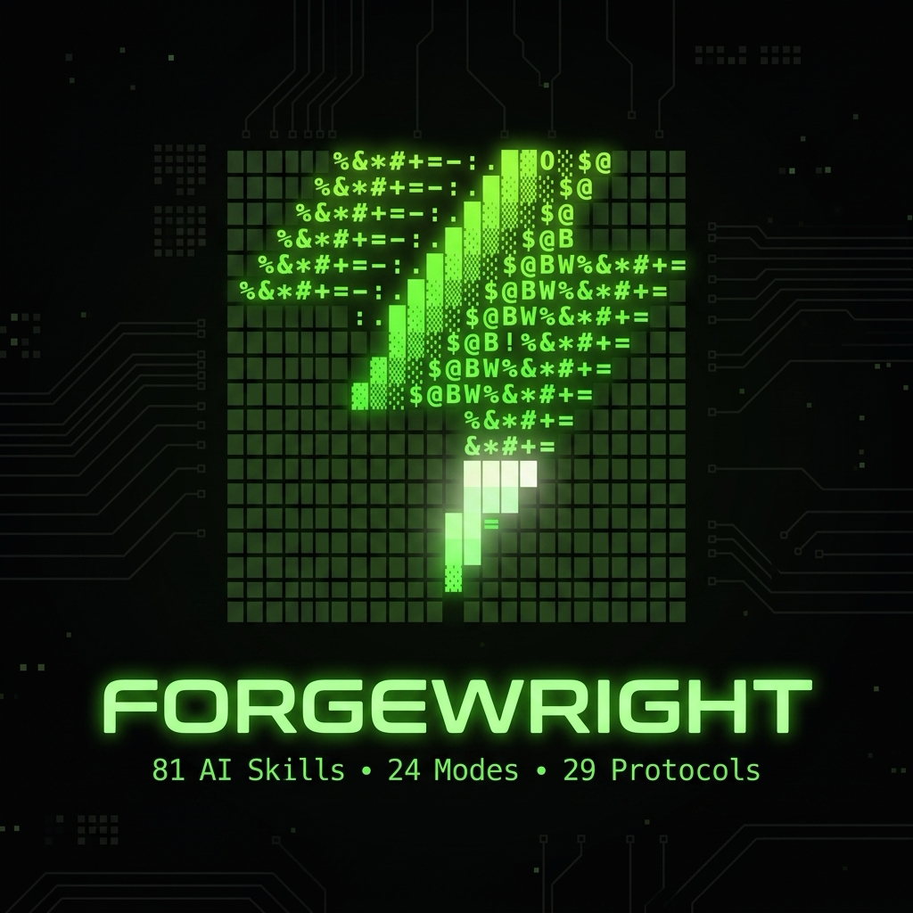
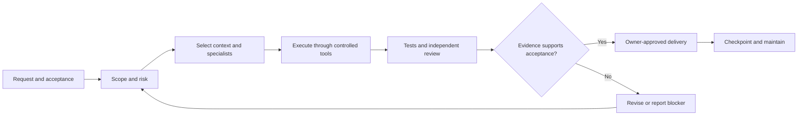

<!-- markdownlint-disable MD013 MD033 -->
# Forgewright

<p align="center">
  
</p>

<p align="center">
  <strong>From a prompt to an engineering workflow you can inspect, verify, and control.</strong>
</p>

<p align="center">
  
  
  
  
</p>

<p align="center">
  <a href="#quick-start">Quick start</a> ·
  <a href="#what-you-can-build">Use cases</a> ·
  <a href="#whats-new">What's new</a> ·
  <a href="#verification">Verification</a> ·
  <a href="README.vi.md">Tiếng Việt</a>
</p>

**Forgewright is a local-first engineering harness for AI-assisted software delivery.** It brings task definition, specialist workflows, code intelligence, tool controls, verification, and project continuity into one repository. Use it with the model runtime and tools you configure—not a mandatory hosted service or a second model subscription.

## Why Forgewright

| Engineering problem | What Forgewright adds |
| --- | --- |
| The agent writes code before understanding the task | A goal, explicit acceptance criteria, risk assessment, and the minimum safe scope. |
| Every specialist reads the entire conversation | Compact routing, on-demand skill overlays, bounded task context, and artifact references. |
| Parallel workers overwrite one another | Dependency-aware dispatch, explicit ownership, and isolated worktrees where configured. |
| “Done” means the model says it is done | Project-owned checks and schema-v2 evidence tied to the command, acceptance criteria, and exact worktree. |
| A stopped task leaves effects or processes behind | Owned process leases, cancellation, lifecycle accounting, and honest cleanup status. |
| The next session forgets decisions | Project-scoped checkpoints and canonical documentation; retrieved memory remains context, not authority. |

**84 skills. 24 operating modes. One delivery pipeline.** The [product manifest](product-manifest.json) and [capability inventory](docs/capability-maturity.json) keep those claims tied to the repository rather than marketing copy.

## What you can build

**Web products and internal tools.** Shape a brief, define architecture and acceptance, coordinate implementation and review, and retain the decisions needed for maintenance. The [Product Factory source](mcp/src/product-factory/) includes intent, environment-adapter, outcome-verification, and release contracts.

**Games and mobile projects.** Coordinate systems design, engineering, art direction, QA, performance work, and release evidence. The [Game Studio workflow](workflows/game-studio-build.md) covers concept through release; Unity, Android, and web environment adapters have local tests. Each target still needs its own build tools, devices, and production evidence.

**Existing codebases.** Investigate bugs, assess refactor impact, generate tests, review security-sensitive changes, and keep documentation aligned with the code. Start with a bounded task; parallel execution is an option, not a requirement.

### A practical request

```text
Add save/continue to this game.

Preserve the current gameplay and existing tests.
Define acceptance for resume, corrupt saves, and duplicate rewards.
Inspect affected systems before editing.
Implement the smallest safe change, run the checks, and report:
  changed files · observed results · remaining risks · rollback
Do not publish or deploy without approval.
```

This is an example input, not a fabricated execution transcript. Actual results depend on the connected runtime, project, tools, and checks.

## How it works

`INTERPRET → DEFINE → BUILD → HARDEN → SHIP → SUSTAIN`


```mermaid
flowchart LR
    A[Request and acceptance] --> B[Scope and risk]
    B --> C[Select context and specialists]
    C --> D[Execute through controlled tools]
    D --> E[Tests and independent review]
    E --> F{Evidence supports acceptance?}
    F -->|Yes| G[Owner-approved delivery]
    F -->|No| H[Revise or report blocker]
    H --> B
    G --> I[Checkpoint and maintain]
```

Clear local work stays small. Security, billing, concurrency, public contracts, and release changes require stronger checks. A worker's successful generation is not product acceptance, and stopping a retry loop never turns an unverified result into a verified one.

The [pipeline reference](docs/pipeline-reference.md) describes orchestration; the [canonical runtime ADR](docs/adr/0001-canonical-production-runtime.md) documents the implemented enforcement boundaries.

## Evidence loop: observation, context and learning

The ECC-inspired upgrade adds project-isolated, opt-in observation, bounded supplemental worker context, native candidate intake, and source-bound handoff. It does not install a second agent stack, start a paid learning model or automatically promote frequent tool sequences.

```sh
# Verify shipped observer code and source consistency.
npm run check:observer

# Run actual local game/web/app reference workloads and negative controls.
npm run bench:ecc

# Verify the ECC integration, native intake, regression and paired-comparison gates.
npm run verify:ecc

# Maintained research and handoff entrypoints.
python3 scripts/runtime/research_decision.py --help
python3 scripts/runtime/resumable_handoff.py --help
```

The native MCP `fw_record_learning_candidate` tool requires a parent-owned task descriptor, matching project/task/plan/tree, schema-v2 evidence and a terminal ledger. It writes an **unapproved proposal** without changing the active registry. Its stdio tests retain containment, policy, quality and output-sandbox controls. Independent review, replay, non-regression and rollback gates still apply.

Worker context has a parent-owned three-round/64 KiB budget. Missing required context blocks execution, and stale context cannot authorize changed source. Local scenario reports are **test-only**, with no inferred model savings or product outcomes. See [architecture and activation boundaries](docs/architecture.md#evidence-gated-learning-and-worker-context-protocols) and the [Instinct System contract](skills/instinct-system/SKILL.md).

## Quick start

### 1. Install Forgewright as a plugin (recommended)

Forgewright now ships one provider-neutral plugin source for **Codex** and **Claude Code**. It installs the entry workflow and specialist skills without requiring a second model subscription.

**Codex CLI**

```bash
codex plugin marketplace add buiphucminhtam/forgewright --ref main
codex plugin add forgewright@forgewright-marketplace
```

**Claude Code**

```bash
claude plugin marketplace add buiphucminhtam/forgewright
claude plugin install forgewright@forgewright-marketplace --scope user
```

Start a fresh session after installation and ask for normal engineering work; trigger-only skill descriptions let the host discover the relevant skill on demand. The entry skill is an orchestration alias, so the canonical specialist inventory remains **84 skills**.

The plugin is **skills-first and consent-gated**. Its bounded `PreToolUse` hook is inert until the user enables a global bootstrap policy; installation alone does not mutate projects or start local MCP/Pi/runtime setup.

Verify both installers in isolated profiles:

```bash
npm run verify:plugins
```

### 2. Build the full local toolchain (advanced)

Use **Node.js 22+**, **Python 3.11+**, and Git. The optional Pi package requires **Node.js 22.19+**. Clone the repository when you need Forge CLI, Docs Hub, MCP, local gates, or framework development:

```bash
git clone https://github.com/buiphucminhtam/forgewright.git
cd forgewright
npm run ci:bootstrap
npm run build
npm run build:cli
node src/cli/dist/index.js --help
```

`ci:bootstrap` installs checked-in verification dependencies and configures this clone's Git hooks. It does not enable Pi, start production services, or require hosted CI. Model calls use the provider/account you explicitly configure.

Auto-bootstrap needs explicit policy consent and host hook trust. Start with `automation` mode and an explicit `--allow-root`, with Pi disabled and no MCP clients selected. Eligible descendants are included. Review the [auto-bootstrap guide](docs/guides/auto-bootstrap.md) before enabling it. Installation, trust and a completed hook event do not prove readiness. Check the actual bootstrap receipt and index after a native prompt. Earlier isolated macOS acceptance does not certify a later source or installed-cache update.

You can inspect/onboard a local project without a model call:

```bash
node src/cli/dist/index.js --json init /path/to/your-project
node src/cli/dist/index.js --json onboard /path/to/your-project
```

### 3. Pin the full framework inside a project (advanced)

For a repository-pinned runtime and local MCP setup, keep the Git-submodule workflow:

```bash
git submodule add -b main https://github.com/buiphucminhtam/forgewright.git forgewright
git submodule update --init --recursive
bash forgewright/scripts/forgewright-mcp-setup.sh
```

Review generated configuration before adoption. A project submodule is still useful when the project must pin exact framework source, but global-policy auto-bootstrap does not require one.

## What's new

### Game fixture and bounded memory

**Local source candidate, not yet published.** Marketplace installation does not include unpublished checkout changes.

[Signal Dash](tests/game/fixtures/threejs-lifecycle/README.md) is a playable Three.js reference with seeded fixed stepping, keyboard/touch controls, win/loss, pause and restart. Its checks compile the affected skill examples, exercise real browser input and record screenshots with a build hash. Run the fixture's build and tests, then `npm --prefix tests/game/fixtures/threejs-lifecycle run serve` to play locally.

MCP result caching accounts for bytes, with a 512 KiB entry limit, 2 MiB per project and 8 MiB shared within one MCP process. Idle entries expire after five minutes. These bounds do not cap process RSS or remove source data. The [game test guide](tests/game/README.md) separates executable fixtures from engine templates, and the [Unity setup guide](docs/unity-mcp-setup.md) uses the project-matched Unity Test Framework. Unity execution and physical mobile performance still need their own evidence.

### Plugin distribution + behavioral skill quality

Codex and Claude share one plugin source and one `skills/` tree. Harness manifests reference that tree, avoiding copied skill packs.

Skill changes are checked against observable behavior:

| Upgrade | What it changes |
| --- | --- |
| Skill Quality Engine | Compares **baseline → current → candidate**, blocking regressions and forbidden behavior. |
| Trigger-only metadata | Boot descriptions say when to load a skill. Its body owns execution details. |
| Minimal worker packets | Digest-bound `PLAN_LOCKED` packets carry task scope, acceptance, constraints and verifier references. |
| Scoped review packages | Reviews bind exact `BASE..HEAD` and an explicit task or release scope. |
| Plan-scoped runtime state | State binds goal, plan and base SHA. Failed runs retain diagnostic evidence. |
| Failure classification | Distinguishes hypothesis, implementation, environment and architecture faults. Two failed attempts require a new approach. |

The engine itself is deterministic and provider-neutral. A real model benchmark remains separate evidence; Forgewright does not claim universal quality, token, or latency gains from the framework change alone.

### Optional Pi execution, under Forgewright control

The [Pi integration](integrations/pi/) adds an isolated worker option without replacing Hermes, the current dispatcher, or Forgewright's ownership of goals and acceptance.

| Upgrade | Behavior |
| --- | --- |
| Pinned SDK | An independent lockfile pins `@earendil-works/pi-agent-core@0.85.1`; root installation does not install the optional package. |
| Canonical host bridge | Uses the existing model/tool gateways, containment, lifecycle coordinator, and trajectory ledger. `start()` returns a session; `wait()` owns settlement. |
| Explicit authority | Host-owned model, account, policy, tool registry, approvals, and scope; task text cannot grant permission. |
| Account-level budgets | One billing-account cap spans multiple workspaces. Never-dispatched reservations are released; uncertain invoked calls retain escrow. |
| Cancellation and deadlines | Late success cannot reopen a closed attempt. Cancellation also releases undispatched reservations when a binding callback hangs. |
| Bounded context and receipts | Preserve acceptance and current bindings; missing native usage or price remains unavailable, not zero. |
| Evaluation and rollback controls | Paired-report comparison plus default-off, single-active-worker canary admission, kill switch, and quarantine. |

**Status: experimental, explicitly opt-in.** The public `delegate` CLI runs a Pi worker from the parent project using an existing authorized Codex/Pi subscription or an explicit loopback model server. Approved tasks name allowed files, compare-and-swap patches and immutable verifiers. There is no new paid API fallback.

```bash
npm --prefix integrations/pi ci --ignore-scripts --no-audit --no-fund
npm run build
npm run build:cli
npm --prefix integrations/pi run test:all
```

After building the CLI and MCP above, run from the **parent project**, not inside its submodule:

```bash
node forgewright/src/cli/dist/index.js delegate on --worker pi --provider openai-codex --auth-source codex --model <exact-codex-model-id>
node forgewright/src/cli/dist/index.js delegate status --worker pi
node forgewright/src/cli/dist/index.js delegate run --worker pi --contract task.json
node forgewright/src/cli/dist/index.js delegate resources
# node forgewright/src/cli/dist/index.js delegate cancel <run-id>
```

Settings live in the parent's `.production-grade.yaml`, preserving unrelated settings. Prefer the explicit provider/model above. `current` only accepts compatible unprefixed Codex selections. `CODEX_HOME` is respected, subscription access is read-only, and expired authorization returns `pi_auth_required`. Existing quota still applies.

Verifier isolation currently requires macOS and a single-process command. Fork/spawn, network and source writes are denied. Unsupported platforms and unmanaged legacy Agy execution fail closed. `ready` means prerequisites, not successful execution. The [Pi ADR](docs/adr/ADR-pi-worker-runtime.md) owns setup, cancellation, lifecycle and measurement contracts.

### Leaner context and clearer project state

System-1 routing now uses bounded English/Vietnamese rules and optional exact caching, then abstains when the intent is ambiguous. It does not import or call Jev, require `TYPESAFE_API_KEY`, download a classifier, or spend an extra model call. It takes Jev's bounded-choice approach without claiming to run the Jev model. Progressive skill loading and compact execution summaries keep unrelated context out of the worker.

A shared per-user SQLite authority limits governed clients to two workers and one heavy verifier, or one worker on hosts with at most 8 GiB RAM. Admission considers OS pressure, load, known reservations, headroom and observed swap activity. On macOS, immediate pages and estimated reclaimable cache remain separate. Free pages alone do not measure available capacity.

Default estimates of **192 MiB per Pi worker** and **128 MiB per single-process verifier** are scheduling budgets, not RSS caps or generic build measurements. The broker exits after 15 idle seconds, and cleanup is limited to owned resources. User apps and unsaved sessions stay outside automatic reclamation. Whole-build savings and temperature reduction remain unverified.

The **Docs Hub** builds a searchable local HTML control center from approved Markdown/JSON. Project structure, roadmap, blockers, and Mermaid-derived flow views come from canonical sources—not another manually maintained dashboard.

```bash
node src/cli/dist/index.js docs build .
node src/cli/dist/index.js docs doctor . --strict
```

Open `.forgewright/docs-hub/site/index.html`. See the [Docs Hub guide](docs/guides/docs-hub.md) for multi-project registration, privacy allowlists, and Obsidian export.

## Core Capabilities

The maturity labels below follow the [capability inventory](docs/capability-maturity.json): **beta** means automated local evidence, **experimental** means incomplete production evidence, and **docs-only** means a documented integration or workflow—not a supported production runtime claim.

<details>
<summary><strong>Explore all 14 capability areas</strong></summary>

### 1. Code Intelligence (GitNexus)

**Docs-only integration.** Relationship navigation and impact analysis remain limited by stale indexes and dynamic code, and compatibility paths and user overrides are not universally enforced. [Guide](docs/guides/gitnexus.md).

### 2. Autonomous Testing Stack

**Beta.** Local checks, controlled mutations and acceptance-bound evidence with requirement-locked oracles. [Guide](docs/guides/testing-stack.md).

### 3. Persistent Cognitive Memory (FluxMem)

**Experimental.** Optional project retrieval. Current evidence outranks memory, which grants no authority. [Architecture](docs/architecture.md).

### 4. Parallel Skill Dispatch

**Experimental.** Owned lanes for independent tasks. Coupled work stays serial. [Pipeline](docs/pipeline-reference.md).

### 5. Multi-Project Hub

**Docs-only management integration.** Docs Hub separately implements local registration and static project views. [Guide](docs/guides/docs-hub.md).

### 6. Token Tracking & Cost Analytics

**Beta.** Reported usage, reservations and benchmarks distinguish measurements from estimates. [ForgeBench](src/cli/src/bench/).

### 7. MCP Tool Sandbox

**Beta application controls.** Admission, policy, containment and output bounds do not provide OS isolation. [Contract](docs/adr/0001-canonical-production-runtime.md).

### 8. The Adaptive Self-Improving Protocol (ASIP)

**Experimental legacy workflow.** Lessons need review before promotion. Repeated failures require new evidence or escalation. [Kernel](AGENTS.md).

### 9. Runtime Lifecycle Guard

**Beta.** Owned process leases, service reuse and cleanup accounting. No reclamation of unowned processes. [ADR](docs/adr/ADR-010-runtime-lifecycle-guard.md).

### 10. Game Studio Control Plane

**Beta optional pack.** Game production handoffs with project-specific builds, playtests and release evidence. [Workflow](workflows/game-studio-build.md).

### 11. Token Efficiency Engine & System-1 Routing (Jev Integration)

**Experimental.** Bounded local EN/VI routing with abstention. No default Jev model, download or cloud routing call. [Protocol](skills/_shared/protocols/tool-efficiency.md).

### 12. Optional Pi Worker Pilot

**Experimental, opt-in.** Scoped coding workers, immutable verifiers, cancellation and shared admission. No production or paired-savings claim. [ADR](docs/adr/ADR-pi-worker-runtime.md).

### 13. Codex & Claude Plugin Distribution

**Beta.** Shared source, lazy discovery, isolated install checks and consent-gated bootstrap. [ADR](docs/adr/ADR-agent-plugin-distribution.md).

### 14. Behavioral Skill Quality Engine

**Experimental.** Deterministic behavioral scenarios and promotion gates. Fixture results do not establish real-model gains. [Skill evals](evals/skills/README.md).

</details>

## Verification

Forgewright's evidence is executable locally. Hosted CI can mirror it, but is not required.

The local game/resource upgrade has observed aggregate-gate and desktop Chromium passes on recorded snapshots. **End-to-end upgrade acceptance remains open** pending fresh final-tree HARD verification and native bootstrap/index/receipt proof. Installed cache is a separate state from live activation. Consult [canonical project status](docs/project-state.json) and current runtime receipts. Earlier passes do not certify later edits, cloud execution, Unity or physical mobile performance.

```bash
# Core checks
npm run lint
npm run build
npm test
npm run typecheck:cli
npm run build:cli

# Documentation and declared roadmap contracts
npm run ci:docs
npm run verify:product-truth
npm run verify:roadmap
npm run verify:plugins

# Complete project-owned local pipeline
npm run ci:local
```

Run optional Pi tests separately with the commands above; they include contract checks, real-SDK runtime checks, and owner-gated workflows in separate Node processes. `python3 scripts/ci/verify-readme.py` checks both front pages and runs the documented init/onboard commands in a disposable project without a model call. The [roadmap completion manifest](docs/roadmap-completion.json) separates **implementation, integration, activation, production evidence, and measured outcome**. A passing unit suite, a signed commit, and an accepted product outcome are different things.

### Trust boundaries

The core is provider-neutral; execution stays within the selected provider's configured ecosystem. Local-first does not mean all data stays on-device: a remote model may receive prompts, selected code, and tool results. Use an appropriate local runtime when that is required.

Tool containment is application-level, not a kernel sandbox. Trusted host callbacks retain host privileges. Hash-bound evidence detects mismatches; it does not authenticate against a same-user attacker. Production Pi activation, live adaptive routing, and arbitrary autonomous process execution require their separate gates. See [security guidance](SECURITY.md) and the [active roadmap](docs/active-roadmap.md).

## Documentation

| Start here | Purpose |
| --- | --- |
| [Product overview](docs/product-overview.md) | Scope, delivery model, and product direction. |
| [Architecture](docs/architecture.md) / [pipeline reference](docs/pipeline-reference.md) | Components, ownership, and execution flow. |
| [Quickstart details](docs/guides/forge-init-onboard.md) | Deterministic initialization and onboarding. |
| [Docs Hub](docs/guides/docs-hub.md) | Source-backed local documentation and project views. |
| [Visual grounding](skills/_shared/protocols/visual-grounding.md) | Design direction based on inspected references and evidence. |
| [Game Studio](workflows/game-studio-build.md) | Game-production phases and handoff requirements. |
| [Pi integration](docs/adr/ADR-pi-worker-runtime.md) | Optional worker architecture, limits, and rollout gates. |
| [Capability inventory](docs/capability-maturity.json) / [active roadmap](docs/active-roadmap.md) | What exists, its maturity, and what remains open. |
| [Changelog](CHANGELOG.md) | Maintained change history. |

## Contributing and support

Bring a concrete problem, a bounded change, and the checks that demonstrate it. Preserve existing behavioral tests; include a failing reproduction for a fix, update the canonical documentation, and run the local gates before opening a pull request. Do not commit generated runtime evidence, credentials, or personal workspace state.

Use [GitHub issues](https://github.com/buiphucminhtam/forgewright/issues) for reproducible bugs and proposals. Security reports follow [SECURITY.md](SECURITY.md). Package-specific licensing is declared in the relevant package metadata, including [the CLI's MIT declaration](src/cli/package.json); review those declarations and upstream dependency licenses before redistribution.

**Build with more leverage. Ship with evidence.**
