# Forgewright — AI Orchestrator Tự Học và Tự Sửa Sai

> **This is the Vietnamese version.** For English documentation, see [README.md](./README.md)

<p align="center">
  <a href="https://opensource.org/licenses/MIT"></a>
  
  
  
  
  
  
  
  
</p>

---

## TL;DR — Forgewright là gì?

**Tưởng tượng:** Bạn có một đội ngũ 81 chuyên gia AI. Mỗi người giỏi một việc khác nhau — viết code, kiểm tra bảo mật, thiết kế game, tối ưu tốc độ. Forgewright là "người quản lý" — khi bạn nói "tôi muốn build một app bán hàng", nó tự biết cần gọi chuyên gia nào, theo thứ tự nào, và kiểm tra chất lượng ra sao.

> **Một câu:** Forgewright tự động chọn đúng chuyên gia AI cho đúng việc, từ ý tưởng đến sản phẩm.

### Ví dụ cụ thể

```
Bạn nói:  "Build cho tôi một website bán áo thun"

    ↓

Forgewright tự động làm:
    1. Phân tích thị trường (Business Analyst)
    2. Lên kế hoạch tính năng (Product Manager)
    3. Thiết kế kiến trúc database & API (Solution Architect)
    4. Viết code backend + frontend (Software Engineer)
    5. Viết unit test (QA Engineer)
    6. Kiểm tra bảo mật (Security Engineer)
    7. Deploy lên server (DevOps)
    8. Monitor & tối ưu (SRE)

    ↓

Kết quả: Website production-ready, đã review, đã test, score 0-100
```

---

## 🖥️ ForgeWright Console — Giao diện Desktop Chuyên nghiệp (Premium GUI)

Bạn muốn theo dõi trực quan luồng hoạt động của agent theo thời gian thực? Hãy trải nghiệm **[ForgeWright Console](https://feedmycode.com/)** — phiên bản giao diện Desktop cao cấp (GUI) chạy cục bộ, được thiết kế để kết hợp hoàn hảo với CLI mã nguồn mở.

<p align="center">
  <a href="https://feedmycode.com/">
    
  </a>
</p>

*   **Bảng điều khiển trực quan (Visual Dashboard)**: Theo dõi sơ đồ tiến trình và luồng chạy thực tế của hơn 56 kỹ năng AI theo thời gian thực thay vì phải đọc log JSON thô từ terminal.
*   **Trình khám phá SQLite cục bộ**: Dễ dàng truy vấn, lọc và kiểm tra (audit) các quyết định trước đó của agent, các khoảng trống yêu cầu (requirements gaps) và sơ đồ kiến trúc.
*   **Cấu hình một chạm**: Chỉnh sửa các biến môi trường workspace, chế độ cô lập dự án MCP (Multi-project Isolation) và cấu hình tools thông qua giao diện trực quan và sạch sẽ.
*   **Chạy tác vụ nền**: Vận hành các pipeline chạy tự động dài ngày một cách mượt mà dưới nền với các thông báo hệ thống (OS notifications) tích hợp.

👉 Tìm hiểu thêm và mua bản quyền trọn đời chỉ với $25 tại **[feedmycode.com](https://feedmycode.com/)**.

---

## Harness Engineering: Biến LLM Thô Thành Lập Trình Viên Đáng Tin Cậy

Trong kỹ nghệ AI hiện đại, một mô hình ngôn ngữ lớn (LLM) thô chỉ đóng vai trò 20% trong một agent hoàn chỉnh. 80% còn lại thuộc về **Harness (Khung vận hành)** — hệ thống điều phối execution pipeline, các rào cản an toàn (safety guardrails), bộ nhớ (cognitive memory), và các lớp kiểm thử tự động điều khiển cách AI hoạt động.

<p align="center">
  <strong>Agent = Model (Claude/GPT) + Forgewright Harness</strong>
</p>

Forgewright đóng vai trò là một Harness phân phối phần mềm chuẩn production dành cho các AI coding agent:

*   **Middleware Chain (14 giai đoạn)**: Bọc ngoài mỗi lượt thực thi skill bằng các công cụ kiểm soát an toàn, môi trường sandbox cô lập, nén ngữ cảnh và cổng kiểm định chất lượng (Quality Gates).
*   **Vòng lặp ASIP tự sửa đổi**: Tự động phát hiện lỗi lên plan/thực thi code, kích hoạt nghiên cứu tài liệu chuyên sâu và tự cập nhật quy trình làm việc (SOPs).
*   **Đồ thị nhận thức SQLite (FluxMem)**: Đảm bảo cô lập ngữ cảnh cho từng dự án riêng biệt và bộ nhớ đệm phục hồi quy trình dưới một giây (Procedural Circuits).
*   **Hệ thống phòng vệ chủ động**: Tự động quét lỗ hổng bảo mật, tích hợp kiểm thử CI/CD và bảo vệ các thư mục nhạy cảm, ngăn các ảo giác của AI đưa lỗ hổng bảo mật vào dự án.
*   **Quy trình kiểm thử Hybrid BDD-First**: Tự động phân loại độ phức tạp của tác vụ dựa trên số liệu của GitNexus. Bắt buộc thực hiện theo luồng BDD/TDD-first (`BA (BDD) -> QA (Stubs) -> Build -> Test`) cho các tác vụ phức tạp, và cho phép kiểm thử sau (test-after) đối với các hotfix rủi ro thấp.

---

### 4 cấp độ "sức mạnh" — chọn cái phù hợp với bạn


---

## Cách bắt đầu — 3 bước dễ nhất

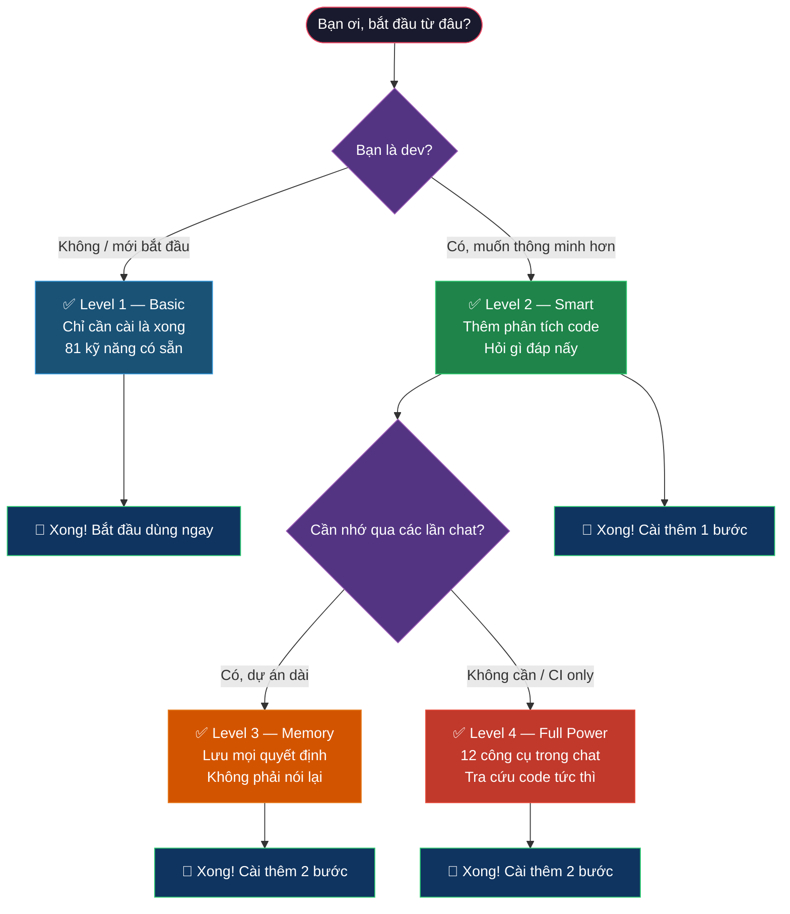

### Cài đặt nhanh (không cần biết bash)

#### Nếu bạn dùng Cursor / VS Code

1. Mở Cursor hoặc VS Code
2. Điền câu hỏi hoặc yêu cầu của bạn
3. **Xong!** Không cần cài gì thêm — Level 1 đã hoạt động

#### Nếu bạn muốn thông minh hơn (Level 2+)

Mở **Terminal** (hoặc Command Prompt) và chạy:

```bash
# Kiểm tra Node.js
node --version

# Nếu thấy số (vd: v20.x.x) → đã đủ điều kiện
# Nếu báo "command not found" → cài Node.js trước
#   macOS: brew install node
#   Windows: tải từ nodejs.org
```

---

## The Flow — Forgewright làm việc thế nào?

> Tất cả sơ đồ dưới đây hiển thị tốt trên GitHub, GitLab, và mọi trình xem mermaid.
> Nếu không thấy hình — đảm bảo trình xem dùng **mermaid 10+**.

### Tổng quan — Ai làm gì

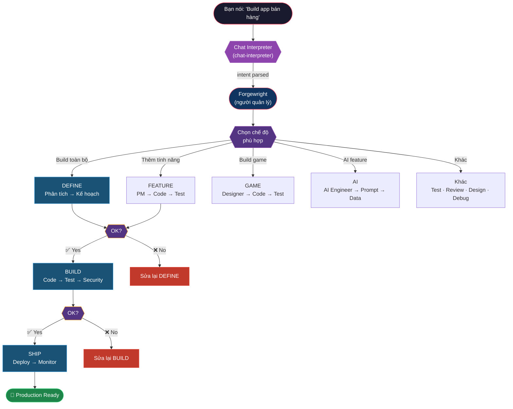

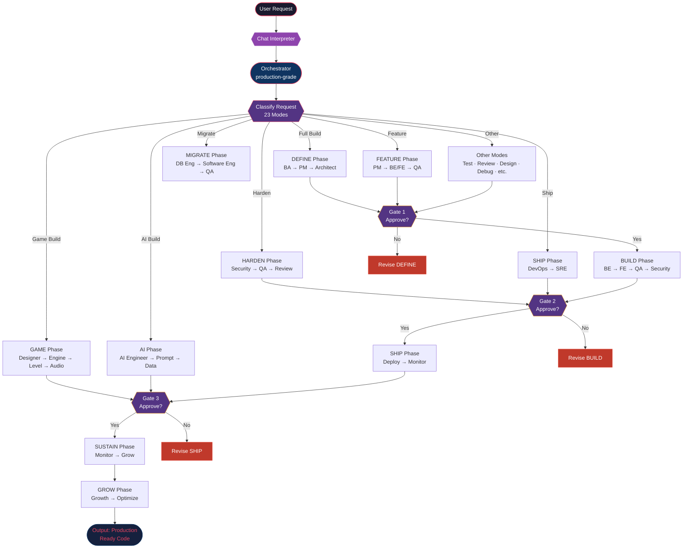

### Middleware Chain (mỗi lần chạy skill)

```mermaid
flowchart TD
    REQ(["User Request"])
    PRE1["① SessionData<br/>Load profile + session state"]
    PRE2["② ContextLoader<br/>Memory + conventions + KIs"]
    PRE3b["③b DryRunContext<br/>System Prompt mock injection"]
    PRE3["③ SkillRegistry<br/>Progressive skill discovery"]
    PRE4["④ Guardrail<br/>Pre-tool authorization"]
    PRE5["⑤ Summarization<br/>Auto-compress context if >70%"]
    SKILL_EXEC["SKILL EXECUTION<br/>Engineer → QA → Security → ..."]
    POST1["⑥ QualityGate<br/>4-level validation 0-100"]
    POST2["⑦ BrownfieldSafety<br/>Regression + change manifest"]
    POST3["⑧ TaskTracking<br/>Update task.md"]
    POST4["⑨ Memory<br/>Async fact extraction"]
    POST5["⑩ GracefulFailure<br/>Stuck detection + retry limits"]
    POST6["⑪ ASIP<br/>Canonical self-improving loop"]
    POST7["⑫ CircuitBreaker<br/>Fault isolation + states"]
    POST8["⑬ Bulkhead<br/>Resource limits per worker"]
    POST9["⑭ Verification<br/>Evidence-First Verification"]
    RESULT(["Result / Next Skill"])

    REQ --> PRE1 --> PRE2 --> PRE3b --> PRE3 --> PRE4 --> PRE5 --> SKILL_EXEC
    SKILL_EXEC --> POST1 --> POST2 --> POST3 --> POST4 --> POST5 --> POST6 --> POST7 --> POST8 --> POST9 --> RESULT

    style REQ fill:#1a1a2e,stroke:#e94560,color:#fff
    style RESULT fill:#16213e,stroke:#0f3460,color:#e94560
    style SKILL_EXEC fill:#0f3460,stroke:#e94560,color:#fff
    style PRE1 fill:#1a5276,stroke:#3498db,color:#fff
    style PRE2 fill:#1a5276,stroke:#3498db,color:#fff
    style PRE3b fill:#1a5276,stroke:#3498db,color:#fff
    style PRE3 fill:#1a5276,stroke:#3498db,color:#fff
    style PRE4 fill:#1a5276,stroke:#3498db,color:#fff
    style PRE5 fill:#1a5276,stroke:#3498db,color:#fff
    style POST1 fill:#1e8449,stroke:#2ecc71,color:#fff
    style POST2 fill:#1e8449,stroke:#2ecc71,color:#fff
    style POST3 fill:#1e8449,stroke:#2ecc71,color:#fff
    style POST4 fill:#1e8449,stroke:#2ecc71,color:#fff
    style POST5 fill:#1e8449,stroke:#2ecc71,color:#fff
    style POST6 fill:#1e8449,stroke:#2ecc71,color:#fff
    style POST7 fill:#1e8449,stroke:#2ecc71,color:#fff
    style POST8 fill:#1e8449,stroke:#2ecc71,color:#fff
    style POST9 fill:#1e8449,stroke:#2ecc71,color:#fff
```

### Session Lifecycle (Turn-Start + Turn-Close)

```mermaid
sequenceDiagram
    autonumber
    participant User
    participant Orch as Orchestrator
    participant Mem as Memory mem0
    participant Forge as ForgeNexus
    participant Skill as Skills

    User->>Orch: New Session Start

    Orch->>Orch: Step 0.5: Load .forgewright/ context
    Orch->>Orch: Step 1: Load project-profile.json
    Orch->>Orch: Step 2: Load session-log.json
    Orch->>Orch: Step 3: mem0 search + code-conventions
    Orch->>Forge: Step 3.5: Check index freshness
    Orch->>Orch: Step 4: Detect greenfield vs brownfield

    rect rgb(20, 30, 60)
        Note over Orch,Skill: FOR EACH REQUEST (within session)

        User->>Orch: Request

        rect rgb(30, 50, 80)
            Note over Orch: TURN-START
            Orch->>Mem: T1: Load CONVERSATION_SUMMARY.md
            Orch->>Mem: T2: mem0 search recent turns + session
            Orch->>Mem: T3: Load BA scope + pipeline context
        end

        Orch->>Skill: Route to skills via Plan Quality Loop
        Skill-->>Orch: Skill output

        rect rgb(20, 60, 40)
            Note over Orch: TURN-CLOSE (mandatory)
            Orch->>Mem: TC1: Auto-generate CONVERSATION_SUMMARY.md
            Orch->>Mem: TC2: mem0 add REQ/DONE/OPEN/SCOPE_UPDATE
            Orch->>Mem: TC3: Optional: decisions/architecture/blockers
        end

        Orch-->>User: Response
    end

    User->>Orch: Session End
```

### Game Build Pipeline (18 kỹ năng game)

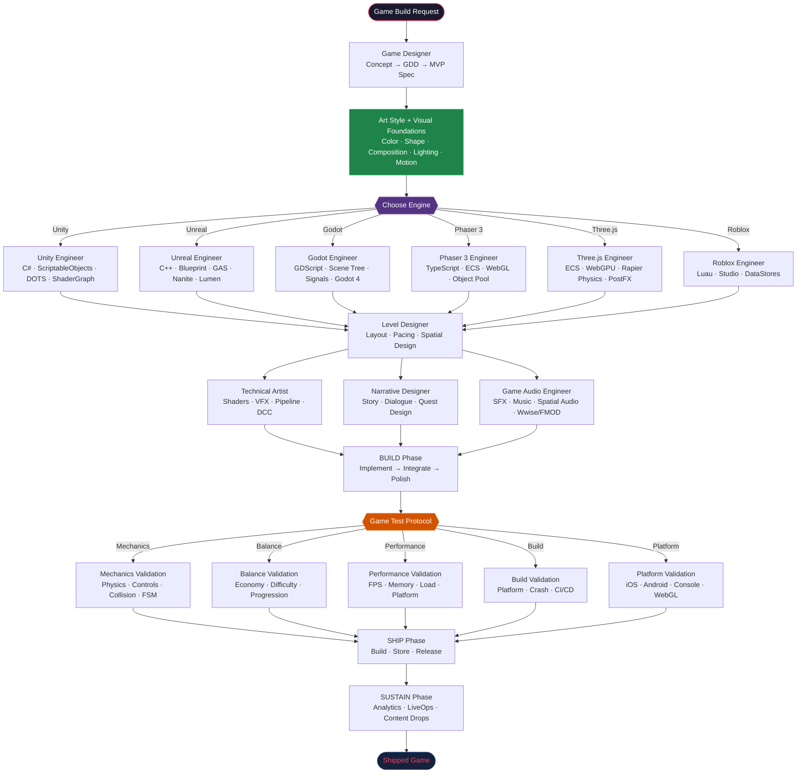

### Full Build Pipeline (6 Phase + 3 Cổng kiểm tra)

```mermaid
flowchart LR
    START(["User Request"])

    START --> DEFINE["DEFINE Phase<br/>Business Analyst<br/>Product Manager<br/>Solution Architect"]

    DEFINE --> GATE1{{"Gate 1<br/>Plan Approved?"}}
    GATE1 --> |"No"| REV1["Revise DEFINE"]
    GATE1 --> |"Yes"| BUILD["BUILD Phase<br/>Backend Engineer<br/>Frontend Engineer<br/>QA Engineer<br/>Security Engineer"]

    BUILD --> GATE2{{"Gate 2<br/>Code Approved?"}}
    GATE2 --> |"No"| REV2["Revise BUILD"]
    GATE2 --> |"Yes"| HARDEN["HARDEN Phase<br/>Security Engineer<br/>QA Engineer<br/>Code Reviewer<br/>Accessibility Engineer"]

    HARDEN --> SHIP["SHIP Phase<br/>DevOps<br/>SRE<br/>Database Engineer<br/>Performance Engineer"]

    SHIP --> GATE3{{"Gate 3<br/>Deploy Approved?"}}
    GATE3 --> |"No"| REV3["Revise SHIP"]
    GATE3 --> |"Yes"| SUSTAIN["SUSTAIN Phase<br/>Monitor<br/>Test · Review<br/>Document"]

    SUSTAIN --> GROW["GROW Phase<br/>Growth Marketer<br/>Conversion Optimizer<br/>AI Engineer"]

    GROW --> END(["Production Ready"])

    style START fill:#1a1a2e,stroke:#e94560,color:#fff
    style END fill:#16213e,stroke:#0f3460,color:#e94560
    style GATE1 fill:#533483,stroke:#f39c12,color:#fff
    style GATE2 fill:#533483,stroke:#f39c12,color:#fff
    style GATE3 fill:#533483,stroke:#f39c12,color:#fff
    style REV1 fill:#c0392b,stroke:#e74c3c,color:#fff
    style REV2 fill:#c0392b,stroke:#e74c3c,color:#fff
    style REV3 fill:#c0392b,stroke:#e74c3c,color:#fff
    style DEFINE fill:#0f3460,stroke:#3498db,color:#fff
    style BUILD fill:#0f3460,stroke:#3498db,color:#fff
    style HARDEN fill:#0f3460,stroke:#3498db,color:#fff
    style SHIP fill:#0f3460,stroke:#3498db,color:#fff
    style SUSTAIN fill:#0f3460,stroke:#3498db,color:#fff
    style GROW fill:#0f3460,stroke:#3498db,color:#fff
```

### NotebookLM Research Workflow (Research Mode — v0.5.19)

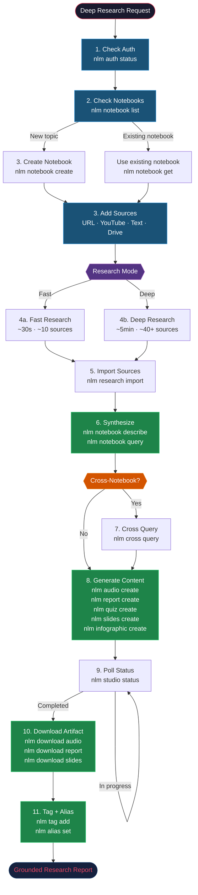

### GitNexus Analyze Pipeline (phân tích code)

```mermaid
flowchart LR
    ANAME["gitnexus analyze"]

    subgraph SCAN["① Scanner"]
        S1["glob file discovery"]
        S2["language detection"]
        S3[".gitignore filter"]
    end

    subgraph PARSE["② Parse — tree-sitter AST"]
        P1["Worker Pool<br/>cpus-1 threads<br/>20MB budget/worker"]
        P2["Graceful fallback<br/>sequential if <15 files"]
        P3["17 Edge Types extracted"]
    end

    subgraph RESOLVE["③ Resolve"]
        R1["Suffix Trie O(1)<br/>import path resolution"]
        R2["Fast-path<br/>skip if <3% gaps"]
    end

    subgraph PROP["④ Propagate"]
        PP1["Kahn topological sort"]
        PP2["Cross-file binding"]
    end

    subgraph COMMUNITY["⑤ Community — Leiden Algorithm"]
        C1["3-phase:<br/>move → refine → aggregate"]
        C2["60s timeout · large-graph mode"]
    end

    subgraph PROCESS["⑥ Process — BFS Entry-Point Tracing"]
        PR1["Call chain extraction"]
        PR2["Auto-detect framework:<br/>Next.js · FastAPI · NestJS<br/>Express · Django · Rails<br/>Gin · Spring · etc."]
    end

    subgraph FTS_EMB["⑦ FTS + Embeddings"]
        F1["Incremental FTS5<br/>only changed nodes"]
        E1["Cache-first embedding<br/>5 providers"]
    end

    subgraph META["⑧ Meta"]
        M1["Commit tracking"]
        M2["Early exit<br/>if git unchanged"]
    end

    DB[(<b>KuzuDB Graph<br/>Nodes + Rels + FTS<br/>Vector Embeddings</b>)]

    ANAME --> SCAN --> PARSE --> RESOLVE --> PROP --> COMMUNITY --> PROCESS --> FTS_EMB --> META
    FTS_EMB --> DB
    PARSE --> DB
    PROP --> DB

    style ANAME fill:#0f3460,stroke:#e94560,color:#fff
    style DB fill:#16213e,stroke:#4B0082,color:#fff
    style SCAN fill:#1a5276,stroke:#3498db
    style PARSE fill:#1a5276,stroke:#3498db
    style RESOLVE fill:#6c3483,stroke:#9b59b6
    style PROP fill:#6c3483,stroke:#9b59b6
    style COMMUNITY fill:#1e8449,stroke:#2ecc71
    style PROCESS fill:#1e8449,stroke:#2ecc71
    style FTS_EMB fill:#d35400,stroke:#e67e22
    style META fill:#2c3e50,stroke:#7f8c8d
```

### Multi-Repo Group Management (quản lý nhóm multi-repo)

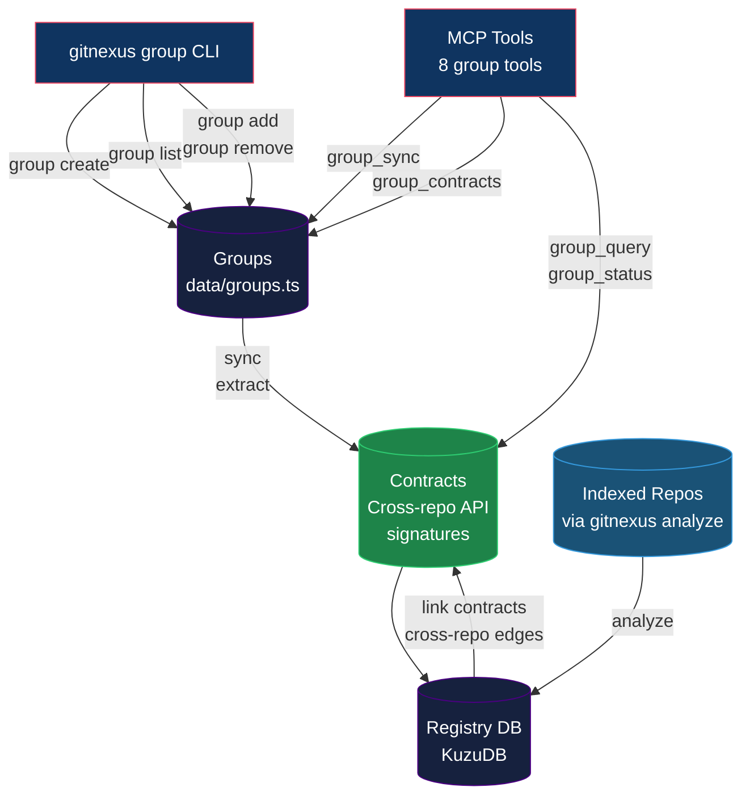

### ForgeNexus Enterprise — GitHub Actions

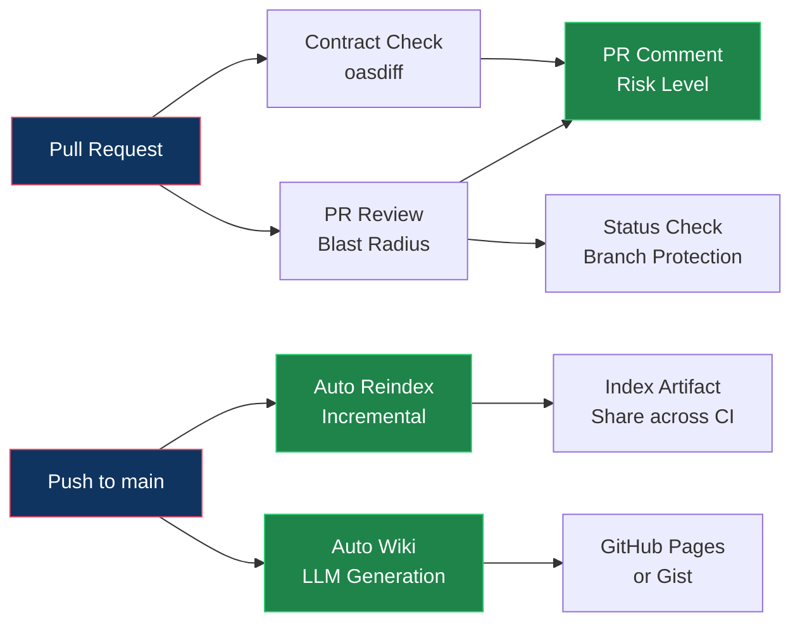

#### Cài đặt nhanh — PR Review cho repo của bạn

#### Lệnh CLI (Enterprise)

| Lệnh | Mô tả |
|-------|--------|
| `pr-review <base> [head]` | Phân tích blast radius của PR |
| `impact <symbol>` | Phân tích ảnh hưởng của symbol |
| `group contracts <group>` | Xem tất cả contracts trong group |
| `group status <group>` | Kiểm tra staleness của tất cả repos |
| `group query <group> <term>` | Tìm kiếm xuyên suốt các repos |

#### Tính năng Enterprise

| Tính năng | CLI | GitHub Actions | Dry Run |
|------------|-----|---------------|---------|
| PR Review Blast Radius | ✅ | ✅ | ✅ |
| Kiểm tra contract OpenAPI (oasdiff) | N/A | ✅ | ✅ |
| Tạo Wiki tự động | ✅ | ✅ | ✅ |
| Auto Reindex (tăng dần/đầy đủ) | ✅ | ✅ | ✅ |
| Quản lý Multi-Repo Groups | ✅ | ✅ | ✅ |
| Phân tích ảnh hưởng xuyên repos | N/A | ✅ | ✅ |

**Độ hoàn thiện: 100%** — Tất cả tính năng đều hỗ trợ dry-run mode.

### Claude Code Hooks — Auto-Reindex

```mermaid
flowchart TD
    HOOK_PRE[("pre-tool-use hook<br/>Enrich context")]
    HOOK_POST[("post-tool-use hook<br/>Auto-reindex")]

    subgraph PRE_HOOK["pre-tool-use.ts"]
        T1{"tool name?"}
        T_GREP["grep / search<br/>ForgeNexus search<br/>→ show callers"]
        T_READ["read file<br/>→ show file symbols"]
        T_EDIT["edit / Write<br/>→ warn about callers"]
        T_SKIP["Other tools<br/>→ skip"]
    end

    subgraph POST_HOOK["post-tool-use.ts"]
        G1{"git commit<br/>detected?"}
        G2["Find gitnexus root<br/>detect last commit"]
        G3["Spawn incremental<br/>gitnexus analyze"]
        G4["Success → log<br/>Failure → warn"]
    end

    HOOK_PRE --> PRE_HOOK
    PRE_HOOK --> T1
    T1 --> |"grep/search"| T_GREP
    T1 --> |"read"| T_READ
    T1 --> |"edit/Write"| T_EDIT
    T1 --> |"other"| T_SKIP

    HOOK_POST --> POST_HOOK
    POST_HOOK --> G1
    G1 --> |"yes"| G2 --> G3 --> G4
    G1 --> |"no"| G_SKIP["(no action)"]

    style HOOK_PRE fill:#6c3483,stroke:#9b59b6,color:#fff
    style HOOK_POST fill:#6c3483,stroke:#9b59b6,color:#fff
    style PRE_HOOK fill:#1a1a2e,stroke:#9b59b6
    style POST_HOOK fill:#1a1a2e,stroke:#9b59b6
    style T_GREP fill:#1e8449,stroke:#2ecc71,color:#fff
    style T_READ fill:#1e8449,stroke:#2ecc71,color:#fff
    style T_EDIT fill:#d35400,stroke:#e67e22,color:#fff
    style G3 fill:#d35400,stroke:#e67e22,color:#fff
```

### 23 Modes — Bạn nói gì, Forgewright chọn cái đó

```mermaid
flowchart LR
    INPUT["Bạn nói..."]

    INPUT --> F1["Build SaaS<br/>Production Grade"]
    INPUT --> F2["Thêm tính năng"]
    INPUT --> F3["Build Game<br/>Unity/Unreal/Godot/Roblox"]
    INPUT --> F4["Build VR/AR"]
    INPUT --> F5["Build Mobile<br/>iOS/Android"]
    INPUT --> F6["AI Feature<br/>RAG/LLM/Chatbot"]
    INPUT --> F7["Review Code<br/>Kiểm tra chất lượng"]
    INPUT --> F8["Viết Tests"]
    INPUT --> F9["Deploy CI/CD<br/>Docker/Terraform"]
    INPUT --> F10["Design UI<br/>UX Research"]
    INPUT --> F11["Optimize<br/>Performance"]
    INPUT --> F12["Research sâu"]
    INPUT --> F13["Marketing"]
    INPUT --> F14["Debug Fix<br/>Bug Trace"]
    INPUT --> F15["Analyze<br/>Requirements"]
    INPUT --> F16["Migrate DB"]
    INPUT --> F17["Harden Security<br/>Audit + Fix"]
    INPUT --> F18["Design Architecture<br/>API/Data Model"]
    INPUT --> F19["Write Docs<br/>Tài liệu"]
    INPUT --> F20["Improve Prompts<br/>Prompt Engineering"]

    F1 --> M1{{"Full Build"}}
    F2 --> M2{{"Feature"}}
    F3 --> M3{{"Game Build"}}
    F4 --> M4{{"XR Build"}}
    F5 --> M5{{"Mobile"}}
    F6 --> M6{{"AI Build"}}
    F7 --> M7{{"Review"}}
    F8 --> M8{{"Test"}}
    F9 --> M9{{"Ship"}}
    F10 --> M10{{"Design"}}
    F11 --> M11{{"Optimize"}}
    F12 --> M12{{"Research"}}
    F13 --> M13{{"Marketing"}}
    F14 --> M14{{"Debug"}}
    F15 --> M15{{"Analyze"}}
    F16 --> M16{{"Migrate"}}
    F17 --> M17{{"Harden"}}
    F18 --> M18{{"Architect"}}
    F19 --> M19{{"Document"}}
    F20 --> M20{{"Prompt"}}

    M1 --> SK1["BA → PM → Architect →<br/>BE → FE → QA →<br/>Security → DevOps → SRE"]
    M2 --> SK2["PM → Architect →<br/>BE/FE → QA"]
    M3 --> SK3["Game Designer →<br/>Engine Engineer →<br/>Level → Narrative →<br/>Technical Art → Audio"]
    M4 --> SK4["XR Engineer →<br/>XR Game Pipeline"]
    M5 --> SK5["BA → Mobile Engineer →<br/>PM → Architect"]
    M6 --> SK6["AI Engineer →<br/>Prompt Engineer →<br/>Data Scientist"]
    M7 --> SK7["Code Reviewer"]
    M8 --> SK8["QA Engineer"]
    M9 --> SK9["DevOps → SRE"]
    M10 --> SK10["UX Researcher →<br/>UI Designer"]
    M11 --> SK11["Performance Engineer →<br/>SRE"]
    M12 --> SK12["NotebookLM Researcher\n(+ Polymath web search)"]
    M13 --> SK13["Growth Marketer →<br/>Conversion Optimizer"]
    M14 --> SK14["Debugger →<br/>Engineer"]
    M15 --> SK15["Business Analyst"]
    M16 --> SK16["Database Engineer →<br/>Software Eng → QA"]
    M17 --> SK17["Security → QA →<br/>Code Review → Fix"]
    M18 --> SK18["Solution Architect"]
    M19 --> SK19["Technical Writer"]
    M20 --> SK20["Prompt Engineer →<br/>chat-interpreter →<br/>prompt-techniques → templates"]

    style INPUT fill:#1a1a2e,stroke:#e94560,color:#fff
    style M1 fill:#533483,stroke:#9b59b6,color:#fff
    style M2 fill:#533483,stroke:#9b59b6,color:#fff
    style M3 fill:#533483,stroke:#9b59b6,color:#fff
    style M4 fill:#533483,stroke:#9b59b6,color:#fff
    style M5 fill:#533483,stroke:#9b59b6,color:#fff
    style M6 fill:#533483,stroke:#9b59b6,color:#fff
    style M7 fill:#533483,stroke:#9b59b6,color:#fff
    style M8 fill:#533483,stroke:#9b59b6,color:#fff
    style M9 fill:#533483,stroke:#9b59b6,color:#fff
    style M10 fill:#533483,stroke:#9b59b6,color:#fff
    style M11 fill:#533483,stroke:#9b59b6,color:#fff
    style M12 fill:#533483,stroke:#9b59b6,color:#fff
    style M13 fill:#533483,stroke:#9b59b6,color:#fff
    style M14 fill:#533483,stroke:#9b59b6,color:#fff
    style M15 fill:#533483,stroke:#9b59b6,color:#fff
    style M16 fill:#533483,stroke:#9b59b6,color:#fff
    style M17 fill:#533483,stroke:#9b59b6,color:#fff
    style M18 fill:#533483,stroke:#9b59b6,color:#fff
    style M19 fill:#533483,stroke:#9b59b6,color:#fff
    style M20 fill:#8e44ad,stroke:#9b59b6,color:#fff
    style SK1 fill:#0f3460,stroke:#3498db,color:#fff
    style SK2 fill:#0f3460,stroke:#3498db,color:#fff
    style SK3 fill:#0f3460,stroke:#3498db,color:#fff
    style SK4 fill:#0f3460,stroke:#3498db,color:#fff
    style SK5 fill:#0f3460,stroke:#3498db,color:#fff
    style SK6 fill:#0f3460,stroke:#3498db,color:#fff
    style SK7 fill:#0f3460,stroke:#3498db,color:#fff
    style SK8 fill:#0f3460,stroke:#3498db,color:#fff
    style SK9 fill:#0f3460,stroke:#3498db,color:#fff
    style SK10 fill:#0f3460,stroke:#3498db,color:#fff
    style SK11 fill:#0f3460,stroke:#3498db,color:#fff
    style SK12 fill:#0f3460,stroke:#3498db,color:#fff
    style SK13 fill:#0f3460,stroke:#3498db,color:#fff
    style SK14 fill:#0f3460,stroke:#3498db,color:#fff
    style SK15 fill:#0f3460,stroke:#3498db,color:#fff
    style SK16 fill:#0f3460,stroke:#3498db,color:#fff
    style SK17 fill:#0f3460,stroke:#3498db,color:#fff
    style SK18 fill:#0f3460,stroke:#3498db,color:#fff
    style SK19 fill:#0f3460,stroke:#3498db,color:#fff
    style SK20 fill:#8e44ad,stroke:#3498db,color:#fff
```

---

## 81 Skills — Dùng cái nào, khi nào?

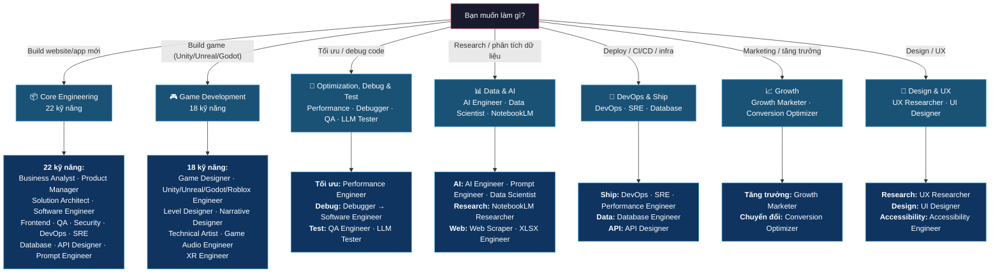

---

## Cài đặt chi tiết

### Cách 1: Thêm vào dự án khác như submodule

**Bước 1:** Mở Terminal, chạy từ thư mục gốc dự án của bạn:

```bash
git submodule add -b main https://github.com/buiphucminhtam/forgewright.git forgewright
```

**Bước 2:** Copy 2 file cần thiết:

```bash
cp forgewright/AGENTS.md .
cp forgewright/CLAUDE.md .
```

**Bước 3:** Commit:

```bash
git add .gitmodules forgewright AGENTS.md CLAUDE.md
git commit -m "feat: add forgewright"
```

**Bước 4:** Khởi tạo submodule:

```bash
git submodule update --init --recursive
```

### Cách 2: Nâng cấp lên Level 2 (Smart)

Cần: **Node.js 18+**

```bash
# Kiểm tra
node --version

# Nếu chưa có → tải tại nodejs.org
# macOS: brew install node
```

Sau đó:

```bash
npm install -g gitnexus && gitnexus analyze "$(pwd)"
```

Đợi 1-2 phút (lần đầu). Xong!

### Cách 3: Thêm bộ nhớ (Level 3)

Cần: **Python 3.8+**

```bash
# Kiểm tra
python3 --version
```

Sau đó:

```bash
bash forgewright/scripts/ensure-mem0.sh "$(pwd)"
```

### Cách 4: Cài MCP server (Level 4)

Chạy 1 lệnh:

```bash
bash forgewright/scripts/forgewright-mcp-setup.sh
```

Sau đó khởi động lại Cursor/VS Code.

### Bước 5: Chạy Onboarding lần đầu tiên (Khuyến nghị)

Sau khi cài đặt xong và khởi động lại IDE (Cursor / Claude), việc đầu tiên bạn nên làm là mở khung chat AI và ra lệnh:

> Chạy `/onboard` để phân tích và khởi tạo thông tin dự án.

Lệnh này giúp Forgewright:
1. Tự động nhận diện ngôn ngữ & framework của dự án để tạo file cấu hình `.forgewright/project-profile.json`.
2. Kiểm tra sức khỏe hệ thống (các công cụ dev có sẵn).
3. Thiết lập bộ nhớ cơ sở (local memory baseline) cho dự án mới này.

### Kiểm tra đã cài đúng chưa

```bash
echo "=== Kiểm tra ==="
echo "Skills: $(ls forgewright/skills/ -1 2>/dev/null | wc -l | tr -d ' ')"
echo "MCP: $([ -d forgewright/.forgewright/mcp-server ] || [ -d ~/.forgewright/mcp-server ] && echo 'OK' || echo 'MISSING')"
echo "Memory: $([ -f .forgewright/memory.db ] || [ -f .forgewright/memory.jsonl ] && echo 'OK' || echo 'MISSING')"
```

---

## Tính năng bổ sung

### Bộ nhớ GraphRAG V4 — FluxMem (SQLite Brain)

> **Mới trong v8.7.0** — Thay thế bộ nhớ lưu bằng file JSON bằng cấu trúc đồ thị nhận thức lớp 2 (Layer 2 Cognitive Graph) chạy trên SQLite (`flux_nodes` & `flux_edges`).

Vấn đề lớn nhất của các phiên chat AI dài là **context bloat (phình to ngữ cảnh)** — AI sẽ quên mất phần đầu của cuộc trò chuyện do file memory quá lớn, dẫn tới việc lặp lại các lỗi cũ.

**FluxMem (Memory V4)** giải quyết vấn đề này bằng mô hình bộ nhớ lai Đồ thị - Vector (Hybrid Graph-Vector):

1. **Đồ thị nhận thức SQLite (`flux_nodes` & `flux_edges`)**: Toàn bộ các mốc sự kiện (episodic checkpoints), quyết định (semantic decisions), và kỹ năng (procedural skills) được lưu dưới dạng các Node/Edge trong SQLite database. Giúp tăng tốc truy vấn qua các liên kết (SQL JOINs), chống hỏng dữ liệu và xử lý ghi/đọc đồng thời.
2. **Procedural Circuits (Mạch quy trình)**: Lưu trữ các luồng thực thi thành công của agent (completed session tasks) vào bảng `procedural_circuits` đi kèm điểm số PES (Performance Evaluation Score), cho phép tái sử dụng quy trình chạy chỉ trong mili-giây (sub-second recovery).
3. **Cơ chế Edge Decay (Giảm liên kết) của ASIP**: Khi điểm số của plan dưới 9.0 hoặc gặp lỗi thực thi (execution blocker), ASIP tự động giảm trọng số liên kết của các node liên quan đi **0.5**, giúp AI học cách tránh đi vào các vết xe đổ.
4. **Cơ chế Edge Reinforcement & Lesson Ingestion (Tăng cường & Tiếp thu bài học)**: Khi chạy thành công, trọng số liên kết được tăng thêm hệ số **1.2**. Đồng thời, các bài học học được từ NotebookLM sẽ tự động lưu dưới dạng Node ngữ nghĩa (`semantic`) và kết nối trực tiếp đến kỹ năng tương ứng (`edge_type: improves`, trọng số `1.5`).
5. **Passive Idle Trigger (Tự động lưu checkpoint khi treo máy)**: Tự động tạo checkpoint sau **10 phút** không có phản hồi nếu phiên chat đang có tin nhắn chưa lưu, tránh mất dữ liệu khi IDE mất kết nối đột ngột.

---

## Featured: MCP Tool Sandbox & Context Offload (DeerFlow IV)

Để chống phình to ngữ cảnh (context bloat) và tối ưu hóa token trong các phiên chat dài, Forgewright tích hợp bộ đôi middleware trung gian trực tiếp trong luồng thực thi công cụ MCP (chạy tại giai đoạn ④c và ④d):

1. **Tool Sandbox (Middleware ④c)**: Tự động chặn và kiểm duyệt mọi kết quả trả về của công cụ, loại bỏ mã màu ANSI, ngăn chặn tấn công Prompt Injection, và tự động ẩn/redact các thông tin nhạy cảm (như API keys, bearer tokens, chuỗi kết nối database PostgreSQL/MongoDB/MySQL) trước khi đưa vào cache hoặc ngữ cảnh của mô hình.
2. **Context Offload (Middleware ④d)**: Tự động đẩy các kết quả chạy công cụ có kích thước lớn hơn ngữ cảnh quy định (mặc định: 1200 tokens) ra ngoài ngữ cảnh lưu dưới dạng các file Markdown cục bộ tại `.forgewright/offload/<session_id>/refs/<node_id>.md`.
   - Ngữ cảnh mô hình chỉ nhận được một **mã tham chiếu truy vết (trace handle)** ngắn (ví dụ: `refs/n-X-tool-hash.md`) kèm theo bản tóm tắt cực kỳ ngắn gọn của kết quả.
   - Tiết kiệm lên tới 90% số lượng token trong ngữ cảnh.
   - Tự động duy trì và vẽ lại đồ thị luồng thực thi của phiên làm việc (`canvas.mmd` định dạng Mermaid) với các màu sắc biểu thị trạng thái trực quan (`queued`, `running`, `done`, `error`, `skipped`).

### Truy vết và Hợp nhất bộ nhớ Offload

Hai script mới được thêm vào để quản lý và vận hành hệ thống bộ nhớ này:

*   **Truy vết ngữ cảnh (`scripts/memory-trace.py`)**: Hỗ trợ tìm kiếm, kiểm tra và truy xuất nội dung offload trực tiếp từ terminal:
    ```bash
    # Liệt kê tất cả các sự kiện gọi công cụ trong một session
    python3 scripts/memory-trace.py trace-session <session_id>

    # Xem nội dung chi tiết và preview của một node kết quả cụ thể
    python3 scripts/memory-trace.py trace-node <node_id> --session <session_id>

    # In sơ đồ Mermaid thể hiện luồng chạy công cụ của session
    python3 scripts/memory-trace.py trace-canvas <session_id>
    ```
*   **Hợp nhất bộ nhớ (`scripts/memory-consolidate.py`)**: Hợp nhất các quan sát ghi nhận trong SQLite, log hoàn thành phiên làm việc và các sự kiện offload thành các lớp thông tin có cấu trúc của memory bank:
    ```bash
    # Chạy hợp nhất bộ nhớ cục bộ
    python3 scripts/memory-consolidate.py
    ```
    Kết quả đầu ra:
    - `.forgewright/memory-bank/persona.md`: Lưu trữ các cài đặt mặc định và sở thích ổn định của lập trình viên.
    - `.forgewright/memory-bank/scenarios/<scenario_id>.md`: Ghi nhận các mẫu giải quyết vấn đề và quy trình thành công từ các phiên làm việc đã hoàn thành.

---

### Research — NotebookLM CLI (v0.5.19)


> **AI nghiên cứu không sai.** Dùng Google NotebookLM để đọc tài liệu, tạo tóm tắt, quiz, flashcards, podcast, báo cáo, slide, và hơn thế nữa.

```bash
# Install (uv recommended)
pipx install notebooklm-mcp-cli

# Authenticate (launches browser, extracts cookies automatically)
nlm login

# Check status
nlm auth status        # Shows "Authenticated" with notebook count
nlm notebook list      # List all notebooks
nlm --ai              # Full AI-optimized documentation
```

**35+ tools:** notebook, source, research, studio, audio, video, report, quiz, flashcards, mindmap, slides, infographic, data-table, batch, cross-notebook, pipelines, tags, drive-sync, sharing, aliases.

### Web Scraping (crawl4ai)

```bash
pip install "crawl4ai>=0.8.0"
# Then: "Scrape [URL]" or "Crawl [website]"
```

### AI Vision Testing (Midscene.js)

```bash
npm install -g @anthropic-ai/midscene
# Then: "Test on Android" or "Test on iOS"
```

### Multi-Agent (Paperclip)

```bash
npx paperclipai onboard --yes
cd paperclip && pnpm dev
# Dashboard: http://localhost:3100
```

### Tích hợp LLM Wiki & Obsidian

Forgewright tích hợp với [nashsu/llm_wiki](https://github.com/nashsu/llm_wiki) và Obsidian để quản lý và trực quan hóa tài liệu của tất cả các dự án trong một **Shared Obsidian Vault** tập trung.

* **Không trùng lặp dung lượng (Symlink-based):** Tài liệu của mỗi dự án con được liên kết trực tiếp vào Vault bằng liên kết mềm (Symlink), đảm bảo cập nhật thời gian thực mà không làm tăng dung lượng đĩa.
* **Tự động hóa 2 lớp:**
  - **Post-Skill Hook:** AI tự động chạy đồng bộ khi đóng phiên làm việc (Session End).
  - **Git Hook (post-commit):** Tự động đồng bộ mỗi khi bạn commit thay đổi liên quan đến tài liệu (`docs/`, `README.md`, `TASKS.md`...).
* **Obsidian Graph View:** Trực quan hóa mối liên hệ kiến trúc, sơ đồ luồng dữ liệu APIs giữa các dự án.

Các lệnh thực thi:
```bash
# Đồng bộ dự án hiện tại vào Vault chung
./scripts/forgewright-wiki-sync.sh

# Quét và đồng bộ hàng loạt tất cả dự án trong thư mục GitHub
./scripts/forgewright-wiki-sync-all.sh
```

### Chuẩn hóa cấu trúc tài liệu dự án

Để duy trì tính nhất quán và tối ưu hóa việc truy xuất ngữ cảnh cho AI Agent (giảm thiểu ảo giác), các dự án Forgewright áp dụng cấu trúc thư mục tài liệu chuẩn hóa trong thư mục `docs/`:

*   **Cấu trúc thư mục**: Phân lớp rõ ràng sử dụng tiền tố số (ví dụ: `00-vision/` cho lộ trình phát triển, `01-product/` cho yêu cầu nghiệp vụ, `02-architecture/` cho thiết kế kiến trúc và ADR, `03-guides/` cho hướng dẫn lập trình viên, `04-testing/` cho QA test case, và `05-operations/` cho tài liệu vận hành).
*   **Quy tắc đặt tên file**: Chỉ sử dụng chữ viết thường và định dạng `kebab-case` (ví dụ: `api-specification.md`). Không sử dụng khoảng trắng hay tiếng Việt có dấu.
*   **Bản mẫu thiết lập sẵn**:
    *   [TEMPLATE-FEATURE-SPEC.md](docs/01-product/TEMPLATE-FEATURE-SPEC.md): Mẫu đặc tả tính năng và tiêu chí nghiệm thu chuẩn.
    *   [TEMPLATE-ADR.md](docs/02-architecture/adrs/TEMPLATE-ADR.md): Mẫu nhật ký quyết định kiến trúc (ADR) chuẩn.

---

## Quality Gate — Chấm điểm tự động

Chạy bất kỳ lúc nào để chấm điểm dự án 0-100:

```bash
bash scripts/forge-validate.sh

# Chế độ CI (chỉ exit code)
bash scripts/forge-validate.sh --quiet

# Báo cáo JSON
bash scripts/forge-validate.sh --json
```

| Điểm | Grade | Ý nghĩa |
|-------|-------|---------|
| 90–100 | A | Sẵn sàng production |
| 80–89 | B | Có vài lỗi nhỏ |
| 70–79 | C | Nên review |
| 60–69 | D | Sửa trước khi deploy |
| < 60 | F | Không chấp nhận được — chặn deploy |

---

## Bộ Công Cụ Kiểm Thử & Quản Lý Chất Lượng Chuẩn Enterprise

Forgewright hỗ trợ hạ tầng kiểm thử mã nguồn mở hoàn toàn miễn phí, chạy offline cục bộ, giúp loại bỏ hoàn toàn chi phí bản quyền SaaS bên thứ ba và đảm bảo chất lượng phần mềm không lọt lỗi (zero-escaped bugs):

*   **Property-Based Testing (PBT)**: Tích hợp thư viện `fast-check` (JS/TS) và `Hypothesis` (Python) giúp tự động sinh hàng ngàn bộ dữ liệu ngẫu nhiên, dị biệt để dò tìm các lỗi biên, lỗi logic cực đoan của thuật toán trước khi release.
*   **Mutation Testing (Kiểm thử đột biến)**: Tích hợp `Stryker` (JS/TS) và `mutmut` (Python) để tự động tiêm lỗi giả lập ("mutants") vào code logic, đánh giá độ tin cậy thực tế và chất lượng của bộ test case hiện có.
*   **Shift-Left Spec Gate & DoD**: Thiết lập chốt chặn chất lượng từ khâu Specs (quy trình ký duyệt ba bên PM + Dev Lead + QA Lead) kết hợp với Git Hooks (Husky + lint-staged) cục bộ và CI pipeline chạy song song cực nhanh, thực thi nghiêm ngặt tiêu chí Definition of Done (DoD).
*   **Visual Regression (VRT)**: Sử dụng trình so sánh ảnh gốc của Playwright kết hợp `pixelmatch` tại local hoặc chạy trong Docker container chính thức trên CI (nhằm đồng bộ font/giao diện render).
*   **Performance & Load**: Tích hợp k6 CLI đẩy số liệu thời gian thực trực tiếp về hệ thống cơ sở dữ liệu InfluxDB và trực quan hóa qua Grafana cục bộ (dựng qua Docker Compose).
*   **Mobile E2E**: Chạy Appium, Midscene.js tương tác bằng AI, và **Maestro (Chạy Local Miễn Phí)** trực tiếp trên máy ảo Android Emulator cục bộ (tạo qua [scripts/setup-local-emulators.sh](file:///Users/buiphucminhtam/GitHub/forgewright/scripts/setup-local-emulators.sh)) hoặc iOS Simulator.

---

## 🖼️ Tự động vẽ sơ đồ Sequence Flow Chart Client-Server (NEW v8.8.0)

Forgewright tích hợp tính năng **Tự động vẽ và cập nhật Sequence Flow Chart** liên thông hoàn hảo giữa Client và Server sử dụng dữ liệu đồ thị tĩnh từ GitNexus và định tuyến Heuristics.

*   **Không tốn phí & Không cần chạy App**: Tự động khớp nối các lượt gọi API ở Client (`fetch`/`axios` trong file React/Next.js) sang API handler tương ứng ở Server (`route.ts`) mà không cần khởi chạy ứng dụng hay kết nối cơ sở dữ liệu.
*   **Truy vết sâu đồ thị cuộc gọi (Call Graph)**: Tự động chạy truy vấn đệ quy qua đồ thị GitNexus để vẽ chi tiết luồng gọi (`Route -> Service -> Database/Prisma`).
*   **Sinh sơ đồ Mermaid chuyên nghiệp**: Xuất kết quả sơ đồ trình tự chuẩn Mermaid.js và cập nhật tự động vào thư mục [docs/architecture/flows/](file:///Users/buiphucminhtam/GitHub/forgewright/docs/architecture/flows/).
*   **Lọc nhiễu thông minh & Tách tham số**: Tự động loại bỏ các hàm hệ thống/logs nhiễu (`console.log`, `execSync`, `NextResponse.json`...) để giữ sơ đồ sạch, đồng thời tách các Query Parameters truyền lên ở client và vẽ ghi chú (Mermaid Note) chi tiết.

**Cách sử dụng trong các dự án khác (Submodules):**

Để chạy và đồng bộ sơ đồ trình tự cho bất kỳ dự án nào tích hợp Forgewright dưới dạng submodule:

#### Bước 1: Cập nhật Submodule Forgewright mới nhất
Tại thư mục root của dự án đó, chạy lệnh sau để kéo mã nguồn script mới nhất về:
```bash
git submodule update --remote --merge
```

#### Bước 2: Đảm bảo GitNexus đã được lập chỉ mục (Indexing)
Sequence Generator yêu cầu dữ liệu đồ thị từ GitNexus. Nếu chưa có hoặc index cũ, hãy chạy:
```bash
# 1. Cài đặt toàn cục (nếu chưa cài)
npm install -g gitnexus && gitnexus setup

# 2. Tạo chỉ mục đồ thị cho repo mới
gitnexus analyze
```

#### Bước 3: Khởi chạy vẽ sơ đồ trình tự
Chạy script sinh sơ đồ thông qua các tham số cấu hình đường dẫn linh hoạt (CLI Arguments) của dự án đó:
```bash
npx tsx forgewright/scripts/generate-sequence.ts \
  --client <thư-mục-chứa-frontend> \
  --api <thư-mục-chứa-routes-api> \
  --repo <tên-repo-trong-gitnexus> \
  --output <thư-mục-lưu-sơ-đồ>
```

*Ví dụ thực tế:*
Nếu dự án mới có Client tại `apps/web/src`, API routes tại `apps/web/src/pages/api`, tên repo là `my-saas-app`, và muốn lưu sơ đồ vào `docs/flows/`:
```bash
npx tsx forgewright/scripts/generate-sequence.ts \
  --client apps/web/src \
  --api apps/web/src/pages/api \
  --repo my-saas-app \
  --output docs/flows
```
*(Nếu bỏ qua các tham số này, script sẽ tự động tìm kiếm các thư mục mặc định thông dụng như `src/`, `src/app/api/` hoặc `multica-hub/src`).*

---

#### 🚀 Cách ép quy luật tự động hóa (Automation)

1.  **Tự động cập nhật khi commit**: Forgewright tích hợp sẵn pre-commit hook (`.husky/pre-commit`). Khi phát hiện có thay đổi ở các file logic core (`.ts`, `.py`, `.js` trong `src/`, `mcp/` hoặc `scripts/` ngoại trừ test), hook này sẽ tự động chạy phân tích GitNexus và sinh lại sơ đồ Sequence Flow:
    ```bash
    gitnexus analyze
    npx tsx scripts/generate-sequence.ts
    ```
2.  **Ràng buộc Agent AI**: Dự án bắt buộc tự động cập nhật GitNexus & Sơ đồ Sequence thông qua các quy tắc (Rules) thiết lập trong file `CLAUDE.md` và `AGENTS.md`.
3.  **Tự động kiểm tra và cập nhật Submodule Forgewright**: Đối với các dự án sử dụng Forgewright dưới dạng submodule, bạn có thể tích hợp việc kiểm tra và cập nhật tự động bằng cách thêm dòng sau vào file hook (ví dụ `.husky/pre-commit` hoặc `.husky/post-merge`) của dự án cha:
    ```bash
    bash forgewright/scripts/forgewright-submodule-check.sh --pull
    ```
    Script này sẽ tự động kết nối và đối chiếu mã nguồn của submodule với GitHub. Nếu có bản cập nhật mới, nó sẽ tự động chạy lệnh `git submodule update --remote --merge` để kéo code mới về, đồng thời tự động rebuild và refresh lại MCP Global.


---

## Xử lý sự cố thường gặp

| Vấn đề | Cách xử lý |
|---------|------------|
| `gitnexus: command not found` | Chạy `npm install -g gitnexus && gitnexus setup` |
| `npm install` bị lỗi trong submodule | Kiểm tra `node --version` (cần 18+) |
| Không thấy MCP tools | Khởi động lại Cursor/VS Code sau khi đổi config |
| Index cũ | Chạy `gitnexus analyze "$(pwd)"` để cập nhật |
| Submodule chưa khởi tạo | `git submodule update --init --recursive` |
| `realpath` không tìm thấy (macOS) | `brew install coreutils` |
| `python3` không tìm thấy | Cài Python 3.8+ cho tính năng memory |
| Windows: `bash` không tìm thấy | Dùng lệnh PowerShell tương đương |
| Sơ đồ mermaid không hiển thị | Đảm bảo trình xem dùng **mermaid 10+**. GitHub/GitLab đã hỗ trợ. |
| Lỗi `better-sqlite3` sau merge | Chạy `cd forgenexus && npm install` để cài `kuzu` thay thế |

---

## Lệnh tắt (Shortcuts)

| Lệnh | Tác dụng |
|------|-----------|
| `/setup` | Cài đặt lần đầu như git submodule |
| `/update` | Kiểm tra & cài cập nhật mới (an toàn, giữ thay đổi) |
| `/pipeline` | Xem toàn bộ pipeline, modes, và danh sách skills |
| `/onboard` | Phân tích sâu dự án — tạo `.forgewright/project-profile.json` |
| `/mcp` | Tạo hoặc tạo lại MCP server config |
| `/setup-mobile-test` | Cài đặt mobile testing cho Android/iOS |
| `/setup-auto-publish` | Cài đặt tự động publish iOS/Android (EAS & Fastlane) |

---

## Đóng góp

1. Fork repo
2. Tạo nhánh: `git checkout -b feature/your-feature`
3. Commit theo [Conventional Commits](https://www.conventionalcommits.org/): `feat(skill): add new capability`
4. Mở Pull Request

**Thêm skill mới:** Tạo file `skills/your-skill-name/SKILL.md`. Xem skill có sẵn làm ví dụ.

---

## License

MIT

---

## Ủng hộ dự án

Nếu Forgewright giúp bạn ship nhanh hơn, bạn có thể ủng hộ tại đây:

<p align="center">
  
</p>

---

<p align="center">
  <strong>Forgewright — 81 AI skills. 24 modes. Persistent Memory. Code Intelligence. SaaS to AAA games.</strong>
</p>
<p align="center">
  <em>Lên kế hoạch chính xác. Build với tự tin. Mở rộng thông minh.</em>
</p>
