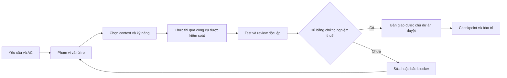

<!-- markdownlint-disable MD013 MD033 -->
# Forgewright

<p align="center">
  
</p>

<p align="center"><strong>Từ một yêu cầu đến quy trình kỹ thuật có thể kiểm tra, kiểm chứng và kiểm soát.</strong></p>

<p align="center">
  
  
  
  
</p>

<p align="center">
  <a href="#bắt-đầu">Bắt đầu</a> ·
  <a href="#dùng-cho-việc-gì">Ứng dụng</a> ·
  <a href="#đã-nâng-cấp-gì">Nâng cấp</a> ·
  <a href="#kiểm-chứng">Kiểm chứng</a> ·
  <a href="README.md">English</a>
</p>

**Forgewright là bộ khung điều phối kỹ thuật local-first cho phát triển phần mềm bằng AI.** Repo kết hợp làm rõ yêu cầu, lựa chọn kỹ năng, phân tích code, kiểm soát công cụ, kiểm chứng và lưu ngữ cảnh dự án. Bạn dùng model runtime và công cụ mình cấu hình; không bắt buộc thêm một dịch vụ hosted hay một gói model riêng.

Giá trị không nằm ở prompt dài hơn hoặc gọi thật nhiều agent. Nó nằm ở bốn câu hỏi: **cần thay đổi gì, ai được phép thay đổi, kiểm tra bằng cách nào, và điều gì vẫn chưa được chứng minh.**

## Vì sao dùng Forgewright

| Vấn đề khi giao việc cho AI | Cơ chế Forgewright bổ sung |
| --- | --- |
| Viết code trước khi hiểu đúng yêu cầu | Goal, tiêu chí nghiệm thu, phân loại rủi ro và phạm vi tối thiểu an toàn. |
| Agent nào cũng đọc toàn bộ lịch sử | Routing gọn, nạp skill khi cần, context có giới hạn và tham chiếu artifact. |
| Nhiều worker sửa chồng lên nhau | Phân tích dependency, chỉ định phạm vi sở hữu và worktree tách biệt khi được cấu hình. |
| “Xong” chỉ vì model nói xong | Lệnh kiểm tra của dự án và evidence schema-v2 gắn với AC, command, worktree cụ thể. |
| Dừng tác vụ nhưng vẫn còn process hoặc hiệu ứng | Lease cho process được sở hữu, hủy tác vụ, theo dõi lifecycle và trạng thái cleanup rõ ràng. |
| Phiên sau quên quyết định của phiên trước | Checkpoint theo dự án và tài liệu canonical; memory chỉ là ngữ cảnh tham khảo. |

**84 kỹ năng, 24 chế độ vận hành, một pipeline bàn giao.** [Product manifest](product-manifest.json) và [capability inventory](docs/capability-maturity.json) là nguồn kiểm tra các thông tin này.

## Dùng cho việc gì

**Web và công cụ nội bộ:** làm rõ brief, xác định kiến trúc/AC, phối hợp triển khai và review, giữ lại quyết định phục vụ bảo trì. [Product Factory](mcp/src/product-factory/) có các contract cho intent, môi trường thực thi, đánh giá outcome và release.

**Game và ứng dụng mobile:** phối hợp game design, kỹ thuật, art direction, QA, hiệu năng và phát hành. [Game Studio workflow](workflows/game-studio-build.md) đi từ concept đến release. Adapter Unity, Android và web có test local; toolchain, thiết bị, playtest và bằng chứng production vẫn cần kiểm tra theo từng sản phẩm.

**Codebase đang vận hành:** tìm nguyên nhân lỗi, đánh giá phạm vi ảnh hưởng trước refactor, viết test, review bảo mật và cập nhật tài liệu. Chia worker chỉ khi công việc thực sự độc lập; không mặc định song song mọi thứ.

### Một yêu cầu thực tế

```text
Thêm save/continue cho game này.

Giữ nguyên gameplay và các test hiện có.
Xác định AC cho resume, save hỏng và nhận thưởng trùng.
Kiểm tra các hệ thống bị ảnh hưởng trước khi sửa.
Triển khai thay đổi nhỏ nhất đủ an toàn, chạy kiểm tra và báo cáo:
  file đã sửa · kết quả quan sát được · rủi ro còn lại · cách rollback
Không publish hoặc deploy khi chưa được duyệt.
```

Đây là ví dụ đầu vào, không phải transcript giả về một lần chạy thành công. Kết quả phụ thuộc runtime, dự án, công cụ và verifier được kết nối.

## Cách hoạt động

`INTERPRET → DEFINE → BUILD → HARDEN → SHIP → SUSTAIN`


```mermaid
flowchart LR
    A[Yêu cầu và AC] --> B[Phạm vi và rủi ro]
    B --> C[Chọn context và kỹ năng]
    C --> D[Thực thi qua công cụ được kiểm soát]
    D --> E[Test và review độc lập]
    E --> F{Đủ bằng chứng nghiệm thu?}
    F -->|Có| G[Bàn giao được chủ dự án duyệt]
    F -->|Chưa| H[Sửa hoặc báo blocker]
    H --> B
    G --> I[Checkpoint và bảo trì]
```

Việc nhỏ được xử lý gọn. Thay đổi bảo mật, billing, concurrency, public contract và release cần kiểm chứng sâu hơn. Model sinh được kết quả chưa đồng nghĩa với sản phẩm đạt yêu cầu; kết thúc vòng retry không biến kết quả chưa xác minh thành kết quả đã xác minh.

Xem [pipeline reference](docs/pipeline-reference.md) và [canonical runtime ADR](docs/adr/0001-canonical-production-runtime.md) để biết phạm vi thực thi của từng lớp kiểm soát.

## Bắt đầu

### 1. Cài Forgewright như plugin (khuyến nghị)

Forgewright giờ có một nguồn plugin dùng chung cho **Codex** và **Claude Code**. Plugin cài entry workflow và specialist skills mà không bắt buộc thêm một gói model riêng.

**Codex CLI**

```bash
codex plugin marketplace add buiphucminhtam/forgewright --ref main
codex plugin add forgewright@forgewright-marketplace
```

**Claude Code**

```bash
claude plugin marketplace add buiphucminhtam/forgewright
claude plugin install forgewright@forgewright-marketplace --scope user
```

Sau khi cài, mở session mới và giao việc bình thường; description dạng trigger-only giúp host chỉ nạp skill phù hợp khi cần. `forgewright` là entry/alias workflow nên số specialist canonical vẫn là **84 kỹ năng**.

Plugin theo hướng **skills-first + consent-gated**. Gói plugin có một `PreToolUse` hook bootstrap nhỏ và bị giới hạn, nhưng chỉ cài plugin thì **không** sửa project, cài MCP, bật Pi, dò credential hay khởi động local runtime. Nếu chưa có global bootstrap policy do người dùng bật, hook sẽ thoát mà không thay đổi repository. Maintainer có thể test cài đặt trong HOME tạm, không đụng profile thật:

```bash
npm run verify:plugins
```

### 2. Build full local toolchain (nâng cao)

Cần **Node.js 22+**, **Python 3.11+** và Git. Pi tùy chọn cần **Node.js 22.19+**. Clone repo khi cần Forge CLI, Docs Hub, MCP, local gates hoặc phát triển framework:

```bash
git clone https://github.com/buiphucminhtam/forgewright.git
cd forgewright
npm run ci:bootstrap
npm run build
npm run build:cli
node src/cli/dist/index.js --help
```

Muốn auto-bootstrap toàn máy, opt-in một lần bằng `forge bootstrap policy set --mode full --auto on` từ shared runtime. Từ đó project mới có thể tự lên mode đã chọn ở lần dùng plugin đầu tiên mà không cần submodule riêng. Xem [hướng dẫn auto-bootstrap](docs/guides/auto-bootstrap.md) để cấu hình allow/deny root, lifecycle và trust boundary.

Có thể init/onboard một dự án local mà chưa gọi model:

```bash
node src/cli/dist/index.js --json init /path/to/your-project
node src/cli/dist/index.js --json onboard /path/to/your-project
```

### 3. Pin toàn bộ framework vào project (nâng cao)

Nếu team cần runtime Forgewright được pin theo repo cùng local MCP setup, vẫn dùng Git submodule:

```bash
git submodule add -b main https://github.com/buiphucminhtam/forgewright.git forgewright
git submodule update --init --recursive
bash forgewright/scripts/forgewright-mcp-setup.sh
```

Hãy review setup script và config sinh ra; merge rule cần thiết vào project thay vì ghi đè rule sẵn có. Submodule vẫn hữu ích khi chính project cần pin framework source cố định, nhưng không còn là điều kiện để dùng global-policy auto-bootstrap.

## Đã nâng cấp gì

### Plugin Codex/Claude + chất lượng skill có thể đo

Forgewright không còn bắt buộc người dùng clone/submodule chỉ để có workflow: cùng một `skills/` source được đóng gói thành plugin cho Codex và Claude. Không copy 80+ skill sang hai bộ riêng nên tránh drift giữa harness.

| Nâng cấp | Lợi ích |
| --- | --- |
| Skill Quality Engine | So sánh **baseline → current → candidate** bằng trigger accuracy, required/forbidden behavior, pressure/rationalization, abstention, tool call, context bytes và latency. Có regression thì không promote. |
| Trigger-only metadata | Description chỉ nói **khi nào dùng skill**; workflow nằm trong body, giúp routing gọn hơn. |
| Minimal worker packet | `PLAN_LOCKED` compile thành context tối thiểu có digest, goal/plan/task/scope/base binding; không nhét parent accounting vào worker. |
| Scoped review | Review task chỉ xem phạm vi task; mở rộng branch/release phải có final-review intent hoặc cross-cutting risk cụ thể. |
| Plan-scoped state | Runtime state tách theo `goal_id + plan_digest + base SHA`; success dọn sạch, failure giữ lại để debug/resume. |
| Failure classification | Phân biệt `hypothesis_wrong`, `implementation_wrong`, `environment_wrong`, `architecture_wrong`; cùng cách làm fail hai lần thì không retry biến thể mù. |

Framework eval là deterministic/provider-neutral. Chưa có benchmark model thật thì không tuyên bố chắc chắn giảm token, tăng chất lượng hay nhanh hơn bao nhiêu.

### Pi worker tùy chọn, vẫn do Forgewright kiểm soát

[Tích hợp Pi](integrations/pi/) không thay Hermes, dispatcher hiện có hay quyền sở hữu goal/AC của Forgewright.

| Nâng cấp | Hành vi |
| --- | --- |
| SDK được pin | Lockfile độc lập cho `@earendil-works/pi-agent-core@0.85.1`; cài root không tự cài gói Pi. |
| Canonical host bridge | Dùng gateway model/tool, containment, lifecycle và trajectory ledger hiện có. `start()` trả session; `wait()` quản lý kết quả cuối. |
| Quyền được tách khỏi task | Model, account, policy, tool registry và approval do host quyết định; nội dung task không tự cấp quyền. |
| Budget theo tài khoản | Nhiều workspace dùng chung account không được tách để vượt hạn mức. Chưa dispatch thì hoàn reservation; đã gọi nhưng chưa rõ chi phí thì giữ lại. |
| Deadline và cancellation | Kết quả muộn không mở lại task đã đóng; hủy tác vụ hoàn cả khoản chưa dispatch dù callback kiểm tra scope bị treo. |
| Context và receipt | Bảo toàn AC và binding hiện tại; usage/giá còn thiếu được ghi là unavailable, không phải 0. |
| Gate đánh giá và rollback | So sánh báo cáo đối chứng; canary tắt mặc định, chỉ một worker hoạt động trong controller, có kill switch và quarantine. |

**Trạng thái: experimental, tắt mặc định và bật chủ động theo project.** Lệnh `delegate` đã nối Pi worker thực tế từ project cha: đọc file, patch có before-hash và chạy verifier do host duyệt. Dùng quyền truy cập Codex/Pi OAuth hiện có hoặc model server loopback; không cần TypeSafe key, không tự chuyển sang API trả tiền. Analysis pilot không tool vẫn tồn tại nhưng không phải đường chạy coding worker.

```bash
npm --prefix integrations/pi ci --ignore-scripts --no-audit --no-fund
npm run build
npm run build:cli
npm --prefix integrations/pi run test:all
```

Sau khi build CLI/MCP, chạy từ **project cha có submodule**:

```bash
node forgewright/src/cli/dist/index.js delegate on --worker pi --provider openai-codex --auth-source codex --model <exact-codex-model-id>
node forgewright/src/cli/dist/index.js delegate status --worker pi
node forgewright/src/cli/dist/index.js delegate run --worker pi --contract task.json
node forgewright/src/cli/dist/index.js delegate resources
# node forgewright/src/cli/dist/index.js delegate cancel <run-id>
```

Cấu hình nằm trong `.production-grade.yaml` của project cha; giữ các mục không liên quan. `current` chỉ là tiện ích khi model hiện tại tương thích Codex và không có prefix provider; custom provider hoặc route kiểu `provider/model` sẽ bị từ chối thay vì bị hiểu nhầm thành OpenAI. Để ổn định, nên dùng explicit `openai-codex` như lệnh ở trên. Quyền subscription được đọc, không sao chép/refresh token của ứng dụng khác; hết hạn trả `pi_auth_required`. Không thêm phí dịch vụ không có nghĩa thuê bao hay quota hiện có là miễn phí vô hạn. Sandbox cho verifier hiện yêu cầu macOS và lệnh đơn process; chưa hỗ trợ npm/Unity build có process con. Đường `delegate run` có quản lý tài nguyên tạm từ chối worker Agy cũ vì chưa có contract admission/cleanup tương thích; không tự fallback sang Agy. Nền tảng chưa hỗ trợ phải báo rõ. `ready` chỉ xác nhận điều kiện khởi chạy, không thay cho kết quả task thật. [Pi ADR](docs/adr/ADR-pi-worker-runtime.md) có mẫu contract, provider local, cancellation và các giới hạn.

### Context gọn hơn, trạng thái dự án rõ hơn

Routing System-1 dùng rules tiếng Việt/Anh có giới hạn, cache chính xác tùy chọn và từ chối chọn khi yêu cầu mơ hồ. Không import/gọi Jev, không cần `TYPESAFE_API_KEY`, không tải classifier hay gọi thêm model để chọn skill. Đây là tinh thần chọn trong shortlist của Jev, không phải model Jev được đổi tên.

Nhiều project chia sẻ một bộ cấp tài nguyên: tối đa hai worker và một verifier nặng trên toàn user/máy; profile ít RAM giảm còn một worker. Mức reservation mặc định là **192 MiB cho Pi worker** và **128 MiB cho verifier đơn process**, hiệu chỉnh từ RSS quan sát trên Mac mục tiêu (~71–84 MiB cho Pi runtime đã load và ~42 MiB cho verifier Node nhỏ). Đây là ước lượng để scheduler cấp slot, không phải hard RAM cap; khi memory pressure tăng hệ thống vẫn dừng cấp việc mới để giữ headroom. Queue luân phiên theo project, giữ cách ly tác vụ chưa xác nhận dừng; broker nhẹ chỉ chạy khi cần và tự thoát sau 15 giây không hoạt động. Không dùng chung context/credential và không kill IDE hay process của anh. Chưa coi các giới hạn này là chứng nhận hiệu năng cho mọi máy 4 GB; mức tiết kiệm phải đo thực tế.

**Docs Hub** build trang HTML local có tìm kiếm từ Markdown/JSON được duyệt. Cấu trúc dự án, roadmap, blocker và flow lấy từ nguồn canonical, không phải một dashboard cập nhật thủ công khác.

```bash
node src/cli/dist/index.js docs build .
node src/cli/dist/index.js docs doctor . --strict
```

Mở `.forgewright/docs-hub/site/index.html`. [Hướng dẫn Docs Hub](docs/guides/docs-hub.md) có đăng ký đa dự án, privacy allowlist và export Obsidian.

## Năng lực và độ trưởng thành

**Beta** nghĩa là có kiểm chứng tự động local, chưa đồng nghĩa đủ bằng chứng production. **Experimental** còn thiếu bằng chứng production hoàn chỉnh. **Docs-only** là tích hợp/workflow được mô tả, không phải cam kết runtime production.

| Nhóm | Maturity | Giá trị chính |
| --- | --- | --- |
| Code Intelligence / GitNexus | Docs-only integration | Đồ thị quan hệ và đánh giá ảnh hưởng trước refactor; index có thể thiếu hoặc cũ. |
| Autonomous Testing Stack | Beta | Test của dự án, property-based testing, mutation và evidence gắn AC; không sửa oracle chỉ để pass. |
| Persistent Cognitive Memory / FluxMem | Experimental | Truy xuất ngữ cảnh local; file và checkpoint hiện tại vẫn là nguồn thật. |
| Parallel Skill Dispatch | Experimental | Worker có phạm vi riêng; công việc phụ thuộc vẫn xử lý tuần tự. |
| Multi-Project Hub | Docs-only management integration | Hướng tích hợp quản lý đa dự án; tách biệt với Docs Hub static đã có. |
| Token Tracking & Cost Analytics | Beta | Usage, reservation và dữ liệu benchmark; phân biệt số đo, ước tính và unavailable. |
| MCP Tool Sandbox | Beta application controls | Policy, containment và xử lý output; không phải OS sandbox hay bảo đảm chống mọi prompt injection. |
| ASIP | Experimental legacy workflow | Lưu bài học hữu ích nhưng không tự sửa shared rules; stuck rule vẫn có hiệu lực. |
| Runtime Lifecycle Guard | Beta | Lease, reuse và cleanup process được sở hữu; không tự thu hồi process ngoài quyền quản lý. |
| Game Studio Control Plane | Beta optional pack | Handoff theo phase; build, playtest, thiết bị và phát hành cần bằng chứng riêng. |
| Token Efficiency / Jev spirit | Experimental | Routing rules/cache local EN/VI, không key/model phụ; abstain khi mơ hồ. |
| Pi Worker | Experimental, opt-in | CLI từ project cha, scoped patch/verifier, cancellation và governor đa project; không tự migrate production. |
| Codex & Claude Plugin Distribution | Beta | Plugin manifests + shared entry skill + lazy discovery; mặc định không executable hook/MCP side effect. |
| Behavioral Skill Quality Engine | Experimental | Pressure/rationalization eval, metadata lint, packet/review compiler và promotion gate; model benchmark thật vẫn là evidence riêng. |

Nguồn trạng thái chi tiết: [capability inventory](docs/capability-maturity.json) và [active roadmap](docs/active-roadmap.md).

## Kiểm chứng

```bash
npm run lint
npm run build
npm test
npm run typecheck:cli
npm run build:cli
npm run ci:docs
npm run verify:product-truth
npm run verify:roadmap
npm run verify:plugins
npm run ci:local
```

Chạy bộ Pi tùy chọn bằng lệnh ở phần trên: gồm contract, runtime dùng SDK thật và workflow có owner gate trong các process Node riêng. `python3 scripts/ci/verify-readme.py` kiểm tra hai trang giới thiệu và chạy init/onboard trong dự án dùng thử, không gọi model. Các gate là lệnh local của dự án; hosted CI có thể gọi lại chúng nhưng không phải điều kiện bắt buộc.

[Completion manifest](docs/roadmap-completion.json) tách **implementation, integration, activation, production evidence và measured outcome**. Test pass, commit có chữ ký, và sản phẩm được nghiệm thu là ba việc khác nhau.

## Ranh giới tin cậy

Core không phụ thuộc một provider. Thực thi ở trong hệ sinh thái provider đã chọn. Local-first không đồng nghĩa dữ liệu luôn ở trên máy: model từ xa có thể nhận prompt, code được chọn và tool result. Dùng runtime local phù hợp khi dữ liệu phải ở lại thiết bị.

Containment ở cấp ứng dụng, không thay OS sandbox. Callback được host tin cậy vẫn có quyền của host. Hash giúp phát hiện dữ liệu không khớp, không chứng thực trước người tấn công cùng quyền user. Các đường tương thích và user override không được thực thi đồng nhất trên mọi client.

Bật Pi production, live adaptive routing hoặc cho process tự trị cần qua gate riêng. Xem [SECURITY.md](SECURITY.md) và [runtime ADR](docs/adr/0001-canonical-production-runtime.md).

## Tài liệu và đóng góp

| Tài liệu | Nội dung |
| --- | --- |
| [Product overview](docs/product-overview.md) | Phạm vi và định hướng sản phẩm. |
| [Architecture](docs/architecture.md), [pipeline](docs/pipeline-reference.md) | Thành phần, quyền sở hữu và luồng thực thi. |
| [Init/onboard](docs/guides/forge-init-onboard.md), [Docs Hub](docs/guides/docs-hub.md) | Bắt đầu và quản lý tài liệu theo nguồn thật. |
| [Visual grounding](skills/_shared/protocols/visual-grounding.md) | Design direction dựa trên reference và bằng chứng đã kiểm tra. |
| [Game Studio](workflows/game-studio-build.md), [Pi](docs/adr/ADR-pi-worker-runtime.md) | Workflow game và kiến trúc worker tùy chọn. |
| [Maturity](docs/capability-maturity.json), [roadmap](docs/active-roadmap.md), [changelog](CHANGELOG.md) | Đã có gì, đang thử nghiệm gì, còn thiếu gì. |

Đóng góp nên có vấn đề cụ thể, thay đổi đúng phạm vi và lệnh chứng minh kết quả. Giữ nguyên behavioral test; bugfix cần tái hiện lỗi; cập nhật tài liệu canonical và chạy gate local trước pull request. Không commit credential, dữ liệu runtime sinh ra hay trạng thái workspace cá nhân.

Báo lỗi/đề xuất tại [GitHub issues](https://github.com/buiphucminhtam/forgewright/issues); báo bảo mật theo [SECURITY.md](SECURITY.md). Kiểm tra khai báo license của từng package và dependency trước khi phân phối lại, chẳng hạn [khai báo MIT của CLI](src/cli/package.json).

**Tăng sức làm việc. Bàn giao bằng bằng chứng.**
