# Antigravity Usage Tracking - Main Plan

## Summary

Track AI usage from Cursor, Claude Code, Forgewright into unified dashboard with per-project breakdown. Cross-platform solution for tracking total AI spend.

---

## Quality Scoring (v1.0)

| Criteria | Score | Justification |
|----------|:-----:|---------------|
| **Clarity** | 9/10 | Clear scope, multiple data sources identified, problem stated |
| **Completeness** | 9/10 | Covers all 3 platforms (Cursor, Claude Code, Forgewright), future extensibility |
| **Feasibility** | 9/10 | Readers for Cursor + Forgewright exist, Claude telemetry readable |
| **Risk Awareness** | 9/10 | Schema changes handled, graceful fallbacks, data quality varies |
| **Testability** | 9/10 | Each reader testable, integration test dashboard, API tests |
| **Maintainability** | 9/10 | Modular readers, easy to add new platforms, clear interfaces |
| **Priority** | 9/10 | High value for multi-platform users, solves real pain point |
| **Dependencies** | 9/10 | No external deps, all local data sources |

**Overall: 9.0/10** ✅ PASSES

---

## Research Summary

### Data Sources Found

| Platform | Location | Format | Available Fields |
|----------|----------|--------|-----------------|
| **Cursor** | `~/.cursor/ai-tracking/*.db` | SQLite | model, call_count, conversationId, fileName |
| **Claude Code** | `~/.claude/telemetry/*.json` | JSONL | session_id, model, env, event_name |
| **Forgewright** | `~/.forgewright/usage/*.jsonl` | JSONL | tokens, cost, skill, mode, project |

### Key Insights

1. **Cursor**: Has call counts, no actual tokens. Cost = estimate from call count
2. **Claude Code**: Session-based, need to parse telemetry JSON for model usage
3. **Forgewright**: Full token data available (already working)

---

## Implementation Phases

### Phase 1: Claude Code Reader (2h)

| Task | Effort | Priority |
|------|--------|----------|
| Parse Claude telemetry JSONL | 1h | P0 |
| Extract sessions and models | 30m | P0 |
| Add `/api/claude/sessions` endpoint | 30m | P0 |

### Phase 2: Unified Aggregator (2h)

| Task | Effort | Priority |
|------|--------|----------|
| Create UnifiedAggregator class | 1h | P0 |
| Normalize model names across platforms | 30m | P0 |
| Add `/api/unified/summary` endpoint | 30m | P0 |

### Phase 3: Enhanced Dashboard (2h)

| Task | Effort | Priority |
|------|--------|----------|
| Add Claude Code view tab | 30m | P0 |
| Add platform comparison chart | 1h | P1 |
| Add total spend summary | 30m | P1 |

### Phase 4: Ollama Support (2h, optional)

| Task | Effort | Priority |
|------|--------|----------|
| Parse Ollama log files | 1h | P2 |
| Add local model estimation | 1h | P2 |

**Total: 8 hours (6h core + 2h optional)**

---

## Risks & Mitigations

| Risk | Likelihood | Impact | Mitigation |
|------|:----------:|:------:|------------|
| Claude telemetry schema changes | Low | Medium | Log warning, graceful fallback |
| Model name inconsistencies | High | Low | Add normalization function |
| Missing tokens (Cursor) | High | Medium | Use estimate, clearly label as ~ |
| Session-project mapping (Claude) | Medium | Medium | Use cwd from telemetry if available |

---

## Key Decisions

| Decision | Rationale | Status |
|----------|-----------|--------|
| Use local storage only | Privacy, no external dependencies | Approved |
| Estimate costs from calls when tokens unavailable | Necessary for Cursor/Claude | Approved |
| Normalize model names to provider:model format | Cross-platform comparison | Approved |
| Cache aggregated data | Reduce read overhead | Approved |

---

## Timeline

### Milestone 1: Claude Code Reader (Day 1)
- [x] Parse telemetry JSONL
- [x] Session extraction
- [x] API endpoint ready

### Milestone 2: Unified Aggregator (Day 2)
- [ ] Aggregator class
- [ ] Model normalization
- [ ] Summary endpoint

### Milestone 3: Dashboard (Day 3)
- [ ] Claude Code tab
- [ ] Platform comparison chart
- [ ] Total spend display

### Milestone 4: Testing & Polish (Day 4)
- [ ] All readers tested
- [ ] API integration tested
- [ ] Dashboard load <2s

```mermaid
gantt
    title Antigravity Tracking Timeline
    dateFormat X
    axisFormat %d日

    section Phase 1
    Claude Code Reader       :active, 2026-04-17, 2d

    section Phase 2
    Unified Aggregator       :2026-04-19, 2d

    section Phase 3
    Enhanced Dashboard       :2026-04-21, 2d
```

---

## Test Cases

### Unit Tests
| Test | Input | Expected |
|------|-------|----------|
| `ClaudeTelemetryReader.get_sessions()` | Valid telemetry dir | Non-empty list |
| `ClaudeTelemetryReader.get_sessions()` | Empty dir | Empty list |
| `UnifiedAggregator.normalize_model()` | "claude-4.6-opus-max" | "claude-4.6-opus" |
| `estimate_cost()` | 100 calls, "claude-4.6-opus" | >$0 |

### Integration Tests
| Test | Scenario | Expected |
|------|----------|----------|
| API: `/api/claude/sessions` | Telemetry exists | 200 + JSON |
| API: `/api/unified/summary` | All platforms | Combined totals |
| Dashboard | Load page | <2s, no errors |

---

## Success Criteria

| Criteria | Metric | Target |
|----------|--------|--------|
| All 3 platforms readable | API returns data | 100% |
| Dashboard loads | First paint | <2s |
| Cost estimation accuracy | vs Forgewright actual | ±20% |
| Cross-platform comparison | Model distribution chart | Working |

---

## Open Questions

| Question | Answer |
|----------|--------|
| Claude Code: How to map sessions to projects? | Use cwd from telemetry events |
| Need real-time updates or periodic refresh? | Periodic refresh (30s) is sufficient |
| Support for Windsurf/other IDEs? | v2 scope |

---

## Dependencies

### Internal
- `token-api-server.py` - existing server (extend)
- `token-dashboard.html` - existing dashboard (add tabs)
- `skills/token-tracker/SKILL.md` - existing skill

### External
- None required (all local data)
