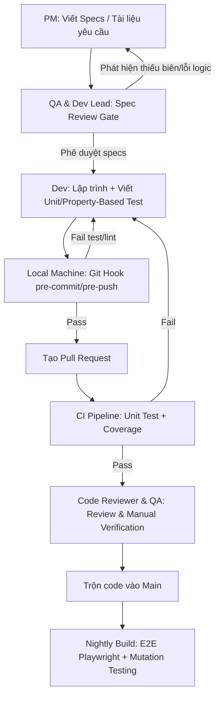

# Technical & Process Architecture: Mô Hình Kiểm Thử Đa Lớp

> **Mô tả:** Tài liệu thiết kế kiến trúc quy trình kiểm thử và cách tích hợp các công cụ kiểm thử tự động vào hệ thống mã nguồn hiện tại của Forgewright.

---

## 1. Sơ Đồ Quy Trình Kiểm Thử (Spec-to-Release Flow)

Quy trình kiểm thử mới dịch chuyển hoàn toàn về bên trái (Shift-Left) và tích hợp tự động hóa ở từng bước:

---

## 2. Mô Hình Thiết Kế Test Đa Lớp (Test Pyramids & Tools)

Chúng ta áp dụng 4 lớp kiểm thử với các thư viện mã nguồn mở tương ứng với hạ tầng kỹ thuật hiện tại (Python & TypeScript/Node):

### 2.1. Lớp 1: Static Analysis & Linting (Quét code tĩnh)
* **Mục tiêu:** Phát hiện sớm các lỗi cú pháp, code smell, lỗ hổng bảo mật cơ bản trước khi chạy code.
* **Công cụ sử dụng:**
  * **TypeScript/Node:** `eslint`, `prettier`.
  * **Python:** `ruff` (thay thế cực nhanh cho flake8, black, isort).
  * **Shell Script:** `shellcheck` (quét lỗi shell script cực tốt trong thư mục `scripts/`).

### 2.2. Lớp 2: Unit Testing & Property-Based Testing (PBT)
* **Mục tiêu:** Kiểm tra logic sâu của từng module, lớp, hàm toán học và xử lý chuỗi.
* **Công cụ sử dụng:**
  * **TypeScript/Node:** `vitest` hoặc `jest` kết hợp **[fast-check](https://github.com/dubzzz/fast-check)** để thực hiện Property-Based Testing.
  * **Python:** `pytest` kết hợp **[Hypothesis](https://hypothesis.readthedocs.io/)** để thực hiện Property-Based Testing.
* **Ví dụ ứng dụng:** Kiểm tra module sinh chuỗi, phân tích bộ nhớ (`mem0-v2.py`), hoặc tính toán token.

### 2.3. Lớp 3: Mutation Testing (Kiểm thử đột biến)
* **Mục tiêu:** Đo lường chất lượng và độ bao phủ thực tế của bộ Unit Test bằng cách "gây lỗi giả lập" vào code logic.
* **Công cụ sử dụng:**
  * **TypeScript/Node:** `Stryker Mutator`.
  * **Python:** `mutmut`.
* **Quy chuẩn:** Bất kỳ pull request nào sửa đổi logic tính toán cốt lõi đều phải vượt qua Mutation Check với tỷ lệ Mutants bị tiêu diệt (Killed Mutants) $\ge$ 80%.

### 2.4. Lớp 4: Integration & End-to-End (E2E) Testing
* **Mục tiêu:** Kiểm thử luồng tích hợp hệ thống, gọi API và kiểm thử giao diện người dùng.
* **Công cụ sử dụng:**
  * **Playwright TS:** Đã được cấu hình trong `playwright.config.ts`.
  * **Pytest Integration:** Sử dụng `pytest` giả lập các cuộc gọi API và database.

---

## 3. Kiến Trúc Tích Hợp Git Hooks & CI/CD

### 3.1. Thiết lập Git Hooks cục bộ (Husky & lint-staged)
Để nhà phát triển không đẩy code lỗi lên Github, chúng ta sử dụng cơ chế chặn tự động ở local:
* **pre-commit:** Chạy `lint-staged` để tự động định dạng code và chạy linting chỉ trên các file được thay đổi.
* **pre-push:** Chạy bộ Unit Test nhanh ở local.

### 3.2. Cấu hình GitHub Actions CI/CD Pipeline
* **PR Build Pipeline (Fail-Fast):**
  1. Setup environment (Node + Python).
  2. Run Linter (`ruff check`, `eslint`).
  3. Run Unit Tests & Property-Based Tests (`pytest`, `vitest`).
  4. Xuất báo cáo Coverage lên PR Comment.
* **Nightly Build Pipeline (Thorough Check - Ban đêm):**
  1. Chạy toàn bộ E2E Playwright Test trên các trình duyệt thực tế.
  2. Chạy Mutation Testing toàn diện.
  3. Gửi báo cáo chất lượng lên Slack/Telegram nếu có lỗi xảy ra.
