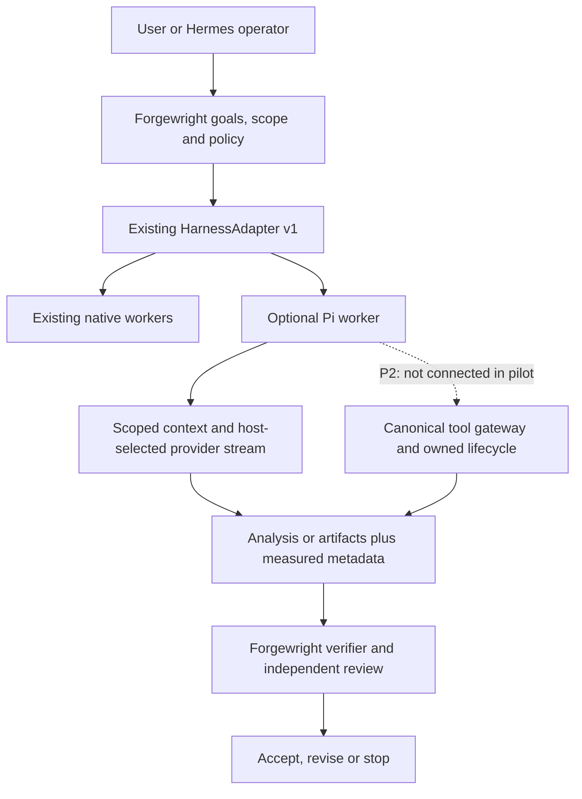

# ADR: Optional Pi Worker Runtime

## Decision and authority

Add Pi as an optional worker behind the existing `HarnessAdapter v1`, not as
another orchestrator. This is an additive Layer 5 decision under the existing
[architecture](https://github.com/buiphucminhtam/forgewright/blob/0d835e28740f112c5c3737345d8d0404becd0d1f/docs/architecture.md) and
[canonical-runtime ADR](https://github.com/buiphucminhtam/forgewright/blob/0d835e28740f112c5c3737345d8d0404becd0d1f/docs/adr/0001-canonical-production-runtime.md). The
[provider-native policy](../active-roadmap.md#provider-native-routing-policy),
canonical tool/model gateways, requirement-locked tests, schema-v2 verification,
Stop gates, process ownership, and context-only continuity remain authoritative.

The owner requested the architecture, README, detailed plan, and incremental
implementation. The initial implementation is deliberately an isolated,
default-off **analysis-only pilot**, not a registered production worker.
Hermes retains operator identity/scheduling; Forgewright retains goals, routing,
approvals, memory, and acceptance. No active local goal or running service is
replaced by this decision. Existing Jev routing remains unchanged.

## Target architecture and current boundary



| Responsibility | Owner and constraint |
| --- | --- |
| Intent, acceptance and task priority | Forgewright; never delegated to Pi session state |
| Model, provider credentials and spend authorization | Trusted host using the existing provider-native contract; no automatic provider switch |
| Agent loop | Pi within one explicitly scoped worker |
| Tool admission, workspace and approvals | Existing canonical gateway; pilot exposes **zero tools** |
| Memory, checkpoint validity and resume authority | Existing Forgewright continuity; Pi history is not project truth |
| Usage/cost evidence | Existing receipt contract; missing usage stays unavailable, not zero |
| Product completion | Forgewright verification; successful generation is not acceptance |

### P1 implementation surface

`integrations/pi/adapter.mjs` exports `createPiWorkerAdapter(config)` and a lazy
`loadPinnedPiAgent()`. This is an optional package outside the root workspaces;
normal root installation and canonical runtime registration are unchanged.

The trusted host must supply `enabled: true`, its system policy, selected model,
and `streamFn`. These are not accepted inside task data. A task contains only
`taskId`, `objective`, `acceptance`, and optional supplied `context`. Acceptance
must contain 1-64 explicit non-empty strings; sparse or missing entries are
rejected before SDK loading, not serialized into null criteria. Fresh messages
and an empty tool set are constructed for every adapter instance.
There is no filesystem reader: analysis uses only the supplied context.

The adapter advertises `native-host-loop` with `start` and `interrupt` only.
`start()` waits for its bounded attempt before returning a session ID; live
scheduler compatibility with this waiting behavior is a P2 acceptance gate.
`resume`, `fork`, `steer`, `checkpoint`, and pre-compaction are unsupported.
`getResult()` returns analysis and execution metadata; `getTelemetry()` excludes
the prompt, system policy, supplied context, and generated text. Task IDs must
be non-secret correlation IDs supplied by the host.

| Limit | Default | Hard ceiling | Meaning |
| --- | ---: | ---: | --- |
| Input bytes | 16,384 | 65,536 | UTF-8 system policy plus serialized task; reject, never silently trim AC |
| Final text bytes | 16,384 | 65,536 | Collected assistant text; **not** a provider output-token or streaming-memory cap |
| Model invocations | 1 | 4 | Calls through the supplied stream callback; provider-internal retries are not counted |
| Attempt deadline | 60 seconds | 120 seconds | Includes SDK loading; timeout requests abort, not forced process termination |

An instance cannot overlap tasks or be reused for replay. Retained stream
callbacks lose admission after successful or failed settlement; retained
message callbacks cannot mutate settled output or telemetry. This is a local
callback gate, not proof that a remote provider has stopped. Timeout/interruption
remain terminal even if a late SDK call finishes. `quiescence` reports whether
the adapter's SDK promise settled; it is not proof of remote provider shutdown,
OS isolation, or zero further billing. Non-cooperative work is not automatically
retried. Every result retains `completion_state: unverified`.

### Dependency and trust boundary

The isolated package pins `@earendil-works/pi-agent-core@0.85.1`, whose
manifest requires Node >=22.19.0. The loader checks Node and the direct package
version before loading `Agent`. `integrations/pi/package-lock.json` pins the
transitive graph and registry integrity values independently of the root
workspaces; install it with `npm ci --ignore-scripts`, never substitute `latest`.

The registry's published `gitHead` is
`d981de1229ef899957bbe968bc8dcda02a21f477`; the immutable package manifest at
that revision agrees with the installed version, Node requirement, MIT license
and direct dependencies. The core tarball integrity recorded in the lock is
`sha512-hIXIP3eAWueAYiAl8aMvWCvvZ8Q5gT3Dip5bE5uJyIGh4+YlWRjtMLI4BaeoXoSs93zndjue61u1B/vhefLnuA==`.
Clean installation, actual SDK import and deterministic stream conformance
have been exercised on the isolated Mac arm64 worktree with Node 22.22.0.
This is not a live-provider, remote-cancellation or production certification.
Rerun the dependency audit on the candidate lock before promotion; a clean
advisory scan does not establish absence of vulnerabilities.

The core package itself depends on Pi AI, telemetry and Chord. Therefore neither
small footprint nor reduced token use is assumed. `pi-coding-agent`, extensions,
auto-discovered project scripts and default shell tools are not loaded. Pi does
not provide a built-in OS permission sandbox. Trusted injected code can still
use host privileges; this pilot is not a security boundary against malicious
SDKs, host callbacks, or a same-user attacker.

`pi-durable` adoption is deferred. Forgewright already has state, checkpoint and
ledger contracts; adding another durable store requires a demonstrated gap and
an explicit migration decision, not a presumed token-saving benefit.

## Locked delivery sequence

The sequence is **P0 -> P1 -> P2 -> P3 -> P4 -> P5 -> P6**. Later gates never
become complete because a file exists or fixture tests pass. The PR checklist
tracks transient execution status. Canonical project status remains
`docs/project-state.json`; reconcile it with the target workspace before
activation, without overwriting another lane's goal.

### P0: Target preflight and baseline

- Inspect Mac workspace, branch, worktree status, active goal, Node/npm versions,
  existing providers, and owned process leases. Never reset/clean or switch a
  dirty checkout. Use a separate worktree for the feature branch.
- Run the existing Docs Hub strict doctor/build baseline and current relevant
  local verification commands before integrating behavior.
- Record source/dependency/license provenance and exact provider topology;
  establish a no-live-spend default until the host authorizes a capped run.
- **Exit:** current Mac evidence and baseline are recorded; unresolved failures
  remain blockers, not reasons to relax tests or install hooks differently.

### P1: Isolated SDK seam and offline conformance

- Keep the package default-off with no canonical dispatch registration.
- Verify strict input, host-owned configuration, no tools, one-shot lifecycle,
  bounded attempts, redacted errors, cancellation and unavailable usage.
- Run the checked-in PI-01 through PI-24 tests; bind their exact file/command
  hashes. PI-21 through PI-24 preserve the existing strict-AC and one-shot
  requirements, including sparse entries and retained callbacks after success
  or failure. Exercise the corresponding runtime boundaries through
  `sdk.test.mjs` against the real pinned `Agent` and a deterministic transport,
  then use `harness.test.mjs` to validate the actual built Forgewright
  `HarnessAdapter` negotiator. Keep these evidence tiers separate: the SDK
  suite does not replace the original fixture tests or certify live providers.
- Generate and review the isolated dependency lockfile on the target; perform
  clean install with lifecycle scripts disabled. No root dependency churn.
- **Exit:** fixture, real-SDK and target-host conformance are separately proven.
  No tool effects, resume support or production readiness are claimed.

### P2: Canonical provider/tool/lifecycle integration

- Bind the host stream to the existing model gateway: runtime capability probe,
  one provider ecosystem, approved credentials, attempt identity, reservation,
  settlement and provider-native receipts. No independent Gemini API path.
- Adapt an explicit allowlist of canonical gateway tools, not Pi default tools.
  Bind each call to workspace/session/task/turn, scoped paths, policy, approval,
  trajectory accounting and the existing process-ownership contract.
- Add negative tests for unknown tools, forged approval, traversal/symlink
  escape, stale scope, credential exposure, prompt injection, duplicate effects,
  policy denial, interrupt during effects and non-cooperative cleanup.
- Resolve scheduler start/wait semantics, verify cancellation/settlement and
  negotiate only capabilities actually implemented. Never fake resume support.
- **Exit:** canonical integration plus independent security/contract review;
  the feature remains opt-in and denied effects never execute.

### P3: Context and continuity discipline

- Use existing bounded task contracts, progressive skill loading and offload
  references; exclude whole conversation histories by default.
- Preserve required acceptance, policy, provenance and active work references.
  Measure bytes and exact-provider tokens separately; do not label bytes tokens.
- Add resume only after binding canonical tree, ledger, workspace, capability
  snapshot and expiry, with rejection tests for stale/corrupt/replayed state.
- **Exit:** context limits and acceptance preservation pass; any summarization
  cost and recovery overhead are included in later measurements.

### P4: Evidence and telemetry bridge

- Normalize native input/output/cached usage, model snapshot, latency, tool
  calls, retries, failures and cost basis into the existing receipt contract.
- Missing usage/pricing stays explicitly unavailable. Do not copy entire Pi
  events, prompts, source files, secrets or outputs into telemetry.
- Add tests for partial streams, duplicate receipts, retry accounting,
  cancellation charges and failed attempts. Keep billing/provider truth distinct
  from local callback counts and SDK-settled state.
- **Exit:** exact-bound receipts reconcile with the selected live provider;
  neither fixture events nor generated metadata can enable routing gates.

### P5: Paired benchmark and promotion decision

- Compare current worker and Pi on the same task revisions, acceptance tests,
  provider/model snapshot, settings, tool capabilities and retry budgets.
- Use an initial declared pilot of 12 tasks (analysis, bugfix, tests, refactor),
  three repetitions per arm with randomized order; label this a pilot, not a
  universal performance estimate. Separate cold/warm cache and startup costs.
- Log all failures and retries. Primary metric: total cost per verified accepted
  outcome. Also report accepted-task rate, false-success, tokens, p50/p95 latency,
  peak RSS, cleanup/recovery and maintenance complexity.
- Promotion requires no new safety/false-success failures, no accepted-task
  regression in the paired suite, and a reproducible material benefit. A proposed
  pilot threshold is >=10% lower median tokens or accepted-outcome cost without
  >10% p95 latency regression; lock thresholds before running, not afterwards.
- **Exit:** independent review of results, uncertainty and native receipts.
  If no benefit is demonstrated, keep the adapter experimental or remove it;
  do not migrate because an integration already exists.

### P6: Opt-in canary, rollback and documentation gate

- Canary one owner-selected low-risk lane, one active worker, with explicit
  provider/spend caps; keep existing native workers as the default.
- Verify an immediate admission kill switch and exact-owned draining/cleanup.
  Do not reroute a task after possible effects until state is reconciled.
- Update canonical project-state/roadmap only from observed evidence, rebuild
  Docs Hub and run its gate, existing local regression checks and independent
  schema-v2 exact-tree review. Hosted CI is not required.
- **Exit:** separate implementation/integration/activation/production/outcome
  records, tested rollback and explicit release decision. No automatic main
  merge, service restart, submodule rollout or Hermes migration.

## Verification entry points and evidence boundaries

Offline pilot, no API key or Pi installation required:

```bash
node --check integrations/pi/adapter.mjs
node --test integrations/pi/adapter.test.mjs
```

Real installed SDK and canonical host-contract conformance, without an API key:

```bash
npm --prefix integrations/pi ci --ignore-scripts --no-audit --no-fund
npm run build
npm --prefix integrations/pi run test:all
npm --prefix integrations/pi audit --omit=dev
```

`test:all` retains the 24 fixture contracts and adds 20 actual-SDK transport
contracts plus four canonical host-negotiation contracts. The SDK suite mocks
only transport output; the installed agent loop, event handling and abort path
execute normally. Its synthetic usage is intentionally not promoted into
native billing evidence. A test-local fetch rejection is an accidental-network
tripwire, not a general OS or network sandbox. Host negotiation does not
register or enable the worker, and does not resolve scheduler start/wait
semantics. The runtime source and original fixture oracles are unchanged by
these conformance additions.

On the target checkout, use the existing configured toolchain and gates:

```bash
npm run build
npm test
npm run ci:docs
npm run verify:roadmap
```

Use the established Docs Hub lifecycle (`forge docs doctor . --strict`,
`forge docs build .`, `forge docs gate . --worktree`, final build). Also evaluate
the **base-to-head changeset** during PR review; a clean checkout's worktree-only
gate is not evidence that the committed PR diff was checked.

Offline fake-Agent tests prove adapter logic only. The separate installed-SDK
and built-host tests add deterministic compatibility evidence on the tested
Mac/Node version; they do not prove canonical dispatch integration, native
provider usage, sandboxing, throughput, cost savings, scheduler compatibility
or independent approval. Current runtime blockers and exact next actions
belong in canonical project-state and the PR, not a fabricated PASS record.

## Primary sources

- [Pi repository and permission model](https://github.com/earendil-works/pi)
- [Pinned agent package manifest](https://github.com/earendil-works/pi/blob/d981de1229ef899957bbe968bc8dcda02a21f477/packages/agent/package.json)
- [Pinned agent API and implementation](https://github.com/earendil-works/pi/blob/d981de1229ef899957bbe968bc8dcda02a21f477/packages/agent/src/agent.ts)
- [Forgewright HarnessAdapter contract](https://github.com/buiphucminhtam/forgewright/blob/0d835e28740f112c5c3737345d8d0404becd0d1f/mcp/src/runtime/harness-adapter.ts)
- [Documentation governance](../../skills/_shared/protocols/documentation-governance.md)

The repository overview is a moving reference; the package/API references are
bound to the published immutable revision above. A dependency upgrade requires
reviewing the new revision and lockfile, then repeating target conformance and
audit before any later activation decision.
