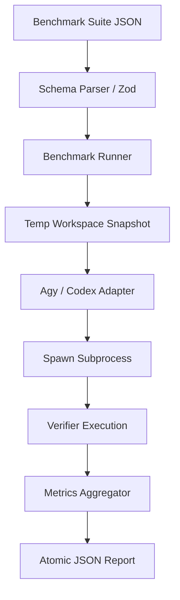

# Agent Benchmark Foundation Architecture

This document details the architecture, design choices, and fair-comparison guidelines for the Forgewright Agent Benchmark foundation, designed to compare Gemini 3.5 Flash against GPT-5.5.

## Architecture Overview

The benchmark framework consists of:
1. **Schema Validation**: A strongly typed schema built via `zod` validating tasks, provider settings, and verification targets.
2. **Process Adapters**: Injectable, shell-disabled process execution components for both `Agy` and `Codex`.
3. **Runner**: Handles task execution, temporary workspace instantiation, attempt retries, verifier executions, and result collation.
4. **Metrics**: Computes per-category and aggregated `pass@1` and `pass@k` statistics from observed task attempts.

## JSON Benchmark-Suite Schema

Every benchmark suite is a JSON file conforming to the schema defined in [types.ts](../../src/cli/src/bench/types.ts).

### Schema Properties

* `version`: Schema version.
* `name`: Benchmark suite name.
* `description`: Purpose of the suite.
* `defaultProviderSettings`: Object containing the default `provider` and `model` configuration.
* `defaultAttempts`: Default attempt count (k) per task.
* `defaultTimeoutMs`: Default timeout in milliseconds for each attempt.
* `tasks`: Array of benchmark tasks:
  * `id`: A unique task identifier.
  * `category`: Evaluation category.
  * `prompt`: The prompt instructions given to the agent.
  * `providerSettings`: (Optional) Overrides for provider/model.
  * `attempts`: (Optional) Overrides for attempt count.
  * `timeoutMs`: (Optional) Overrides for timeout.
  * `workspace`: (Optional) Path to a directory containing baseline files.
  * `verifierCommands`: List of deterministic commands run in sequence to verify correctness.

## Injectable Process Adapters

Execution of agents (Agy and Codex) uses a clean process boundary without shell expansion to avoid shell injections or environment pollution:
* **Agy Adapter**: Writes `CONTRACT.json` and `WORKER_INSTRUCTIONS.md` to the workspace root, and then spawns `agy --model <model> --sandbox --print <prompt_instructions>`.
* **Codex Adapter**: Spawns `codex exec --model <model> --sandbox workspace-write --ephemeral <prompt>`.
* Both adapters support custom `spawn` function injection for testing, preventing any live model executions during test runs.

## Metrics Definition

* **pass@1**: The probability that a task succeeds on the first try. Mathematically, it is the fraction of tasks where the first attempt succeeded.
* **pass@k**: The probability that a task succeeds within $k$ attempts. A task is considered passed at $k$ if at least one of the first $k$ attempts passes its verification checks.

## Fair-Comparison Rules

To ensure a scientifically valid comparison between Gemini and GPT (or any other model) runs, the following parameters must be strictly controlled and held constant across comparisons:

1. **Same Task and Prompt**: The prompt template and requirements must be identical.
2. **Workspace Snapshot**: Each run must start with an identical clean copy of the designated workspace template.
3. **Tool Permissions**: The available tools, MCP servers, and environment restrictions must be equal.
4. **Timeout**: Individual attempt timeouts must be identical.
5. **Retry Count (k)**: The exact same number of attempts $k$ must be evaluated.
6. **Verifier Commands**: The exact same sequence of verifiers must run.
7. **Context Budget**: The token limits or system-prompt context sizes must be configured equivalently where possible.
