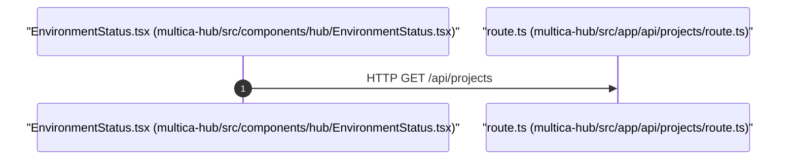

# API Flow: GET /api/projects
Generated: 2026-06-25T11:40:29.131Z

## Flow Diagram

## Flow Details
*   **Client Component**: [multica-hub/src/components/hub/EnvironmentStatus.tsx](../../../multica-hub/src/components/hub/EnvironmentStatus.tsx)
*   **API Endpoint**: `GET /api/projects`
*   **Server Handler File**: [multica-hub/src/app/api/projects/route.ts](../../../multica-hub/src/app/api/projects/route.ts)
