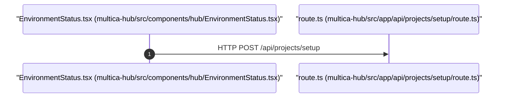

# API Flow: POST /api/projects/setup
Generated: 2026-06-26T06:09:48.804Z

## Flow Diagram

## Flow Details
*   **Client Component**: [multica-hub/src/components/hub/EnvironmentStatus.tsx](../../../multica-hub/src/components/hub/EnvironmentStatus.tsx)
*   **API Endpoint**: `POST /api/projects/setup`
*   **Server Handler File**: [multica-hub/src/app/api/projects/setup/route.ts](../../../multica-hub/src/app/api/projects/setup/route.ts)
