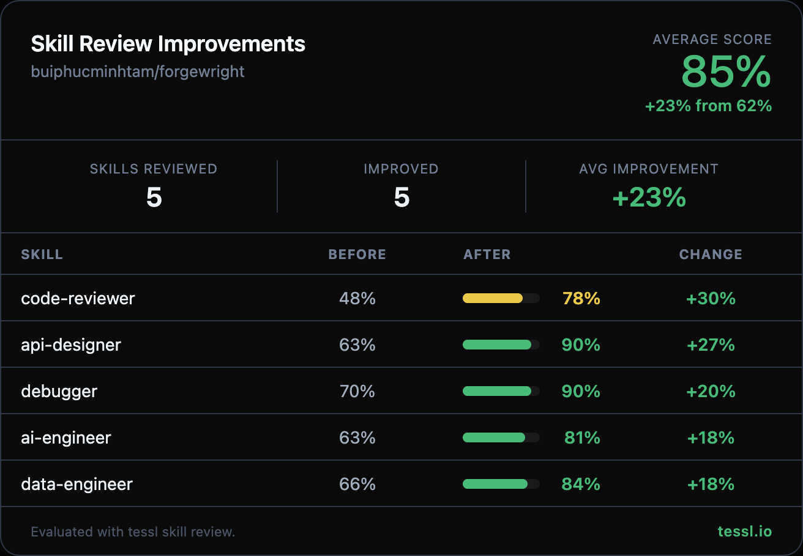

## Forgewright Pull Request

### Description

Hey @buiphucminhtam 👋

I ran your skills through `tessl skill review` at work and found some targeted improvements. Here's the full before/after:

| Skill | Before | After | Change |
|-------|--------|-------|--------|
| code-reviewer | 48% | 78% | +30% |
| api-designer | 63% | 90% | +27% |
| debugger | 70% | 90% | +20% |
| ai-engineer | 63% | 81% | +18% |
| data-engineer | 66% | 84% | +18% |

What changed

**All 5 skills:**
- Replaced chevron (`>`) description format with quoted strings for cleaner YAML parsing
- Added explicit `Use when...` clauses with natural trigger terms so Claude knows when to select each skill
- Removed internal routing notes (`Routed via the production-grade orchestrator`) that don't help with skill selection

**ai-engineer:**
- Removed generic Identity/Distinction section that explained what an AI Engineer is
- Added a concrete LiteLLM provider abstraction code example
- Added explicit validation gates between phases

**api-designer:**
- Condensed CRUD-to-HTTP mapping table (Claude already knows standard REST conventions)
- Added validation gates between phases ("Validate domain model...", "Run OpenAPI linter...")

**code-reviewer:**
- Condensed severity level table from verbose paragraph-per-level to a compact reference
- Replaced 14-item SOLID/code structure checklist with terse threshold-based rules
- Replaced 15-row Common Mistakes table with focused Key Constraints section
- Condensed the finding format template to a one-line description

**data-engineer:**
- Removed generic Identity/Distinction section
- Added a concrete dbt staging model SQL example
- Added validation gates ("Do not proceed until data sources mapped...", "Run dbt test after each model layer...")

**debugger:**
- Condensed verbose Iron Law section (rationalizations table, real-world impact stats, red flags list, human partner signals) into a focused 3-line summary
- Replaced 10-row Bug Pattern Reference and 10-row Common Mistakes tables with a focused Key Constraints section

Honest disclosure — I work at @tesslio where we build tooling around skills like these. Not a pitch - just saw room for improvement and wanted to contribute.

Want to self-improve your skills? Just point your agent (Claude Code, Codex, etc.) at [this Tessl guide](https://docs.tessl.io/evaluate/optimize-a-skill-using-best-practices) and ask it to optimize your skill. Ping me - [@yogesh-tessl](https://github.com/yogesh-tessl) - if you hit any snags.

Thanks in advance 🙏

### Type of Change

- [x] Skill update

### Testing

- [ ] MCP server tests pass (`npm run test` in `mcp/`)
- [ ] TypeScript compiles clean (`npm run build` in `mcp/`)
- [ ] ESLint clean (`npm run lint` in `mcp/`)
- [ ] Pre-commit hooks pass

### Pipeline Phase

- [x] SUSTAIN — Monitoring, Iteration

### Documentation

- [x] Relevant skill SKILL.md updated
- [ ] No documentation changes needed

### Additional Notes

All 5 skills were evaluated using `tessl skill review`. Changes focus on description quality (adding Use when... clauses, natural trigger terms) and content conciseness (removing verbose explanations of concepts the model already knows, adding validation gates and code examples). The total diff is under 300 lines to keep the PR reviewable.

### Checklist

- [x] Code follows the project's conventions
- [x] Self-reviewed before requesting review
- [ ] Related ForgeNexus impact analysis completed
- [x] No unintended side effects on other skills
